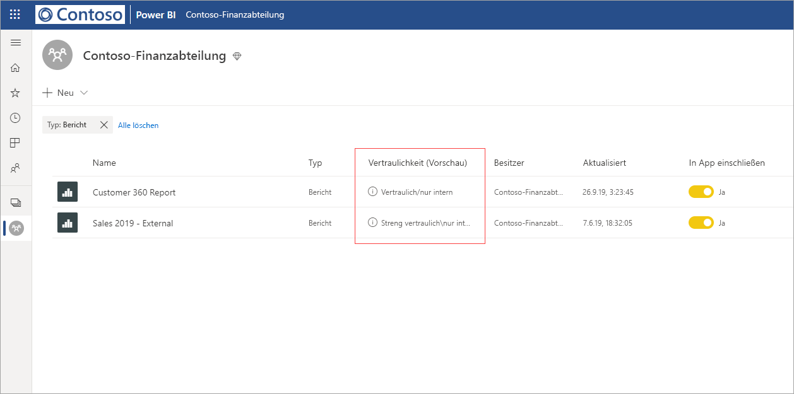
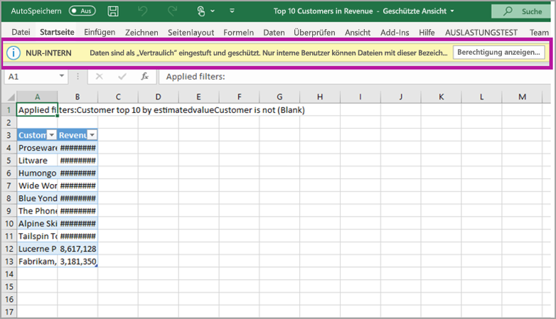

# Datenschutz in Power BI (Vorschauversion)

Moderne Unternehmen unterliegen strengen Anforderungen und rechtlichen Vorgaben bezüglich der Verarbeitung und des Schutzes vertraulicher Daten. Sie können Power BI mit Microsoft Information Protection und Microsoft Cloud App Security integrieren, um vertrauliche Daten in Power BI besser einsehen und kontrollieren zu können. 

Mit dem Datenschutz in Power BI ist Folgendes möglich:

* Sie können die Microsoft-Vertraulichkeitsbezeichnungen verwenden, um Inhalte im Power BI-Dienst (Dashboards, Berichte, Datasets und Dataflows) mit der gleichen Taxonomie wie bei Office 365-Dateien zu klassifizieren und zu kennzeichnen. 

* Sie können Schutzmaßnahmen wie Verschlüsselung oder Wasserzeichen beim Exportieren von Daten aus dem Power BI-Dienst für Dateien erzwingen, indem Sie die Vertraulichkeitsbezeichnung und den Schutz des Inhalts (Excel, PowerPoint und PDF) anwenden. 

  Beispielsweise können Ihre Benutzer die Bezeichnung „Vertraulich“ auf einen Bericht in Power BI anwenden. Wenn die Daten dann in eine Excel-Datei exportiert werden, wendet Power BI diese Bezeichnung auf die Datei an. Die Bezeichnung kann den Inhalt verschlüsseln und ein Wasserzeichen für Vertraulichkeit anwenden.

* Verwenden Sie Microsoft Cloud App Security zur Überwachung von Aktivitäten in Power BI, zur Untersuchung von Sicherheitsproblemen und zum Schützen von Inhalten in Power BI mit der App-Steuerung für bedingten Zugriff in Microsoft Cloud App Security. 

## Vertraulichkeitsbezeichnungen in Power BI

Vertraulichkeitsbezeichnungen werden entweder im [Microsoft 365 Security Center](https://security.microsoft.com/) oder im [Microsoft 365 Compliance Center](https://compliance.microsoft.com/) erstellt und verwaltet.

Sie können dort auf die Vertraulichkeitsbezeichnungen zugreifen, indem Sie zu **Klassifizierung > Vertraulichkeitsbezeichnungen** navigieren. Diese Vertraulichkeitsbezeichnungen können von mehreren Microsoft-Diensten wie Azure Information Protection, Office-Apps und Office 365-Diensten verwendet werden.

> [!IMPORTANT]
> Azure Information Protection-Kunden müssen die Bezeichnungen zu einem der zuvor aufgeführten Dienste migrieren, damit sie Vertraulichkeitsbezeichnungen in Power BI verwenden können. Außerdem werden Vertraulichkeitsbezeichnungen nur in öffentlichen Clouds unterstützt und nicht für Mandanten in Clouds, z. B. unabhängige Clouds.
>
> Hier finden Sie weitere Informationen zur [Migration von Vertraulichkeitsbezeichnungen in Microsoft Information Protection](https://docs.microsoft.com/azure/information-protection/configure-policy-migrate-labels).

## Funktionsweise von Vertraulichkeitsbezeichnungen

Wenn Sie eine Vertraulichkeitsbezeichnung auf ein Dashboard, einen Bericht, ein Dataset oder einen Dataflow in Power BI anwenden, ähnelt dieser Vorgang dem Anwenden eines *Tags* mit folgenden Vorteilen zu diesen Ressourcen:
* **Anpassbar**: Sie können Kategorien für unterschiedliche Grade vertraulicher Inhalte in Ihrer Organisation anwenden, z. B. „Persönlich“, „Öffentlich“, „Allgemein“, „Vertraulich“ oder „Streng vertraulich“.
* **Clear text** (Klartext): Da die Bezeichnung in Klartext verfasst ist, können Benutzer einfach nachvollziehen, wie der Inhalt anhand der Richtlinien für Vertraulichkeitsbezeichnungen behandelt werden muss.
* **Persistent** (Permanent): Nachdem eine Vertraulichkeitsbezeichnung auf den Inhalt angewendet wurde, wird sie beim Exportieren des Inhalts in folgende Dateitypen beibehalten: Excel, PowerPoint und PDF. 

  Das bedeutet, dass die Vertraulichkeitsbezeichnung dem Inhalt einschließlich der Schutzeinstellungen folgt und die Grundlage für das Anwenden und Erzwingen von Richtlinien wird. 

## Beispiel für eine Vertraulichkeitsbezeichnung 

Im Folgenden finden Sie ein kurzes Beispiel dafür, wie eine Vertraulichkeitsbezeichnung in Power BI angewendet werden kann.

1. Im Power BI-Dienst wird die Vertraulichkeitsbezeichnung **Highly Confidential - Internal Only** (Streng vertraulich – nur für internen Gebrauch) auf einen Bericht angewendet.

   

2. Wenn die Daten aus diesem Bericht in eine Excel-Datei exportiert werden, werden die Vertraulichkeitsbezeichnung und der Schutz auf die exportierte Excel-Datei angewendet.

   

In Microsoft Office-Anwendungen wird eine Vertraulichkeitsbezeichnung ähnlich wie auf der obigen Abbildung als Tag in E-Mails und Dokumenten angezeigt.

Sie können dem Inhalt auch eine permanente Klassifizierung (z. B. einen Sticker) zuweisen, die bei Verwendung und Freigabe beim Inhalt verbleibt. Sie können diese Klassifizierung verwenden, um Nutzungsberichte zu generieren und Aktivitätsdaten für Ihre vertraulichen Inhalte anzuzeigen. Anhand dieser Informationen können Sie später ggf. Schutzeinstellungen anwenden.

## Verwenden von Vertraulichkeitsbezeichnungen in Power BI

Bevor Ihre Vertraulichkeitsbezeichnungen in Power BI aktiviert werden können, müssen folgende Voraussetzungen erfüllt sein: 

* Stellen Sie sicher, dass Vertraulichkeitsbezeichnungen im [Microsoft 365 Security Center](https://security.microsoft.com/) oder im [Microsoft 365 Compliance Center](https://compliance.microsoft.com/) definiert wurden. 
* [Aktivieren Sie Vertraulichkeitsbezeichnungen](service-security-enable-data-sensitivity-labels.md) (Vorschauversion) in Power BI.
* Sorgen Sie dafür, dass Benutzer die entsprechenden Lizenzen besitzen.
  * Damit Benutzer Bezeichnungen in Power BI anwenden oder anzeigen können, müssen diese eine Premium P1- oder Premium P2-Lizenz für Azure Information Protection besitzen. Microsoft Azure Information Protection kann entweder als eigenständige Version oder über eines der Microsoft-Lizenzpakete erworben werden. Ausführliche Informationen finden Sie unter [Azure Information Protection – Preise](https://azure.microsoft.com/pricing/details/information-protection/).
  * Damit Benutzer Bezeichnungen auf Power BI-Ressourcen anwenden können, müssen diese eine Power BI Pro-Lizenz und eine der zuvor erwähnten Azure Information Protection-Lizenzen besitzen. 

## Schützen von Inhalten mithilfe von Microsoft Cloud App Security

Sie können Power BI-Inhalte mit Microsoft Cloud App Security vor unbeabsichtigten Verlusten oder Sicherheitsverletzungen schützen. Sobald Microsoft Cloud App Security eingerichtet und konfiguriert ist, können Administratoren den Zugriff und die Aktivitäten der Benutzer überwachen, Risikoanalysen in Echtzeit durchführen und bezeichnungsspezifische Steuerelemente festlegen.

Organisationen können Microsoft Cloud App Security beispielsweise für die Konfiguration einer Richtlinie verwenden, die Benutzer vom Herunterladen vertraulicher Daten von Power BI auf nicht verwaltete Geräte hindert. Durch eine solche Konfiguration bleiben die Benutzer produktiv und können ortsunabhängig eine Verbindung mit Power BI herstellen, während Microsoft Cloud App Security schädliche Benutzeraktionen in Echtzeit verhindert. 

### Anforderungen

Bevor Ihre Vertraulichkeitsbezeichnungen in Microsoft Cloud App Security verwendet werden können, müssen folgende Voraussetzungen erfüllt sein: 

* Cloud App Security und Azure Information Protection [müssen](https://docs.microsoft.com/cloud-app-security/azip-integration) für Ihren Mandanten aktiviert sein.
* Die App [muss](https://docs.microsoft.com/cloud-app-security/enable-instant-visibility-protection-and-governance-actions-for-your-apps) mit Microsoft Cloud App Security verbunden sein.

## Überlegungen und Einschränkungen

In der folgenden Liste finden Sie einige Einschränkungen für Vertraulichkeitsbezeichnungen in Power BI:

* Für das Anwenden und Anzeigen von Microsoft Information Protection-Vertraulichkeitsbezeichnungen in Power BI wird eine Premium P1- oder Premium P2-Lizenz für Azure Information Protection benötigt. Microsoft Azure Information Protection kann entweder als eigenständige Version oder über eines der Microsoft-Lizenzpakete erworben werden. Ausführliche Informationen finden Sie unter [Azure Information Protection – Preise](https://azure.microsoft.com/pricing/details/information-protection/).
* Vertraulichkeitsbezeichnungen können nur auf Dashboards, Berichte, Datasets und Dataflows angewendet werden.
* Das Erzwingen von Bezeichnungen und Schutzeinstellungen für exportierte Dateien wird nur für Excel-, PowerPoint- und PDF-Dateien unterstützt. Bezeichnungen und Schutzeinstellungen werden nicht erzwungen, wenn Daten in CSV-Dateien exportiert, E-Mails abonniert, Visuals eingebettet und gedruckt werden.
* Ein Benutzer, der eine Datei aus Power BI exportiert, kann gemäß den Einstellungen der Vertraulichkeitsbezeichnung auf diese Datei zugreifen und sie bearbeiten. Ein Benutzer, der Daten in eine Datei exportiert, erhält keine Besitzerberechtigungen für die Datei. 
* Vertraulichkeitsbezeichnungen stehen für [paginierte Berichte]( https://docs.microsoft.com/power-bi/paginated-reports-report-builder-power-bi) und Arbeitsmappen aktuell nicht zur Verfügung. 
* Sie können eine Bezeichnung aktuell nicht aus einem Power BI-Objekt löschen, nachdem sie angewendet wurde.
* Vertraulichkeitsbezeichnungen für Power BI-Objekte sind nur in der Arbeitsbereichsliste und in Herkunftsansichten sichtbar. In den Ansichten „Favoriten“, „Für mich freigegeben“, „Kürzlich verwendet“ oder in der App-Ansicht werden Bezeichnungen aktuell nicht angezeigt. Beachten Sie jedoch, dass eine auf ein Power BI-Objekt angewendete Vertraulichkeitsbezeichnung – auch wenn sie nicht sichtbar ist – immer mit den Daten gespeichert bleibt, die in Excel-, PowerPoint- und PDF-Dateien exportiert werden.
* Die Vertraulichkeitsbezeichnung *Dateiverschlüsselungseinstellung*, die entweder im [Microsoft 365 Security Center](https://security.microsoft.com/) oder im [Microsoft 365 Compliance Center](https://compliance.microsoft.com/) konfiguriert ist, gilt nur für Dateien, die aus Power BI *exportiert werden*. Sie wird *innerhalb von Power BI* nicht erzwungen.
* [HYOK-Schutz](https://docs.microsoft.com/azure/information-protection/configure-adrms-restrictions) (Hold Your Own Key) wird für in Power BI angewendete Bezeichnungen nicht unterstützt.
* Für das Anzeigen und Anwenden von Bezeichnungen in Office-Apps gelten [Lizenzanforderungen](https://docs.microsoft.com/microsoft-365/compliance/sensitivity-labels-office-apps#subscription-and-licensing-requirements-for-sensitivity-labels).
* Vertraulichkeitsbezeichnungen werden nur für Mandanten in der globalen (öffentlichen) Cloud unterstützt. Für Mandanten in anderen Clouds werden keine Vertraulichkeitsbezeichnungen unterstützt.

## Nächste Schritte

Dieser Artikel bietet eine Übersicht über den Schutz von Daten in Power BI. In den folgenden Artikeln finden Sie ausführlichere Informationen zum Datenschutz in Power BI. 

* [Aktivieren von Vertraulichkeitsbezeichnungen für Daten in Power BI](service-security-enable-data-sensitivity-labels.md)
* [Anwenden von Vertraulichkeitsbezeichnungen auf Daten in Power BI](../designer/service-security-apply-data-sensitivity-labels.md)
* [Verwenden von Microsoft Cloud App Security-Steuerelementen in Power BI](service-security-using-microsoft-cloud-app-security-controls.md)