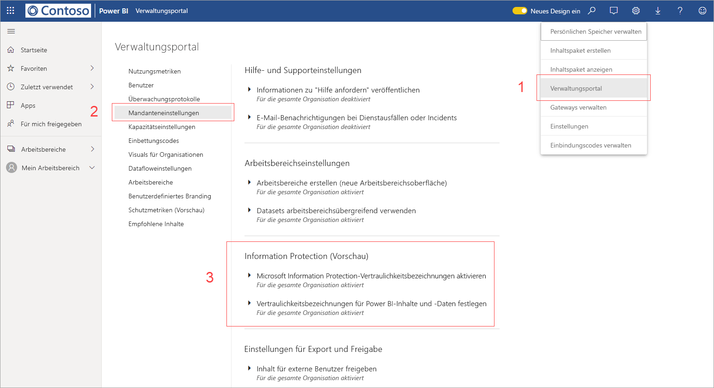
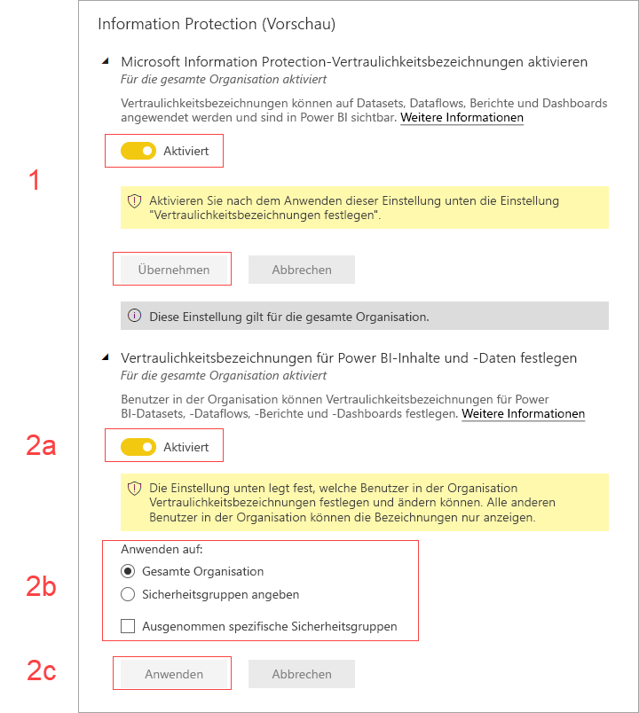

# Aktivieren von Vertraulichkeitsbezeichnungen für Daten in Power BI (Vorschau)

Für das Aktivieren von [Microsoft Information Protection-Vertraulichkeitsbezeichnungen für Daten](https://docs.microsoft.com/microsoft-365/compliance/sensitivity-labels) in Power BI gilt Folgendes:

* Bestimmte Benutzer und Sicherheitsgruppen in einer Organisation können [Vertraulichkeitsbezeichnungen](../designer/service-security-apply-data-sensitivity-labels.md) festlegen und auf ihre Power BI-Dashboards, -Berichte, -Datasets und Dataflows (nachfolgend als *Assets* bezeichnet) anwenden.
* Alle Mitglieder der Organisation können diese Bezeichnungen anzeigen.

Vertraulichkeitsbezeichnungen für Daten fördern den Datenschutz, indem sie Power BI-Autoren und -Consumer auf die Vertraulichkeit von Daten aufmerksam machen und Informationen dazu bereitstellen, was die Klassifizierung bedeutet und wie mit derart klassifizierten Daten umgegangen werden sollte.

Wenn Power BI-Daten, die eine Vertraulichkeitsbezeichnung umfassen, in eine Excel-, PowerPoint- oder PDF-Datei exportiert werden, wird das Vertraulichkeitsbezeichnung mit den Daten exportiert. Das bedeutet, dass ein Benutzer, der aufgrund von Richtlinien für Vertraulichkeitsbezeichnungen keine Berechtigung zum Zugriff auf die klassifizierten Daten besitzt, die Dateien *außerhalb* von Power BI (in Excel-, PowerPoint- oder PDF-Apps) nicht öffnen kann.

Für das Aktivieren von Vertraulichkeitsbezeichnungen wird eine Azure Information Protection-Lizenz benötigt. Weitere Informationen hierzu finden Sie unter [Lizenzierung](#licensing).

## Aktivieren von Vertraulichkeitsbezeichnungen für Daten

Um die Verwendung von Microsoft Information Protection-Vertraulichkeitsbezeichnungen in Power BI zu aktivieren, wechseln Sie zum Power BI-Verwaltungsportal, öffnen Sie den Bereich „Mandanteneinstellungen“, und suchen Sie den Abschnitt „Information Protection“.

Führen Sie im Abschnitt **Information Protection** die folgenden Schritte aus:
1.  Aktivieren Sie die Einstellung **Microsoft Information Protection-Vertraulichkeitsbezeichnungen aktivieren**, und klicken Sie auf **Anwenden**. Durch diesen Schritt werden die Vertraulichkeitsbezeichnungen für Ihr gesamtes Unternehmen *nur sichtbar*. Es werden keine Bezeichnungen angewendet. Um zu definieren, wer diese Bezeichnungen in Power BI anwenden kann, müssen Sie Schritt 2 ausführen.
2.  Definieren Sie, wer diese Vertraulichkeitsbezeichnungen in Power BI anwenden und ändern kann. Dieser Schritt umfasst drei Aktionen:
    1.  Aktivieren Sie den Umschalter **Vertraulichkeitsbezeichnungen für Power BI-Inhalte und -Daten festlegen**.
    2.  Wählen Sie die relevanten Sicherheitsgruppen aus. Standardmäßig kann jeder Benutzer in Ihrer Organisation Vertraulichkeitsbezeichnungen anwenden. Sie können jedoch die Festlegung von Vertraulichkeitsbezeichnungen nur für bestimmte Benutzer oder Sicherheitsgruppen aktivieren. Wenn entweder die gesamte Organisation oder bestimmte Sicherheitsgruppen ausgewählt sind, können Sie bestimmte Teilmengen von Benutzern oder Sicherheitsgruppen ausschließen.
    * Wenn Vertraulichkeitsbezeichnungen für die gesamte Organisation aktiviert sind, geben Ausnahmen in der Regel Sicherheitsgruppen an.
    * Wenn Vertraulichkeitsbezeichnungen nur für bestimmte Benutzer oder Sicherheitsgruppen aktiviert sind, geben Ausnahmen typischerweise bestimmte Benutzer an.  
    Durch diesen Ansatz kann verhindert werden, dass bestimmte Benutzer in Power BI Vertraulichkeitsbezeichnungen anwenden, auch wenn sie einer Gruppe angehören, die hierzu berechtigt ist.
    
    3. Klicken Sie auf **Anwenden**.

> [!IMPORTANT]
> Nur Power BI Pro-Benutzer, die über die Berechtigungen *Erstellen* und *Bearbeiten* für das Asset verfügen und der relevanten Sicherheitsgruppe angehören, die in diesem Abschnitt festgelegt wurde, können die Vertraulichkeitsbezeichnungen festlegen und bearbeiten. Benutzer, die nicht dieser Gruppe angehören, können die Bezeichnung weder festlegen noch bearbeiten. 

## Überlegungen und Einschränkungen

Power BI verwendet Microsoft Information Protection-Vertraulichkeitsbezeichnungen. Wenn Sie daher beim Aktivieren von Vertraulichkeitsbezeichnungen eine Fehlermeldung erhalten, kann dies folgende Ursachen haben:

* Sie besitzen keine Azure Information Protection-[Lizenz](#licensing).
* Die Vertraulichkeitsbezeichnungen wurden nicht zu der von Power BI unterstützten Microsoft Information Protection-Version migriert. Erfahren Sie mehr über das [Migrieren von Vertraulichkeitsbezeichnungen](https://docs.microsoft.com/azure/information-protection/configure-policy-migrate-labels).
* Es wurden in der Organisation keine Vertraulichkeitsbezeichnungen für Microsoft Information Protection definiert. Darüber hinaus muss eine Bezeichnung Teil einer veröffentlichten Richtlinie sein, damit sie verwendet werden kann. [Erfahren Sie mehr über Vertraulichkeitsbezeichnungen](https://docs.microsoft.com/Office365/SecurityCompliance/sensitivity-labels), oder besuchen Sie das Microsoft-Portal [Security & Compliance ](https://sip.protection.office.com/sensitivity?flight=EnableMIPLabels), um zu erfahren, wie Sie Bezeichnungen definieren und Richtlinien für Ihre Organisation veröffentlichen können.

## Lizenzierung

* Um Microsoft Information Protection-Vertraulichkeitsbezeichnungen in Power BI anzeigen oder anwenden zu können, müssen Sie über eine Azure Information Protection Premium P1- oder Premium P2-Lizenz verfügen. Microsoft Azure Information Protection kann entweder als eigenständige Version oder über eines der Microsoft-Lizenzpakete erworben werden. Ausführliche Informationen finden Sie unter [Azure Information Protection – Preise](https://azure.microsoft.com/pricing/details/information-protection/).
* Benutzer, die Vertraulichkeitsbezeichnungen auf Power BI-Assets anwenden müssen, müssen über eine Power BI Pro-Lizenz verfügen.

## Nächste Schritte

In diesem Artikel wurde beschrieben, wie Sie Vertraulichkeitsbezeichnungen auf Daten in Power BI anwenden. Die folgenden Artikel stellen ausführlichere Informationen zum Datenschutz in Power BI bereit. 

* [Übersicht über den Datenschutz in Power BI](service-security-data-protection-overview.md)
* [Anwenden von Vertraulichkeitsbezeichnungen auf Daten in Power BI](../designer/service-security-apply-data-sensitivity-labels.md)
* [Verwenden von Microsoft Cloud App Security-Steuerelementen in Power BI](service-security-using-microsoft-cloud-app-security-controls.md)
* [Bericht zu Datenschutzmetriken](service-security-data-protection-metrics-report.md)