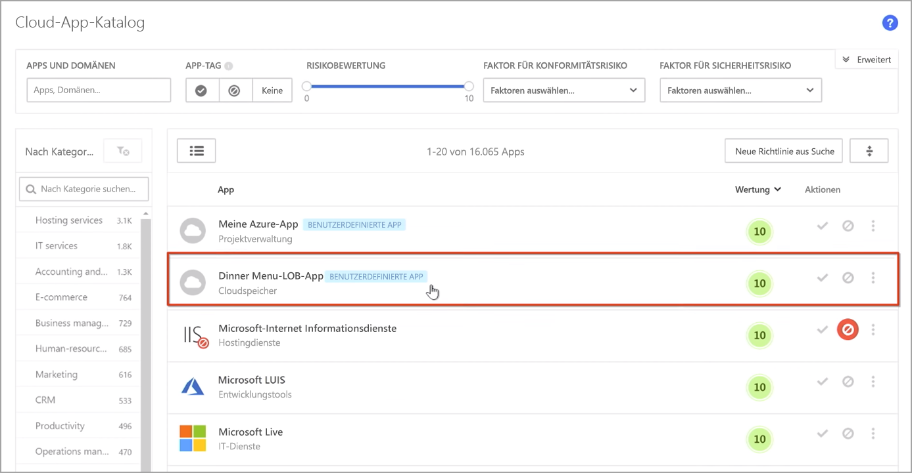
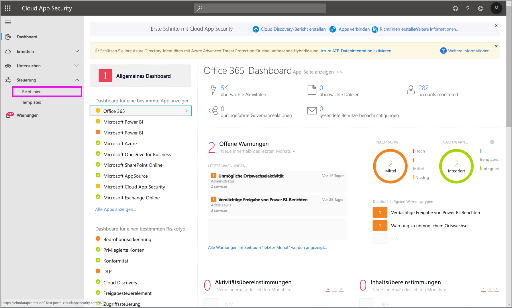
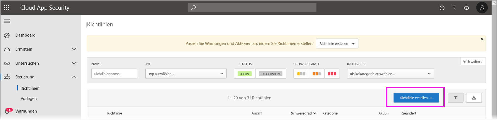
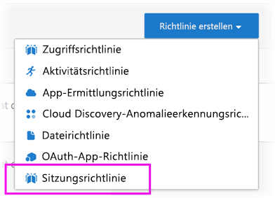
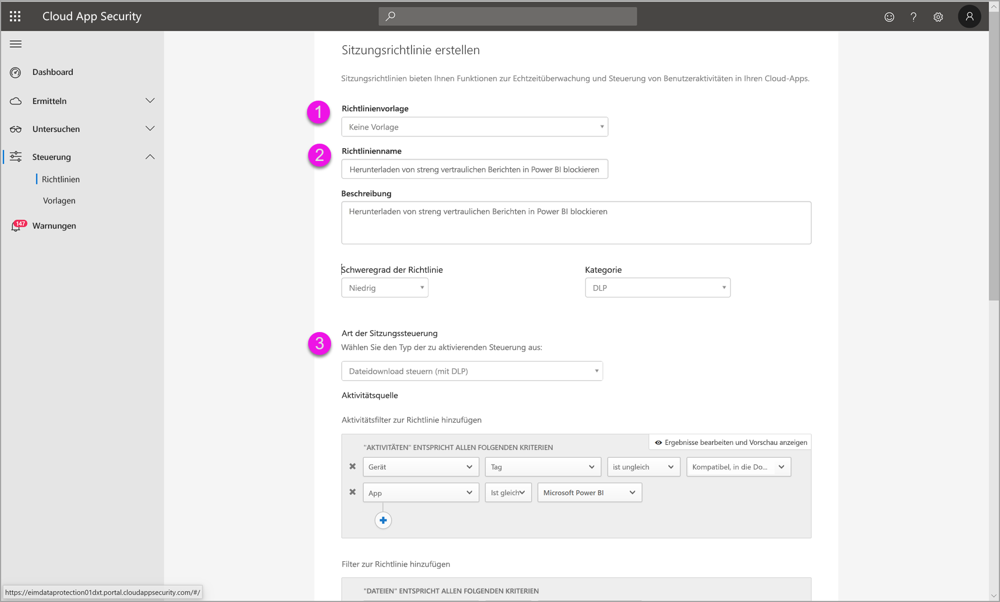
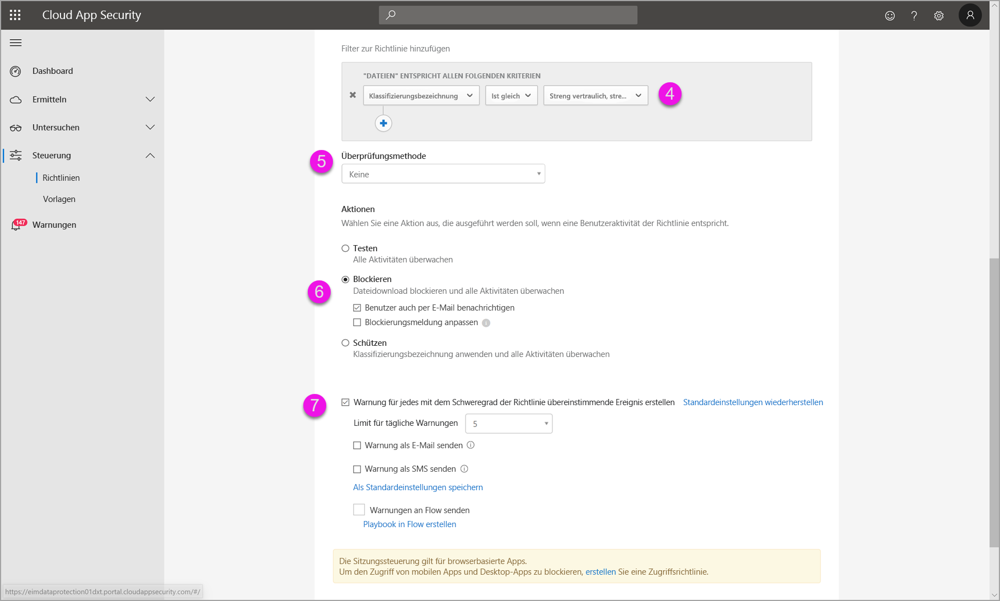

# Verwenden von Microsoft Cloud App Security-Steuerelementen in Power BI (Vorschauversion)

Durch die Verwendung von Microsoft Cloud App Security mit Power BI können Sie Ihre Power BI-Berichte, -Daten und -Dienste vor unbeabsichtigten Lecks oder Sicherheitsverletzungen schützen. Mit Cloud App Security können Sie über Echtzeit-Sitzungssteuerelemente in Azure Active Directory (Azure AD) bedingte Zugriffsrichtlinien für Ihre Organisationsdaten erstellen und so Sicherheit für Ihre Power BI-Analysen gewährleisten. Sobald diese Richtlinien festgelegt wurden, können Administratoren den Zugriff und die Aktivitäten der Benutzer überwachen, Risikoanalysen in Echtzeit durchführen und bezeichnungsspezifische Steuerelemente festlegen. 

Sie können Microsoft Cloud App Security nicht nur für Power BI, sondern auch für alle Arten von Anwendungen und Diensten konfigurieren. Cloud App Security ist ein Microsoft-Dienst, der Anwendungen und Geräte schützt und über ein eigenes Dashboard verwaltet wird. Sie müssen Cloud App Security für die Zusammenarbeit mit Power BI konfigurieren, um von den Cloud App-Sicherheitsfunktionen für Ihre Power BI-Daten und -Analysen zu profitieren. Weitere Informationen über Cloud App Security, einschließlich eines Überblicks über die Funktionsweise, das Dashboard und die Risikobewertung der App, finden Sie in der Dokumentation [Microsoft Cloud App Security](https://docs.microsoft.com/cloud-app-security/).

## Verwenden von Microsoft Cloud App Security mit Power BI

Um Microsoft Cloud App Security mit Power BI nutzen zu können, müssen Sie die entsprechenden Microsoft Security-Dienste verwenden und konfigurieren, von denen einige außerhalb von Power BI eingerichtet sind.

### Microsoft Cloud App Security-Lizenzierung

Um Microsoft Cloud App Security in Ihrem Mandanten verwenden zu können, müssen Sie über eine der folgenden Lizenzen verfügen:
* MCAS: Bietet OCAS-Funktionen für alle unterstützten Apps; Teil der EMS E5- und M365 E5-Suites.
* CAS-D: Stellt nur MCAS Discovery bereit.
* OCAS: Bietet MCAS-Funktionen nur für Office 365; Teil der Office E5-Suite.
* Optional: AAD P1 und AIP P1, um von den wichtigsten Microsoft Cloud App Security-Funktionen profitieren zu können.

In den folgenden Abschnitten werden die Schritte zum Verwenden von Microsoft Cloud App Security in Power BI beschrieben.

### Festlegen von Sitzungsrichtlinien in Azure Active Directory (erforderlich)
Die Schritte zum Festlegen von Sitzungssteuerelementen, werden in den Azure AD- und Microsoft Cloud App Security-Portalen ausgeführt. Im Azure AD-Portal erstellen Sie eine Richtlinie für den bedingten Zugriff auf Power BI und leiten die in Power BI verwendeten Sitzungen über den Microsoft Cloud App Security-Dienst weiter. 

Microsoft Cloud App Security arbeitet mit einer Reverseproxyarchitektur und ist in den bedingten Azure AD-Zugriff integriert, um Power BI-Benutzeraktivität in Echtzeit zu überwachen. Die folgenden Schritte dienen hier dem besseren Verständnis des Prozesses. Detaillierte Schritt-für-Schritt-Anleitungen finden Sie in den verlinkten Inhalten in den einzelnen Schritten. In diesem [Cloud App Security-Artikel](https://docs.microsoft.com/cloud-app-security/proxy-deployment-aad) ist der gesamte Prozess beschrieben.

1.  [Erstellen einer Azure AD-Testrichtlinie für bedingten Zugriff](https://docs.microsoft.com/cloud-app-security/proxy-deployment-aad#add-azure-ad)
2.  [Anmelden bei jeder App mithilfe eines Benutzers, der der Richtlinie zugeordnet ist](https://docs.microsoft.com/cloud-app-security/proxy-deployment-aad#sign-in-scoped)
3.  [Überprüfen, ob die Apps für die Verwendung von Zugriffs-und Sitzungssteuerungen konfiguriert sind](https://docs.microsoft.com/cloud-app-security/proxy-deployment-aad#portal)
4.  [Testen der Bereitstellung](https://docs.microsoft.com/cloud-app-security/proxy-deployment-aad#step-4-test-the-deployment)

Der Prozess zum Festlegen von Sitzungsrichtlinien wird ausführlich im Artikel [Sitzungsrichtlinien](https://docs.microsoft.com/cloud-app-security/session-policy-aad) beschrieben. 

### Festlegen von Richtlinien zur Anomalieerkennung zum Überwachen von PBI-Aktivitäten (empfohlen)
Power BI-Richtlinien zur Anomalieerkennung können individuell festgelegt werden, sodass sie sich nur auf die Benutzer und Gruppen bezieht, die Sie in der Richtlinie ein- und ausschließen möchten. [Weitere Informationen](https://docs.microsoft.com/cloud-app-security/anomaly-detection-policy#scope-anomaly-detection-policies).

Cloud App Security verfügt auch über zwei dedizierte, integrierte Erkennungsfunktionen für Power BI. [Einzelheiten finden Sie im Abschnitt weiter unten in diesem Dokument](#built-in-microsoft-cloud-app-security-detections-for-power-bi).

### Verwenden von Microsoft Information Protection-Vertraulichkeitsbezeichnungen (empfohlen)

Mithilfe von Vertraulichkeitsbezeichnungen können Sie sensible Inhalte klassifizieren und schützen, sodass die Mitarbeiter in Ihrer Organisation mit externen Partnern zusammenarbeiten und gleichzeitig den Schutz vertraulicher Inhalte und Daten gewährleisten können. 

Im Artikel zu [Vertraulichkeitsbezeichnungen in Power BI](../designer/service-security-apply-data-sensitivity-labels.md) finden Sie Details zum Prozess der Verwendung von Vertraulichkeitsbezeichnungen für Power BI. Im Folgenden finden Sie ein [Beispiel einer Power BI Richtlinie, die auf Vertraulichkeitsbezeichnungen](#example) basiert.

## Integrierte Microsoft Cloud App Security-Erkennungsfunktionen für Power BI

Mit Microsoft Cloud App Security-Erkennungsfunktionen können Administratoren bestimmte Aktivitäten einer überwachten App überwachen. Für Power BI gibt es derzeit zwei dedizierte, integrierte Cloud App Security-Erkennungsfunktionen: 

* **Verdächtige Freigabe** – erkennt, wenn ein Benutzer einen Bericht mit sensiblen Daten mit einer unbekannten E-Mail (außerhalb der Organisation) freigibt. Bei einem Bericht mit sensiblen Daten handelt es sich um einen Bericht, dessen Vertraulichkeitsbezeichnung auf **INTERNAL-ONLY** oder höher festgelegt ist. 

* **Massenfreigabe von Berichten** – erkennt, wenn ein Benutzer viele verschiedene Berichte in einer einzigen Sitzung freigibt.

Die Einstellungen für diese Erkennungsfunktionen werden im Cloud App Security-Portal konfiguriert. [Weitere Informationen](https://docs.microsoft.com/cloud-app-security/anomaly-detection-policy#unusual-activities-by-user). 

## Power BI-Administratorrolle in Microsoft Cloud App Security

Bei der Verwendung von Microsoft Cloud App Security mit Power BI wird für Power BI-Administratoren eine neue Rolle erstellt. Wenn Sie sich als Power BI-Administrator beim [Cloud App Security-Portal](https://portal.cloudappsecurity.com/) anmelden, haben Sie eingeschränkten Zugriff auf Power BI-relevante Daten, Warnungen, gefährdete Benutzer, Aktivitätsprotokolle und weitere Informationen.

## Überlegungen und Einschränkungen 
Durch die Verwendung von Cloud App Security mit Power BI können Sie mit Erkennungsfunktionen zur Überwachung von Benutzersitzungen und deren Aktivitäten die Inhalte und Daten Ihrer Organisation schützen. Bei der Verwendung von Cloud App Security mit Power BI sind einige Überlegungen und Einschränkungen zu berücksichtigen:

* Microsoft Cloud App Security kann nur für Excel-, PowerPoint-und PDF-Dateien verwendet werden.
* Wenn Sie die Funktionen der Vertraulichkeitsbezeichnungen in Ihren Sitzungsrichtlinien für Power BI verwenden möchten, benötigen Sie eine Azure Information Protection Premium P1- oder Premium P2-Lizenz. Microsoft Azure Information Protection kann entweder als eigenständige Version oder über eines der Microsoft-Lizenzpakete erworben werden. Ausführliche Informationen finden Sie unter [Azure Information Protection – Preise](https://azure.microsoft.com/pricing/details/information-protection/). Außerdem müssen Vertraulichkeitsbezeichnungen auf Ihre Power BI-Objekte angewendet werden.
* Die Sitzungssteuerung steht für jeden Browser auf jeder gängigen Plattform unter jedem Betriebssystem zur Verfügung. Es wird empfohlen, Internet Explorer 11, Microsoft Edge (neueste Version), Google Chrome (neueste Version), Mozilla Firefox (neueste Version) oder Apple Safari (neueste Version) zu verwenden. Öffentliche API-Aufrufe von Power BI und andere nicht browserbasierte Sitzungen werden nicht als Teil der Microsoft Cloud App Security-Sitzungssteuerung unterstützt. [Weitere Details finden Sie hier](https://docs.microsoft.com/cloud-app-security/proxy-intro-aad#supported-apps-and-clients).

> [!CAUTION]
> * Die Richtlinie *content inspection* in Microsoft Cloud App Security ist derzeit bei der Anwendung einer Excel-Dateirichtlinie in Power BI nicht verfügbar. Legen Sie diese Richtlinie daher nicht für Power BI fest.
> * Die Funktion „protect“ funktioniert in der Sitzungsrichtlinie im Teil „Action“ nur, wenn keine Bezeichnung auf dem Element vorhanden ist. Wenn eine Bezeichnung bereits vorhanden ist, wird die Aktion „protect“ nicht angewendet. Eine vorhandene Bezeichnung, die bereits für ein Element in Power BI angewendet wurde, kann nicht überschrieben werden.

## Beispiel

Im folgenden Beispiel wird gezeigt, wie Sie mit Microsoft Cloud App Security mit Power BI eine neue Sitzungsrichtlinie erstellen.

Erstellen Sie zunächst eine neue Sitzungsrichtlinie. Wählen Sie im linken Menü im **Cloud App Security**-Portal die Option **Richtlinien**.

Wählen Sie im angezeigten Fenster die Dropdownliste **Richtlinie erstellen** aus.

Wählen Sie aus den Optionen in der Dropdownliste **Sitzungsrichtlinie** aus.

Die Sitzungsrichtlinie wird im angezeigten Fenster erstellt. Die nummerierten Schritten beschreiben die Einstellungen in der folgenden Abbildung.

  1. Wählen Sie in der Dropdownliste **Richtlinienvorlage** die Option *Keine Vorlage* aus.
  2. Geben Sie für das Feld **Richtlinienname** einen relevanten Namen für Ihre Sitzungsrichtlinie ein.
  3. Wählen Sie für **Sitzungssteuerungstyp***Heruntergeladene Steuerungsdatei (mit DLP)* .

      Wählen Sie im Abschnitt **Aktivitätsquelle** die relevanten Blockierungsrichtlinien aus. Es wird empfohlen, nicht verwaltete und nicht kompatible Geräte zu blockieren. Legen Sie fest, das Downloads blockiert werden, wenn die Sitzung in Power BI ausgeführt wird.

        

        Wenn Sie nach unten scrollen, finden Sie weitere Optionen. In der folgenden Abbildung werden diese Optionen mit zusätzlichen Beispielen gezeigt. 

  4. Wählen Sie als *Vertraulichkeitsbezeichnung* die Option *streng vertraulich* oder welche Bezeichnung am besten zu Ihrer Organisation passt.
  5. Ändern Sie die **Überprüfungsmethode** in *Keine*.
  6. Wählen Sie die Option zum **Blockieren**, die zu Ihren Anforderungen passt.
  7. Stellen Sie sicher, dass Sie für eine solche Aktion eine Warnung erstellt haben.

        

        

  8. Klicken Sie abschließend auf **Erstellen**, um die Sitzungsrichtlinie zu erstellen.

        

> [!CAUTION]
> Stellen Sie sicher, dass Sie keine Richtlinie **content inspection** für Power BI-Excel-Dateien erstellen. Dies ist eine bekannte Einschränkung dieser *Vorschauversion*.

## Nächste Schritte
In diesem Artikel wurde beschrieben, wie Microsoft Cloud App Security den Schutz von Daten und Inhalten für Power BI gewährleisten kann. Möglicherweise sind auch die folgenden Artikel für Sie interessant. Darin werden der Datenschutz für Power BI und die Unterstützung von Inhalten für die Azure-Dienste beschrieben, die diesen ermöglichen.

* [Übersicht über den Datenschutz in Power BI](service-security-data-protection-overview.md)
* [Aktivieren von Vertraulichkeitsbezeichnungen für Daten in Power BI](service-security-enable-data-sensitivity-labels.md)
* [Anwenden von Vertraulichkeitsbezeichnungen auf Daten in Power BI](../designer/service-security-apply-data-sensitivity-labels.md)

Folgende Azure- und Sicherheitsartikel könnten Sie ebenfalls interessieren:

* [Schützen von Apps mit Microsoft Cloud App Security Conditional Access App Control](https://docs.microsoft.com/cloud-app-security/proxy-intro-aad)
* [Bereitstellen der App-Steuerung für bedingten Zugriff für ausgewählte Apps](https://docs.microsoft.com/cloud-app-security/proxy-deployment-aad)
* [Sitzungsrichtlinien](https://docs.microsoft.com/cloud-app-security/session-policy-aad)
* [Übersicht über Vertraulichkeitsbezeichnung](https://docs.microsoft.com/microsoft-365/compliance/sensitivity-labels)