# Installieren und Verwenden von Apps mit Dashboards und Berichten in Power BI

[!INCLUDE [power-bi-service-new-look-include](../includes/power-bi-service-new-look-include.md)]

Nachdem Sie [grundlegende Informationen zu Apps](end-user-apps.md) erhalten haben, erfahren Sie hier, wie Apps geöffnet werden und wie Sie mit ihnen interagieren. 

## Wie erhalte ich eine neue App?
Es gibt mehrere Möglichkeiten, eine neue App zu erhalten. Ein Berichts-Designer kann die App automatisch in Ihrem Power BI-Konto installieren oder Ihnen einen direkten Link zur App senden. Sie können auch in AppSource nach verfügbaren Apps suchen, die von App-Designern innerhalb oder außerhalb Ihres Unternehmens bereitgestellt werden. 

Wenn Sie Power BI auf Ihrem mobilen Gerät nutzen, können Sie eine App nur über einen direkten Link und nicht über AppSource installieren. Wenn der Designer der App diese automatisch installiert, wird sie in der Liste der Apps angezeigt.

## Installieren einer App über einen direkten Link
Wenn Sie selbst eine neue App installieren möchten, besteht die einfachste Möglichkeit darin, einen direkten Link zu verwenden, der Ihnen vom Designer der App per E-Mail zugesendet wird.  

**Auf Ihrem Computer** 

Wenn Sie auf den Link in der E-Mail klicken, öffnet der Power BI-Dienst ([https://powerbi.com](https://powerbi.com)) die App in Ihrem Browser. 

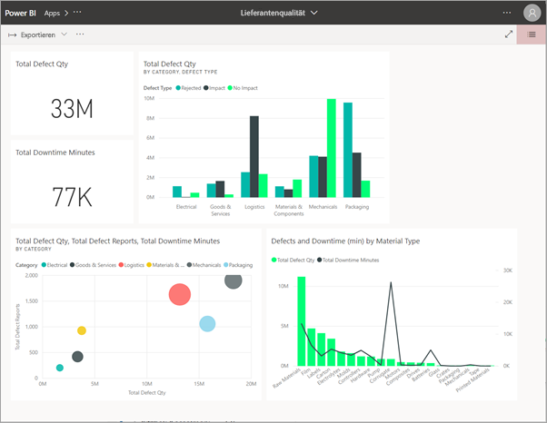

**Auf Ihrem iOS- oder Android-Mobilgerät** 

Wenn Sie auf Ihrem mobilen Gerät auf den Link in der E-Mail klicken, wird die App automatisch installiert und in der mobilen App geöffnet. Sie müssen sich möglicherweise zuerst anmelden. 

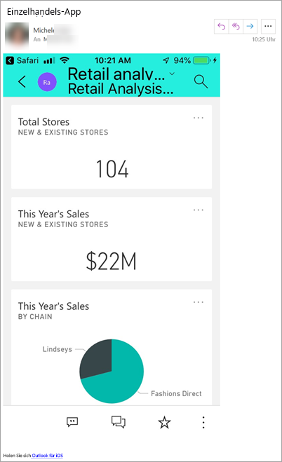

## Abrufen der App von Microsoft AppSource
Sie können auch in Microsoft AppSource Apps suchen und installieren. Dort werden nur Apps angezeigt, auf die Sie Zugriff haben (da der Ersteller der App Ihnen oder allen die Berechtigung dazu erteilt hat).

1. Wählen Sie **Apps**  > **Apps abrufen** aus. 
   
    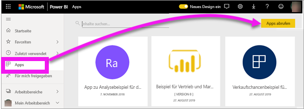    
2. Suchen Sie in AppSource unter **Meine Organisation**, um die Ergebnisse einzugrenzen und die gewünschte App zu finden.
   
    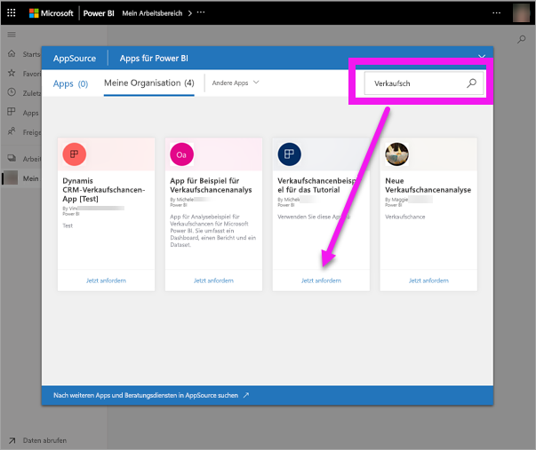
3. Wählen Sie **Jetzt anfordern** aus, um sie Ihrer Inhaltsliste „Apps“ hinzuzufügen. 

## Abrufen einer App von der Microsoft AppSource-Website 

In diesem Beispiel wird eine der Beispiel-Apps von Microsoft geöffnet. Unter AppSource finden Sie Apps für viele der Dienste, die Sie zur Unterstützung Ihrer Geschäftstätigkeit verwenden.  Dienste wie Salesforce, Microsoft Dynamics, Google Analytics, GitHub, Zendesk, Marketo und viele mehr. Weitere Informationen finden Sie unter [Apps für Dienste, die Sie mit Power BI verwenden](../service-connect-to-services.md). 

1. Öffnen Sie https://appsource.microsoft.com in einem Browser, und wählen Sie **Power BI-Apps** aus.

    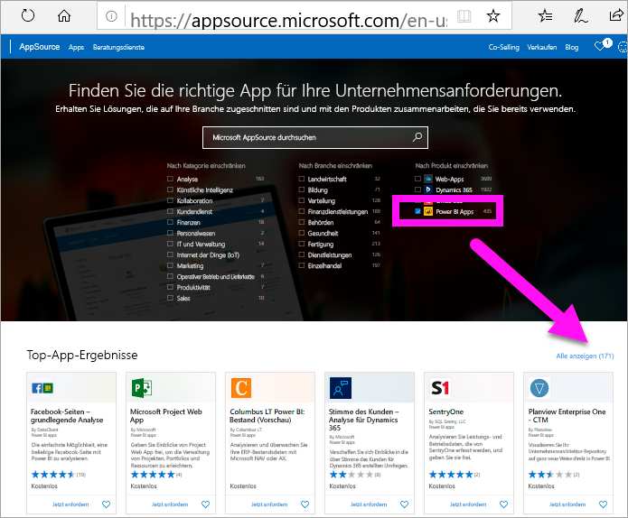

2. Klicken Sie auf **Alle anzeigen**, um die Liste aller Power BI-Apps anzuzeigen, die derzeit unter AppSource verfügbar sind. Suchen Sie nach der App **Microsoft Sample - Sales & Marketing**.

    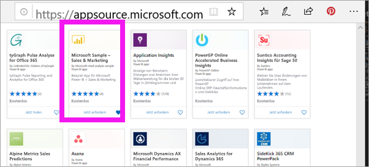

3. Klicken Sie auf **Jetzt holen**, und stimmen Sie den Nutzungsbedingungen zu.

    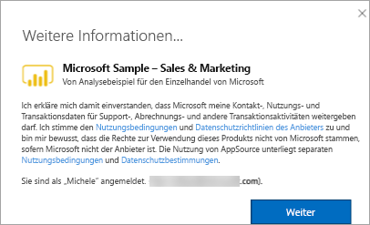

4. Bestätigen Sie, dass Sie diese App installieren möchten.

    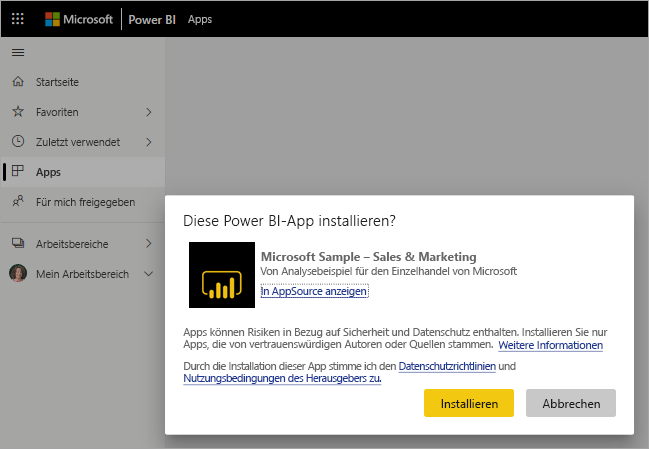

5. Im Power BI-Dienst wird eine Erfolgsmeldung angezeigt, sobald die App installiert wurde. Klicken Sie auf **Zu App wechseln**, um die App zu öffnen. Abhängig davon, wie der Designer die App erstellt hat, wird entweder das App-Dashboard oder der App-Bericht angezeigt.

    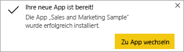

    Sie können die App auch direkt über die Inhaltsliste Ihrer App öffnen, indem Sie auf **Apps** und anschließend auf **Sales & Marketing** klicken.

    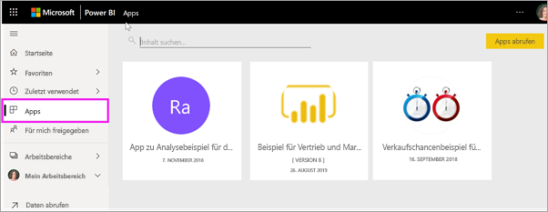

6. Wählen Sie aus, ob Sie Ihre neue App untersuchen oder anpassen und freigeben möchten. Da wir eine Beispiel-App von Microsoft ausgewählt haben, erkunden wir diese zunächst. 

    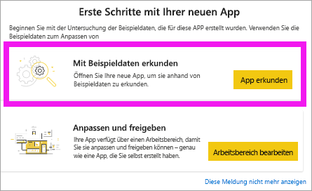

7.  Die neue App wird mit einem Dashboard geöffnet. Der *Designer* der App hätte die App so erstellen können, dass sie stattdessen mit einem Bericht geöffnet wird.  

    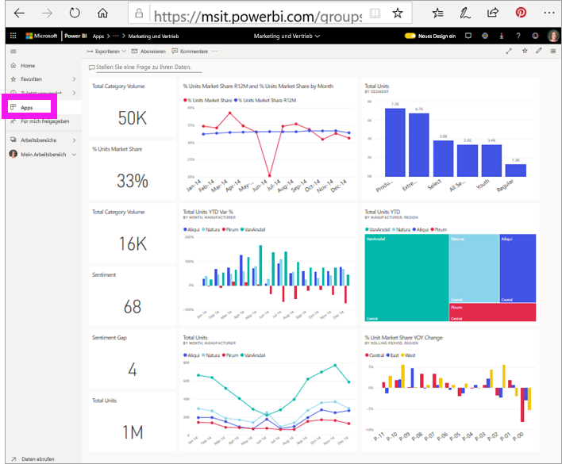

## Interagieren mit Dashboards und Berichten in der App
Nehmen Sie sich Zeit, die Daten auf den Dashboards und in den Berichten zu erkunden, aus denen die App besteht. Sie haben Zugriff auf alle standardmäßigen Power BI-Interaktionen wie Filtern, Hervorheben, Sortieren und Durchführen von Drilldowns.  Ist Ihnen der Unterschied zwischen Dashboards und Berichten noch nicht ganz klar?  Lesen Sie sich die Artikel zu [Dashboards](end-user-dashboards.md) und zu [Berichten](end-user-reports.md) durch.  

## Aktualisieren einer App 

Von Zeit zu Zeit veröffentlichen App-Ersteller neue Versionen ihrer Apps. Wie Sie Zugang zu neuen Versionen erhalten, hängt davon ab, wie Sie die ursprüngliche Version erhalten haben. 

* Wenn Sie die App von Ihrer Organisation erhalten haben, erfolgt das Update auf die neue Version vollständig transparent – Sie selbst müssen nicht aktiv werden. 

* Wenn Sie die App von AppSource heruntergeladen haben, wird für Sie beim nächsten Öffnen der App ein Benachrichtigungsbanner angezeigt. Darüber werden Sie benachrichtigt, dass eine neue Version verfügbar ist. 

    1. Klicken Sie auf **Get it** (Jetzt herunterladen), damit Ihre App aktualisiert wird.  

        <!-- -->

    2. Klicken Sie auf **Installieren**, wenn Sie zur Installation des App-Updates aufgefordert werden. 

         

    3. Da Sie bereits eine Version der App haben, können Sie sich entscheiden, ob Sie die vorhanden Version ersetzen oder die aktualisierte App in einem neuen Arbeitsbereich installieren möchten.   

         

    > [!NOTE] 
    > Durch die Installation einer neuen Version werden alle Änderungen überschrieben, die Sie an Berichten und Dashboards vorgenommen haben. Wenn Sie Änderungen an Berichten und Dashboards auch nach einem Update beibehalten möchten, können Sie sie vor der Installation mit einem anderen Namen oder an einem anderen Speicherort speichern. 

    4. Sobald die aktuelle Version installiert ist, klicken Sie auf **App aktualisieren**, damit das Update abgeschlossen wird. 

    <!-- -->

## Nächste Schritte
* [Zurück zur App-Übersicht](end-user-apps.md)
* [Anzeigen eines Power BI-Berichts](end-user-report-open.md)
* [Andere Möglichkeiten, wie Inhalte für Sie freigegeben werden](end-user-shared-with-me.md)
