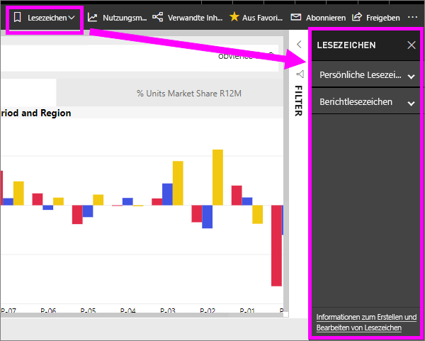
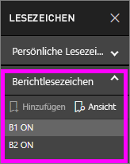
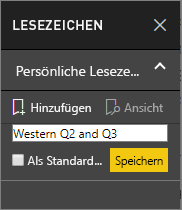
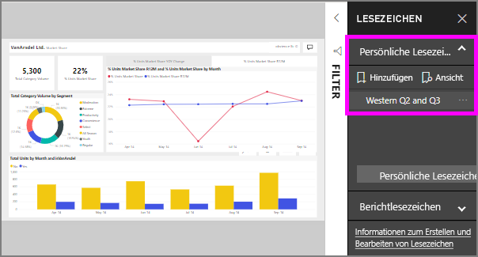

# Was sind Lesezeichen?
Lesezeichen erfassen die aktuell konfigurierte Ansicht einer Berichtseite, einschließlich Filtern, Datenschnitten und dem Zustand von Visuals. Beim Klicken auf ein Lesezeichen gelangen Sie in Power BI dann wieder zu dieser Ansicht. Es gibt zwei Arten von Lesezeichen: von Ihnen selbst erstellte und von *Berichts-Designern* erstellte.

## Verwenden von Lesezeichen zum Teilen von Erkenntnissen und zum Erstellen von Präsentationen in Power BI 
Lesezeichen besitzen viele unterschiedliche Verwendungsmöglichkeiten. Angenommen Sie entdecken eine interessante Information und möchten später darauf zurückkommen können – mit einem Lesezeichen ist dies jederzeit möglich. Wenn Sie Ihre Arbeit unterbrechen müssen, den aktuellen Stand aber beibehalten möchten – erstellen Sie ein Lesezeichen. Sie können ein Lesezeichen sogar als Standardansicht des Berichts festlegen, damit bei jedem Öffnen zunächst diese Ansicht der Berichtseite angezeigt wird. 

Sie können auch eine Sammlung von Lesezeichen erstellen, sie in der gewünschten Reihenfolge anordnen und dann die einzelnen Lesezeichen in einer Präsentation durchlaufen, um eine Reihe von zusammenhängenden Einsichten hervorzuheben.  

## Verwenden von Lesezeichen
Klicken Sie in der Menüleiste auf **Lesezeichen**, um den Lesezeichenbereich zu öffnen. Klicken Sie auf die Option **Auf Standardwert zurücksetzen**, um zur ursprünglich veröffentlichten Ansicht zurückzukehren.

### Berichtlesezeichen
Wurden vom *Berichts-Designer* Berichtlesezeichen hinzugefügt, finden Sie diese unter der Überschrift **Berichtlesezeichen**. 

Klicken Sie auf ein Lesezeichen, um zu dieser Berichtsansicht zu wechseln. 

### Persönliche Lesezeichen

Wenn Sie ein Lesezeichen erstellen, werden die folgenden Elemente mit dem Lesezeichen gespeichert:

* Die aktuelle Seite
* Filter
* Slicer, einschließlich Slicertyp (z.B. Dropdown oder Liste) und Slicerstatus
* Status der Auswahl des Visuals (z.B. Filter mit übergreifender Hervorhebung)
* Sortierreihenfolge
* Drilldownposition
* Sichtbarkeit (eines Objekts, im Bereich **Auswahl** festgelegt)
* Der Fokus- oder **Spotlightmodus** jedes angezeigten Objekts

Konfigurieren Sie eine Berichtsseite so, wie sie im Lesezeichen angezeigt werden soll. Sobald die Berichtsseite und die Visuals wie gewünscht angeordnet sind, wählen Sie im Bereich **Lesezeichen** die Option **Hinzufügen** aus, um ein Lesezeichen hinzufügen. In diesem Beispiel wurden Filter nach Region und Datum hinzugefügt. 

**Power BI** erstellt ein Lesezeichen und benennt es mit einem generischen oder einem von Ihnen eingegebenen Namen. Lesezeichen können *umbenannt*, *gelöscht* oder *aktualisiert* werden. Klicken Sie hierzu auf die Auslassungspunkte neben dem Namen des Lesezeichens, und wählen Sie im daraufhin angezeigten Menü eine Aktion aus.

Sobald ein Lesezeichen erstellt wurde, können Sie es einfach durch Klicken im Bereich **Lesezeichen** anzeigen. 

<!--
## Arranging bookmarks
As you create bookmarks, you might find that the order in which you create them isn't necessarily the same order you'd like to present them to your audience. No problem, you can easily rearrange the order of bookmarks.

In the **Bookmarks** pane, simply drag-and-drop bookmarks to change their order, as shown in the following image. The yellow bar between bookmarks designates where the dragged bookmark will be placed.

The order of your bookmarks can become important when you use the **View** feature of bookmarks, as described in the next section. 

-->

## Lesezeichen als Bildschirmpräsentation
Wenn Sie Lesezeichen in einer bestimmten Reihenfolge präsentieren oder anzeigen möchten, klicken Sie im Bereich **Lesezeichen** auf **Ansicht**, um die Diashow zu starten.

Im Modus **Ansicht** sind einige Features zu beachten:

1. Auf der Lesezeichen-Titelleiste am unteren Rand des Zeichenbereichs wird der Name des Lesezeichens angezeigt.
2. Die Lesezeichen-Titelleiste verfügt über Pfeile, mit denen Sie zum nächsten oder vorherigen Lesezeichen wechseln können.
3. Sie können den Modus **Ansicht** beenden, indem Sie im Bereich **Lesezeichen** die Option **Beenden** oder das **X** auf der Lesezeichen-Titelleiste auswählen. 

Im Modus **Ansicht** können Sie den Bereich **Lesezeichen** schließen (durch Klicken auf das „X“ in diesem Bereich), um mehr Platz für die Präsentation zu erhalten. Und im Modus **Ansicht** sind alle Visuals interaktiv und für die übergreifende Hervorhebung verfügbar, so wie bei der Interaktion mit ihnen. 

<!--
## Visibility - using the Selection pane
With the release of bookmarks, the new **Selection** pane is also introduced. The **Selection** pane provides a list of all objects on the current page and allows you to select the object and specify whether a given object is visible. 

You can select an object using the **Selection** pane. Also, you can toggle whether the object is currently visible by clicking the eye icon to the right of the visual. 

When a bookmark is added, the visible status of each object is also saved based on its setting in the **Selection** pane. 

It's important to note that **slicers** continue to filter a report page, regardless of whether they are visible. As such, you can create many different bookmarks, with different slicer settings, and make a single report page appear very different (and highlight different insights) in various bookmarks.

## Bookmarks for shapes and images
You can also link shapes and images to bookmarks. With this feature, when you click on an object, it will show the bookmark associated with that object. This can be especially useful when working with buttons; you can learn more by reading the article about [using buttons in Power BI](desktop-buttons.md). 

To assign a bookmark to an object, select the object, then expand the **Action** section from the **Format Shape** pane, as shown in the following image.

Once you turn the **Action** slider to **On** you can select whether the object is a back button, a bookmark, or a Q&A command. If you select bookmark, you can then select which of your bookmarks the object is linked to.

There are all sorts of interesting things you can do with object-linked bookmarking. You can create a visual table of contents on your report page, or you can provide different views (such as visual types) of the same information, just by clicking on an object.

When you are in editing mode you can use ctrl+click to follow the link, and when not in edit mode, simply click the object to follow the link. 

## Bookmark groups

Beginning with the August 2018 release of **Power BI Desktop**, you can create and use bookmark groups. A bookmark group is a collection of bookmarks that you specify, which can be shown and organized as a group. 

To create a bookmark group, hold down the CTRL key and select the bookmarks you want to include in the group, then click the ellipses beside any of the selected bookmarks, and select **Group** from the menu that appears.

**Power BI Desktop** automatically names the group *Group 1*. Fortunately, you can just double-click on the name and rename it to whatever you want.

With any bookmark group, clicking on the bookmark group's name only expands or collapses the group of bookmarks, and does not represent a bookmark by itself. 

When using the **View** feature of bookmarks, the following applies:

* If the selected bookmark is in a group when you select **View** from bookmarks, only the bookmarks *in that group* are shown in the viewing session. 

* If the selected bookmark is not in a group, or is on the top level (such as the name of a bookmark group), then all bookmarks for the entire report are played, including bookmarks in any group. 

To ungroup bookmarks, just select any bookmark in a group, click the ellipses, and then select **Ungroup** from the menu that appears. 

Note that selecting **Ungroup** for any bookmark from a group takes all bookmarks out of the group (it deletes the group, but not the bookmarks themselves). So to remove a single bookmark from a group, you need to **Ungroup** any member from that group, which deletes the grouping, then select the members you want in the new group (using CTRL and clicking each bookmark), and select **Group** again. 
-->

## Einschränkungen und Überlegungen
Für dieses Release von **Lesezeichen** gelten einige Einschränkungen und Überlegungen.

* Die meisten benutzerdefinierten Visualisierungen sollten mit Lesezeichen gut funktionieren. Wenn bei einem Lesezeichen Probleme in Zusammenhang mit einem benutzerdefinierten Visual auftreten sollten, bitten Sie den Ersteller des benutzerdefinierten Visuals, dafür zu sorgen, dass sein Visual Lesezeichen unterstützt. 
* Wenn Sie einer Berichtsseite nach dem Erstellen eines Lesezeichens ein Visual hinzufügen, wird das Visual in seinem Standardstatus angezeigt. Dies bedeutet auch, dass beim Anwenden eines Datenschnitts auf einer Seite, auf der Sie zuvor Lesezeichen erstellt haben, das Verhalten des Datenschnitts seinem Standardstatus entspricht.
* Das Verschieben von Visuals nach dem Erstellen des Lesezeichens wird im Lesezeichen wiedergegeben. 
* Im Allgemeinen sind Lesezeichen nicht davon betroffen, wenn der *Berichts-Designer* den Bericht aktualisiert oder noch mal veröffentlicht. Bei wesentlichen Änderungen am Bericht, wie etwa dem Entfernen eines Felds, das von einem Lesezeichen verwendet wird, wird jedoch beim nächsten Versuch, das Lesezeichen zu öffnen, eine Fehlermeldung angezeigt. 

<!--
## Next steps
spotlight?
-->
