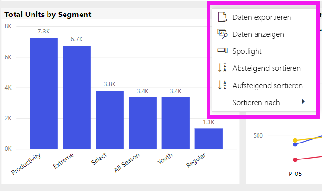

# Ändern der Sortierung eines Diagramms in einem Power BI-Bericht

[!INCLUDE [power-bi-service-new-look-include](../includes/power-bi-service-new-look-include.md)]

> [!IMPORTANT]
> **Dieser Artikel richtet sich an Power BI-Benutzer, die nicht berechtigt sind, den Bericht oder das Dataset zu bearbeiten, und die nur die Onlineversion von Power BI (Power BI-Dienst) verwenden. Wenn Sie ein Berichts-*Designer*, -*administrator* oder -*besitzer* sind, finden Sie in diesem Artikel möglicherweise nicht alle Informationen, die Sie benötigen. Stattdessen sollten Sie den Artikel [Sortieren nach Spalten in Power BI Desktop](../desktop-sort-by-column.md)** lesen.

Im Power BI-Dienst können Sie das Erscheinungsbild eines Visuals ändern, indem Sie es nach verschiedenen Datenfeldern sortieren. Indem Sie die Sortierung eines Visuals ändern, können Sie die Informationen hervorheben, die Sie vermitteln möchten. Ob Sie numerische Daten (z.B. Umsatzzahlen) oder Text (z.B. Ländernamen) verwenden – die Visualisierungen lassen sich wunschgemäß sortieren. Power BI bietet große Flexibilität beim Sortieren sowie Schnellmenüs. 

Visuals auf einem Dashboard können nicht sortiert werden, aber in einem Power BI-Bericht können Sie die meisten Visualisierungen sortieren. 

## Erste Schritte

Wählen Sie zum Einstieg ein beliebiges Berichtsvisual aus, und klicken Sie auf **Weitere Aktionen** (...).  Es gibt drei Optionen für das Sortieren: **Absteigend sortieren**, **Aufsteigend sortieren** und **Sortieren nach**. 
    

### Alphabetisches oder numerisches Sortieren

Visuals lassen sich alphabetisch nach den Textnamen der Kategorien im Visual oder nach den numerischen Werten jeder Kategorie sortieren. In diesem Diagramm wird z.B. alphabetisch nach der Kategorie auf der X-Achse **Name** sortiert.

Sie können ganz einfach statt nach einer Kategorie (Geschäftsname) nach einem Wert (Umsatz pro Quadratfuß) sortieren. Wählen Sie die Auslassungspunkte (...) für **Weitere Aktionen** und **Sortieren nach** aus. Wählen Sie einen numerischen Wert aus, der im Visual verwendet wird.  In diesem Beispiel wird **Sales Per Sq Ft** ausgewählt.

Ändern Sie ggf. die Sortierreihenfolge von aufsteigend in absteigend oder umgekehrt.  Wählen Sie noch einmal **Weitere Aktionen** (...) und dann **Absteigend sortieren** bzw. **Aufsteigend sortieren** aus. Das Feld, das zum Sortieren verwendet wird, ist fett dargestellt und weist eine gelbe Leiste auf.

   

> [!NOTE]
> Nicht alle Visuals können sortiert werden. Beispielsweise können die folgenden Visuals nicht sortiert werden: Treemaps, Karten, Flächenkartogramme, Punktdiagramme, Tachometerdiagramme, Kartendiagramme, Wasserfalldiagramme.

## Speichern der Änderungen an der Sortierreihenfolge
Power BI-Berichte behalten die von Ihnen vorgenommenen Änderungen an den Filtern, den Datenschnitten, der Sortierung und anderen Datenansichten bei, selbst wenn Sie in der [Leseansicht](end-user-reading-view.md) arbeiten. Wenn Sie also einen Bericht verlassen und später zurückkehren, werden Ihre Änderungen an der Sortierung gespeichert.  Klicken Sie auf der oberen Menüleiste auf **Auf Standardwert zurücksetzen**, wenn Sie Ihre Änderungen an den Einstellungen des Berichts-*Designers* zurücksetzen möchten. 

Ist die Schaltfläche **Auf Standardwert zurücksetzen** jedoch ausgegraut, bedeutet das, dass der *Designer* für Berichte die Option zum Speichern (Beibehalten) der Änderungen deaktiviert hat.

## Zu beachtende Aspekte und Problembehandlung

### Sortieren mithilfe anderer Kriterien
Zuweilen möchten Sie Ihre Visualisierung anhand eines anderen Felds (das nicht im Visual enthalten ist) oder anderer Kriterien sortieren,  beispielsweise nach Monat in einer sequenziellen Reihenfolge (anstatt in alphabetischer Reihenfolge) oder nach ganzen Zahlen anstatt nach Ziffer (z. B. 0, 1, 9, 20 und nicht 0, 1, 20, 9).  

Nur die Person, die den Bericht entworfen hat, kann diese Änderungen für Sie vornehmen. Kontaktinformationen zum *Designer* des Berichts können Sie erfahren, indem Sie den Namen des Berichts in der Kopfleiste auswählen.

Wenn Sie ein *Designer* sind und über die Berechtigungen verfügen, den Inhalt zu bearbeiten, erfahren Sie im Artikel [Sortieren nach Spalten in Power BI Desktop](../desktop-sort-by-column.md), wie Sie das Dataset aktualisieren und diese Art von Sortierung aktivieren.

## Nächste Schritte
Weitere Informationen zu [Visualisierungen in Power BI-Berichten](end-user-visualizations.md).

[Power BI – Grundkonzepte](end-user-basic-concepts.md)
