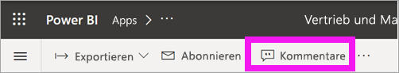
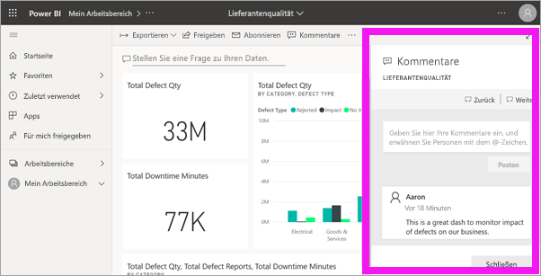
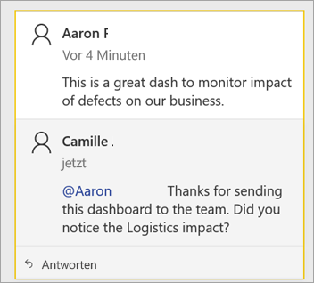
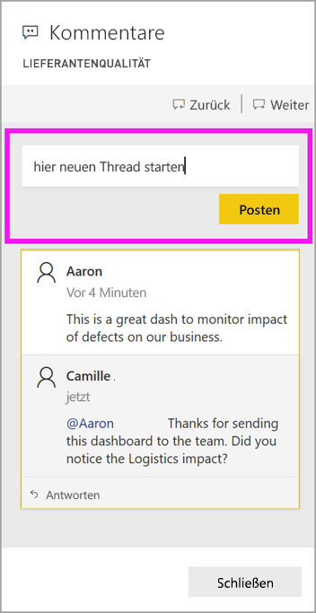
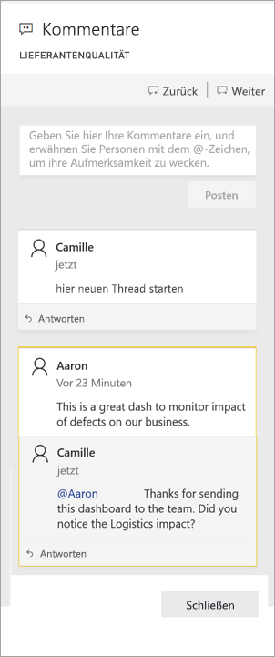
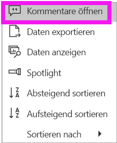
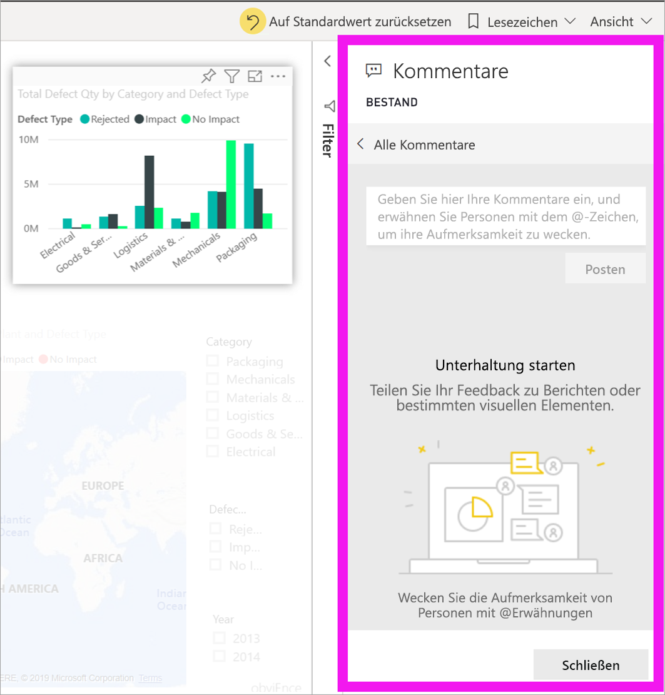
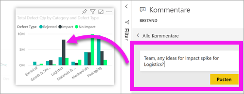
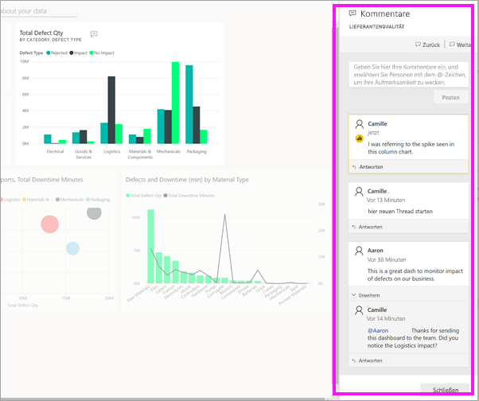

# Hinzufügen von Kommentaren zu einem Dashboard oder Bericht

[!INCLUDE [power-bi-service-new-look-include](../includes/power-bi-service-new-look-include.md)]

Sie können einem Dashboard oder Bericht einen persönlichen Kommentar hinzufügen oder über ein Dashboard oder einen Bericht eine Unterhaltung mit Ihren Kollegen beginnen. Das Feature **Kommentare** ist nur eine der Möglichkeiten, wie ein *Endbenutzer* mit anderen Personen interagieren kann. 

## Verwenden des Features „Kommentare“
Kommentare können einem gesamten Dashboard, einzelnen Visuals auf einem Dashboard, einer Berichtseite, einem paginierten Bericht und einzelnen Visuals auf einer Berichtseite hinzugefügt werden. Sie können einen allgemeinen Kommentar oder einen Kommentar hinzufügen, der sich an bestimmte Kollegen richtet.  

Wenn Sie einem Bericht einen Kommentar hinzufügen, erfasst Power BI die aktuellen Filter- und Slicerwerte. Das bedeutet, dass sich beim Auswählen oder Beantworten eines Kommentars die Berichtsseite oder das Berichtsvisual ändern kann, um Ihnen die Filter- und Slicerwerte anzuzeigen, die beim ersten Hinzufügen des Kommentars aktiv waren.  

Warum ist dies wichtig? Nehmen wir an, eine Kollegin hat einen Filter angewendet, der einen interessanten Einblick gewährt, den sie mit dem Team teilen möchte. Ohne dass dieser Filter ausgewählt ist, ergibt der Kommentar möglicherweise keinen Sinn.

Wenn Sie einen paginierten Bericht verwenden, können Sie nur einen allgemeinen Kommentar zu Ihrem Bericht hinterlassen.  Das Hinterlassen von Kommentaren in einzelnen Berichtsvisuals wird nicht unterstützt.

### Hinzufügen eines allgemeinen Kommentars zu einem Dashboard oder Bericht
Die Vorgehensweise zum Hinzufügen von Kommentaren zu einem Dashboard oder Bericht ist ähnlich.  In diesem Beispiel wird ein Dashboard verwendet. 

1. Öffnen Sie ein Power BI-Dashboard oder einen Power BI-Bericht, und klicken Sie auf das Symbol **Kommentare**. Daraufhin wird das Dialogfeld „Kommentare“ geöffnet.

    

    Auf der folgenden Abbildung hat der Ersteller des Dashboards bereits einen allgemeinen Kommentar hinzugefügt.  Jedem Benutzer mit Zugriff auf dieses Dashboard wird dieser Kommentar angezeigt.

    

2. Klicken Sie zum Beantworten auf **Antworten**, geben Sie Ihre Antwort ein, und klicken Sie anschließend auf **Post** (Posten).  

    

    Standardmäßig leitet Power BI Ihre Antwort an den Kollegen weiter, der den Kommentarthread gestartet hat, in diesem Fall Aaron. 

    

 3. Wenn Sie einen Kommentar nicht zu einem vorhandenen Thread hinzufügen möchten, geben Sie Ihren Kommentar in das obere Textfeld ein.

    

    Die Kommentare für dieses Dashboard werden jetzt wie folgt dargestellt:

    

### Hinzufügen eines Kommentars zu einem bestimmten Dashboard- oder Berichtsvisual
Sie können Kommentare nicht nur zu einem vollständigen Dashboard oder zu einer gesamten Berichtsseite, sondern auch zu einzelnen Dashboardkacheln und einzelnen Berichtsvisuals hinzufügen. Die Vorgehensweisen sind sehr ähnlich, und in diesem Beispiel wird ein Bericht verwendet.

1. Zeigen Sie auf das Visual, und klicken Sie auf **Weitere Optionen** (...).    
2. Wählen Sie in der Dropdownliste **Kommentare öffnen** aus.

      

3.  Das Dialogfeld **Kommentare** wird geöffnet, und die anderen Visuals auf der Seite sind abgeblendet. Zu diesem Visual gibt es noch keine Kommentare. 

      

4. Geben Sie Ihren Kommentar ein, und klicken Sie auf **Post** (Posten).

      

    - Wird auf einer Berichtsseite ein Kommentar ausgewählt, der in einem Visual erstellt wurde, wird dieses Visual hervorgehoben (siehe oben).

    - Auf einem Dashboard gibt das Diagrammsymbol  an, dass ein Kommentar an ein bestimmtes Visual gebunden ist. Kommentare, die für das gesamte Dashboard gelten, haben kein spezielles Symbol. Wird das Diagrammsymbol ausgewählt, wird das zugehörige Visual auf dem Dashboard hervorgehoben.
    

    

5. Klicken Sie auf **Schließen**, um zum Dashboard oder zum Bericht zurückzukehren.

### Kollegen mit dem @-Zeichen auf Kommentare aufmerksam machen
Egal, ob Sie einen Kommentar für ein Dashboard, einen Bericht, eine Kachel oder ein Visual erstellen, können Sie durch Verwenden des \@-Zeichens die Aufmerksamkeit Ihrer Kollegen erlangen.  Wenn Sie das \@-Zeichen eingeben, wird in Power BI eine Dropdownliste geöffnet, in der Sie nach Personen in Ihrer Organisation suchen und diese auswählen können. Überprüfte Namen, denen ein \@-Zeichen vorangestellt wurde, werden in blauer Schrift dargestellt. 

Hier ist eine Konversation mit dem *Designer* der Visualisierung zu sehen. Er verwendet das @-Zeichen, um sicherzustellen, dass ich den Kommentar sehe. Ich weiß, dass dieser Kommentar für mich ist. Wenn ich dieses App-Dashboard in Power BI öffne, wähle ich in der Kopfzeile **Kommentare** aus. Im Bereich **Kommentare** wird unsere Konversation angezeigt.

  

## Nächste Schritte
Zurück zu [Visualisierungen für Consumer](end-user-visualizations.md)    
<!--[Select a visualization to open a report](end-user-open-report.md)-->
