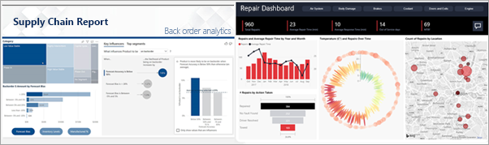
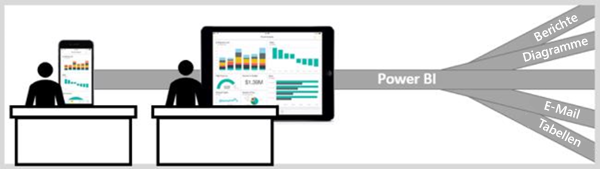

# Der Power BI-Dienst für Verbraucher

Sie leben in einer Datenkultur, in der Geschäftsentscheidungen auf Fakten und nicht auf Meinungen basieren. Sie benötigen Daten, um diese Entscheidungen treffen zu können, und Ihre Kollegen enttäuschen Sie nicht.     
 
Sie senden Ihnen alle Arten von Berichten, Tabellenkalkulationen, E-Mails mit Diagrammen und sogar gedruckte Handouts. Wenn sich die Daten häufen, wird es immer schwieriger, das Gesuchte schnell zu finden, und Sie sorgen sich, dass Sie nicht die neuesten Informationen verwenden.  
 

## Der Power BI-Dienst für *Benutzer*

Mit Power BI wird Ihre Arbeit einfacher und gleichzeitig wirkungsvoller. Alle Daten bilden Diagramme und Grafiken, die Ihre Daten für Sie visualisieren. Anstelle von langen Listen oder Tabellen mit Zahlen und Wörtern sehen Ihre Datenerkenntnisse ***ansprechend*** aus – farbenfrohe und ansehnliche visuelle Elemente, die Erkenntnisse in Ihren Daten aufzeigen. 

 
Öffnen Sie einfach den Power BI-Dienst in einem Browser oder auf einem mobilen Gerät. Sie und Ihre Kollegen arbeiten von denselben vertrauenswürdigen Dashboards und Berichten aus, die automatisch aktualisiert werden. Sie arbeiten also stets mit den neuesten Inhalten.   

Da der Inhalt nicht statisch ist, können Sie sich eingehend damit befassen und nach Trends, Erkenntnissen und weiterer Business Intelligence Ausschau halten. Kombinieren und unterteilen Sie den Inhalt, und stellen Sie sogar Fragen mit ihren eigenen Wörtern. Oder lehnen Sie sich zurück, und lassen Sie Ihre Daten für Sie zu interessanten Erkenntnissen gelangen. Sie erhalten Meldungen, wenn sich Daten ändern, sowie Berichte nach einem von Ihnen festgelegten Zeitplan. Alle Ihre Daten, jederzeit, in der Cloud oder lokal, von jedem Gerät aus. Das ist erst der Anfang von dem, was Power BI leisten kann. 

## Bin ich ein *Power BI-Benutzer*?

Die Art und Weise, wie Sie mit Power BI interagieren, hängt von Ihrer Position ab. Wenn Sie Endbenutzer oder *Benutzer* sind, empfangen Sie Inhalte (Dashboards, Berichte und Apps) von Kollegen. Sie arbeiten in der Online- oder der mobilen Version von Power BI, also dem Power BI-Dienst, und lesen sowie interagieren mit diesem Inhalt, um geschäftliche Entscheidungen zu treffen. 
   
Wenn Sie ein Benutzer sind, haben Sie nicht auf alle Funktionen von Power BI Zugriff. Dies stellt allerdings kein Problem dar, da Sie in Ihrer Position schließlich weder Dashboards noch Berichte erstellen müssen. Sie müssen den Power BI-Dienst nur zu Analyse- und Überwachungszwecken nutzen, verschiedene Optionen testen und Entscheidungen treffen. 

Bestimmt haben Sie schon von „Power BI Desktop“ oder einfach nur „Desktop“ gehört. Dies ist ein eigenständiges Tool, das die *Designer* verwenden, die Dashboards und Berichte erstellen und für Sie freigeben.  Es ist wichtig zu wissen, dass es auch andere Power BI-Tools gibt. Als Benutzer arbeiten Sie aber nur mit dem Power BI-Dienst. 

## Sicheres Interagieren mit Inhalten 
Wenn Sie in Power BI arbeiten (Filtern, Unterteilen, Abonnieren und Exportieren), wirken sich Ihre Änderungen nicht auf das zugrunde liegende Dataset oder den ursprünglich freigegebenen Inhalt aus (Dashboards, Berichte und Apps). Sie müssen sich also keine Gedanken darüber machen.  

Sie können Ihre Daten nicht beeinträchtigen.  Power BI ist ein hervorragendes Tool zum Untersuchen und Experimentieren, ohne dass Sie sich sorgen müssen, dass Sie etwas „kaputt“ machen.  
 
Das bedeutet nicht, dass Sie Ihre Änderungen nicht speichern können. Allerdings wirken sich diese Änderungen nur auf Ihre Ansicht des Inhalts aus. Zum Wiederherstellen der ursprünglichen Standardansicht müssen Sie lediglich auf eine Schaltfläche klicken.  

## Nächste Schritte

[Verschaffen Sie sich einen Überblick über den Power BI-Dienst für Benutzer](end-user-reading-view.md)    
[Schulung zum Power BI-Dienst für Benutzer](https://docs.microsoft.com/en-us/learn/paths/consume-data-with-power-bi/)    
[Terminologie und Konzepte für Power BI-*Kunden*](end-user-basic-concepts.md)    

