# Drillmodus in einer Visualisierung in Power BI

Dieser Artikel veranschaulicht, wie Sie im Microsoft Power BI-Dienst und in Power BI Desktop einen Drilldown in eine Visualisierung durchführen können. Power BI-Berichte können mehrere Hierarchien von Daten enthalten, damit Sie die maximale Einsicht in Ihre Daten erhalten. Mittels Drilldown und Drillup an Ihren Datenpunkten können Sie Ihre Daten ausführlich untersuchen. Sie können dies sogar auf dem kleinen Formfaktor Ihrer mobilen Geräte nutzen.

## Ein Drillvorgang setzt eine Hierarchie voraus

Wenn eine Visualisierung eine Hierarchie aufweist, können Sie einen Drilldown ausführen, um weitere Details einzublenden. Sie verfügen beispielsweise über eine Visualisierung eines Olympia-Medaillenspiegels, hierarchisch geordnet nach Sportart, Disziplin und Ereignis. Standardmäßig würde die Visualisierung die Anzahl der Medaillen nach Sportart anzeigen – Gymnastik, Skisport, Wassersport usw. Da jedoch eine Hierarchie vorhanden ist, wird durch die Auswahl eines Visualisierungselements (etwa eines Balkens, einer Linie oder einer Blase) ein zunehmend detaillierteres Bild angezeigt werden. Sie würden beispielsweise das Element **Wassersport** auswählen, um Daten für Schwimmsport, Kunstspringen und Wasserball anzuzeigen.  Sie wählen das Element **Kunstspringen** aus, um Details zu Sprungbrett, Sprungturm und Synchronsprung-Veranstaltungen anzuzeigen.

Sie können Hierarchien Berichten hinzufügen, deren Eigentümer Sie sind, jedoch nicht Berichten, die für Sie freigegeben wurden.
Sie sind nicht sicher, welche Power BI-Visualisierungen eine Hierarchie enthalten? Zeigen Sie mit dem Mauszeiger auf eine Visualisierung. Wenn diese Drillsteuerelemente in den oberen Ecken sichtbar sind, weist die Visualisierung eine Hierarchie auf.

    
    

Datumsangaben sind ein eindeutiger Hierarchietyp. Wenn Sie einer Visualisierung ein Datumsfeld hinzufügen, wird in Power BI automatisch eine Zeithierarchie hinzugefügt, die Jahr, Quartal, Monat und Tag enthält. Weitere Informationen finden Sie unter [Visuelle Hierarchien und Drilldown](../guided-learning/visualizations.yml?tutorial-step=18), oder sehen Sie sich das Video unten an.

<iframe width="560" height="315" src="https://www.youtube.com/embed/MNAaHw4PxzE?list=PL1N57mwBHtN0JFoKSR0n-tBkUJHeMP2cP" frameborder="0" allowfullscreen></iframe>

> [!NOTE]
> Informationen zum Erstellen von Hierarchien mit Power BI Desktop erhalten Sie im Video zum [Erstellen und Hinzufügen von Hierarchien](https://youtu.be/q8WDUAiTGeU).

## Voraussetzungen

1. Ein Drillvorgang erfordert im Power BI-Dienst oder in Power BI Desktop eine Visualisierung mit einer Hierarchie.

1. Öffnen Sie zur Begleitung das [Analysebeispiel für den Einzelhandel](../sample-datasets.md). Erstellen einer **Treemap**-Visualisierung, die Folgendes untersucht:

    | Bereich | Feld |
    | ---- | ----- |
    | Wert |Sales \|\_ Gesamte Einheiten in diesem Jahr |
    | Gruppe | Store \|\_ Gebiet \|\_ Stadt \|\_ Postleitzahl \|\_ Name

    Die Visualisierung weist eine Hierarchie aus Gebiet, Stadt, Postleitzahl und Ortsname auf. Jedes Gebiet umfasst eine oder mehrere Städte, jede Stadt weist eine oder mehrere Postleitzahlen auf usw. In der Standardeinstellung werden in der Visualisierung nur die Gebietsdaten angezeigt, da *Gebiet* in der Liste als erster Eintrag aufgeführt wird.

    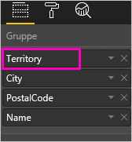

1. Zu lernen, wie die verschiedenen Drillsymbole zusammenwirken, kann verwirrend sein. Wir filtern die Treemap, um nur zwei der kleineren Gebiete anzuzeigen: **KY** und **TN**. Wählen Sie die Treemap aus, und erweitern Sie unter **Filter auf visueller Ebene** **Territory**, und wählen Sie **KY** und **TN** aus.

    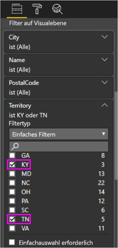

    Jetzt werden nur diese beiden Gebiete in der Treemap angezeigt.

    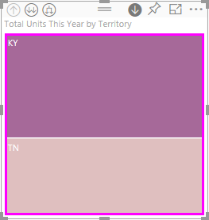

## Drei Möglichkeiten, das Drillfeature zu verwenden

Es stehen mehrere Optionen zur Verfügung, um auf die Features „Drilldown“, „Drillup“ und „Erweitern“ für Visualisierungen mit Hierarchien zuzugreifen. In diesem Artikel wird die erste Option erklärt. Sobald Sie die Grundlagen von Drilldown und Erweitern gelernt haben, werden Sie wissen, wie Sie alle drei verwenden. Sie alle erreichen die gleichen Ziele. Probieren Sie sie aus, und wählen Sie aus, was Ihnen am besten gefällt.

- Zeigen Sie mit dem Mauszeiger auf eine Visualisierung. Dann werden die Symbole angezeigt, und Sie können sie verwenden.  

    

- Klicken Sie mit der rechten Maustaste auf eine Visualisierung. Dann wird das Menü angezeigt, und Sie können die Optionen verwenden.

    

- Klicken Sie in der Power BI-Menüleiste auf **Durchsuchen**.

   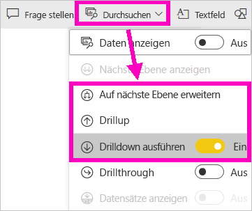

## Drillvorgänge

### Drilldown

Es gibt mehrere Möglichkeiten, einen Drilldown für Ihre Visualisierungen durchzuführen. Durch einen **Drilldown** erreichen Sie die nächstniedrigere Ebene einer Hierarchie. Wenn Sie sich also gerade die Ebene **Gebiet** ansehen, können Sie einen Drilldown auf die Ebene der Stadt, dann der Postleitzahl und dann des Namens durchführen. Durch jeden Schritt in diesem Vorgang erhalten Sie neue Informationen.

### Erweitern

Durch **Auf nächste Ebene erweitern** wird der aktuellen Ansicht eine weitere Hierarchieebene hinzugefügt. Wenn Sie sich gerade die Ebene **Gebiet** ansehen, können Sie Ihrer Treemap Informationen zur Stadt, der Postleitzahl und dem Namen hinzufügen. Durch jeden Schritt in diesem Vorgang werden die gleichen Informationen und eine Ebene mit neuen Informationen angezeigt.

Außerdem können Sie Drilldown- und Erweiterungsvorgänge entweder für ein Feld oder für alle Felder gleichzeitig durchführen.

## Drilldown für alle Felder gleichzeitig

1. Beginnen Sie auf der höchsten Ebene der Treemap, auf der Daten für KY und TN angezeigt werden. Erhöhen Sie die Breite Ihrer Treemap, indem Sie auf einen Ziehpunkt klicken und diesen nach rechts ziehen.

    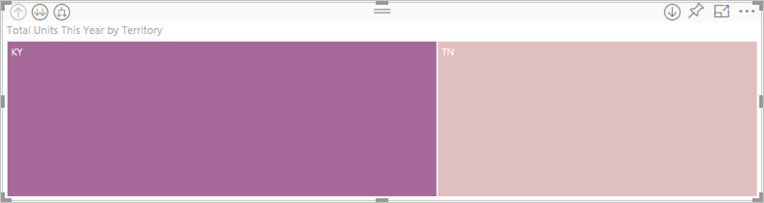

1. Um für *alle Felder gleichzeitig* einen Drilldown durchzuführen, wählen Sie den doppelten Pfeil in der linken oberen Ecke der Visualisierung aus . Ihre Treemap zeigt nun Stadtdaten für Kentucky und Tennessee an.

    

1. Führen Sie noch einmal einen Drilldown auf die Hierarchieebene der Postleitzahl durch.

    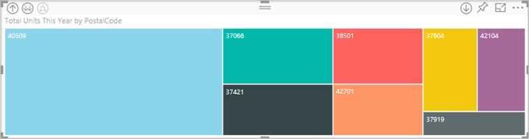

1. Um einen Drilldown bei der Sicherung durchzuführen, wählen Sie den Pfeil nach oben in der oberen linken Ecke der Visualisierung aus .

## Drilldown für ein Feld

Bei dieser Methode wird das Drilldownsymbol in der rechten oberen Ecke der Visualisierung verwendet.

1. Wählen Sie das Drilldownsymbol aus, um es zu aktivieren. .

    Jetzt können Sie einen **Drilldown für ein Feld** durchführen.

    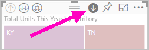

    Wenn Sie den Drilldown nicht einschalten, erfolgt bei Auswahl eines Visualisierungselements (wie Balken, Blase oder Blatt) kein Drilldown. Stattdessen werden die anderen Diagrammen auf der Berichtsseite kreuzgefiltert.

1. Wählen Sie das Blatt für **TN** aus. Jetzt werden in Ihrer Treemap alle Städte in Tennessee angezeigt, in denen es ein Geschäft gibt.

    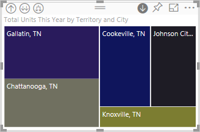

1. An diesem Punkt können Sie:

    1. Den Drilldown für Tennessee fortsetzen.

    1. Einen Drilldown nach einem bestimmten Ort in Tennessee ausführen.

    1. Erweitern Sie stattdessen (siehe **Alle Felder gleichzeitig erweitern** unten).

    Führen Sie weiter einen Drilldown für ein Feld durch.  Klicken Sie auf **Knoxville, TN**. Ihre Treemap zeigt jetzt die Postleitzahl Ihres Geschäfts in Knoxville an.

    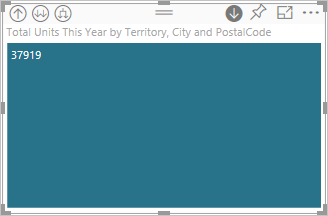

    Beachten Sie, dass sich der Titel ändert, wenn Sie einen Drilldown und anschließend einen Drillup ausführen.

## Erweitern von einem Feld und von allen Feldern

Eine Treemap, die nur die Postleitzahl anzeigt, ist nicht nützlich.  Erweitern Sie also auf die nächste Ebene in der Hierarchie.  

1. Wählen Sie bei aktiver Treemap das Symbol für die *Erweiterung nach unten* aus . Ihre Treemap zeigt nun die folgenden zwei Ebenen Ihrer Hierarchie: die Postleitzahl und den Namen des Geschäfts.

    

1. Klicken Sie auf den Drilluppfeil, bis Sie die zweite Ebene **Gesamte Einheiten in diesem Jahr nach Gebiet und Stadt** Ihrer Treemap erreichen, um alle vier Datenhierarchieebenen für Tennessee anzuzeigen.

    

1. Stellen Sie sicher, dass Drilldown weiterhin aktiviert ist , und wählen Sie bei aktiver Treemap das Symbol für die *Erweiterung nach unten* aus . Jetzt zeigt Ihre Treemap zusätzliche Informationen an. Statt nur die Stadt und den Staat anzuzeigen, wird jetzt auch die Postleitzahl angezeigt.

    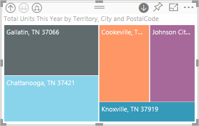

1. Wählen Sie das Symbol *nach unten erweitern* erneut aus, um alle vier Hierarchieebenen der Informationen zu Tennessee auf Ihrer Treemap anzuzeigen. Zeigen Sie auf ein Blatt, um noch mehr Informationen anzuzeigen.

    

## Drillfilter anderer Visuals

Wenn Sie im Drillmodus arbeiten, ist es Ihre Entscheidung, wie sich Drilldown- und Erweiterungsvorgänge auf die anderen Visualisierungen auf Ihrer Seite auswirken.

Standardmäßig filtern Drillvorgänge keine anderen visuellen Elemente in einem Bericht. Dieses Feature können Sie in Power BI Desktop und im Power BI-Dienst aktivieren.

1. Klicken Sie in Power BI-Desktop auf die Registerkarte **Format**, und aktivieren Sie das Kontrollkästchen für **Drillfilter anderer Visuals**.

    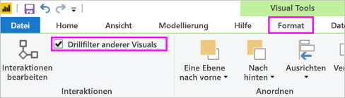

1. Wenn Sie jetzt einen Drilldown-, Drillup- oder Erweiterungsvorgang in einer Visualisierung mit einer Hierarchie durchführen, werden dadurch die anderen visuellen Elemente auf der Seite gefiltert.

    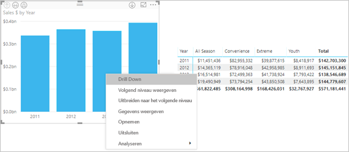

    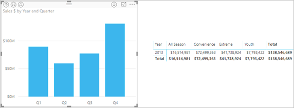

> [!NOTE]
> Wenn Sie dieses Feature im Power BI-Dienst aktivieren möchten, wählen Sie in der Menüleiste oben **Visualinteraktionen** > **Drillfilter anderer Visuals** aus.
>
> 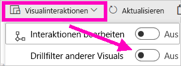

## Informationen zur Hierarchieachse und Hierarchiegruppe

Sie können sich die Hierarchieachse und -gruppe als die Mechanismen vorstellen, die Sie zum Erhöhen und Reduzieren der Granularität der anzuzeigenden Daten verwenden können. Alle Daten, die Sie in Kategorien und Unterkategorien einteilen können, sind dafür qualifiziert, eine Hierarchie inklusive Datums- und Zeitangaben zu besitzen.

Sie können in Power BI Visualisierungen erstellen, die über eine Hierarchie verfügen. Wählen Sie dazu mindestens ein Datenfeld aus, das Sie entweder dem Bereich **Achse** oder **Gruppe** hinzufügen. Fügen Sie dann die Daten hinzu, die Sie als Datenfelder im Bereich **Werte** untersuchen möchten. Sobald *Drillmodussymbole* in der oberen linken und oberen rechten Ecke Ihrer Visualisierung angezeigt werden, wissen Sie, dass Ihre Daten hierarchisch sind.

Es ist ganz hilfreich, sich zwei Typen hierarchischer Daten vorzustellen:

- Datums- und Uhrzeitdaten: Wenn Sie über ein Datenfeld mit dem DateTime-Datentyp verfügen, besitzen Sie bereits hierarchische Daten. Power BI erstellt automatisch eine Hierarchie für jedes Datenfeld. Sie können die Werte in eine [DateTime](https://msdn.microsoft.com/library/system.datetime.aspx)-Struktur analysieren. Sie müssen der **Achse** oder **Gruppe** jeweils nur ein DateTime-Feld hinzufügen

- Kategorische Daten: Wenn Power BI Ihre Daten von Sammlungen ableitet, die untergeordnete Sammlungen enthalten oder in einem anderen Fall über Datenzeilen verfügen, die gemeinsame Werte beinhalten, besitzen Sie hierarchische Daten.

Power BI ermöglicht Ihnen eine Erweiterung um eine oder alle Teilmengen. Sie können einen Drilldown durch Ihre Daten ausführen, um eine einzelne Teilmenge pro Ebene anzuzeigen, oder einen Drilldown ausführen, um alle Teilmengen gleichzeitig auf jeder Ebene anzuzeigen. Sie können beispielsweise einen Drilldown für ein bestimmtes Jahr durchführen, oder Sie können alle Ergebnisse für jedes Jahr anzeigen, wenn Sie die Hierarchie abgehen.

Sie können ebenso einen Drillup ausführen.

In den folgenden Abschnitten werden Drilldowns von der höchsten Ansicht, der mittleren Ansicht und der niedrigsten Ansicht beschrieben

### Hierarchische Datums- und Uhrzeitdaten

Für dieses Beispiel:

1. Befolgen Sie das [Analysebeispiel für den Einzelhandel](../sample-datasets.md), und erstellen Sie als Visualisierung ein gestapeltes Säulendiagramm, das Folgendes enthält:

    | Bereich | Feld |
    | ---- | ----- |
    | Achse | Zeit \|\_ Monat |
    | Werte | Sales \|\_ Gesamtverkäufe |

    Obwohl das Datenfeld „Achse“ **Monat** ist, erstellt es noch immer die Kategorie **Jahr** unter **Achse**. Der Grund dafür ist, dass Power BI die vollständige DateTime-Struktur für alle gelesenen Werte bereitstellt. Auf der obersten Hierarchieebene werden Daten für das Jahr angezeigt.

    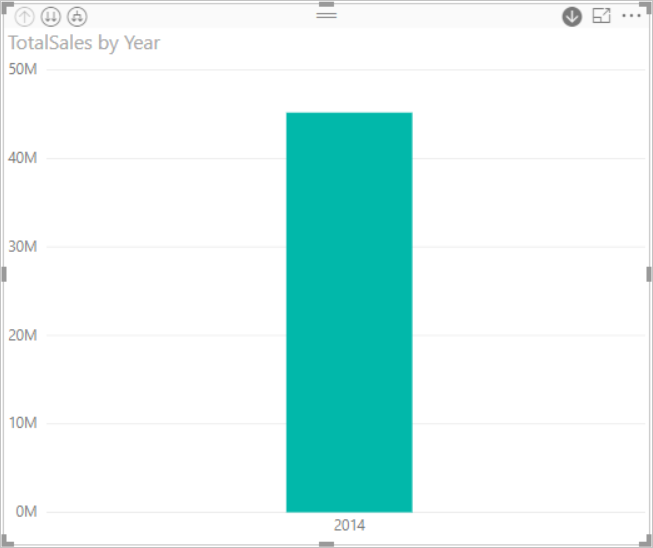

1. Wählen Sie bei aktiviertem Drilldownmodus die Säule im Diagramm aus, um eine Ebene in der Hierarchie herunterzugehen. Es werden drei Säulen für die verfügbaren Daten der Quartale angezeigt.

1. Wählen Sie aus den Symbolen links oben die Option **Alles eine Hierarchieebene nach unten erweitern** aus.

1. Wiederholen Sie diesen Schritt ein oder mehrere Male, um zur niedrigsten Ebene der Hierarchie zu gelangen, die die Ergebnisse für jeden Monat zeigt.

    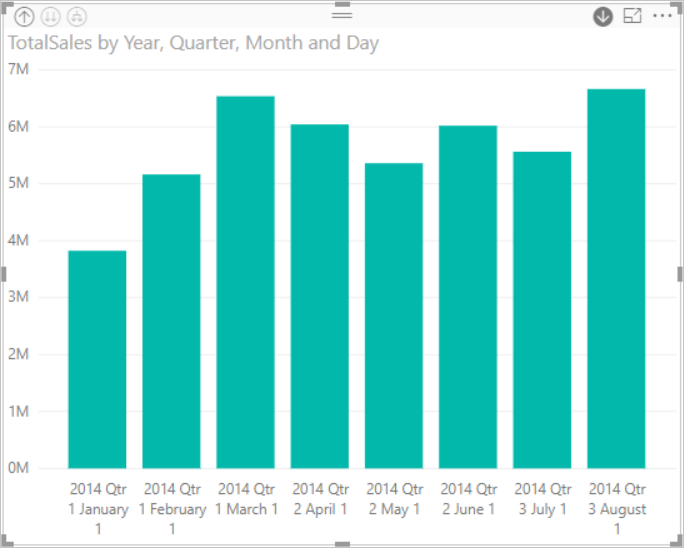

Abgesehen von der Visualisierung können wir die Hierarchie sehen, die in den für jeden Bericht gerenderten Daten übernommen wird. Wählen Sie rechts oben die Auslassungspunkte und dann **Daten anzeigen** aus. In der folgenden Tabelle werden die Drilldownergebnisse eines einzelnen Monats oder aller Monate angezeigt:

|Modus „Erweitern“|Jahr|Quartal|Monat|Tag|
| --- |:---:|:---:|:---:|---|
|Einfach|||||
|Alle|||||

Beachten Sie, dass die Daten für die Berichte **Quartal** und **Jahr** identisch sind. Nach dem Drilldown zur Detailebene, die für **Werte** festgelegt ist, können Sie jedoch sehen, wie der einzelne Bericht genauer wird und dass der Bericht „alle Monate“ über mehr Daten verfügt.

### Hierarchische Kategoriedaten

Daten, die aus Sammlungen und Untersammlungen generiert wurden, sind hierarchisch.

Ein gutes Beispiel hierfür sind Standortdaten. Nehmen wir hierfür eine Tabelle in einer Datenquelle, die die Säulen „Land“, „Staat“, „Stadt“ und „PLZ“ besitzt. Daten, deren Werte für Land, Staat und Stadt übereinstimmen, sind hierarchisch.

Für dieses Beispiel:

1. Nehmen Sie wieder das [Analysebeispiel für Einzelhandel](../sample-datasets.md). Erstellen Sie als Visualisierung ein gestapeltes Säulendiagramm, das Folgendes untersucht:

    | Bereich | Feld |
    | ---- | ----- |
    | Wert |Sales \|\_ Gesamte Einheiten in diesem Jahr |
    | Achse | Store \|\_ Gebiet \|\_ Stadt – möglicherweise müssen Sie „Stadt“ aus dem Bereich **Legende** in den Bereich **Achse** ziehen. \|\_ Postleitzahl \|\_ Name |

    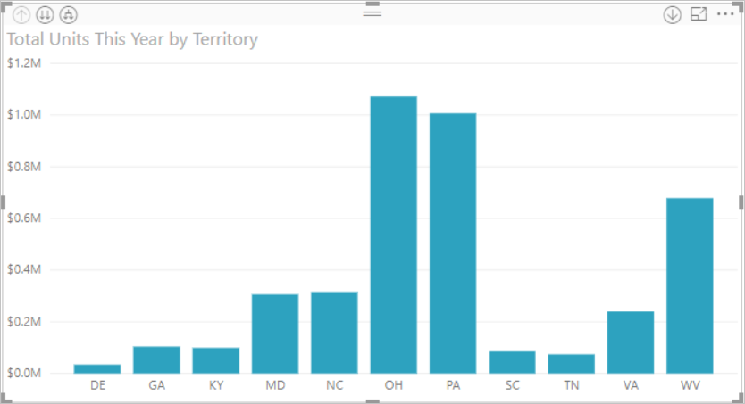

1. Wählen Sie bei aktivierten Drilldownmodus aus den Symbolen links oben dreimal die Option **Alles eine Hierarchieebene nach unten erweitern** aus.

    Sie sollten sich auf der untersten Ebene der Hierarchie befinden, auf der die Ergebnisse für Gebiet, Stadt und Postleitzahl angezeigt werden.

    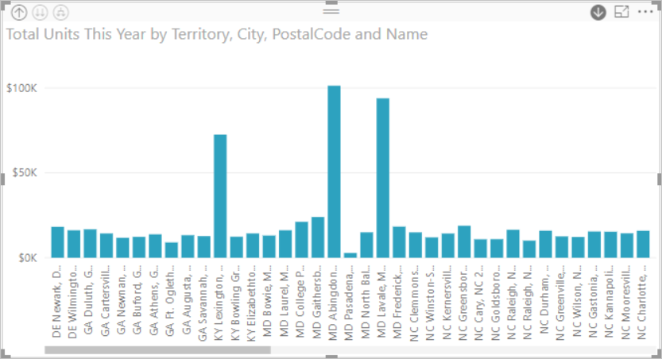

Abgesehen von der Visualisierung können wir die Hierarchie sehen, die in den für jeden Bericht gerenderten Daten übernommen wird. Wählen Sie rechts oben die Auslassungspunkte und dann **Daten anzeigen** aus. Die folgende Tabelle zeigt die Ergebnisse des Drilldowns für ein einzelnes Gebiet oder alle Gebiete an.

| Modus „Erweitern“|Gebiet|City|PLZ|Name|
| ---|:---:|:---:|:---:|---|
|Einfach|||||
|Alle|||||

 Wenn Sie einen Drilldown ausführen, können Sie sehen, wie ein **einzelner** Bericht genauer wird und der Bericht über **alle** Gebiete über mehr Daten verfügt.

## Überlegungen und Einschränkungen

Wenn Sie einer Visualisierung ein Datumsfeld hinzufügen, wird dadurch keine Hierarchie erstellt. Möglicherweise wird das Datumsfeld nicht tatsächlich als Datum gespeichert. Wenn Sie das Dataset besitzen:

1. Öffnen Sie die Ansicht *Daten* in Power BI Desktop.

1. Wählen Sie die Spalte aus, die das Datum enthält.

1. Ändern Sie auf der Registerkarte **Modellierung** den **Datentyp** in **Datum** oder **Datum/Uhrzeit**.

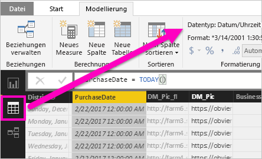

Wenn der Bericht für Sie freigegeben wurde, wenden Sie sich an den Eigentümer, um die Änderung anzufordern.

## Nächste Schritte

[Visualisierungen in Power BI-Berichten](../visuals/power-bi-report-visualizations.md)

[Power BI-Berichte](end-user-reports.md)

[Power BI – Grundkonzepte](end-user-basic-concepts.md)

Weitere Fragen? [Wenden Sie sich an die Power BI-Community](http://community.powerbi.com/)
