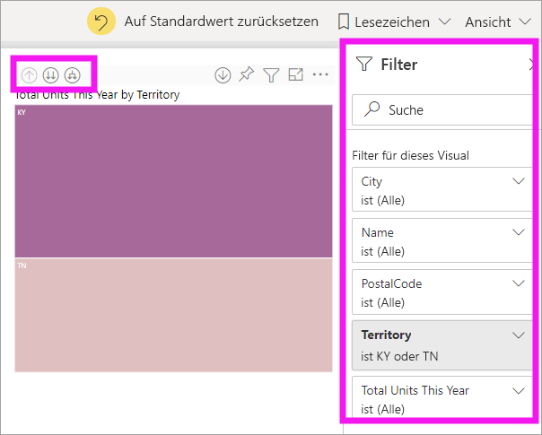
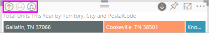
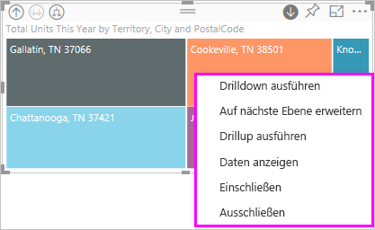
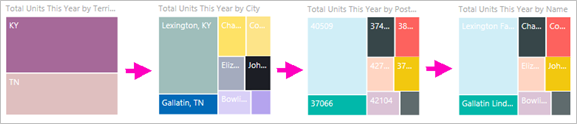
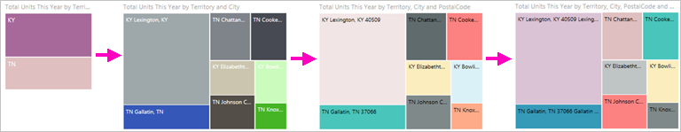
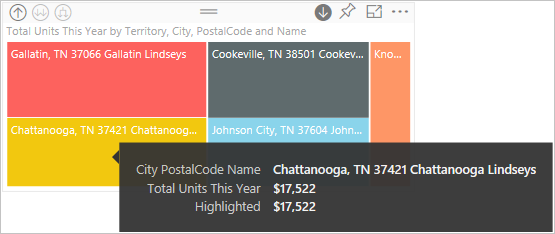
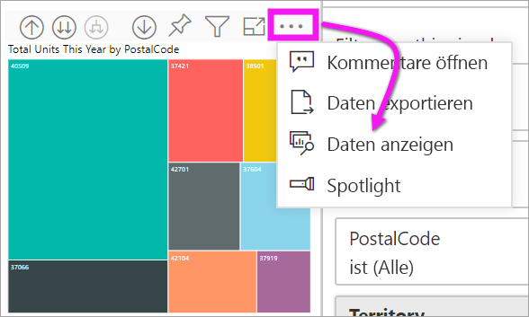

# Drillmodus in einem Visual in Power BI

[!INCLUDE [power-bi-service-new-look-include](../includes/power-bi-service-new-look-include.md)]

Dieser Artikel veranschaulicht, wie Sie im Microsoft Power BI-Dienst einen Drilldown in einem Visual durchführen können. Mittels Drilldown und Drillup an Ihren Datenpunkten können Sie Ihre Daten ausführlich untersuchen. 

## Ein Drillvorgang setzt eine Hierarchie voraus

Wenn eine Visualisierung eine Hierarchie aufweist, können Sie einen Drilldown ausführen, um weitere Details einzublenden. Sie verfügen beispielsweise über ein Visual eines Olympia-Medaillenspiegels, hierarchisch geordnet nach Sportart, Disziplin und Ereignis. Standardmäßig würde das Visual die Anzahl der Medaillen nach Sportart anzeigen – Gymnastik, Skisport, Wassersport, usw. Da jedoch eine Hierarchie vorhanden ist, wird durch die Auswahl eines visuellen Elements (etwa eines Balkens, einer Linie oder einer Blase) ein zunehmend detaillierteres Bild angezeigt werden. Sie würden beispielsweise das Element **Wassersport** auswählen, um Daten für Schwimmsport, Kunstspringen und Wasserball anzuzeigen.  Sie wählen das Element **Kunstspringen** aus, um Details zu Sprungbrett, Sprungturm und Synchronsprung-Veranstaltungen anzuzeigen.

Datumsangaben sind ein eindeutiger Hierarchietyp.  Berichts-Designer fügen oft Datumshierarchien zu Visuals hinzu. Eine gemeinsame Datumshierarchie ist eine, die Jahr, Quartal, Monat und Tag enthält. 

## Finden Sie heraus, für welche Visuals ein Drillvorgang ausgeführt werden kann
Sie sind nicht sicher, welche Power BI-Visuals eine Hierarchie enthalten? Zeigen Sie mit dem Mauszeiger auf ein Visual. Wenn Sie eine Kombination dieser oben stehenden Drillsteuerelemente sehen, hat Ihr Visual eine Hierarchie.

  

## Erfahren Sie, wie Sie einen Drilldown und Drillup ausführen

In diesem Beispiel wird eine Treemap verwendet, die eine Hierarchie aus Gebiet, Stadt, Postleitzahl und Filialname enthält. Die Treemap vor dem Bohren zeigt die in diesem Jahr verkauften Gesamteinheiten nach Gebieten. 

  

### Zwei Möglichkeiten, auf das Drillfeature zuzugreifen

Sie haben zwei Möglichkeiten, um auf die Features „Drilldown“, „Drillup“ und „Erweitern“ für Visuals mit Hierarchien zuzugreifen. Probieren Sie sie aus, und wählen Sie die aus, die Ihnen am besten gefällt.

- Erste Möglichkeit: Fahren Sie mit der Maus über ein Visual, um die Symbole anzuzeigen und zu verwenden.  

    

- Zweite Möglichkeit: Klicken Sie mit der rechten Maustaste auf ein Visual. Dann wird das Menü angezeigt, und Sie können die Optionen verwenden.

    

## Drillvorgänge

### Drilldown für alle Felder gleichzeitig

Es gibt mehrere Möglichkeiten, Drillvorgänge für Ihre Visuals auszuführen. Durch einen Drilldown erreichen Sie die nächstniedrigere Ebene einer Hierarchie. Wenn Sie sich die Ebene **Gebiet** für Kentucky und Tennessee ansehen, können Sie bis auf Stadtebene für beide Staaten einen Drilldown ausführen, dann auf Postleitzahlenebene für beide Staaten und schließlich auf der Ebene der Geschäftsnamen für beide Staaten. Durch jeden Schritt in diesem Vorgang erhalten Sie neue Informationen.

Wählen Sie das Drillupsymbol aus,  bis Sie zu „Gesamte Einheiten in diesem Jahr nach Gebiet“ zurückkehren.

### Erweitern aller Felder gleichzeitig

Durch **Auf nächste Ebene erweitern** wird der aktuellen Ansicht eine weitere Hierarchieebene hinzugefügt. Wenn Sie sich gerade die Ebene **Gebiet** ansehen, können Sie Ihrer Treemap Informationen zur Stadt, der Postleitzahl und dem Namen hinzufügen. Durch jeden Schritt in diesem Vorgang werden die gleichen Informationen und eine Ebene mit neuen Informationen angezeigt.

Außerdem können Sie Drilldown- und Erweiterungsvorgänge für ein Feld gleichzeitig ausführen.

### Drilldown für ein Feld

1. Wählen Sie das Drilldownsymbol aus, um es zu aktivieren. .

    Jetzt können Sie einen Drilldown **für ein Feld gleichzeitig** ausführen, indem Sie ein visuelles Element auswählen. Beispiele für visuelle Elemente: Balken, Blasen und Blätter.

    

    Wenn Sie den Drilldown nicht aktivieren, erfolgt bei Auswahl eines visuellen Elements (wie Balken, Blase oder Blatt) kein Drilldown. Stattdessen werden die anderen Diagrammen auf der Berichtsseite kreuzgefiltert.

1. Wählen Sie das Blatt für **TN** aus. Jetzt werden in Ihrer Treemap alle Städte und Gebiete in Tennessee angezeigt, in denen es ein Geschäft gibt.

    

1. An diesem Punkt können Sie:

    1. Den Drilldown für Tennessee fortsetzen.

    1. Einen Drilldown nach einem bestimmten Ort in Tennessee ausführen.

    1. Stattdessen erweitern.

    Führen Sie weiter einen Drilldown für ein Feld durch.  Klicken Sie auf **Knoxville, TN**. Ihre Treemap zeigt jetzt die Postleitzahl Ihres Geschäfts in Knoxville an.

    

    Beachten Sie, dass sich der Titel ändert, wenn Sie einen Drilldown und anschließend einen Drillup ausführen.

### Erweitern von einem Feld und von allen Feldern

Eine Treemap, die nur die Postleitzahl anzeigt, ist nicht nützlich.  *Erweitern* Sie also auf die nächste Ebene in der Hierarchie.  

1. Wählen Sie bei aktiver Treemap das Symbol für die *Erweiterung nach unten* aus . Ihre Treemap zeigt nun die folgenden zwei Ebenen Ihrer Hierarchie: die Postleitzahl und den Namen des Geschäfts.

    

1. Klicken Sie auf den Drilluppfeil, bis Sie die zweite Ebene **Gesamte Einheiten in diesem Jahr nach Gebiet und Stadt** Ihrer Treemap erreichen, um alle vier Datenhierarchieebenen für Tennessee anzuzeigen.

    

1. Stellen Sie sicher, dass Drilldown weiterhin aktiviert ist , und wählen Sie bei aktiver Treemap das Symbol für die *Erweiterung nach unten* aus . Ihre Treemap zeigt nun die gleiche Anzahl von Blättern (Felder), aber jedes Blatt hat zusätzliche Details. Statt nur die Stadt und den Staat anzuzeigen, wird jetzt auch die Postleitzahl angezeigt.

    

1. Wählen Sie das Symbol *nach unten erweitern* erneut aus, um alle vier Hierarchieebenen der Informationen zu Tennessee auf Ihrer Treemap anzuzeigen. Zeigen Sie auf ein Blatt, um noch mehr Informationen anzuzeigen.

    

## Anzeigen der Daten beim Drillvorgang
Verwenden Sie **Daten anzeigen**, um Daten anzuzeigen, die sich im Hintergrund befinden. Immer wenn Sie einen Drillvorgang ausführen oder eine Erweiterung durchführen, werden durch **Daten anzeigen** die Daten angezeigt, die zum Erstellen des Visuals verwendet werden. Dies kann Ihnen helfen zu verstehen, wie Hierarchien, Drillvorgänge und Erweiterungsvorgänge zusammenarbeiten, um Visuals zu erstellen. 

Wählen Sie rechts oben die Auslassungspunkte (...) und dann **Daten anzeigen** aus. 

Die folgende Tabelle zeigt die Ergebnisse des Drilldowns aller Felder auf einmal vom Gebiet bis zum Geschäftsnamen.  

Beachten Sie, dass die Summen für **Stadt**, **Postleitzahl** und **Name** gleich sind. Das wird nicht immer der Fall sein.  Aber für diese Daten gibt es nur ein Geschäft für jede Postleitzahl und Stadt.  

## Überlegungen und Einschränkungen
Standardmäßig filtern Drillvorgänge keine anderen visuellen Elemente in einem Bericht. Der Berichts-Designer kann dieses Standardverhalten jedoch ändern. Während Sie einen Drillvorgang ausführen, prüfen Sie, ob die anderen Visuals auf der Seite Kreuzfilterungen oder übergreifende Hervorhebungen sind.

## Nächste Schritte

[Visuals in Power BI-Berichten](../visuals/power-bi-report-visualizations.md)

[Power BI-Berichte](end-user-reports.md)

[Power BI – Grundkonzepte](end-user-basic-concepts.md)

Weitere Fragen? [Wenden Sie sich an die Power BI-Community](http://community.powerbi.com/)
