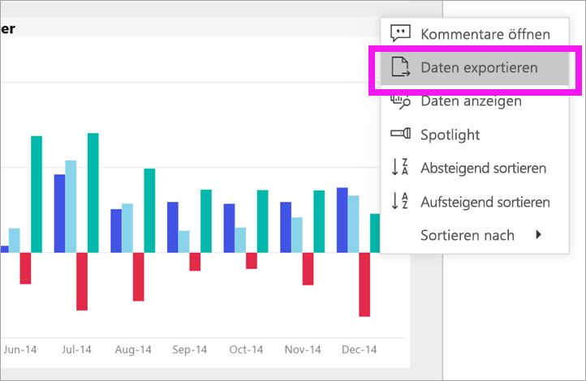
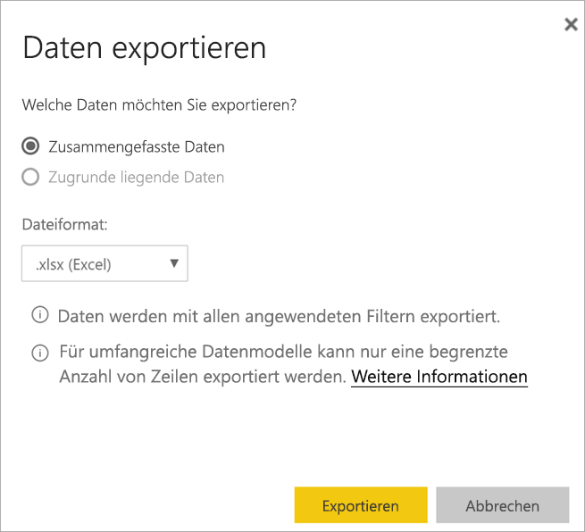
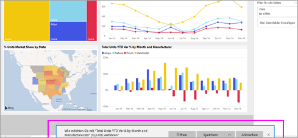

# Exportieren von Daten aus einer Visualisierung
Wenn Sie die Daten anzeigen möchten, auf deren Grundlage ein Visual erstellt wurde, können Sie die [Daten in Power BI anzeigen](end-user-show-data.md) oder in Excel exportieren. Die Option zum Exportieren der Daten erfordert einen bestimmten Typ oder eine bestimmte Lizenz und Bearbeitungsberechtigungen für den Inhalt. Wenn Sie nicht exportieren können, wenden Sie sich an den Power BI-Administrator. 

## Aus einem Visual in einem Power BI-Dashboard

1. Starten Sie ein Power BI-Dashboard. Hier verwenden wir das Dashboard aus der ***Beispiel für Vertrieb und Marketing***-App. Sie können [diese APP von AppSource.com herunterladen](https://appsource.microsoft.com/en-us/product/power-bi/microsoft-retail-analysis-sample.salesandmarketingsample-preview?flightCodes=e2b06c7a-a438-4d99-9eb6-4324ce87f282).

    

2. Zeigen Sie auf ein Visual, um die Auslassungspunkte (...) anzuzeigen, und klicken Sie, um das Aktionsmenü anzuzeigen.

    

3. Wählen Sie **In Excel exportieren** aus.

4. Was als Nächstes passiert, hängt davon ab, welchen Browser Sie verwenden. Möglicherweise werden Sie aufgefordert, die Datei zu speichern, oder es wird ein Link zur exportierten Datei am unteren Rand des Browsers angezeigt. 

    

5. Öffnen Sie die Datei in Excel.  

    

## Aus einem Visual in einem Bericht
Sie können Daten aus einem Visual in einem Bericht im CSV- oder XLSX-Format (Excel) exportieren. 

1. Wählen Sie auf einem Dashboard eine Kachel aus, um den zugrunde liegenden Bericht zu öffnen.  In diesem Beispiel wählen wir das gleiche Visual wie oben aus, *Total Units YTD Var %* (Gesamte Einheiten seit Jahresbeginn – Abweichung in %). 

    

    Diese Kachel wurde aus dem Bericht des *Beispiels für Vertrieb und Marketing* erstellt, das ist der Bericht, der geöffnet wird. Er wird mit der Seite geöffnet, die das ausgewählte Kachelvisual enthält. 

2. Wählen Sie die Kachel im Bericht aus. Beachten Sie den Bereich **Filter** auf der rechten Seite. Für dieses Visual werden Filter angewendet. Weitere Informationen zu Filtern finden Sie unter [Verwenden von Filtern in einem Bericht](end-user-report-filter.md).

    

3. Wählen Sie die Auslassungspunkte in der rechten oberen Ecke des Visuals aus. Wählen Sie **Daten exportieren** aus.

    

4. Sie sehen Optionen zum Exportieren zusammengefasster oder zugrunde liegender Daten. Wenn Sie die *Beispiel für Vertrieb und Marketing*-App verwenden, werden die **Zugrunde liegenden Daten** deaktiviert. Es können jedoch auch Berichte angezeigt werden, bei denen beide Optionen aktiviert sind. Im Folgenden wird der Unterschied erläutert.

    **Zusammengefasste Daten**: Wählen Sie diese Option aus, wenn Sie Daten für das exportieren möchten, was im Visual angezeigt wird.  Diese Exportart zeigt nur die Daten an, die zum Erstellen des Visuals verwendet wurden. Wenn für das Visual Filter verwendet werden, werden die Daten, die Sie exportieren, ebenfalls gefiltert. Beispielsweise enthält der Export für dieses Visual nur Daten für 2014 und die zentrale Region sowie nur Daten für vier Hersteller: VanArsdel, Natura, Aliqui und Pirum.
  

    **Zugrunde liegende Daten**: Wählen Sie diese Option aus, wenn Sie Daten für das exportieren möchten, was Sie im Visual sehen, **plus** zusätzlicher Daten aus dem zugrunde liegenden Dataset.  Dies kann Daten umfassen, die im Dataset enthalten sind, aber nicht im Visual verwendet werden. 

    

5. Was als Nächstes passiert, hängt davon ab, welchen Browser Sie verwenden. Möglicherweise werden Sie aufgefordert, die Datei zu speichern, oder es wird ein Link zur exportierten Datei am unteren Rand des Browsers angezeigt. 

    

6. Öffnen Sie die Datei in Excel. Vergleichen Sie die Menge der exportierten Daten mit den Daten, die wir aus dem gleichen Visual auf dem Dashboard exportiert haben. Der Unterschied besteht darin, dass dieser Export **zugrunde liegende Daten** enthält. 

    

## Nächste Schritte

[Anzeigen der zum Erstellen einer Visualisierung verwendeten Daten](end-user-show-data.md)