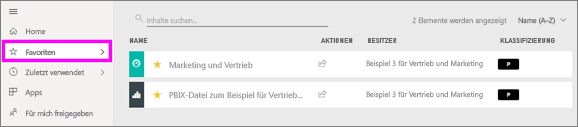
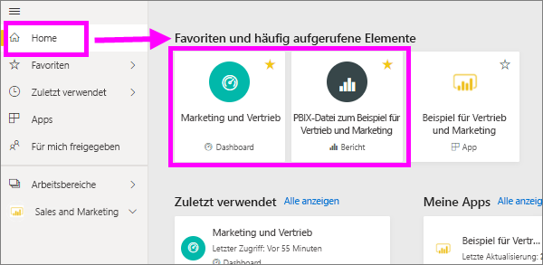
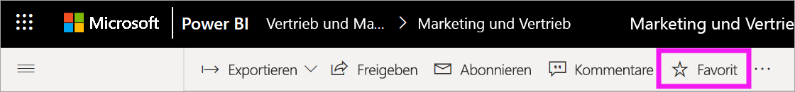
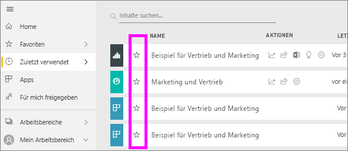
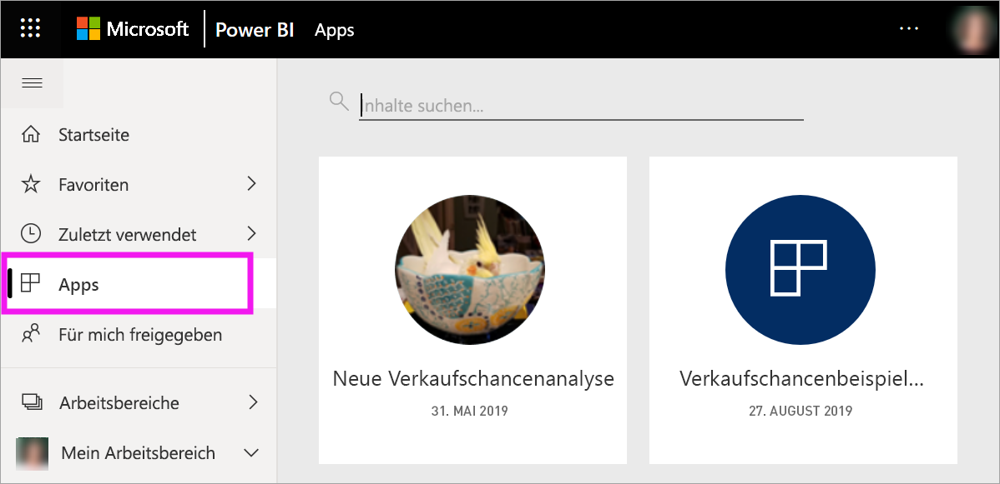
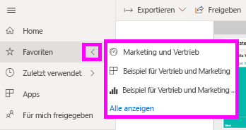
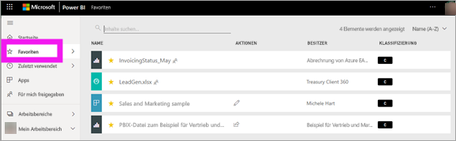
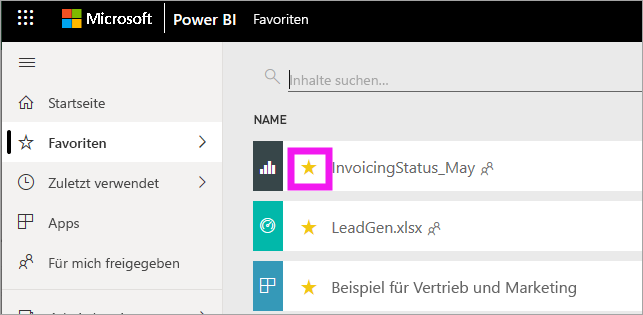

# Bevorzugte Dashboards, Berichte und Apps im Power BI-Dienst
Wenn Sie Inhalte als *Favoriten* festlegen, können Sie schnell über die Inhaltsliste **Favoriten** oder über **Power BI Home** > **Favoriten und häufig aufgerufene Elemente** darauf zugreifen. Als Favoriten werden in der Regel Elemente festgelegt, die Sie häufig aufrufen. Diese werden mit einem gelben Stern markiert.

   

   

Sie können im Power BI-Dienst auch ein einzelnes Dashboard als [ausgewähltes Dashboard](end-user-featured.md) auswählen.

## Hinzufügen eines Dashboards oder Berichts als Favorit

1. Öffnen Sie ein Dashboard oder einen Bericht, das bzw. den Sie häufig verwenden. Auch Inhalte, die für Sie freigegeben wurden, können als Favoriten festgelegt werden.

2. Klicken Sie im Power BI-Dienst in der oberen Menüleiste auf **Favorit** oder auf das Sternsymbol .
   
   
   
   Sie können ein Dashboard oder einen Bericht überall dort als Favorit festlegen, wo das Sternsymbol angezeigt wird, wie etwa auf den Seiten „Home“, „Zuletzt verwendet“, „Apps“ oder „Für mich freigegeben“. 
   
   

## Hinzufügen einer App als Favorit

1. Wählen Sie im Navigationsbereich **Apps** aus.

   

2. Zeigen Sie auf eine App, um weitere Details anzuzeigen. Wählen Sie das Sternsymbol  aus, um einen Favoriten festzulegen.
   
   

## Arbeiten mit Favoriten
1. Wenn Sie auf die Favoriten zugreifen möchten, wählen Sie den Flyoutpfeil rechts neben **Favoriten** aus. Hier können Sie einen Favoriten auswählen und öffnen. Es werden bis zu fünf Favoriten aufgeführt (in alphabetischer Reihenfolge). Wenn Sie mehr als fünf Favoriten haben, klicken Sie auf **Alle anzeigen**, um die Inhaltsliste „Favoriten“ zu öffnen. 
   
   
2. Klicken Sie zum Anzeigen aller als Favoriten hinzugefügten Inhalte im Navigationsbereich auf **Favoriten** oder auf das  für Favoriten. 
   
    
   
   Hier können Sie verschiedene Aktionen durchführen. Sie können einen Favoriten öffnen, die Besitzer ermitteln und Ihre Favoriten sogar für Ihre Kollegen freigeben.

## Löschen eines Inhalts als Favorit
Wenn Sie einen Bericht nicht mehr so oft wie früher verwenden, können Sie ihn als Favorit löschen. Wenn Sie Inhalte als Favoriten löschen, werden diese aus der Favoritenliste, aber nicht aus Power BI entfernt.

1. Wählen Sie im Navigationsbereich **Favoriten** aus, um den Bildschirm **Favoriten** zu öffnen.
   
   
2. Klicken Sie auf den gelben Stern neben dem Inhalt, den Sie als Favoriten löschen möchten.

> [!NOTE]
> Sie können ebenfalls ein Dashboard, einen Bericht oder eine App als Favorit löschen. Öffnen Sie einfach den jeweiligen Inhalt, und klicken Sie auf das gelbe Symbol. 
> 
> 
## Einschränkungen und Überlegungen
Derzeit werden durch das Festlegen einer App als Favorit automatisch alle Berichte und Dashboards dieser App als Favoriten festgelegt. Die Berichte oder Dashboards einer App können nicht einzeln als Favoriten festgelegt werden. 

## Nächste Schritte
- [Power BI: Grundkonzepte](end-user-basic-concepts.md)
- Weitere Fragen? Wenden Sie sich an die [Power BI-Community](https://community.powerbi.com/).

