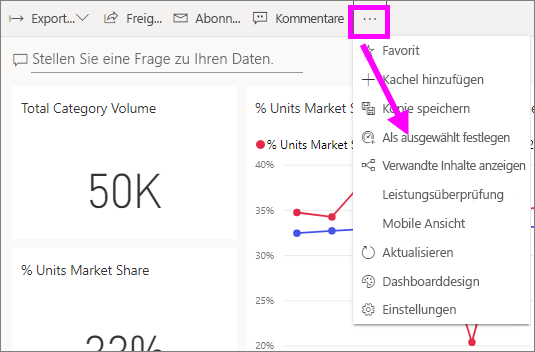
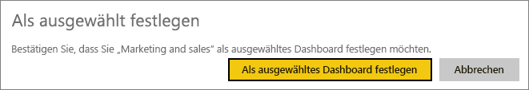

# Ausgewählte Dashboards im Power BI-Dienst

[!INCLUDE [power-bi-service-new-look-include](../includes/power-bi-service-new-look-include.md)]

Viele Benutzer haben ein bevorzugtes Dashboard. Beispielsweise das Dashboard, das sie verwenden, um ihr Unternehmen zu verwalten. Oder das Dashboard mit einer Aggregation von Kacheln aus unterschiedlichen Dashboards und Berichten.

## Erstellen eines ausgewählten Dashboards
Wenn Sie ein Dashboard als *Ausgewählt* festlegen, wird dieses bei jedem Öffnen des Power BI-Diensts angezeigt. 

Sie können auch mehrere Dashboards als Favoriten auswählen. Siehe [Dashboardfavoriten](end-user-favorite.md).

Wenn Sie kein Dashboard als „Ausgewählt“ festlegen, öffnet Power BI das zuletzt verwendete Dashboard oder Power BI **Home**. 

### So legen Sie ein Dashboard als „Ausgewählt“ fest
Sehen Sie sich in diesem Video an, wie Amanda ein ausgewähltes Dashboard erstellt. Führen Sie anschließend die beschriebenen Schritte aus, um es selbst auszuprobieren.

<iframe width="560" height="315" src="https://www.youtube.com/embed/G26dr2PsEpk" frameborder="0" allowfullscreen></iframe>

1. Öffnen Sie das Dashboard, das Sie als „Ausgewählt“ festlegen möchten. 
2. Klicken Sie in der oberen Menüleiste auf **Weitere Optionen** (...), und klicken Sie auf die Option **Als ausgewählt festlegen**. 
   
    
3. Bestätigen Sie Ihre Auswahl.
   
    

## Ändern des ausgewählten Dashboards
Sie können später jederzeit ein neues Dashboard als ausgewähltes Dashboard festlegen.

1. Führen Sie die vorherigen Schritte 1 und 2 aus.
   
    
2. Wählen Sie **Als ausgewähltes Dashboard festlegen** aus. Wenn das Dashboard nicht mehr als „Ausgewählt“ festgelegt ist, bleibt es trotzdem in Power BI erhalten. 
   
    

## Entfernen des ausgewählten Dashboards
Wenn kein Dashboard als ausgewähltes Dashboard festgelegt sein soll, können Sie diese Festlegung wie folgt aufheben.

1. Öffnen Sie das zurzeit ausgewählte Dashboard.
2. Klicken Sie in der oberen Menüleiste auf **Weitere Optionen** (...), und klicken Sie auf die Option **Ausgewähltes deaktivieren**.

    
   
## Nächste Schritte
- [Hinzufügen von Dashboards als „Favoriten“](end-user-favorite.md)
- Weitere Fragen? Wenden Sie sich an die [Power BI-Community](https://community.powerbi.com/).

