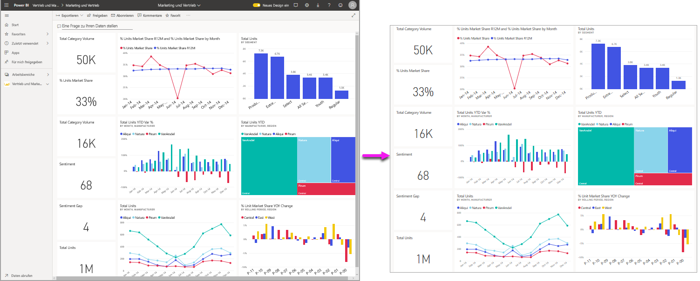
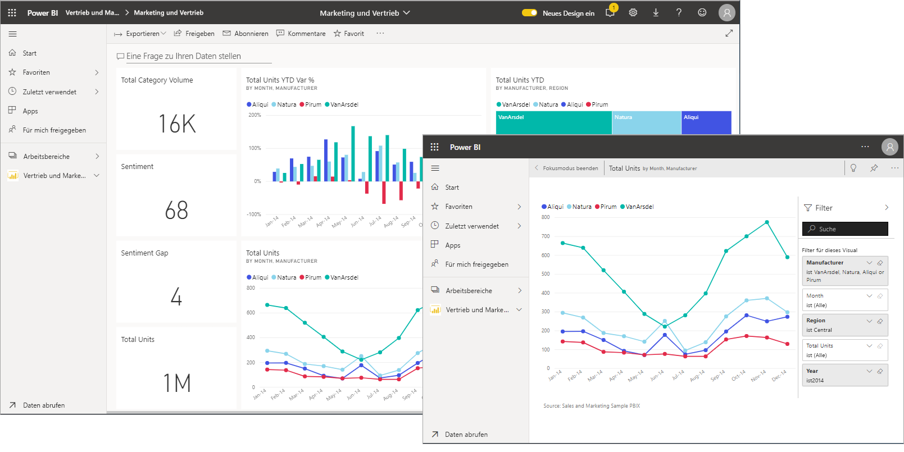
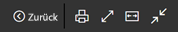
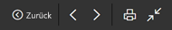
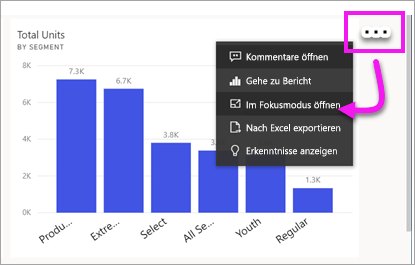
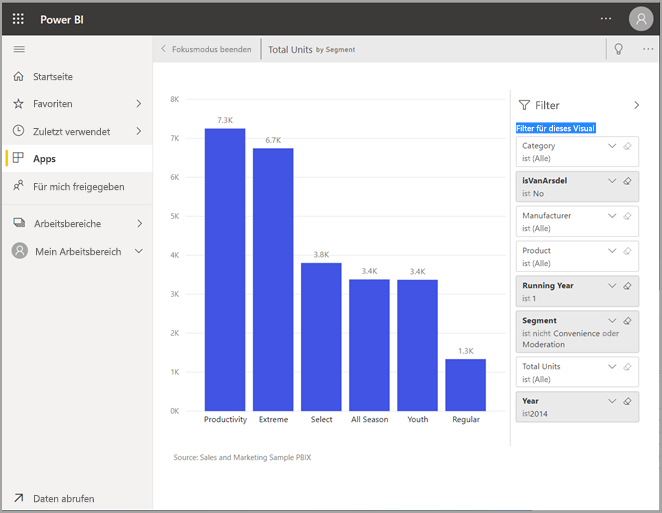
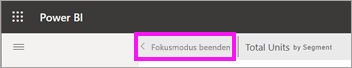
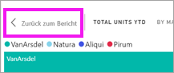

# Anzeigen von Inhalten im Detail: Fokusmodus und Vollbildmodus

[!INCLUDE [power-bi-service-new-look-include](../includes/power-bi-service-new-look-include.md)]    

<iframe width="560" height="315" src="https://www.youtube.com/embed/dtdLul6otYE" frameborder="0" allowfullscreen></iframe>

Der Fokusmodus und der Vollbildmodus sind zwei verschiedene Möglichkeiten, um weitere Details in Ihren Visuals, Berichten und Dashboards anzuzeigen.  Der Hauptunterschied besteht darin, dass in der Vollbildansicht alle Bereiche rund um Ihre Inhalte entfernt werden, während Sie im Fokusmodus weiterhin mit Ihren Visuals interagieren können. Sehen wir uns die Parallelen und die Unterschiede genauer an.  

|Inhalt    | Fokusmodus  |Vollbildmodus  |
|---------|---------|----------------------|
|Dashboard     |   Nicht möglich     | Ja |
|Berichtseite   | Nicht möglich  | Ja|
|Berichtsvisual | Ja    | Ja |
|Dashboardkachel | Ja    | Nicht möglich |
|Windows 10 Mobile | Nicht möglich | Ja |

## Was ist der Vollbildmodus?

Zeigen Sie Ihre Inhalte aus dem Power BI-Dienst (Dashboards, Berichtsseiten, Kacheln und Visuals) ohne störende Menüs und Navigationsbereiche an.  Sie erhalten jederzeit eine aufgeräumte vollständige Ansicht Ihrer Inhalte auf einen Blick. Dies wird gelegentlich auch als TV-Modus bezeichnet.   

Wenn Sie Power BI Mobile verwenden, ist [der Vollbildmodus für mobile Windows 10-Apps verfügbar](./mobile/mobile-windows-10-app-presentation-mode.md). 

Einige Verwendungsmöglichkeiten des Vollbildmodus:

* Präsentieren Ihrer Dashboards, Visuals oder Berichte in einer Besprechung oder Konferenz
* Anzeigen in einem Büro auf einem dedizierten großen Bildschirm oder Projektor
* Anzeigen auf einem kleinen Bildschirm
* Überprüfen im gesperrten Modus – Sie können den Bildschirm berühren oder mit dem Mauszeiger auf Kacheln zeigen, ohne den zugrunde liegenden Bericht oder das Dashboard zu öffnen.

## Was ist der Fokusmodus?

Im ***Fokusmodus*** können Sie ein Visual oder eine Kachel erweitern (ausklappen) und so mehr Details anzeigen.  Vielleicht verwenden Sie ein Dashboard oder einen Bericht, der etwas unübersichtlich ist, und möchten nur ein einzelnes Visual vergrößern.  Dies ist ein perfekter Verwendungszweck des Fokusmodus.  

Im Fokusmodus kann ein Power BI-*Consumer* mit Filtern interagieren, die bei Erstellung des Visuals angewendet wurden.  Im Power BI-Dienst können Sie den Fokusmodus für eine Dashboardkachel oder ein Berichtsvisual verwenden.

## Arbeiten im Vollbildmodus

Der Vollbildmodus steht für Dashboards, Berichtsseiten sowie Berichtsvisuals zur Verfügung. 

- Wenn Sie ein Dashboard im Vollbildmodus öffnen möchten, klicken Sie auf das Symbol für den Vollbildmodus  in der oberen Menüleiste klicken. 

- Wenn Sie eine Berichtsseite im Vollbildmodus öffnen möchten, klicken Sie auf **Ansicht**  >  **Vollbildmodus**.

    

- Wenn Sie ein Visual im Vollbildmodus öffnen möchten, öffnen Sie es zuerst im Fokusmodus, und klicken Sie dann auf **Ansicht**  >  **Vollbildmodus**.  

Der ausgewählte Inhalt füllt den gesamten Bildschirm aus.    Sobald Sie sich im Vollbildmodus befinden, wird durch Bewegen der Maus oder des Cursors ein Kontextmenü angezeigt. Weil der Vollbildmodus für eine breite Vielfalt an Inhalten verfügbar ist, sind die Optionen im Kontextmenü jeweils etwas unterschiedlich, aber ziemlich selbsterklärend.  Zeigen Sie einfach auf ein Symbol, um eine Definition zu erhalten.

Menü für Dashboards    
    

Menü für Berichtsseiten und Berichtsvisuals    
    

  *     
  Kehren Sie mit der Schaltfläche **Zurück** zur vorherigen Seite in Ihrem Browser zurück. Wenn die vorherige Seite eine Power BI-Seite war, wird sie ebenfalls im Vollbildmodus angezeigt.  Der Vollbildmodus bleibt so lange aktiviert, bis Sie ihn beenden.

  *     
  Verwenden Sie diese Schaltfläche, um die Dashboard- oder Berichtsseite im Vollbildmodus zu drucken.

  *     
    Verwenden Sie die Schaltfläche **An Bildschirmgröße anpassen**, um das Dashboard so groß wie möglich anzuzeigen, ohne dass Bildlaufleisten verwendet werden.  

    

  *        
    Manchmal sind Bildlaufleisten nicht wichtig, und das Dashboard soll auf der gesamten Breite des verfügbaren Bereichs angezeigt werden. Wählen Sie die Schaltfläche **An Breite anpassen** aus.    

    

  *        
    Verwenden Sie in Berichten im Vollbildmodus diese Pfeile, um zwischen den Seiten im Bericht zu wechseln.    
  *      
  Um den Vollbildmodus zu beenden, klicken Sie auf das Symbol **Vollbildmodus beenden**.

      

## Arbeiten im Fokusmodus

Der Fokusmodus ist für Dashboardkacheln und Berichtsvisuals verfügbar. 

- Wenn Sie eine Dashboardkachel im Fokusmodus öffnen möchten, bewegen Sie den Mauszeiger auf eine Dashboardkachel oder ein Berichtsvisual, klicken Sie auf **Weitere Optionen** (…), und klicken Sie auf **Im Fokusmodus öffnen**.

    . 

- Wenn Sie ein Berichtsvisual im Fokusmodus öffnen möchten, bewegen Sie den Mauszeiger auf das Visual, und klicken Sie auf das Symbol für den **Fokusmodus** .  

   

Das Visual wird geöffnet und füllt den gesamten Zeichenbereich. Beachten Sie, dass Ihnen immer noch der **Filterbereich** zur Verfügung steht, mit dem Sie mit dem Visual interagieren können. Der Bereich **Filter** und der Navigationsbereich können zugeklappt werden.

   

     

Probieren Sie die Funktion aus, indem Sie die [Filter ändern](end-user-report-filter.md) und in Ihren Daten nach interessanten Erkenntnissen suchen.  

Sehen Sie sich die Daten genauer an, um neue Erkenntnisse zu gewinnen und Antworten auf Fragen zu finden. Als *Consumer* können Sie weder neue Filter hinzufügen, noch die in den Visuals verwendeten Felder ändern oder neue Visuals erstellen.  Sie können jedoch mit den vorhandenen Filtern interagieren. 

Änderungen an Dashboardkacheln können nicht gespeichert werden. Allerdings werden alle Änderungen, die Sie an bestehenden Filtern für Berichtsvisuals vornehmen, beim Beenden von Power BI gespeichert. Wenn Power BI Ihre Änderungen nicht speichern soll, wählen Sie **Auf Standard zurücksetzen** aus.   

Beenden Sie den Fokusmodus, und wechseln Sie zurück zum Dashboard, indem Sie in der linken oberen Ecke des Visuals entweder auf **Fokusmodus beenden** oder auf **Zurück zum Bericht** klicken.

    

  

## Zu beachtende Aspekte und Problembehandlung

* Wenn Sie den Fokusmodus für ein Visual in einem Bericht verwenden, können Sie alle Filter anzeigen und damit interagieren: auf Visual-, Seiten-, Drillthrough- und Berichtsebene.    
* Wenn Sie den Fokusmodus für ein Visual in einem Dashboard verwenden, können Sie nur den Filter auf Visualebene anzeigen und damit interagieren.

## Nächste Schritte

[Anzeigeeinstellungen für Berichte](end-user-report-view.md)