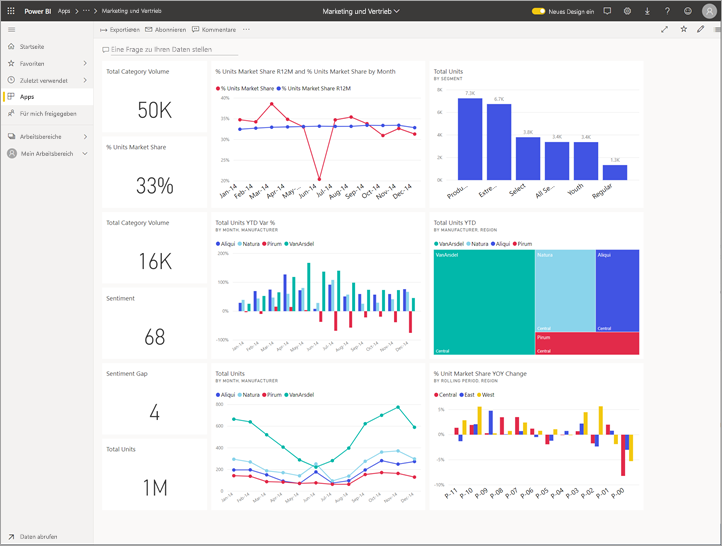
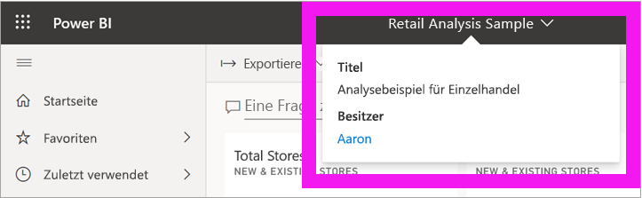
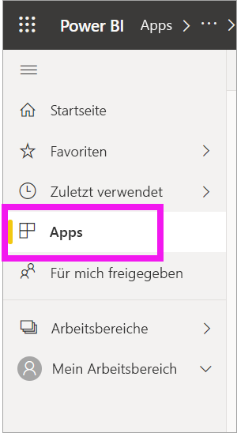
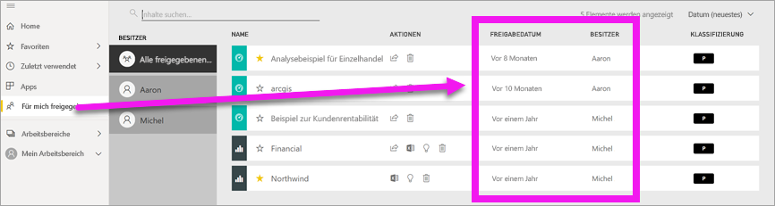
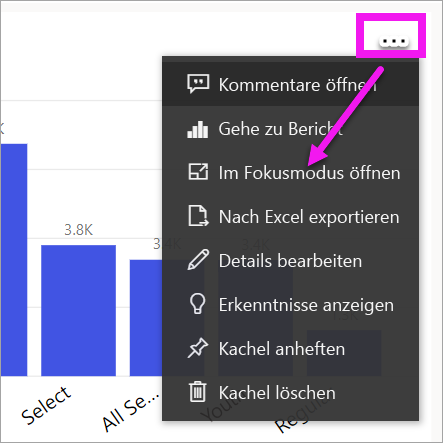
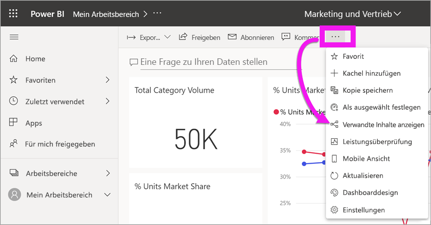
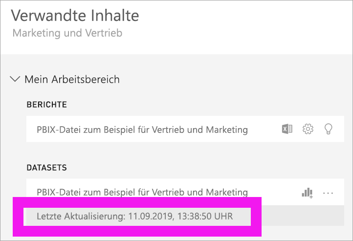

# Aktualität Ihrer Inhalte
Als *Benutzer* interagieren Sie mit Inhalten, die von *Designern* erstellt und für Sie freigegeben werden. Sie fragen sich möglicherweise, ob diese Inhalte aktuell sind, oder Sie möchten einfach nur wissen, wann die Inhalte zuletzt aktualisiert wurden. Zu wissen, dass Sie mit den aktuellsten Inhalten arbeiten, gibt Ihnen Vertrauen.  
 

Es kann oftmals entscheidend sein, dass Sie die neuesten Daten verwenden, um die richtigen Entscheidungen zu treffen. Was können Sie tun, um sicherzustellen, dass Sie die neuesten Inhalte verwenden? In den meisten Fällen müssen Sie überhaupt nichts unternehmen. Apps, die für Sie freigegeben wurden, werden automatisch gemäß einem vom App-Designer festgelegten Zeitplan aktualisiert. Dasselbe gilt für Dashboards und Berichte, die für Sie freigegeben wurden: Der Designer stellt entweder manuell oder mithilfe eines automatisierten Aktualisierungszeitplan sicher, dass die Inhalte aktuell sind.  

Falls Sie Fragen zur Aktualität der Inhalte haben, wenden Sie sich an den Designer.

## Suchen nach dem Namen des Designers oder Besitzers

### Dashboard oder Bericht

Der Name des Besitzers ist in der Titelleiste von Dashboards und Berichten aufgeführt. Wählen Sie den Namen des Berichts oder Dashboards aus, um weitere Details offenzulegen, einschließlich des **Besitzers**.

### Apps

Auf dem App-Bildschirm werden Ihnen sowohl der Name des Designers als auch das Datum der letzten Aktualisierung der App angezeigt.  

1. Klicken Sie im linken Navigationsbereich auf **Apps**.

    

2. Zeigen Sie auf die App, um den Titel, das Aktualisierungsdatum und den Namen des Designers anzuzeigen. 

    

### Für mich freigegeben
Auf dem Bildschirm **Für mich freigegeben** werden Ihnen der Name des Inhaltsbesitzers sowie das Datum angezeigt, an dem der Inhalt zuletzt für Sie freigegeben wurde.

 

## Vorgehensweise: Nachschlagen des Datums der letzten Aktualisierung
Wenn Sie möchten, können Sie für die meisten Inhalte das Datum der letzten Aktualisierung nachschlagen. 

### Dashboardkacheln
Zeigen Sie bei Dashboardkacheln die Kachel im Fokusmodus an, um den Zeitstempel der letzten Aktualisierung anzuzeigen.

1. Klicken Sie auf einer Dashboardkachel auf die Auslassungspunkte (...), und wählen Sie **Im Fokusmodus öffnen** aus.

    

2. In der oberen rechten Ecke wird das Datum der letzten Aktualisierung angezeigt. Wenn Sie das Datum nicht sehen können, erweitern Sie Ihren Browser, um diesen zu verbreitern. 

    

### Dashboards und Berichte
Als weitere Möglichkeit können Sie das Datum der letzten Aktualisierung mithilfe von **Verwandte Inhalte anzeigen** nachschlagen.  **Verwandte Inhalte anzeigen** finden Sie durch Auswählen der Auslassungspunkte (...) in der oberen Menüleiste von Power BI.

Im Bereich **Verwandte Inhalte** werden Informationen zur letzten Aktualisierung der zugrunde liegenden Datasets des Dashboards oder Berichts angezeigt.

## Was geschieht, wenn eine App vom Designer gelöscht wird?

Wenn ein Designer eine App löscht, werden die Dashboards und Berichte, die dieser App zugeordnet sind, automatisch auch aus Ihrem Power BI-Arbeitsbereich gelöscht. Sie sind nicht mehr verfügbar, und die App wird weder im Container „Apps“ noch anderswo im Navigationsbereich angezeigt.

## Abonnieren zum Anzeigen von Änderungen
Eine andere Möglichkeit, auf dem neuesten Stand zu bleiben, ist einen Bericht oder ein Dashboard zu abonnieren. Anstatt sich anmelden und einen Bericht oder ein Dashboard öffnen zu müssen, geben Sie an, dass Power BI Ihnen gemäß einem von Ihnen festgelegten Zeitplan eine Momentaufnahme schickt.  Weitere Informationen finden Sie unter [Abonnieren eines Berichts oder Dashboards im Power BI-Dienst](end-user-subscribe.md).

## Festlegen von Datenwarnungen
Möchten Sie benachrichtigt werden, wenn sich Daten über von Ihnen festgelegte Grenzwerte hinweg ändern? [Erstellen Sie eine Datenwarnung](end-user-alerts.md).  Mithilfe von Datenwarnungen bleiben Sie einfach auf dem neuesten Stand. Mithilfe von Datenwarnungen legen Sie fest, dass Sie von Power BI eine E-Mail erhalten, sobald ein Wert in einem Bericht einen bestimmten Grenzwert überschreitet.  Beispielsweise wenn der Inventar auf weniger als 25 Einheiten sinkt oder wenn Verkaufsziele überschritten werden.  

## Nächste Schritte
[Erstellen einer Datenwarnung](end-user-alerts.md)    
[Abonnieren von Dashboards und Berichten](end-user-subscribe.md)    
[Anzeigen verwandter Inhalte](end-user-related.md)    
