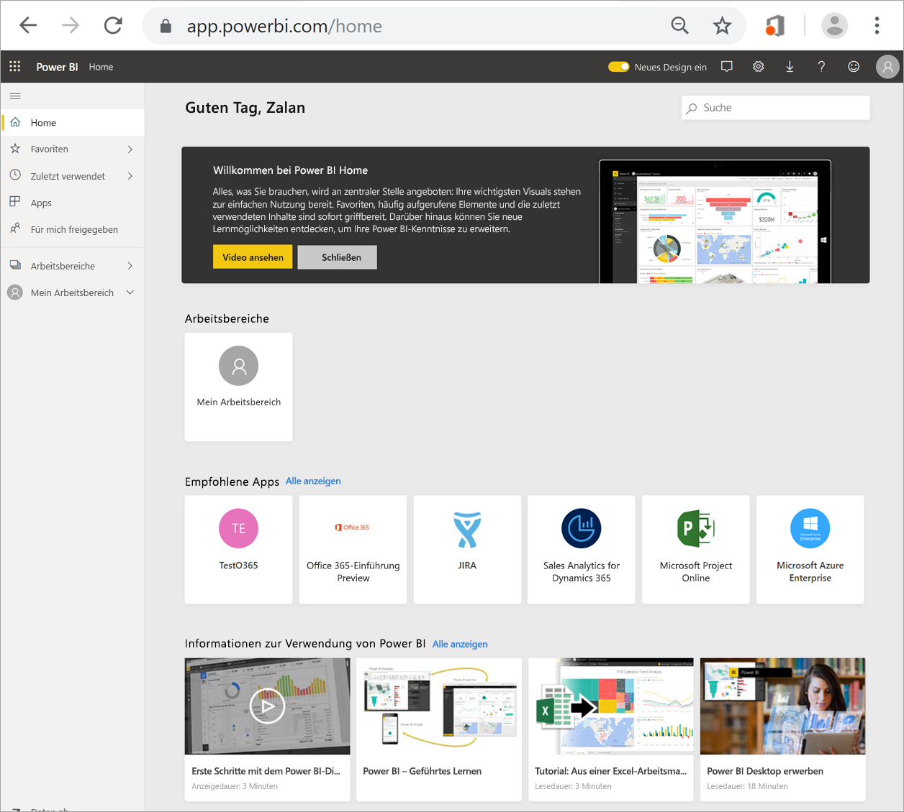

# Suchen von Dashboards, Berichten und Apps
In Power BI bezeichnet der Begriff *Inhalte* Apps, Dashboards und Berichte. Inhalte werden von *Power BI-Designern* erstellt und mit anderen Benutzern wie Ihnen geteilt. Ihre Inhalte werden im Power BI-Dienst angezeigt, und Sie können von dort darauf zugreifen. Beginnen Sie Ihre Arbeit in Power BI am besten auf der Seite **Home**.

## Power BI Home erkunden
Nachdem Sie sich beim Power BI-Dienst angemeldet haben, klicken Sie im Navigationsbereich auf **Home**. 

Nun wird die Seite „Home“angezeigt, wie im folgenden Screenshot dargestellt.
 

Es gibt drei verschiedene Möglichkeiten, in Power BI Home nach Inhalten zu suchen und sie anzuzeigen. Der Pool an Inhalten ist bei allen drei gleich, nur die Art der Suche unterscheidet sich. In manchen Fällen erweist sich das Durchsuchen als die einfachste und schnellste Möglichkeit, einen Inhalt zu finden. In anderen Fällen ist das Auswählen einer *Karte* auf der Seite „Home“ die beste Option.

- Auf der Seite „Home“ werden Ihre Favoriten und neuesten Inhalte sowie empfohlene Inhalte und Lernressourcen angezeigt und organisiert. Jeder Inhalt wird einzeln als *Karte* mit Titel und Symbol angezeigt. Durch Auswählen einer Karte wird der entsprechende Inhalt geöffnet.
- Auf der linken Seite befindet sich ein Navigationsbereich, auch Navigationsleiste genannt. In diesem Bereich werden die gleichen Inhalte in etwas anderer Form angezeigt, und zwar in den Kategorien „Favoriten“, „Zuletzt verwendet“, „Apps“ und „Für mich freigegeben“. Von hier aus können Sie Listen mit Inhalten anzeigen und durch Auswählen einen Inhalt öffnen.
- Über das globale Suchfeld in der oberen rechten Ecke können Sie durch Eingabe von Titel, Name oder Schlüsselwort nach Inhalten suchen.

In den folgenden Abschnitten werden die einzelnen Optionen zum Suchen und Anzeigen von Inhalten näher erläutert.

## Seite „Home“
Auf der Seite „Home“ werden alle Inhalte angezeigt, die Sie verwenden dürfen. Zunächst werden dort nicht viele Inhalte angezeigt werden (wie auf der Abbildung oben). Das ändert sich jedoch mit der Zeit, wenn Sie und Ihre Kollegen anfangen, mit Power BI zu arbeiten.

Auf der Seite „Home“ werden auch aktuelle empfohlene Inhalte und Lernressourcen angezeigt. 
 
Sie werden nach und nach Dashboards, Berichte und Apps von Kollegen erhalten, sodass die Seite allmählich immer voller wird. Nach einiger Zeit sieht sie möglichweise so aus:

 
In den nächsten Abschnitten erhalten Sie nähere Informationen zu den einzelnen Bereichen der Seite „Home“ (von oben nach unten).

## Die wichtigsten Inhalte immer zur Hand

### Favoriten und häufig aufgerufene Elemente
Dieser oberste Bereich enthält Links zu Inhalten, die Sie häufig aufrufen oder die Sie als [ausgewählt oder Favorit](end-user-favorite.md) markiert haben. Wie Sie sehen besitzen manche Karten gelbe Sterne. Das bedeutet, dass diese beiden Apps und das Dashboard als Favoriten markiert wurden. 

Außerdem können Sie Inhalte als [ausgewählt](end-user-featured.md) kennzeichnen. Sie können das Dashboard oder den Bericht auswählen, das bzw. den Sie voraussichtlich am häufigsten öffnen und daher als *ausgewähltes* Dashboard festlegen. Immer wenn Sie den Power BI-Dienst öffnen, wird Ihr ausgewähltes Dashboard zuerst angezeigt. 

### Zuletzt verwendet und Meine Apps
Im nächsten Abschnitt werden die Inhalte angezeigt, die Sie zuletzt aufgerufen haben. Dabei enthält jede Karte einen Zeitstempel. Im Abschnitt **Meine Apps** werden die neuesten Apps angezeigt, die für Sie freigegeben wurden oder die Sie [aus AppSource heruntergeladen](end-user-apps.md) haben. Wenn Sie eine Liste mit allen für Sie freigegebenen Apps anzeigen möchten, wählen Sie **Alle anzeigen** aus.

### Arbeitsbereiche
Jeder Benutzer des Power BI-Diensts hat seinen eigenen Arbeitsbereich, genannt **Mein Arbeitsbereich**. Unter **Mein Arbeitsbereich** werden nur dann Inhalte angezeigt, wenn Sie Beispiele von Microsoft heruntergeladen oder eigene Dashboards, Berichte oder Apps erstellt haben. Deshalb ist *Mein Arbeitsbereich* bei vielen **Benutzern** leer und wird auch leer bleiben.  

Jedes Mal, wenn Sie eine [App herunterladen](end-user-app-marketing.md) oder eine [App für Sie freigegeben wird](end-user-apps.md), wird ein neuer Arbeitsbereich erstellt.  Um einen *App-Arbeitsbereich* zu öffnen, wählen Sie ihn auf der Seite „Home“ aus. 

Die App wird im Zeichenbereich geöffnet, und der Name des Arbeitsbereichs wird im Navigationsbereich angezeigt. Innerhalb eines Arbeitsbereichs trennt der Power BI-Dienst Inhalte nach Typ: Dashboards und Berichte. In manchen Fällen sind auch Arbeitsmappen und Datasets verfügbar. Wenn Sie einen Arbeitsbereich auswählen, wird diese Unterteilung angezeigt. Der Arbeitsbereich **Gardening chain** (Kette für Gartenbedarf) in diesem Beispiel enthält vier Dashboards und zwei Berichte.

### Für mich freigegeben
Kollegen können Apps, aber auch einzelne Dashboards und Berichte für Sie freigeben. Wie Sie sehen werden im Abschnitt **Für mich freigegeben** drei Dashboards und drei Berichte angezeigt, die Ihre Kollegen für Sie freigegeben haben.

### Empfohlene Apps
Power BI empfiehlt Ihnen eine Reihe von Apps basierend auf Ihrer Aktivität und Ihren Kontoeinstellungen. Durch Auswählen einer Karte wird die entsprechende App geöffnet.
 
### Lernressourcen
Ganz unten auf der Seite „Home“ wird eine Reihe von Lernressourcen angezeigt. Welche Ressourcen dort angezeigt werden, hängt von Ihrer Aktivität, Ihren Einstellungen und vom Power BI-Administrator ab. 
 
## Untersuchen des Navigationsbereichs

Im Navigationsbereich werden Inhalte so klassifiziert, dass Sie das Gesuchte schnell und einfach finden.  

Über den Navigationsbereich können Sie Dashboards, Berichte und Apps suchen und zwischen ihnen wechseln. In einigen Fällen stellt der Navigationsbereich die schnellste Möglichkeit dar, auf einen Inhalt zuzugreifen. Der Navigationsbereich wird beim Öffnen der Seite „Home“ angezeigt und bleibt auch nach dem Öffnen von anderen Bereichen des Power BI-Diensts erhalten. Sie können ihn zuklappen, indem Sie auf das Symbol „Ausblenden“ klicken  erforderlich.
  
Im Navigationsbereich werden Ihre Inhalte in Containern organisiert, die den Bereichen auf der Seite „Home“ ähnlich sind: „Favoriten“, „Zuletzt verwendet“, „Apps“, „Für mich freigegeben“ und „Arbeitsbereiche“. Mithilfe der Flyouts können Sie für jeden Container nur die neuesten Inhalte anzeigen oder zu Inhaltslisten mit allen Inhalten der jeweiligen Containerkategorie wechseln.
 
- Wenn Sie einen der Inhaltsabschnitte öffnen möchten, um eine Liste mit allen Elementen anzuzeigen, klicken Sie auf die Überschrift.
- Wenn Sie das neueste Element in den einzelnen Containern anzeigen möchten, klicken Sie auf das Flyout (**>**).

    

 
Der Navigationsbereich ist eine weitere Möglichkeit, schnell nach Inhalten zu suchen. Inhalte werden dort auf ähnliche Weise wie auf der Seite „Home“ organisiert, jedoch in Form von Listen anstelle von Karten. 

## Durchsuchen aller Inhalte
Manchmal findet man einen Inhalt am schnellsten, wenn man danach sucht. Wenn Ihnen beispielsweise auffällt, dass ein längere Zeit nicht mehr verwendetes Dashboard auf der Seite „Home“ nicht mehr angezeigt wird. Ein anderes Beispiel wäre, dass Ihr Kollege Aaron etwas für Sie freigegeben hat, aber Sie sich nicht mehr an den Namen oder die Art des Inhalts erinnern, also ob es ein Dashboard oder ein Bericht war. Es kann auch sein, dass Sie so viele Inhalte haben, dass suchen schneller ist als scrollen oder sortieren. 
 
Das Suchfeld finden Sie auf der Seite „Home“ am rechten Rand der Menüleiste. In solchen Fällen können Sie den Namen des Dashboards ganz oder teilweise eingeben und danach suchen. Zusätzlich können Sie auch den Namen Ihres Kollegen eingeben und nach Inhalten suchen, die er für Sie freigegeben hat. Bei der Suche wird in allen Inhalten, die Ihnen gehören oder auf die Sie zugreifen können, nach Übereinstimmungen gesucht.

## Nächste Schritte
Übersicht über die [Grundkonzepte für Benutzer des Power BI-Diensts](end-user-basic-concepts.md)
