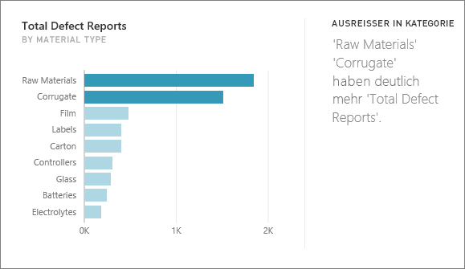
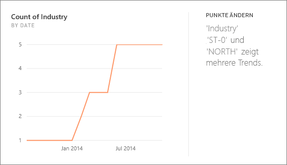
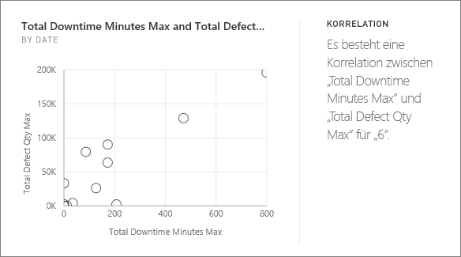
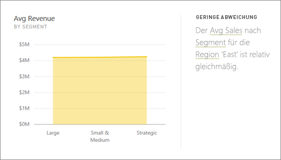
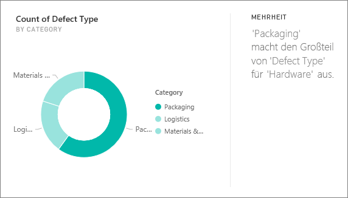
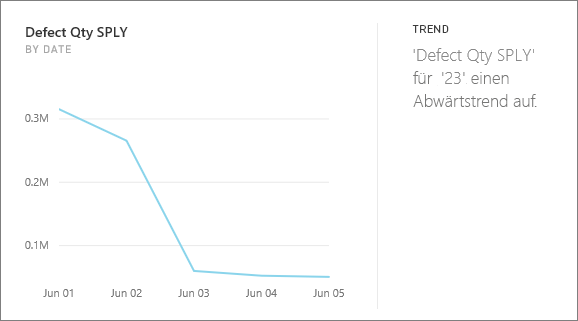
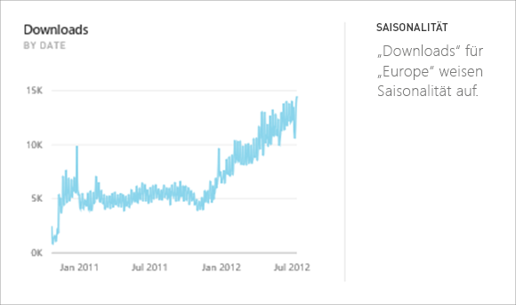
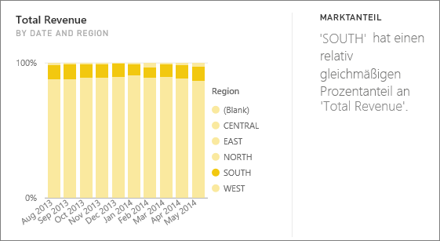

# Von Power BI unterstützte Einblicke

Mit Power BI können Sie Ihre Daten durchsehen und interessante Trends und Muster finden. Diese Trends und Muster werden in Form von Visuals angezeigt, die *Erkenntnisse* genannt werden. 

Informationen zur Verwendung von Erkenntnissen finden Sie unter [Anzeigen von Erkenntnissen auf Dashboardkacheldaten mit Power BI](end-user-insights.md).

## Wie funktionieren Einblicke?
Power BI durchsucht schnell verschiedene Teilmengen Ihres Datasets. Während der Suche nutzt Power BI mehrere hoch entwickelte Algorithmen, um potenziell interessante Erkenntnisse zu ermitteln. *Power BI-Benutzer* können Erkenntnisse auf Dashboardkacheln ausführen.

## Terminologie
Power BI verwendet statistische Algorithmen, um Erkenntnisse zu gewinnen. Die Algorithmen werden im nächsten Abschnitt dieses Artikels aufgeführt und beschrieben. Bevor sich mit den Algorithmen befasst wird, finden Sie hier Definitionen für einige Begriffe, die Ihnen vielleicht nicht vertraut sind. 

* **Measure**: ein Measure ist ein quantitatives (numerisches) Feld, das für Berechnungen verwendet werden kann. Es können z. B. Summen, der Durchschnitt oder Mindestwerte berechnet werden. Wenn das Unternehmen in diesem Beispiel Skateboards herstellt und verkauft, können die Measures die Anzahl der verkauften Skateboards und der durchschnittliche Jahresgewinn sein.  
* **Dimension:** Dimensionen sind kategorische (Text-)Daten. Eine Dimension beschreibt eine Person, ein Objekt, ein Element, ein Produkt, einen Ort und eine Uhrzeit. In einem Dataset bieten Dimensionen die Möglichkeit, *Measures* in nützliche Kategorien zu gruppieren. Für das Beispiel des Skateboardunternehmens enthalten manche Dimensionen möglicherweise die Prüfung der Verkäufe (ein Measure) anhand des Modells, der Farbe, dem Land oder der Marketingkampagne.   
* **Korrelation:** eine Korrelation gibt Aufschluss darüber, wie bestimmte Verhaltensweisen miteinander verknüpft sind.  Wenn sich die Anstiegs- oder Rückgangsmuster ähneln, besteht eine positive Korrelation. Wenn die Muster gegenteilig sind, besteht eine negative Korrelation. Wenn z. B. nach jeder Marketingkampagne im Fernsehen mehr rote Skateboards verkauft werden, besteht eine positive Korrelation zwischen dem Verkauf von roten Skateboards und der Marketingkampagne im Fernsehen.
* **Zeitreihe:** eine Zeitreihe ist eine Möglichkeit, die Zeit als aufeinander folgende Datenpunkte anzuzeigen. Diese Datenpunkte können Inkremente wie Sekunden, Stunden, Monate oder Jahre sein.  
* **Kontinuierliche Variable:** eine kontinuierliche Variable kann einen beliebigen Wert zwischen dem Mindest- und dem Maximalwert aufweisen; andernfalls handelt es sich um eine diskrete Variable. Beispiele hierfür sind Temperatur, Gewicht, Alter und Zeit. Kontinuierliche Variablen können Teilwerte enthalten. Die Gesamtzahl der verkauften blauen Skateboards ist eine diskrete Variable, da kein halbes Skateboard verkauft werden kann.  

## Nach welchen Typen von Erkenntnissen kann gesucht werden?
Dies sind die Algorithmen, die Power BI verwendet: 

### Kategorieausreißer (oben/unten)
Dieser hebt Fälle hervor, in denen ein oder zwei Kategorien viel größere Werte als andere Kategorien aufweisen.  

### Änderungspunkte in einer Zeitreihe
Hebt hervor, wenn es signifikante Trendänderungen in einer Zeitreihe von Daten gibt.

### Korrelation
Dieser erkennt Fälle, in denen mehrere Measures ein ähnliches Muster oder einen ähnlichen Trend aufweisen, wenn diese in einer Kategorie oder in einem Wert im Dataset dargestellt werden.

### Geringe Abweichung
Erkennt Fälle, in denen Datenpunkte nicht stark vom Mittelwert abweichen.

### Mehrheit (Hauptfaktoren)
Sucht nach Fällen, in denen eine Mehrheit eines Gesamtwerts beim Aufschlüsseln in eine andere Dimension einem einzelnen Faktor zugeordnet werden kann.  

### Allgemeine Trends in Zeitreihen
Entdeckt Trends nach oben oder unten in Zeitreihendaten.

### Saisonabhängigkeit in Zeitreihen
Sucht periodische Muster in Zeitreihendaten, z. B. wöchentliche, monatliche oder jährliche Saisonabhängigkeit.

### Stetiger Anteil
Hebt Fälle hervor, in denen eine Beziehung von übergeordneten und untergeordneten Elementen zwischen dem Anteil eines untergeordneten Werts in Bezug auf den Gesamtwert des übergeordneten Elements für eine kontinuierliche Variable vorhanden ist.

### Zeitreihenausreißer
Erkennt in Daten auf einer Zeitreihe, wenn bestimmte Datums- oder Zeitangaben mit sich deutlich von den übrigen Daten unterscheidenden Werten vorliegen.

## Nächste Schritte
[Power BI-Einblicke](end-user-insights.md)

Weitere Fragen? [Wenden Sie sich an die Power BI-Community](https://community.powerbi.com/)

