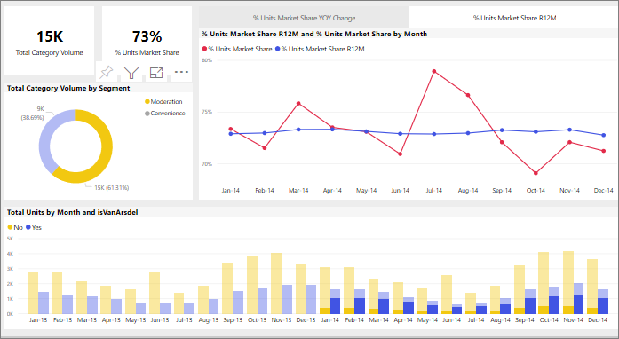

# Gegenseitige Kreuzfilterung von Visuals in einem Power BI-Bericht
Eines der herausragenden Features von Power BI ist die Art, auf die alle visuellen Elemente auf einer Berichtsseite miteinander verbunden sind. Wenn Sie in einem der visuellen Elemente einen Datenpunkt auswählen, ändern sich alle anderen visuellen Elemente auf der Seite, die diese Daten enthalten, auf Grundlage dieser Auswahl. 

## Interaktion von Visuals

Standardmäßig führt die Auswahl eines Datenpunkts in einem Visual auf einer Berichtseite zur Kreuzfilterung oder -hervorhebung der anderen Visuals auf der Seite. Wie visuelle Elemente auf einer Seite genau miteinander interagieren, wird vom *Designer* des Berichts festgelegt. *Designer* können Interaktionen von Visuals aktivieren und deaktivieren sowie das Standardverhalten der Kreuzfilterung, -hervorhebung und von [Drillvorgängen](end-user-drill.md) ändern. 

Wenn Sie Hierarchien und Drillvorgänge noch nicht kennengelernt haben, finden Sie weitere Informationen unter [Drilldowns in Power BI](end-user-drill.md). 

Die Kreuzfilterung und die Kreuzhervorhebung können sich als nützlich erweisen, wenn Sie identifizieren möchten, wie Werte in Ihren Daten zusammenhängen. Wenn Sie beispielsweise den Abschnitt „Moderation“ des Ringdiagramms auswählen, wird der Beitrag dieses Abschnitts zu jeder Spalte des Diagramms „Total Units by Month“ (Gesamteinheiten nach Monat) hervorgehoben und das Liniendiagramm wird entsprechend gefiltert.

Siehe [Informationen zum Filtern und Hervorheben](end-user-report-filter.md). 

  
> [!NOTE]
> Die Begriffe *Kreuzfilterung* und *Kreuzhervorhebung* werden verwendet, um das hier beschriebene Verhalten davon zu unterscheiden, was geschieht, wenn Sie den Bereich **Filter** zum Filtern und Hervorheben von Visualisierungen verwenden.  

## Zu beachtende Aspekte und Problembehandlung
- Wenn Ihr Bericht ein Visual enthält, das [Drillvorgänge](end-user-drill.md) standardmäßig unterstützt, haben Drillvorgänge an einem Visual keine Auswirkungen auf die anderen Visuals der Berichtseite.     
- Interagiert Visual A mit Visual B, werden die Filter auf Visualebene von Visual A auch auf Visual B angewendet.

## Nächste Schritte
[Verwenden von Berichtsfiltern](../power-bi-how-to-report-filter.md)
