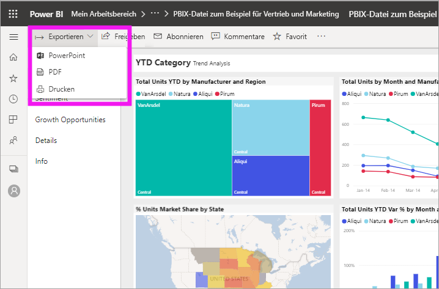
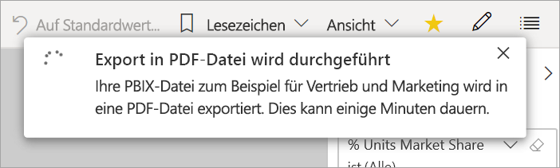
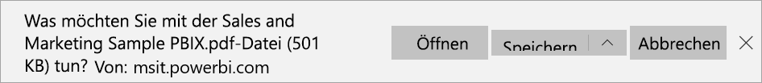

# Exportieren von Power BI-Berichten als PDF-Dateien

[!INCLUDE [power-bi-service-new-look-include](../includes/power-bi-service-new-look-include.md)]

Mit Power BI können Sie Berichte im PDF-Format veröffentlichen und darauf basierend einfach ein Dokument erstellen. Wenn Sie das Feature „In PDF exportieren“ verwenden, wird jede Seite des Power BI-Berichts als individuelle Seite im PDF-Dokument angezeigt.

## Exportieren eines Power BI-Berichts als PDF-Datei
Wählen Sie im Power BI-Dienst einen Bericht aus, der im Zeichenbereich angezeigt werden soll. Sie können auch einen Bericht von der **Startseite**, aus **Apps** oder einem anderen Container im Navigationsbereich auswählen.

1. Wählen Sie in der Menüleiste **Exportieren** > **PDF** aus.

    

    Es wird ein Popupfenster angezeigt, in dem Sie die Option zur Auswahl von **Aktuelle Werte** oder **Standardwerte** haben. **Aktuelle Werte** exportiert den Bericht im aktuellen Zustand. Dazu gehören die aktiven Änderungen, die Sie an Datenschnitt- und Filterwerten vorgenommen haben. Die meisten Benutzer wählen diese Option aus. Alternativ können **Standardwerte** auswählen, wodurch der Bericht im ursprünglichen Zustand exportiert wird (wie er vom *Designer* freigegeben wurde). Änderungen, die Sie am ursprünglichen Zustand vorgenommen haben, werden nicht dargestellt.
    
    Darüber hinaus können Sie über das Kontrollkästchen auswählen, ob die ausgeblendeten Registerkarten eines Berichts exportiert werden sollen. Aktivieren Sie einfach das Kontrollkästchen, wenn Sie nur die Registerkarten des Berichts exportieren möchten, die Ihnen im Browser angezeigt werden. Wenn Sie alle ausgeblendeten Registerkarten im Exportvorgang enthalten möchten, lassen Sie das Kontrollkästchen deaktiviert. Wenn das Kontrollkästchen ausgegraut ist, enthält der Bericht keine ausgeblendeten Registerkarten. Sobald Sie Ihre Auswahl vorgenommen haben, wählen Sie **Exportieren** aus, um fortzufahren.
    
    In der oberen rechten Ecke wird eine Fortschrittsleiste angezeigt. Der Exportvorgang kann einige Minuten dauern. Während der Bericht exportiert wird, können Sie in Power BI weiterarbeiten.

    

    Sobald der Vorgang beendet ist, wird über das Banner gemeldet, dass der Power BI-Dienst den Export abgeschlossen hat.

2. Ihre Datei ist dann dort verfügbar, wo Ihr Browser heruntergeladene Dateien speichert. In der folgenden Abbildung wird die Datei als Downloadbanner unten im Browserfenster angezeigt.

    

Das war schon alles. Sie können die Datei herunterladen und mit einem beliebigen PDF-Viewer öffnen, z.B. der in Microsoft Edge enthaltene.

## Einschränkungen und Überlegungen
Einige Aspekte und Einschränkungen sind bei der Arbeit mit dem Feature **In PDF exportieren** zu beachten.

* R-Visuals werden derzeit nicht unterstützt. Diese Visuals werden in der PDF-Datei leer sein und eine Fehlermeldung anzeigen. 
* Benutzerdefinierte Visuals, die zertifiziert wurden, werden unterstützt. Weitere Informationen zu zertifizierten benutzerdefinierten Visuals sowie zum Zertifizieren von benutzerdefinierten Visuals finden Sie unter [Wie wird ein benutzerdefiniertes Visual zertifiziert?](../developer/power-bi-custom-visuals-certified.md). Benutzerdefinierte Visuals, die nicht zertifiziert wurden, werden nicht unterstützt. In der PDF-Datei werden sie mit einer Fehlermeldung angezeigt. 
* Berichte mit mehr als 30 Berichtsseiten können derzeit nicht exportiert werden.
* Der Exportvorgang des Berichts als PDF-Datei kann einige Minuten dauern. Zu den Faktoren, die die benötigte Zeit beeinflussen, zählen die Struktur des Berichts sowie die jeweils aktuelle Auslastung des Power BI-Diensts.
* Wenn das Menüelement **In PDF exportieren** im Power BI-Dienst nicht verfügbar ist, hat der Mandantenadministrator dieses Feature wahrscheinlich deaktiviert. Wenden Sie sich an den Mandantenadministrator, um Einzelheiten zu erfahren.
* Hintergrundbilder werden an der Begrenzung des Diagramms abgeschnitten. Es wird empfohlen, Hintergrundbilder vor dem Export als PDF-Datei zu entfernen.
* Berichte, die ein Benutzer außerhalb Ihrer Power BI-Mandantendomäne besitzt (beispielsweise ein Bericht im Besitz einer Person außerhalb Ihrer Organisation, die ihn für Sie freigegeben hat), können nicht als PDF-Datei veröffentlicht werden.
* Wenn Sie ein Dashboard für Personen außerhalb Ihrer Organisation freigeben (und damit für einen Benutzer, der nicht Ihrem Power BI-Mandanten angehört), kann der betreffende Benutzer die zugehörigen Berichte des freigegebenen Dashboards nicht als PDF-Datei exportieren. Wenn Sie beispielsweise aaron@contoso.com sind, können Sie Berichte für cassie@cohowinery.com freigeben. cassie@cohowinery.com kann die zugehörigen Berichte jedoch nicht als PDF-Datei exportieren.
* Wenn Sie Berichte mit Hintergrundbild in eine PDF-Datei exportieren und für den **Seitenhintergrund** die Optionen **Normal** oder **Füllung** verwenden, wird das Bild im Export möglicherweise verzerrt dargestellt. Wenn Sie optimale Ergebnisse erzielen möchten, verwenden Sie die Option **Anpassen**, um Probleme mit dem exportierten Dokument zu vermeiden.
* Der Power BI-Dienst verwendet Ihre Power BI-Spracheinstellung, um die Sprache für den PDF-Export festzulegen. Sie können die Spracheinstellung anzeigen oder festlegen, indem Sie das Zahnradsymbol  > **Einstellungen** > **Allgemein** > **Sprache** auswählen.
* URL-Filter werden zurzeit nicht beachtet, wenn Sie **Aktuelle Werte** für Ihren Export auswählen.
* Bei Berichten mit ungewöhnlichen benutzerdefinierten Seitengrößen können in Exportszenarien Probleme auftreten. Um optimale Ergebnisse zu erzielen, sollten Sie zu einer Standardseitengröße für den Bericht wechseln.

## Nächste Schritte
[Drucken eines Berichts](end-user-print.md)
