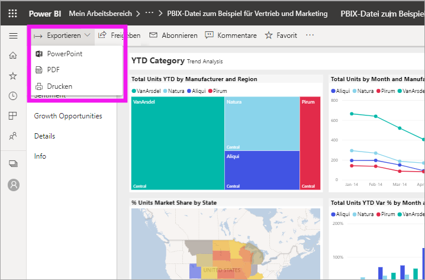
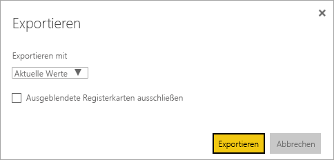
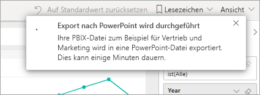

# Exportieren von Berichten aus Power BI nach PowerPoint
Mit Power BI können Sie Berichte in Microsoft PowerPoint veröffentlichen und darauf basierend einfach eine Foliengruppe erstellen. Beim Export nach PowerPoint geschieht Folgendes:

* Jede Seite im Power BI-Bericht entspricht einer einzelnen Folie in PowerPoint.
* Jede Seite im Power BI-Bericht wird beim Export in ein einzelnes hochauflösendes Bild in PowerPoint umgewandelt.
* Die Filter- und Slicereinstellungen, die Sie dem Bericht hinzugefügt haben, werden beibehalten.
* In PowerPoint wird ein Link zum Power BI-Bericht erstellt.

**Power BI-Berichte** lassen sich ganz schnell nach **PowerPoint** exportieren. Befolgen Sie dazu die Schritte im nächsten Abschnitt.

## Exportieren eines Power BI-Berichts nach PowerPoint
Wählen Sie im Power BI-Dienst einen Bericht aus, der im Zeichenbereich angezeigt werden soll. Sie können auch einen Bericht von der **Startseite**, aus **Apps** oder einem anderen Container im linken Navigationsbereich auswählen.

Sobald der Bericht, den Sie nach PowerPoint exportieren möchten, im Zeichenbereich angezeigt wird, wählen Sie in der Menüleiste **Exportieren** > **PowerPoint** aus.

Es wird ein Popupfenster angezeigt, in dem Sie die Option zur Auswahl von **Aktuelle Werte** oder **Standardwerte** haben. **Aktuelle Werte** exportiert den Bericht im aktuellen Zustand. Dazu gehören die aktiven Änderungen, die Sie an Datenschnitt- und Filterwerten vorgenommen haben. Die meisten Benutzer wählen diese Option aus. Alternativ können Sie **Standardwerte** auswählen, wodurch der Bericht im ursprünglichen Zustand exportiert wird (wie er vom *Autor* freigegeben wurde). Änderungen, die Sie am ursprünglichen Zustand vorgenommen haben, werden nicht dargestellt.

 
Darüber hinaus können Sie über das Kontrollkästchen auswählen, ob die ausgeblendeten Registerkarten eines Berichts exportiert werden sollen. Aktivieren Sie einfach das Kontrollkästchen, wenn Sie nur die Registerkarten des Berichts exportieren möchten, die Ihnen im Browser angezeigt werden. Wenn Sie alle ausgeblendeten Registerkarten im Exportvorgang enthalten möchten, lassen Sie das Kontrollkästchen deaktiviert. Wenn das Kontrollkästchen ausgegraut ist, enthält der Bericht keine ausgeblendeten Registerkarten. Sobald Sie Ihre Auswahl vorgenommen haben, wählen Sie **Exportieren** aus, um fortzufahren.

Rechts oben im Browserfenster des Power BI-Diensts wird ein Benachrichtigungsbanner mit der Information angezeigt, dass ein Export nach PowerPoint ausgeführt wird. Der Exportvorgang kann einige Minuten dauern. Während der Bericht exportiert wird, können Sie in Power BI weiterarbeiten.

Nachdem der Power BI-Dienst den Export abgeschlossen hat, werden Sie darüber über das Banner informiert. Ihre Datei ist dann dort verfügbar, wo Ihr Browser heruntergeladene Dateien speichert. In der folgenden Abbildung wird die Datei als Downloadbanner unten im Browserfenster angezeigt.

Das war schon alles. Sie können die Datei herunterladen, in PowerPoint öffnen und wie jeden anderen PowerPoint-Stapel bearbeiten oder erweitern.

## Features der exportierten PowerPoint-Datei
Wenn Sie die aus Power BI exportierte PowerPoint-Datei öffnen, werden Sie einige nützliche Elemente entdecken. Sehen Sie sich die folgende Abbildung an, und betrachten Sie die nummerierten Elemente, in denen einige dieser Features beschrieben werden.

1. Die erste Seite der Foliengruppe enthält den Namen des Berichts sowie einen Link, über den Sie den Bericht, auf dem die Foliengruppe basiert, **in Power BI anzeigen** können.
2. Zudem erhalten Sie nützliche Informationen zum Bericht. **Letzte Datenaktualisierung** zeigt das Datum und die Uhrzeit an, auf denen der exportierte Bericht basiert. **Heruntergeladen am** zeigt das Datum und die Uhrzeit des Exports des Power BI-Berichts in eine PowerPoint-Datei.
3. Jeder Berichtsseite entspricht eine eigene Folie (siehe linken Navigationsbereich). 
4. Ihr veröffentlichter Bericht wird in der Sprache gerendert, die in Ihren Power BI-Einstellungen oder in den Gebietsschemaeinstellungen Ihres Browsers angegeben ist. Sie können die Spracheinstellung anzeigen oder festlegen, indem Sie das Zahnradsymbol  > **Einstellungen** > **Allgemein** > **Sprache** auswählen. Weitere Informationen zu Gebietsschemas finden Sie unter [Unterstützte Sprachen und Länder oder Regionen für Power BI](../supported-languages-countries-regions.md).
5. Die PowerPoint-Präsentation enthält eine Deckfolie mit der exportierten Zeit in der richtigen Zeitzone.

Wenn Sie eine einzelne Folie näher betrachten, sehen Sie, dass jede Berichtsseite als separates Bild enthalten ist.

>[!NOTE]
> Es ist neu, dass für jede Berichtsseite ein Visual vorhanden ist. Das vorherige Verhalten, mit dem für jedes Visual ein eigenständiges Bild bereitgestellt wurde, wird nicht mehr implementiert. 
 

Wie Sie mit dem PowerPoint-Stapel und den hochauflösenden Bildern weiter verfahren möchten, liegt ganz bei Ihnen.

## Einschränkungen
Bei der Arbeit mit der Funktion **Nach PowerPoint exportieren** sind einige Aspekte und Einschränkungen zu beachten.

* R-Visuals werden derzeit nicht unterstützt. Diese Visuals werden als leeres Bild in PowerPoint mit der Fehlermeldung exportiert, dass das Visual nicht unterstützt wird.
* Benutzerdefinierte Visuals, die zertifiziert wurden, werden unterstützt. Weitere Informationen zu zertifizierten benutzerdefinierten Visuals sowie zum Zertifizieren von benutzerdefinierten Visuals finden Sie unter [Wie wird ein benutzerdefiniertes Visual zertifiziert?](../power-bi-custom-visuals-certified.md). Benutzerdefinierte Visuals, die nicht zertifiziert wurden, werden nicht unterstützt. Sie werden als leeres Bild in PowerPoint mit der Fehlermeldung exportiert, dass das Visual nicht unterstützt wird.
* Berichte mit mehr als 30 Berichtsseiten können derzeit nicht exportiert werden.
* Der Exportvorgang des Berichts nach PowerPoint kann einige Minuten dauern. Zu den Faktoren, die die benötigte Zeit beeinflussen, zählen die Struktur des Berichts sowie die jeweils aktuelle Auslastung des Power BI-Diensts.
* Wenn das Menüelement **Nach PowerPoint exportieren** im Power BI-Dienst nicht verfügbar ist, hat der Administrator Ihres Mandanten diese Funktion wahrscheinlich deaktiviert. Wenden Sie sich an den Mandantenadministrator, um Einzelheiten zu erfahren.
* Hintergrundbilder werden an der Begrenzung des Diagramms abgeschnitten. Es wird empfohlen, Hintergrundbilder vor dem Export als PowerPoint-Datei zu entfernen.
* Seiten werden in PowerPoint immer mit dem Standardseitenverhältnis von 9:16 erstellt, unabhängig von den ursprünglichen Seitengrößen oder -abmessungen im Power BI-Bericht.
* Berichte, die ein Benutzer außerhalb Ihrer Power BI-Mandantendomäne besitzt, beispielsweise ein Bericht im Besitz einer Person außerhalb Ihrer Organisation, die ihn für Sie freigegeben hat, können nicht in PowerPoint veröffentlicht werden.
* Wenn Sie ein Dashboard für Personen außerhalb Ihrer Organisation freigeben (und damit für einen Benutzer, der nicht Ihrem Power BI-Mandanten angehört), kann der betreffende Benutzer die zugehörigen Berichte des freigegebenen Dashboards nicht als PowerPoint-Datei exportieren. Wenn Sie beispielsweise aaron@contoso.com sind, können Sie Berichte für david@cohowinery.com freigeben. david@cohowinery.com kann jedoch die zugehörigen Berichte nicht nach PowerPoint exportieren.
* Bei älteren PowerPoint-Versionen funktioniert der Export möglicherweise nicht.
* Wie bereits erwähnt, wird jede Berichtsseite als ein einzelnes Bild in der PowerPoint-Datei exportiert.
* Der Power BI-Dienst verwendet Ihre Power BI-Spracheinstellung, um die Sprache für den PowerPoint-Export festzulegen. Sie können die Spracheinstellung anzeigen oder festlegen, indem Sie das Zahnradsymbol  > **Einstellungen** > **Allgemein** > **Sprache** auswählen.
* Das Datum und die Uhrzeit unter **Heruntergeladen am** auf der Deckfolie für die exportierte PowerPoint-Datei ist auf den Zeitpunkt des Exports entsprechend der Zeitzone des Computers festgelegt.
* URL-Filter werden zurzeit nicht beachtet, wenn Sie **Aktuelle Werte** für Ihren Export auswählen.

## Nächste Schritte
[Drucken eines Berichts](end-user-print.md)
