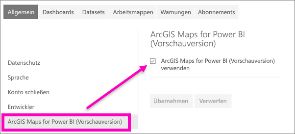

# Aktivieren von Vorschaufeatures im Power BI-Dienst
## Was sind *Vorschaufeatures*?
Der Power BI-Dienst wird ständig verbessert. Neue Features werden immer wieder als *Vorschaufeatures* veröffentlicht. Wenn Sie sie testen möchten, können Sie Vorschaufeatures aktivieren (und deaktivieren).

Einige Previewfunktionen lassen sich im Power BI-Dashboard, in Power BI Home oder im Bericht selbst ein- und ausschalten.

   

Andere Previewfunktionen hingegen werden über das Menü *Einstellungen* verfügbar gemacht. In diesem Artikel erfahren Sie, wie Sie über das Menü „Einstellungen“ auf Previewfunktionen zugreifen.

## Suchen und Aktivieren (und Deaktivieren) von Vorschauversionen
1. Öffnen Sie das Menü „Einstellungen“, indem Sie auf das Zahnradsymbol in der oberen rechten Ecke des Power BI-Bildschirms klicken und dann auf **Einstellungen**.
   
   .
2. Wählen Sie die Registerkarte **Allgemein** aus. Wenn eine Vorschau vorhanden ist, wird eine Option für **Vorschaufeatures** oder ein Vorschaufeature auf der linken Seite angezeigt.  In diesem Beispiel wird eine Vorschau für ArcGIS Maps aufgeführt. 
   
   
3. Im Optionsfeld können Sie die neue Oberfläche mit **Ein** bzw. über das Kontrollkästchen aktivieren. Klicken Sie dann auf **Übernehmen**.
4. Wenn Sie die Vorschaufeatures deaktivieren möchten, führen Sie die ersten drei oben beschriebenen Schritte aus. Wählen Sie dabei im dritten Schritt **Aus** aus bzw. deaktivieren Sie das Kontrollkästchen, und klicken Sie dann auf **Übernehmen**.

Haben Sie Fragen oder Feedback? [Besuchen Sie das Power BI-Communityforum](https://community.powerbi.com/t5/Navigation-Preview-Forum/bd-p/NavigationPreview).

