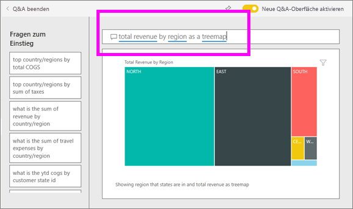
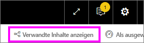
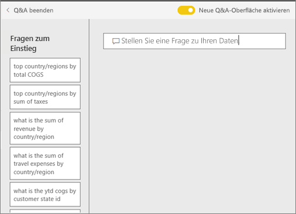

# Q&A für Power BI-**Verbraucher**
## Was ist Q&A?
Manchmal ist die schnellste Möglichkeit, um eine Antwort auf Basis Ihrer Daten zu erhalten, eine Frage in natürlicher Sprache zu stellen. Beispiel: „Wie lautet der Gesamtumsatz für das letzte Jahr“.

Verwenden Sie den Bereich für Fragen und Antworten (F&A), um Ihre Daten mithilfe intuitiver Möglichkeiten der natürlichen Sprache zu untersuchen und die entsprechenden Antworten in Form von Diagrammen und Grafiken zu erhalten. Der Bereich für Fragen und Antworten unterscheidet sich von einer Suchmaschine. Dieser Bereich stellt ausschließlich Ergebnisse zu den Daten in Power BI bereit.

**Power BI Q&A** ist in Pro- und Premium-Lizenzen enthalten.  [Q&A in den Power BI Mobile-Apps](mobile/mobile-apps-ios-qna.md) sowie [Q&A mit Power BI Embedded](../developer/qanda.md) werden in eigenen Artikeln behandelt. Derzeit unterstützt **Power BI Q&A** nur die Beantwortung natürlichsprachlicher Anfragen in Englisch, obwohl es eine Vorschau für Spanisch gibt, die von Ihrem Power BI-Administrator aktiviert werden kann.

Fragen stellen ist erst der Anfang.  Viel Spaß bei Ihrer Reise, bei der Sie Daten optimieren oder eine Frage erweitern, vertrauenwürdige neue Informationen entdecken, sich die Details genauer ansehen und für eine breitere Übersicht den Fokus herausnehmen. Sie werden begeistert sein, welche Einblicke Sie gewinnen und welche Entdeckungen Sie machen werden.

Die Erfahrung ist wahrhaft interaktiv... und schnell! Unterstützt durch einen In-Memory-Speicher wird die Antwort nahezu unmittelbar zurückgegeben.

## Wo finde ich die Q&A-Funktion?
Die Q&A-Funktion ist im Power BI-Dienst in Dashboards enthalten, und in Power BI Mobile finden Sie sie ganz unten im Dashboard. Sie können mit Q&A Daten untersuchen, jedoch keine mit Q&A erstellten Visualisierungen speichern, es sei denn, der Designer hat Ihnen Bearbeitungsberechtigungen erteilt.

## Verwenden von Q&A in einem Dashboard im Power BI-Dienst
Im Power BI-Dienst (app.powerbi.com) enthält ein Dashboard angeheftete Kacheln aus einem oder mehrere Datasets, sodass Sie Fragen zu allen Daten in einem dieser Datasets stellen können. Um festzustellen, welche Berichte und Datasets zum Erstellen des Dashboards verwendet wurden, wählen Sie auf der Menüleiste **Verwandte Inhalte anzeigen** aus.

## Wie beginne ich?
Machen Sie sich zunächst mit dem Inhalt vertraut. Sehen Sie sich die Visuals auf dem Dashboard und im Bericht an. Verschaffen Sie sich ein Gefühl für den Typ und Bereich der Daten, die Ihnen zur Verfügung stehen. 

Beispiel:

* Wenn die Achsenbeschriftungen und -werte eines Visuals Begriffe wie „Umsätze“, „Konto“, „Monat“ und „Chancen“ enthalten, können Sie ganz einfach Fragen stellen wie z.B.: „Welches *Konto* hat die besten *Chancen*, oder *Umsätze* nach Monat als Balkendiagramm anzeigen“.

* Wenn Sie über Website-Leistungsdaten in Google Analytics verfügen, können Sie mit Q&A in Erfahrung bringen, wie viel Zeit auf einer Website verbracht wird, wie häufig einzelne Seiten aufgerufen werden und wie die Benutzerbindung aussieht. Wenn Sie demografische Daten benötigen, können Sie auch Alter und Haushaltseinkommen nach Ort erfragen.

Sobald Sie mit den Daten vertraut sind, navigieren Sie zurück zum Dashboard, und platzieren Sie Ihren Mauszeiger auf dem Fragefeld. Die Q&A-Anzeige wird geöffnet.

 

Noch bevor Sie mit der Eingabe beginnen, zeigt Q&A einen neuen Bildschirm mit Vorschlägen für die Formulierung Ihrer Frage an. Ausdrücke und Fragen, die die Namen der Tabellen in den zugrunde liegenden Datasets enthalten, werden angezeigt, und möglicherweise werden sogar *ausgewählte** Fragen aufgeführt, die der Besitzer des Datasets erstellt hat.

Sie können jede dieser Fragen auswählen, um sie dem Fragefeld hinzuzufügen und dann zu verfeinern, um eine bestimmte Antwort zu finden. 

Eine weitere Art, in der Q&A Sie beim Stellen von Fragen unterstützt, sind Eingabeaufforderungen, automatische Vervollständigung und visuelle Hinweise. 

 

### Welche Visualisierung verwendet Q&A?
Q&A wählt die beste Visualisierung basierend auf den angezeigten Daten aus. Manchmal werden Daten in den zugrunde liegenden Datasets als bestimmter Typ oder bestimmte Kategorie definiert. Dadurch weiß Q&A, wie sie angezeigt werden sollen. Wenn Daten z. B. als Datentyp definiert sind, müssen sie wahrscheinlich als Liniendiagramm angezeigt werden. Daten, die als eine Stadt kategorisiert werden, müssen wahrscheinlich als Karte angezeigt werden.

Sie können Q&A auch mitteilen, welches Visual verwendet werden soll, indem Sie Ihrer Frage diese Information hinzufügen. Bedenken Sie jedoch, dass Q&A Daten nicht immer im angeforderten Visualtyp anzeigen kann. Q&A fordert Sie mit einer Liste umsetzbarer Visualtypen zur Eingabe auf.

## Zu beachtende Aspekte und Problembehandlung
**Frage**: Ich finde Q&A auf diesem Dashboard nicht.    
**Antwort 1**: Wenn Sie kein Fragefeld finden können, überprüfen Sie zunächst Ihre Einstellungen. Klicken Sie hierzu auf das Zahnradsymbol in der oberen rechten Ecke der Power BI-Symbolleiste.   

Klicken Sie dann auf **Einstellungen** > **Dashboards**. Stellen Sie sicher, dass die Option **Show the Q&A search box on this dashboard** (Q&A-Suchfeld auf diesem Dashboard anzeigen) aktiviert ist.    
  

**Antwort 2**: In einigen Fällen hat der *Designer* des Dashboards oder Ihr Administrator die Q&A-Funktion deaktiviert. Wenden Sie sich an die zuständige Person, um festzustellen, ob sie wieder aktiviert werden kann.   

**Frage**: Ich erhalte nicht die Ergebnisse, die ich sehen möchte, wenn ich eine Frage eingebe.    
**Antwort**: Wenden Sie sich an den *Designer* des Dashboards. Es gibt viele Dinge, die der Designer tun kann, um die Q&A-Ergebnisse zu verbessern. Beispielsweise kann der Designer Spalten im Dataset umbenennen, um Begriffe zu verwenden, die einfacher zu verstehen sind (z.B. `CustomerFirstName` anstelle von `CustFN`). Da der Designer das Dataset sehr gut kennt, kann er sich hilfreiche Fragen ausdenken und dem Q&A-Canvas hinzufügen.

## Nächste Schritte
[Q&A-Tipps für Power BI-Verbraucher](end-user-q-and-a.md)
