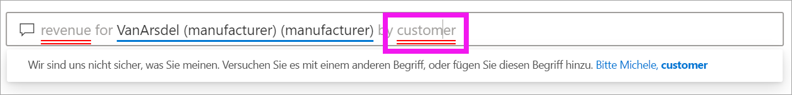

# Q&A für Power BI-**Verbraucher**

[!INCLUDE [power-bi-service-new-look-include](../includes/power-bi-service-new-look-include.md)]

## Was ist Q&A?
Manchmal ist die schnellste Möglichkeit, um eine Antwort auf Basis Ihrer Daten zu erhalten, eine Frage in natürlicher Sprache zu stellen. Beispiel: „Wie lautet der Gesamtumsatz für das letzte Jahr“.

Verwenden Sie den Bereich für Fragen und Antworten (F&A), um Ihre Daten mithilfe intuitiver Möglichkeiten der natürlichen Sprache zu untersuchen und die entsprechenden Antworten in Form von Diagrammen und Grafiken zu erhalten. Der Bereich für Fragen und Antworten unterscheidet sich von einer Suchmaschine. Dieser Bereich stellt ausschließlich Ergebnisse zu den Daten in Power BI bereit.

## Welche Visualisierung verwendet Q&A?
Q&A wählt die beste Visualisierung basierend auf den angezeigten Daten aus. Gelegentlich werden Daten in den zugrunde liegenden Datasets als bestimmter Typ oder bestimmte Kategorie definiert. Dadurch weiß Q&A, wie sie angezeigt werden sollen. Wenn Daten z. B. als Datentyp definiert sind, müssen sie wahrscheinlich als Liniendiagramm angezeigt werden. Daten, die als eine Stadt kategorisiert werden, müssen wahrscheinlich als Karte angezeigt werden.

Sie können Q&A auch mitteilen, welches Visual verwendet werden soll, indem Sie Ihrer Frage diese Information hinzufügen. Bedenken Sie jedoch, dass Q&A Daten nicht immer im angeforderten Visualtyp anzeigen kann. Q&A fordert Sie mit einer Liste umsetzbarer Visualtypen zur Eingabe auf.

## Wo finde ich die Q&A-Funktion?
Die Q&A-Funktion ist im Power BI-Dienst in Dashboards enthalten, und in Power BI Mobile finden Sie sie ganz unten im Dashboard. Sie können mit Q&A Daten untersuchen, jedoch keine mit Q&A erstellten Visualisierungen speichern, es sei denn, der Designer hat Ihnen Bearbeitungsberechtigungen erteilt.

Sie finden Q&A auch in Berichten, wenn der *Berichtdesigner* ein [Q&A-Visual](../visuals/power-bi-visualization-q-and-a.md) hinzugefügt hat.   

## Q&A für Dashboards

**Power BI Q&A** ist in Pro- und Premium-Lizenzen enthalten.  [Q&A in den Power BI Mobile-Apps](mobile/mobile-apps-ios-qna.md) sowie [Q&A mit Power BI Embedded](../developer/qanda.md) werden in eigenen Artikeln behandelt. Derzeit unterstützt **Power BI Q&A** nur die Beantwortung natürlichsprachlicher Anfragen in Englisch, obwohl es eine Vorschau für Spanisch gibt, die von Ihrem Power BI-Administrator aktiviert werden kann.

Fragen stellen ist erst der Anfang.  Viel Spaß bei Ihrer Reise, bei der Sie Daten optimieren oder eine Frage erweitern, vertrauenwürdige neue Informationen entdecken, sich die Details genauer ansehen und für eine breitere Übersicht den Fokus herausnehmen. Sie werden begeistert sein, welche Einblicke Sie gewinnen und welche Entdeckungen Sie machen werden.

Die Erfahrung ist wahrhaft interaktiv... und schnell! Unterstützt durch einen In-Memory-Speicher wird die Antwort nahezu unmittelbar zurückgegeben.

## Verwenden von Q&A in einem Dashboard im Power BI-Dienst
Im Power BI-Dienst (app.powerbi.com) enthält ein Dashboard angeheftete Kacheln aus einem oder mehrere Datasets, sodass Sie Fragen zu allen Daten in einem dieser Datasets stellen können. Um festzustellen, welche Berichte und Datasets zum Erstellen des Dashboards verwendet wurden, wählen Sie in der Dropdownliste **Weitere Aktionen** die Option **Verwandte Inhalte anzeigen** aus.

## Wie beginne ich?
Machen Sie sich zunächst mit dem Inhalt vertraut. Sehen Sie sich die Visuals auf dem Dashboard und im Bericht an. Verschaffen Sie sich ein Gefühl für den Typ und Bereich der Daten, die Ihnen zur Verfügung stehen. 

Beispiel:

* Wenn die Achsenbeschriftungen und -werte eines Visuals Begriffe wie „Umsätze“, „Konto“, „Monat“ und „Chancen“ enthalten, können Sie ganz einfach Fragen stellen wie z.B.: „Welches *Konto* hat die besten *Chancen*, oder *Umsätze* nach Monat als Balkendiagramm anzeigen“.

* Wenn Sie über Website-Leistungsdaten in Google Analytics verfügen, können Sie mit Q&A in Erfahrung bringen, wie viel Zeit auf einer Website verbracht wird, wie häufig einzelne Seiten aufgerufen werden und wie die Benutzerbindung aussieht. Wenn Sie demografische Daten benötigen, können Sie auch Alter und Haushaltseinkommen nach Ort erfragen.

Sobald Sie mit den Daten vertraut sind, navigieren Sie zurück zum Dashboard, und platzieren Sie Ihren Mauszeiger auf dem Fragefeld. Die Q&A-Anzeige wird geöffnet.

 

Noch bevor Sie mit der Eingabe beginnen, zeigt Q&A einen neuen Bildschirm mit Vorschlägen für die Formulierung Ihrer Frage an. Es werden Ausdrücke und Fragen angezeigt, die die Namen von Tabellen in den zugrunde liegenden Datasets enthalten, und möglicherweise werden sogar *ausgewählte* Fragen aufgeführt, die der Besitzer des Datasets erstellt hat.

Sie können jede dieser Fragen auswählen, um sie dem Fragefeld hinzuzufügen und dann zu verfeinern, um eine bestimmte Antwort zu finden. 

Darüber hinaus unterstützt Q&A Sie beim Stellen von Fragen durch Eingabeaufforderungen, AutoVervollständigen und visuelle Hinweise. 

<!--  -->

## Das Q&A-Visual

Über das Q&A-Visual können Sie in natürlicher Sprache Fragen stellen und erhalten Antworten in Form eines visuellen Elements. Das Q&A-Visual unterstützt wie jedes andere visuelle Element Kreuzfilterung, Kreuzhervorhebung, Lesezeichen und Kommentare. 

Sie erkennen ein Q&A-Visual anhand des Fragefelds im oberen Bereich. Hier geben Sie Fragen in natürlicher Sprache ein. Das Q&A-Visual kann beliebig oft verwendet werden, um Fragen zu Ihren Daten zu stellen. Wenn Sie den Bericht verlassen, wird das Q&A-Visual auf die zugehörigen Standardeinstellungen zurückgesetzt. 

## Verwenden des Q&A-Visuals
Um das Q&A-Visual zu verwenden, wählen Sie entweder eine der vorgeschlagenen Fragen aus oder geben eine eigene Frage in natürlicher Sprache ein. 

### Erstellen eines Q&A-Visuals durch Verwendung einer vorgeschlagenen Frage

Hier wurde **top geo states by total units** (Wichtigste Staaten nach Gesamteinheiten) ausgewählt. Power BI wählt den am besten geeigneten Visualtyp aus. In diesem Fall ist dies eine Karte.

Sie können Power BI aber auch mitteilen, welches Visual verwendet werden soll, indem Sie Ihrer Frage in natürlicher Sprache diese Information hinzufügen. Bedenken Sie jedoch, dass nicht jeder Visualtyp auch zu Ihren Daten passen muss. Mit diesen Daten könnten Sie beispielsweise kein sinnvolles Punktdiagramm erstellen. Ein Flächenkartogramm ist jedoch gut geeignet.

### Erstellen eines Q&A-Visuals durch Eingabe einer Abfrage in natürlicher Sprache

Wenn Sie sich nicht sicher sind, welcher Fragetyp oder welche Terminologie verwendet werden sollte, erweitern Sie die Option **Alle Vorschläge anzeigen**. Alternativ können Sie sich auch die weiteren Visuals im Bericht ansehen. Auf diese Weise können Sie sich mit den Begriffen und Inhalten des Datasets vertraut machen.

1. Geben Sie Ihre Frage in natürlicher Sprache in das Q&A-Feld ein. Während Sie Ihre Frage eingeben, stellt Power BI automatische Vervollständigungen, Vorschläge und Feedback bereit.

    - Eine rote Unterstreichung wird für Wörter verwendet, die von Power BI nicht erkannt werden. Sofern möglich, unterstützt Power BI Sie beim Definieren dieser Wörter. Wenn die korrekte Definition angezeigt wird, wählen Sie sie aus der Dropdownliste aus.  

        

    - Wenn keine der Definitionen zutrifft, versuchen Sie es mit einem anderen Begriff. Alternativ können Sie das rot unterstrichene Wort auswählen und den Besitzer des Berichts bitten, das Wort hinzuzufügen.

        

    - Wenn Sie mit der Eingabe der Frage fortfahren, erhalten Sie eine Rückmeldung von Power BI, falls die Frage nicht verstanden wird, und es werden weitere Vorschläge angezeigt. Im nachstehenden Beispiel schlägt Power BI unter „Meinten Sie...“ eine andere Möglichkeit der Formulierung vor, die die Terminologie des Datasets aufgreift. 

        

2. Nachdem Sie einen Korrekturvorschlag von Power BI ausgewählt haben, werden Ihre Ergebnisse als Liniendiagramm angezeigt. 

    

3. Sie können das Liniendiagramm aber auch in einen anderen Visualtyp ändern.  

    

## Zu beachtende Aspekte und Problembehandlung

**Frage**: Ich finde Q&A auf diesem Dashboard nicht.    
**Antwort 1**: Wenn Sie kein Fragefeld finden können, überprüfen Sie zunächst Ihre Einstellungen. Klicken Sie hierzu auf das Zahnradsymbol in der oberen rechten Ecke der Power BI-Symbolleiste.   

Klicken Sie dann auf **Einstellungen** > **Dashboards**. Stellen Sie sicher, dass die Option **Show the Q&A search box on this dashboard** (Q&A-Suchfeld auf diesem Dashboard anzeigen) aktiviert ist.    
  

**Antwort 2**: Es kann vorkommen, dass Sie keinen Zugriff auf die Einstellungen haben. Wenn Q&A durch den *Designer* des Dashboards oder Ihren Administrator deaktiviert wurde, können Sie sich erkundigen, ob eine erneute Aktivierung möglich ist.   

**Frage**: Ich erhalte nicht die Ergebnisse, die ich sehen möchte, wenn ich eine Frage eingebe.    
**Antwort**: Wählen Sie die Option zur Kontaktaufnahme mit dem Besitzer des Berichts oder des Dashboards aus. Die Kontaktaufnahme ist direkt über die Q&A-Dashboardseite oder das Q&A-Visual möglich. Alternativ können Sie den Besitzer über die Power BI-Kopfzeile ermitteln.  Es gibt viele Dinge, die der Designer tun kann, um die Q&A-Ergebnisse zu verbessern. Beispielsweise kann der Designer Spalten im Dataset umbenennen, um Begriffe zu verwenden, die einfacher zu verstehen sind (z.B. `CustomerFirstName` anstelle von `CustFN`). Da der Designer das Dataset sehr gut kennt, kann er hilfreiche Fragen formulieren und den von Q&A vorgeschlagenen Fragen hinzufügen.

## Nächste Schritte
Informationen zum Erstellen eines Q&A-Visuals und dessen Verwaltung durch einen *Berichtdesigner* finden Sie unter [Q&A-Visualtyp](../visuals/power-bi-visualization-q-and-a.md).
