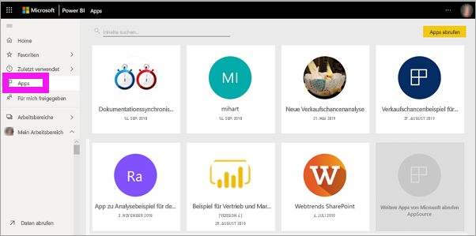
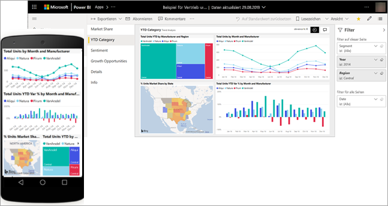
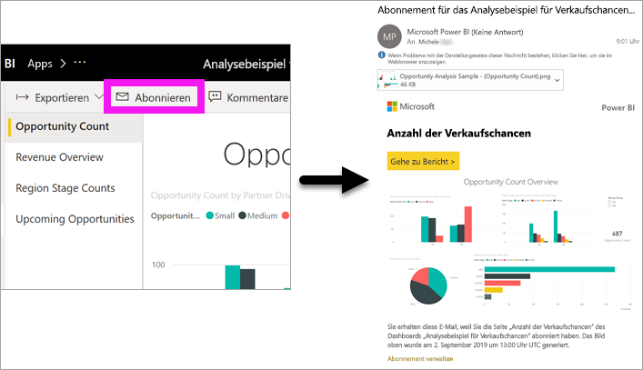
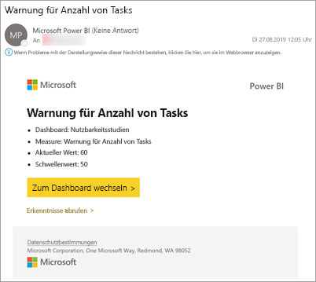
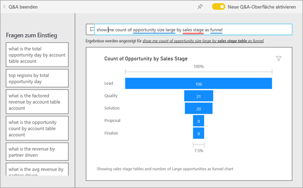
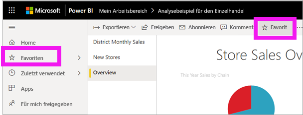
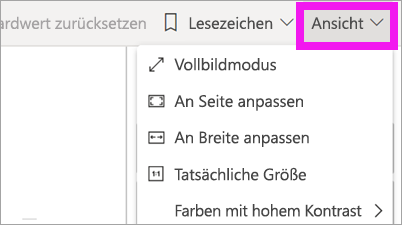
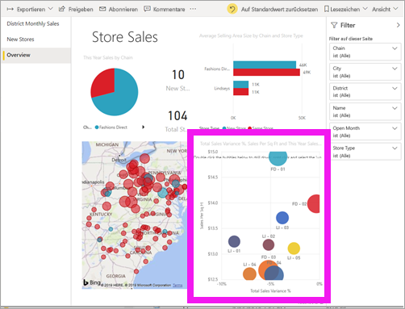
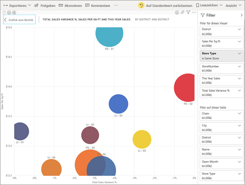
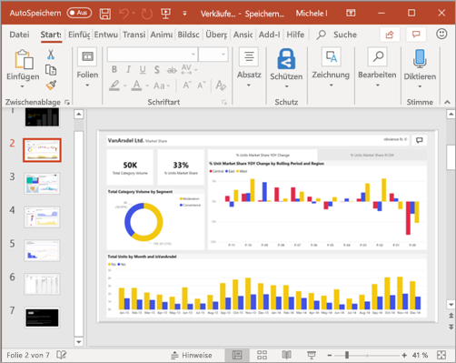

# Schnellstart: Informationen zu Funktionen für *Benutzer* in Power BI
In dieser Schnellstartanleitung erfahren Sie, wie Sie mit Power BI interagieren können, um nach datengesteuerten Geschäftsinformationen zu suchen. Dieser Artikel bietet keinen detaillierten Einblick, sondern vielmehr einen groben Überblick über eine Vielzahl der verfügbaren Aktionen für **Benutzer** in Power BI.

Wenn Sie noch nicht bei Power BI registriert sind, müssen Sie sich zuerst für eine [kostenlose Testversion registrieren](https://app.powerbi.com/signupredirect?pbi_source=web).

## Was ist Power BI? 
Power BI ist eine Sammlung von Softwarediensten, Apps und Connectors, die zusammenarbeiten, um Ihre nicht verbundenen Datenquellen in kohärente, visuell überzeugende und interaktive Erkenntnisse umzuwandeln. Unabhängig davon, ob es sich bei Ihren Daten um ein einfaches Excel-Spreadsheet oder eine Sammlung von Daten aus verschiedenen Datenquellen handelt, können Sie mit Power BI mühelos eine Verbindung mit Ihren Datenquellen herstellen, die wichtigen Daten visualisieren (oder ermitteln) und die Ergebnisse für beliebige Personen freigeben. 

## Leseansicht
Die Leseansicht steht im Power BI-Dienst für *Berichtsbenutzer* zur Verfügung. Wenn ein Kollege einen Bericht, ein Dashboard oder eine App für Sie freigibt, können Sie diesen in der Leseansicht untersuchen und mit ihm interagieren. 

Öffnen Sie einfach den Power BI-Dienst in einem Browser oder auf einem mobilen Gerät. Sie und Ihre Kollegen arbeiten mit denselben vertrauenswürdigen Apps, Dashboards und Berichten, die automatisch aktualisiert werden. Sie arbeiten also stets mit den neuesten Inhalten.   

Da der Inhalt nicht statisch ist, können Sie sich eingehend damit befassen und nach Trends, Erkenntnissen und weiterer Business Intelligence Ausschau halten. Kombinieren und unterteilen Sie den Inhalt, und stellen Sie sogar Fragen mit ihren eigenen Wörtern. Oder lehnen Sie sich zurück, und lassen Sie Ihre Daten für Sie zu interessanten Erkenntnissen gelangen. Sie erhalten Meldungen, wenn sich Daten ändern, sowie Berichte nach einem von Ihnen festgelegten Zeitplan. All Ihre Daten sind jederzeit und von jedem Gerät aus in der Cloud oder lokal verfügbar. 

Lesen Sie weiter, um darüber und über vieles weitere mehr zu erfahren.

## Power BI-Inhalt
Der Begriff „Inhalt“ bezieht sich im Rahmen von Power BI auf Berichte, Dashboards und Apps. Dies sind die Bausteine, die Sie zum Untersuchen Ihrer Daten und zum Treffen von Geschäftsentscheidungen verwenden. 

> [!NOTE]
> Dashboards, Berichte und Apps können auch über mobile Geräte angezeigt und freigegeben werden.

###  Apps

Eine *App* ist ein Power BI-Inhaltstyp, bei dem zusammengehörige Dashboards und Berichte an einem Ort zusammengefasst werden. Eine App bündelt ein oder mehrere Dashboards sowie einen oder mehrere Berichte. Apps werden von *Power BI-Designern* erstellt und mit *Endbenutzern* wie Ihnen geteilt. 

Eine Möglichkeit zum Anzeigen Ihrer Apps besteht darin, in der Navigationsleiste auf **Apps** zu klicken und eine App auszuwählen, die Sie öffnen möchten.

Weitere Informationen zum Anzeigen von Apps finden Sie unter [Power BI-Apps](end-user-apps.md).

### Berichte

Ein Power BI-Bericht stellt eine Ansicht eines Datasets aus verschiedenen Perspektiven dar, wobei die aus dem Dataset gewonnenen verschiedenen Ergebnisse und Erkenntnisse als Visuals angezeigt werden. Ein Bericht kann ein einzelnes Visual, aber auch mehrere mit Visuals gefüllte Seiten enthalten. Berichte werden von *Power BI-Designern* erstellt und mit *Endbenutzern* wie Ihnen geteilt.

Informationen zum Anzeigen von Berichten finden Sie unter [Power BI-Berichte](end-user-reports.md).

### Dashboards

Ein Power BI-Dashboard ist eine einzelne Seite (häufig als Zeichenbereich bezeichnet), auf der mithilfe von Visualisierungen eine Geschichte erzählt wird. Wegen der Beschränkung auf eine Seite erkennen Sie ein gut gestaltetes Dashboard daran, dass die Geschichte auf ihre Kernaussagen verdichtet ist.

Die Visualisierungen auf dem Dashboard werden als Kacheln bezeichnet und werden von *Berichts-Designern* an das Dashboard angeheftet. In den meisten Fällen wird die Berichtsseite aufgerufen, auf der die Visualisierung erstellt wurde, wenn Sie eine Kachel auswählen. 

Informationen zum Anzeigen von Dashboards finden Sie unter [Power BI-Dashboards](end-user-dashboards.md).
 
## Interagieren im Power BI-Dienst

### Zusammenarbeit mit Kollegen
Überspringen Sie die E-Mail. Fügen Sie einen persönlichen Kommentar hinzu oder beginnen Sie eine Unterhaltung über ein Dashboard mit Kollegen direkt im Dashboard. Das Kommentarfeature ist nur eine der Möglichkeiten, die die Zusammenarbeit mit Kollegen ermöglichen. 

Weitere Informationen zum [Kommentieren](end-user-comment.md).

### Lehnen Sie sich zurück, und überlassen Sie Power BI die Arbeit
Der Power BI-Dienst nimmt Ihnen auf zwei Weisen Arbeit ab: mit Abonnements und Benachrichtigungen. 

#### Abonnieren eines Dashboards (oder Berichts)
Power BI muss nicht geöffnet werden, um ein Dashboard zu überwachen.  Sie können es stattdessen abonnieren, und Power BI wird Ihnen nach einem von Ihnen festgelegten Zeitplan eine Momentaufnahme dieses Dashboards per E-Mail zusenden. 

.

 Weitere Informationen zu [Power BI-Abonnements](end-user-subscribe.md).

#### Erhalten Sie Warnungen, wenn Ihre Daten einen Schwellenwert erreichen
Ihre Daten werden in Echtzeit verarbeitet, und Ihre Visuals stellen dies automatisch dar. Wenn Sie benachrichtigt werden möchten, wenn Daten über oder unter einen festgelegten Schwellenwert liegen, verwenden Sie Datenwarnungen. Warnungen können für Messgeräte, KPIs und Karten festgelegt werden.    

Power BI sendet Ihnen eine E-Mail, wenn der Wert einen festgelegten Schwellenwert unter- oder überschreitet.  

Weitere Informationen zu [Power BI-Warnungen](end-user-alerts.md).

### Verwenden von Q&A für Fragen in natürlicher Sprache
Manchmal ist die schnellste Möglichkeit, um eine Antwort auf Basis Ihrer Daten zu erhalten, eine Frage in natürlicher Sprache zu stellen. Das Q&A-Fragefeld befindet sich am oberen Rand Ihres Dashboards. Beispiel: „Zeige mir die Anzahl großer Verkaufschancen sortiert nach Vertriebsphase in einem Trichterdiagramm an.“ 

Weitere Informationen zu [Q&A in Power BI](end-user-q-and-a.md).

### Details für Visualisierung anzeigen
Visuals bestehen aus Datenpunkten. Sie können die Details anzeigen, indem Sie auf einen Datenpunkt zeigen.

### Hinzufügen von Dashboards als „Favoriten“
Wenn Sie Inhalte *als Favorit speichern*, können Sie über die Navigationsleiste auf diese zugreifen. Die Navigationsleiste wird in fast jedem Bereich in Power BI angezeigt. Favoriten sind üblicherweise die Dashboards, Berichtsseiten und Apps, die Sie am häufigsten besuchen.

Klicken Sie in der oberen rechten Ecke des Power BI-Diensts auf **als Favorit speichern**, oder klicken Sie, wenn die Schaltfläche nicht angezeigt wird, auf die Auslassungspunkte (...), und wählen Sie dann **als Favorit speichern** aus. 
   

Sehen Sie sich die anderen in der Dropdownliste verfügbaren Aktionen an.  In diesem Artikel werden nicht alle dieser Aktionen behandelt, jedoch werden sie in anderen Artikeln erläutert.  Über das Power BI-Inhaltsverzeichnis oder das **Suchfeld** erfahren Sie mehr. 

Weitere Informationen finden Sie unter [Favorisieren und Auswählen von Inhalten](end-user-favorite.md).

### Anpassen der Anzeigegröße
Berichte werden auf vielen verschiedenen Geräten mit unterschiedlichen Bildschirmgrößen und Seitenverhältnissen angezeigt.  Die Standardanzeige entspricht unter Umständen nicht dem, was Sie auf Ihrem Gerät anzeigen möchten.  

Klicken Sie in der oberen rechten Menüleiste auf **Ansicht**, und wählen Sie eine der Anzeigeoptionen aus, um dies anzupassen. 

### Finden Sie heraus, wie alle visuellen Elemente auf einer Seite miteinander verbunden sind.
Sie können für Visualisierungen auf einer Berichtseite Kreuzhervorhebungen und Kreuzfilter verwenden. Visualisierungen auf einer Berichtsseite sind alle miteinander „verknüpft“.  Wenn Sie also einen oder mehrere Werte in einer Visualisierung auswählen, werden andere Visualisierungen, die den gleichen Wert verwenden, auf Grundlage Ihrer Auswahl geändert.

> 

Weitere Informationen finden Sie unter [Interagieren mit Visuals](end-user-interactions.md).

<!-- ###  Open the **Selection** pane
Easily navigate between the visualizations on the report page. 

1. Select **View > Selection pane** to open the Selection pane. Toggle **Selection pane** to On.

    

2. The Selection pane opens on your report canvas. Select a visual from the list to make it active.

     -->

### Einzelne visuelle Elemente vergrößern
Zeigen Sie auf eine Visualisierung, und wählen Sie das Symbol für den **Fokusmodus** aus: . Wenn Sie eine Visualisierung im Fokusmodus anzeigen, wird diese erweitert, sodass sie den gesamten Berichtszeichenbereich ausfüllt, wie unten dargestellt.

<!-- To display that same visualization without the distraction of menubars, filter pane, and other chrome -- select the **Full Screen** icon from the top menubar    .

 -->

Weitere Informationen finden Sie unter [Fokusmodus und Vollbildmodus](end-user-focus.md).

### Visualisierung sortieren
Visuelle Elemente auf einer Berichtsseite können mit den von Ihnen vorgenommenen Änderungen sortiert und gespeichert werden. 

Zeigen Sie auf ein Visual, um es zu aktivieren, und klicken Sie dann auf die Auslassungspunkte (...), um die Sortieroptionen zu öffnen.

 

Weitere Informationen zum [Sortieren von Visuals](end-user-search-sort.md).

### Anzeigen der zum Erstellen einer Visualisierung verwendeten Daten
Eine Power BI-Visualisierung wird mithilfe von Daten aus zugrunde liegenden Datasets erstellt. Sie haben in Power BI die Möglichkeit, die Daten *anzuzeigen*, die der Visualisierung zugrunde liegen. Wenn Sie **Daten anzeigen** auswählen, werden die Daten in Power BI unter (oder neben) der Visualisierung angezeigt.

Klicken Sie mit einem aktiven Visual auf die Auslassungspunkte (...), und wählen Sie die Option **Daten anzeigen** aus.
   
   

### Exportieren von Daten in Excel
Zusätzlich zum Anzeigen der Daten, die zum Erstellen eines Visuals verwendet werden, können Sie die Daten auch exportieren und in Microsoft Excel anzeigen. Wenn Sie nach Excel exportieren, erstellen Sie ein separates Dokument. Dies ist ein Spreadsheet, das nicht Teil von Power BI ist. Jegliche Änderungen, die Sie an der Excel-Datei vornehmen, wirken sich nicht auf die Daten in Power BI aus. Unabhängig davon, ob Sie sich die Daten genauer ansehen möchten oder die Daten in einer anderen Anwendung bzw. zu einem anderen Zweck verwenden möchten, ermöglicht Power BI Ihnen diese Flexibilität.

<!-- Exporting isn’t limited to individual visuals; you can export entire reports to PowerPoint or PDF to share with your colleagues.

 -->

Das war ein kurzer Überblick über einige der Aktionen, die für *Benutzer* im Power BI-Dienst verfügbar sind.  

## Bereinigen von Ressourcen
- Wenn Sie mit einer App verbunden sind, wählen Sie in der linken Navigationsleiste **Apps** aus, um die Apps-Inhaltsliste zu öffnen. Zeigen Sie auf die zu löschende App, und klicken Sie auf das Papierkorbsymbol.

- Wenn Sie einen Power BI-Beispielbericht importiert oder sich mit ihm verbunden haben, klicken Sie in der linken Navigationsleiste auf **Mein Arbeitsbereich**. Suchen Sie unter den Registerkarten am oberen Rand das Dashboard, den Bericht und das Dataset, und klicken Sie für alle drei jeweils auf das Papierkorbsymbol.

## Nächste Schritte
[Power BI für Verbraucher](end-user-consumer.md)

