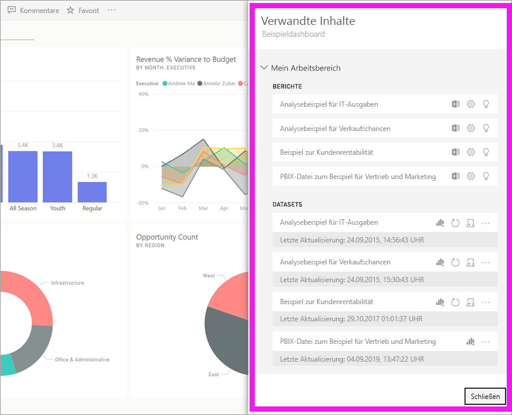
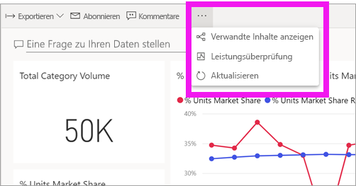
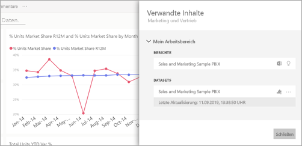
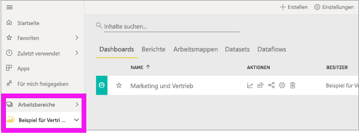
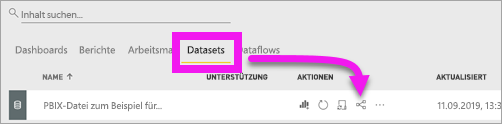
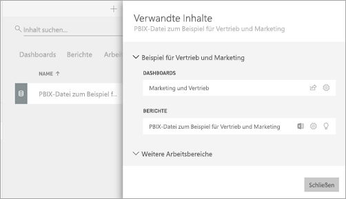

# Anzeigen verwandter Inhalte im Power BI-Dienst

[!INCLUDE [power-bi-service-new-look-include](../includes/power-bi-service-new-look-include.md)]

Im Bereich **verwandte Inhalte** sehen Sie, wie Ihre Inhalte im Power BI-Dienst (Dashboards, Berichte und Datasets) miteinander verbunden sind. Der Bereich **Verwandte Inhalte** dient auch als Startplattform für die Ausführung von Aktionen. Von hier können Sie beispielsweise ein Dashboard öffnen, einen Bericht öffnen, Erkenntnisse generieren, die Daten in Excel analysieren und mehr.  

In Power BI basieren Berichte auf Datasets, werden visuelle Berichtselemente an Dashboards angeheftet, und visuelle Dashboardelemente sind wiederum mit Berichten verknüpft. Aber woher wissen Sie, welche Dashboards visuelle Elemente aus Ihrem Marketingbericht hosten? Und wie finden Sie diese Dashboards? Basieren die visuellen Elemente in Ihrem Beschaffungsdashboard auf mehreren Datasets? Und falls ja: Wie heißen sie, und wie können Sie sie öffnen und bearbeiten? Wird Ihr HR-Dataset überhaupt in einem Bericht oder Dashboard genutzt? Kann es verschoben werden, ohne dass fehlerhafte Links entstehen? Fragen wie diese werden alle im Bereich **Verwandte Inhalte** beantwortet.  Der Bereich enthält nicht nur die verwandten Inhalte, sondern ermöglicht auch, Aktionen auszuführen und komfortabel zwischen den verwandten Inhalten zu navigieren.

> [!NOTE]
> Das Feature „Verwandte Inhalte“ kann nicht für Streamingdatasets verwendet werden.
> 
> 

## Anzeigen verwandter Inhalte für ein Dashboard oder einen Bericht
Sehen Sie sich an, wie Will verwandte Inhalte für ein Dashboard anzeigt. Befolgen Sie dann die detaillierten Anweisungen unter dem Video, um es selbst mit dem Beispieldataset für die Beschaffungsanalyse auszuprobieren.

<iframe width="560" height="315" src="https://www.youtube.com/embed/B2vd4MQrz4M#t=3m05s" frameborder="0" allowfullscreen></iframe>

Wählen Sie bei geöffnetem Dashboard oder Bericht in der Menüleiste **Weitere Optionen** (...) aus, und wählen Sie im Dropdownmenü die Option **Verwandte Inhalte anzeigen** aus.

Der Bereich **Verwandte Inhalte** wird geöffnet. Für Dashboards finden Sie hier alle Berichte, für die Visualisierungen an das Dashboard angeheftet sind, sowie die dazugehörigen Datasets. Für dieses Dashboard sind nur Visualisierungen aus einem Bericht angeheftet, und dieser Bericht basiert auf nur einem Dataset. 

Von hier aus können Sie direkt Aktionen für die verwandten Inhalte ausführen.  Wählen Sie beispielsweise einen Berichts- oder Dashboardnamen aus, um das Dashboard/den Bericht zu öffnen.  Für einen aufgelisteten Bericht können Sie ein Symbol auswählen, um ihn [In Excel zu analysieren](../service-analyze-in-excel.md) oder [Erkenntnisse abzurufen](end-user-insights.md). Für ein Dataset können Sie Datum und Uhrzeit der letzten Aktualisierung anzeigen, es [in Excel analysieren](../service-analyze-in-excel.md) und [Erkenntnisse abrufen](end-user-insights.md).  

## Anzeigen verwandter Inhalte für ein Dataset
Zum Öffnen des Bereichs **Verwandte Inhalte** benötigen Sie mindestens *Anzeigeberechtigungen* für ein Dataset. In diesem Beispiel verwenden wir das [Analysebeispiel für Beschaffung](../sample-procurement.md).

Suchen Sie im Navigationsbereich die Überschrift **Arbeitsbereiche**, und wählen Sie in der Liste einen Arbeitsbereich aus. Wenn ein Arbeitsbereich Inhalte enthält, werden diese im Zeichenbereich auf der rechten Seite angezeigt. 

Wählen Sie in einem Arbeitsbereich die Registerkarte **Datasets** aus, und suchen Sie anschließend das **Verwandte Inhalte anzeigen**-Symbol aus  aus.

Wählen Sie das Symbol aus, um den Bereich **Verwandte Inhalte** zu öffnen.

Von hier aus können Sie direkt Aktionen für die verwandten Inhalte ausführen. Wählen Sie beispielsweise einen Dashboard- oder Berichtsnamen aus, um das entsprechende Dashboard oder den entsprechenden Bericht zu öffnen.  Für jedes Dashboard in der Liste können Sie durch Auswählen eines Symbols [das Dashboard für andere freigeben](../service-share-dashboards.md) oder das Fenster **Einstellungen** für das Dashboard öffnen. Durch Auswählen eines Symbols für einen Bericht können Sie ihn [in Excel analysieren](../service-analyze-in-excel.md), [umbenennen](../service-rename.md) oder [Einblicke erhalten](end-user-insights.md).  

## Einschränkungen und Problembehandlung
* Wenn Sie „Verwandte Inhalte anzeigen“ nicht sehen, suchen Sie stattdessen nach . Wählen Sie das Symbol aus, um den Bereich **Verwandte Inhalte** zu öffnen.
* Um verwandte Inhalte für einen Bericht öffnen zu können, müssen Sie sich in der [Leseansicht](end-user-reading-view.md) befinden.
* Das Feature „Verwandte Inhalte“ kann nicht für Streamingdatasets verwendet werden.

## Nächste Schritte
* [Erste Schritte mit dem Power BI-Dienst](../service-get-started.md)
* Weitere Fragen? [Wenden Sie sich an die Power BI-Community](https://community.powerbi.com/)

