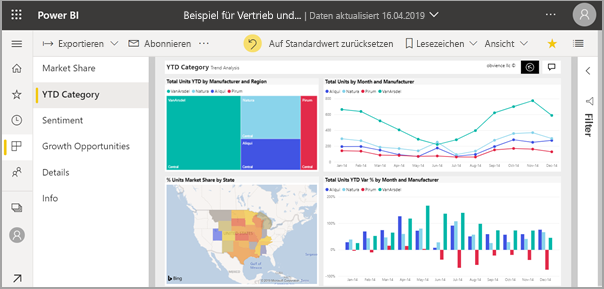
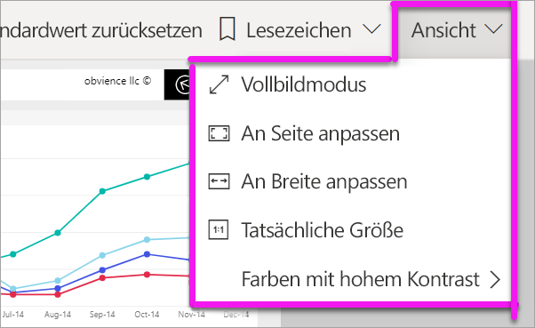
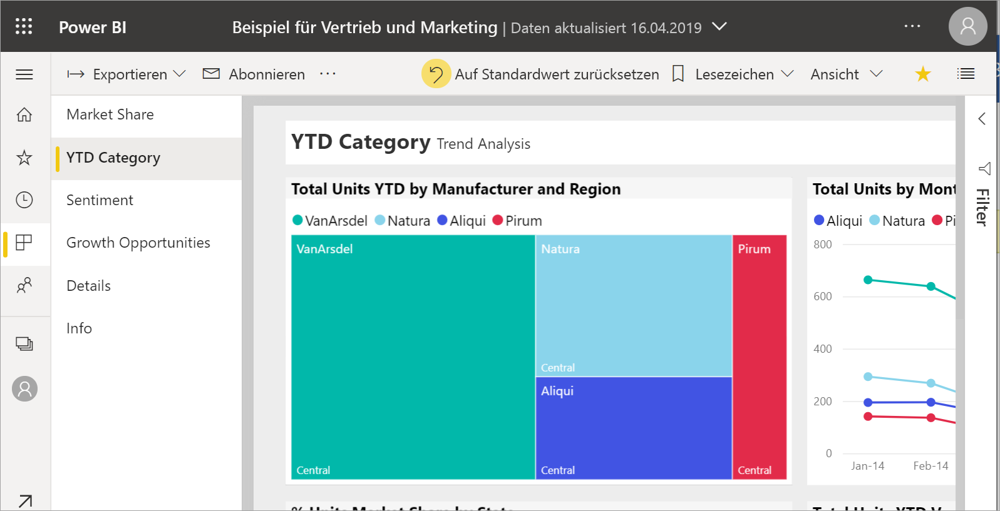
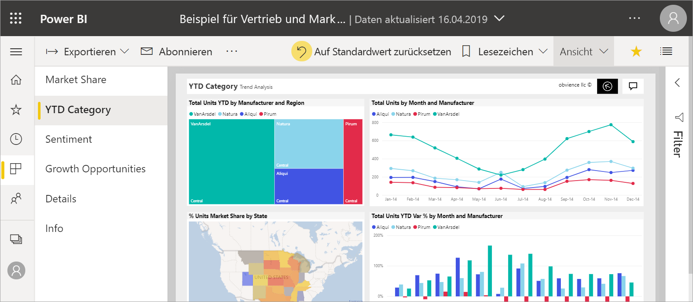
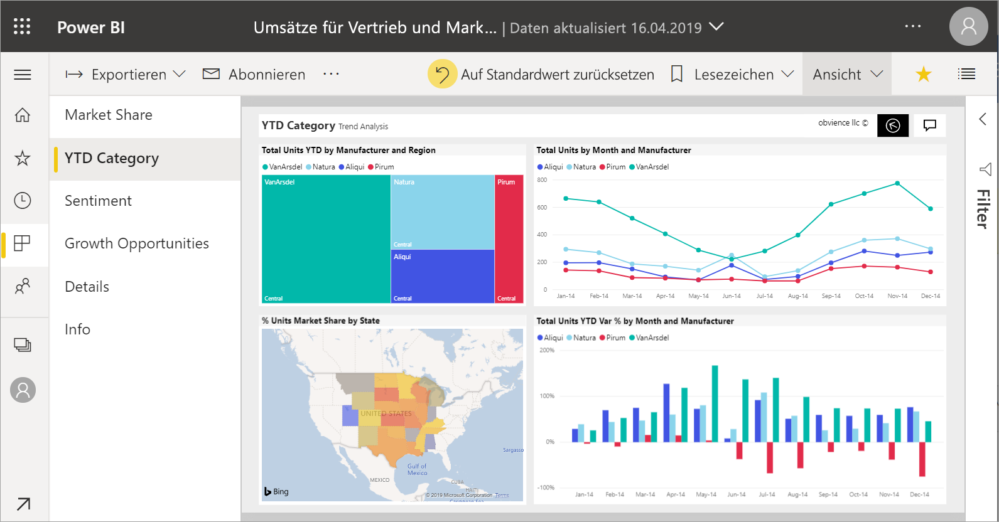
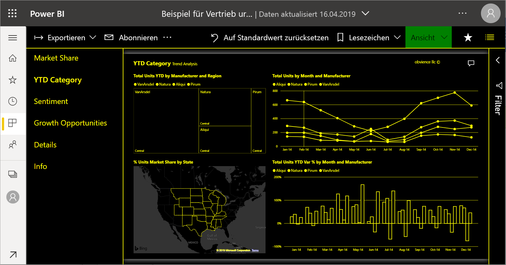
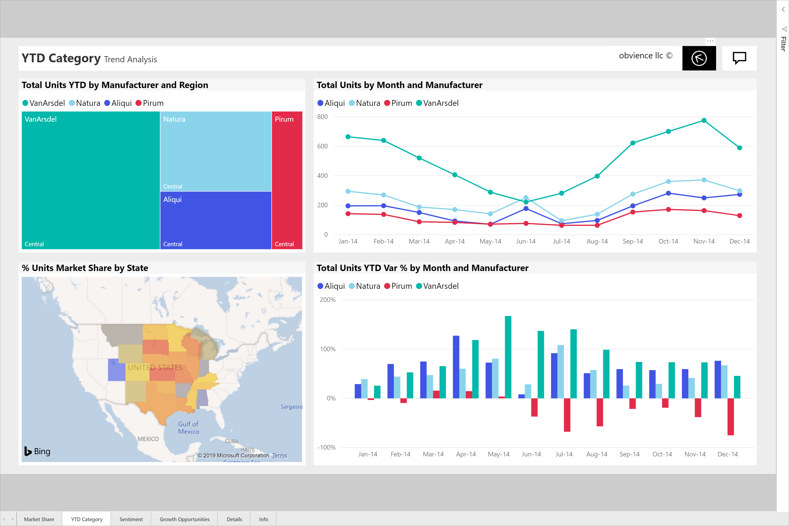

# Ändern der Anzeige einer Berichtsseite

[!INCLUDE [power-bi-service-new-look-include](../includes/power-bi-service-new-look-include.md)]

Berichte werden auf vielen verschiedenen Geräten mit unterschiedlichen Bildschirmgrößen und Seitenverhältnissen angezeigt. Sie können die Anzeige einer Berichtsseite so anpassen, dass diese Ihren Anforderungen entspricht.

## Untersuchen des Menüs „Ansicht“

Die Optionen im Menü **Ansicht** bieten Ihnen Flexibilität beim Anzeigen von Berichtsseiten hinsichtlich der Größe und Breite, die Sie auswählen:

- Angenommen, Sie lassen sich einen Bericht auf einem kleineren Gerät anzeigen, und das Lesen der Titel und Legenden ist sehr schwierig.  Klicken Sie auf **Ansicht** > **Tatsächliche Größe**, um die Berichtsseite zu vergrößern. Verwenden Sie die Scrollleiste, um den Bericht zu verschieben.

    

- Eine weitere Option besteht darin, den Bericht durch Auswählen der Option **An Breite anpassen** an die Bildschirmbreite anzupassen. Da es sich hierbei nur um die Breite und nicht um die Höhe handelt, müssen Sie gegebenenfalls noch die vertikale Scrollleiste verwenden.

  

- Wählen Sie **An Seite anpassen** aus, wenn Sie keine Scrollleiste verwenden, die Bildschirmgröße aber dennoch so gut wie möglich nutzen möchten.

   

- Sie können auch aus vier **Farben mit hohem Kontrast** auswählen: Hoher Kontrast #1, hoher Kontrast #2, hoher Kontrast Schwarz und hoher Kontrast Weiß. Durch diese Funktion für Barrierefreiheit können Menschen mit eingeschränkter Sehkraft die Berichte besser erkennen. Im folgenden Beispiel wird der hohe Kontrast 1 veranschaulicht. 

    

- Die letzte Option (**Vollbild**) zeigt die Berichtsseite ohne Menüleisten und Header an. Die Option „Vollbild“ eignet sich für kleine Bildschirme, auf denen Details nur schwer zu erkennen sind.  „Vollbild“ kann auch für das Projizieren von Berichtsseiten auf große Bildschirme verwendet werden, wenn mit diesen nicht interagiert wird.  

    

Wenn Sie den Bericht verlassen, werden Ihre Einstellungen für **Ansicht** nicht gespeichert und die Standardeinstellung wieder hergestellt. Verwenden Sie [Textmarken](end-user-bookmarks.md), wenn Sie diese Einstellungen speichern möchten.

## Nächste Schritte

* [Überblick über den Berichtsbereich „Filter“](end-user-report-filter.md)