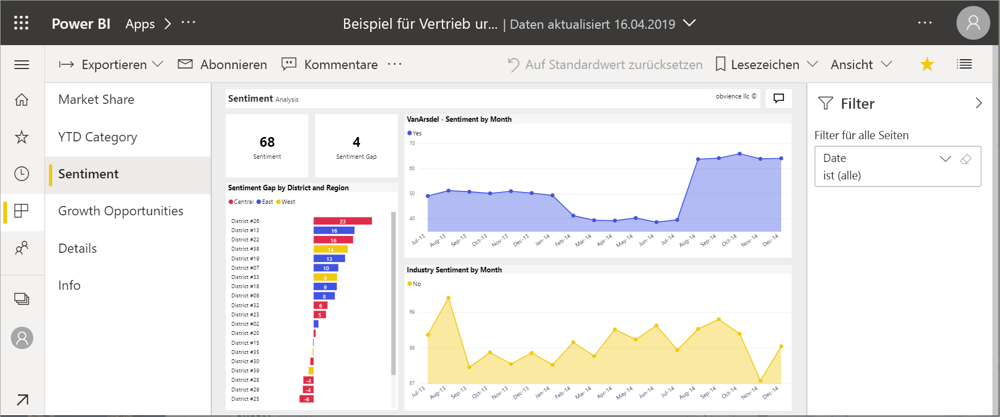
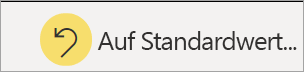

# Berichte in Power BI

Ein Power BI-Bericht stellt eine Ansicht eines Datasets aus verschiedenen Perspektiven dar, wobei die aus dem Dataset gewonnenen verschiedenen Ergebnisse und Erkenntnisse als Visuals angezeigt werden.  Ein Bericht kann ein einzelnes Visual, aber auch mehrere mit Visuals gefüllte Seiten enthalten. Abhängig von Ihrem Aufgabengebiet sind Sie möglicherweise jemand, der Berichte *entwirft*. Sie können auch jemand sein, der Berichte *nutzt* oder verwendet.

Dieser Bericht umfasst sechs Seiten (bzw. Registerkarten). Sie sehen hier die Seite **Stimmung**. Diese Seite enthält fünf verschiedene Visuals und einen Seitentitel. Im Bereich *Filter* wird ein Filter angezeigt, der auf alle Berichtseiten angewendet wird. Klicken Sie auf den Pfeil ( **>** ), um den Filterbereich zu reduzieren.

Wenn Sie noch nicht mit Power BI vertraut sind, können Sie sich mithilfe des Artikels [Basic concepts for the Power BI service consumers (Grundkonzepte für Benutzer des Power BI-Diensts)](end-user-basic-concepts.md) eine gute Grundlage schaffen. Berichte können auf mobilen Geräten angezeigt, freigegeben und kommentiert werden. Weitere Informationen finden Sie unter [Explore reports in the Power BI mobile apps (Untersuchen von Berichten in mobilen Power BI-Apps)](mobile/mobile-reports-in-the-mobile-apps.md).

## Vorteile von Berichten

Bei Power BI basiert ein Bericht auf einem einzelnen Dataset. *Berichts-Designer* erstellen die Visuals in einem Bericht, die wertvolle Informationen darstellen. Diese Visuals sind nicht statisch.  Sie werden aktualisiert, wenn sich die zugrunde liegenden Daten ändern. Sie können mit den Visuals und Filtern interagieren, während Sie die Daten durchsuchen, um sich Erkenntnisse und Antworten zu beschaffen. Ähnlich wie Dashboards bieten auch Berichte zahlreiche Möglichkeiten für die Interaktion und Anpassung.

### Sicheres Interagieren mit Inhalten

Während Sie mit den Inhalten interagieren und sie durchsuchen, indem Sie sie filtern, segmentieren, abonnieren und exportieren, können Sie die Berichte nicht beschädigt werden. Ihre Aktionen wirken sich nicht auf das zugrundeliegende Dataset oder die ursprünglichen freigegebenen Inhalte aus. Dies gilt für Dashboards, Berichte und Apps.

> [!NOTE]
> Beachten Sie, dass Sie Ihre Daten nicht beeinträchtigen können. Power BI ist ein hervorragendes Tool zum Untersuchen und Experimentieren, ohne dass Sie sich sorgen müssen, dass Sie etwas kaputt machen.

### Speichern Ihrer Änderungen oder Wiederherstellen der Standardeinstellungen

Das bedeutet nicht, dass Sie Ihre Änderungen nicht speichern können. Das können Sie, jedoch wirken sich die gespeicherten Änderungen nur auf Ihre Ansicht des Inhalts aus. Klicken Sie auf **Auf Standardwert zurücksetzen**, um die ursprüngliche Standardansicht wiederherzustellen.

## Vergleich: Dashboards und Berichte

[Dashboards](end-user-dashboards.md) werden oft mit Berichten verwechselt, weil es sich bei einem Dashboard ebenfalls um eine Canvas handelt, die Visuals enthält. Es gibt aber einige wichtige Unterschiede.  

| **Eigenschaften** | **Dashboards** | **Berichte** |
| --- | --- | --- |
| Pages |Eine Seite |Eine oder mehrere Seiten |
| Datenquellen |Ein oder mehrere Berichte und ein oder mehrere Datasets pro Dashboard |Ein Dataset pro Bericht |
| Filter |Keine Filter, keine Slices |Viele Filter, Hervorhebungen und Slices |
| Benachrichtigungen festlegen |Kann Ihnen Benachrichtigungen per E-Mail senden, wenn das Dashboard bestimmte Bedingungen erfüllt |Nein |
| Feature |Kann ein Dashboard als Favorit festlegen |Ein ausgewählter Bericht kann nicht erstellt werden. |
| Zugrunde liegende Dataset-Tabellen und Felder sichtbar |Nein. Kann Daten exportieren, aber keine Dataset-Tabellen und Felder im Dashboard selbst einsehen |Ja. Kann Dataset-Tabellen, Felder und Werte einsehen, für die Sie über die Berechtigungen verfügen |
| Anpassung |Nein  |Kann filtern, exportieren, verwandte Inhalte anzeigen, Lesezeichen hinzufügen, QR-Codes generieren, in Excel analysieren und mehr |

<!--| Available in Power BI Desktop |No |Yes, can create and view reports in Desktop |
| Pinning |Can pin existing visuals (tiles) only from current dashboard to your other dashboards |Can pin visuals (as tiles) to any of your dashboards. Can pin entire report pages to any of your dashboards. | -->

## Berichts-Designer und Berichtsnutzer

Abhängig von Ihrem Aufgabengebiet sind Sie möglicherweise ein *Designer*, der Berichte für die eigene Benutzung oder für Kollegen erstellt. Dann sollten Sie wissen, wie Berichte erstellt und freigegeben werden.

Oder Sie sind ein *Berichtsnutzer*, der Berichte von anderen erhält. Dann sollten Sie wissen, wie Sie mit Berichten interagieren können, und sie verstehen. Wenn Sie *Berichtsnutzer* sind, sollten Sie den folgenden Links folgen:

* Beginnen Sie mit einer [Tour des Power BI-Diensts](end-user-basic-concepts.md), um zu erfahren, wo Sie Berichte und Berichtstools finden.
* Erfahren Sie, wie Sie [einen Bericht öffnen](end-user-report-open.md), und lernen Sie alle verfügbaren Interaktionen in der [Leseansicht](end-user-reading-view.md) kennen.
* Machen Sie sich mit Berichten vertraut, indem Sie sich eine Tour durch eines unserer [Beispiele](../sample-tutorial-connect-to-the-samples.md) ansehen.  
* Informationen dazu, welches Dataset ein Bericht verwendet und welche Dashboards Kacheln aus dem Bericht angeheftet haben, finden Sie unter [View related content in the Power BI service (Anzeigen verwandter Inhalte im Power BI-Dienst)](end-user-related.md).

> [!TIP]
> Wenn Sie die gesuchten Informationen hier nicht finden, verwenden Sie das Inhaltsverzeichnis auf der linken Seite, um alle Artikel zu *Berichten* zu durchsuchen.

## Nächste Schritte

[Öffnen und Anzeigen eines Berichts](end-user-report-open.md)    
[Dashboards im Power BI-Dienst](end-user-dashboards.md)