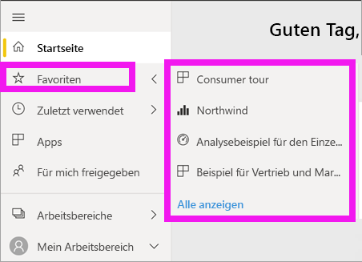

# Navigation: Suchen und Sortieren von Inhalten im Power BI-Dienst

[!INCLUDE [power-bi-service-new-look-include](../includes/power-bi-service-new-look-include.md)]

Für die Navigation zu Ihren Inhalten im Power BI-Dienst gibt es verschiedene Möglichkeiten. Die Inhalte sind in Ihrem Arbeitsbereich nach verschiedenen Typen unterteilt: Dashboards und Berichte.  Außerdem sind Inhalte nach Nutzung kategorisiert: Favoriten, zuletzt verwendet, Apps, für mich freigegeben und ausgewählt. Für die Navigation an einem zentralen Ort organisiert *Power BI Home* alle Inhalte auf einer Seite. Anhand dieser unterschiedlichen Wege, Inhalte aufzurufen, finden Sie schnell das Gesuchte im Power BI-Dienst.  

## Navigation in Arbeitsbereichen

Power BI-*Benutzer* haben in der Regel nur einen Arbeitsbereich: **Mein Arbeitsbereich**. **Mein Arbeitsbereich** enthält Inhalte, wenn Sie Beispiele von Microsoft heruntergeladen oder Ihre eigenen Dashboards, Berichte oder Apps erstellt oder heruntergeladen haben.  

In **Mein Arbeitsbereich** unterteilt der Power BI-Dienst Ihre Inhalte nach Typ: Dashboards, Berichte, Arbeitsmappen und Datasets. Wenn Sie einen Arbeitsbereich auswählen, wird diese Unterteilung angezeigt. In diesem Beispiel enthält **Mein Arbeitsbereich** ein Dashboard, einen Bericht, keine Arbeitsmappen und ein Dataset.

________________________________________
## Navigieren über das Suchfeld
Verwenden Sie die Inhaltsansicht **Mein Arbeitsbereich** zum Suchen, Filtern und Sortieren Ihrer Inhalte. Geben Sie im Suchfeld den Namen eines Dashboards, Berichts, einer Arbeitsmappe oder eines Besitzers ganz oder teilweise ein.  

Wenn Sie nur teilweise über Inhalte verfügen, ist kein Suchen und Sortieren notwendig.  Wenn Sie allerdings über eine Reihe von Dashboards und Berichte verfügen, ist die Such- und Sortierfunktion überaus hilfreich. Beispielsweise enthält die unten stehende Berichtsliste 83 Elemente. 

Sie können die Inhalte auch nach Name oder Besitzer sortieren. Beachten Sie den Pfeil nach oben rechts neben **Name**. Aktuell werden 83 Elemente in alphabetischer aufsteigender Reihenfolge angezeigt. Klicken Sie auf **Name**, um die Elemente in absteigender Reihenfolge anzuzeigen. Dann wird ein Pfeil nach unten angezeigt.

Nicht alle Spalten können sortiert werden. Zeigen Sie auf die Spaltenüberschriften, um herauszufinden, welche Sie sortieren können.

___________________________________________________________________
## Navigieren über den Navigationsbereich
Im Navigationsbereich werden Inhalte so klassifiziert, dass Sie das Gesuchte schnell und einfach finden.  

- Inhalte, die für Sie freigegeben werden, sind unter **Für mich freigegeben** verfügbar.
- Der von Ihnen zuletzt angezeigt Inhalt steht unter **Zuletzt verwendet** zur Verfügung. 
- Ihre Apps finden Sie durch Auswahl von **Apps**.
- **Start** ist eine Einzelseitenansicht Ihrer wichtigsten Inhalte und vorgeschlagenen Inhalte sowie Lernquellen.

Außerdem können Sie Inhalte als [Favorit](end-user-favorite.md) und [Ausgewählt](end-user-featured.md) markieren. Sie können das Dashboard oder den Bericht auswählen, das bzw. den Sie voraussichtlich am häufigsten öffnen und daher als *ausgewähltes* Dashboard festlegen. Immer wenn Sie den Power BI-Dienst öffnen, wird Ihr ausgewähltes Dashboard zuerst angezeigt. Haben Sie eine Reihe von Dashboards und Apps, die Sie häufig aufrufen? Sie können sie als Favoriten festlegen, damit sie im Navigationsbereich immer verfügbar sind.

.

## Zu beachtende Aspekte und Problembehandlung
* Für Datasets kann mit der Option **Sortieren nach** nicht nach Besitzer sortiert werden.

## Nächste Schritte
[Sortieren von Visuals in Berichten](end-user-change-sort.md)

Weitere Fragen? [Wenden Sie sich an die Power BI-Community](https://community.powerbi.com/)
