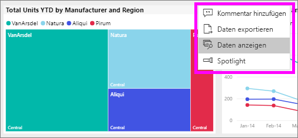
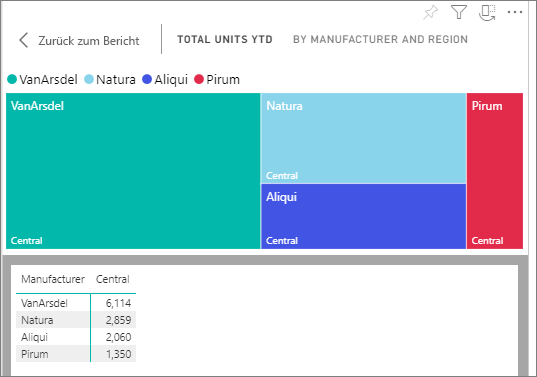
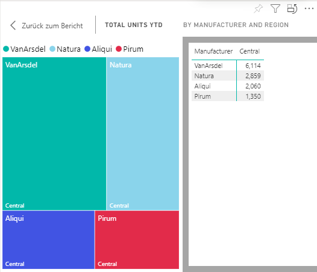

# Anzeigen der Daten mit Power BI-Berichten

[!INCLUDE [power-bi-service-new-look-include](../includes/power-bi-service-new-look-include.md)]

Ein Power BI-Visual wird mithilfe von Daten aus zugrunde liegenden Datasets erstellt. Sie haben im Power BI-Dienst die Möglichkeit, die Daten *anzuzeigen*, mit denen ein Visual in einem Bericht erstellt wird. Wenn Sie die Option **Daten anzeigen** auswählen, werden die Daten in Power BI unter (oder neben) dem Visual angezeigt.

Verwenden Sie auf einem Dashboard [Nach Excel exportieren](end-user-export.md), um die zugrunde liegenden Daten anzuzeigen.

## Anzeigen der Daten, die verwendet werden, um ein Berichtsvisual zu erstellen.
1. Öffnen Sie im Power BI-Dienst einen [Bericht](end-user-report-open.md), und wählen Sie ein Visual aus.  
2. Um die Daten hinter dem Visual anzuzeigen, klicken Sie auf **Weitere Optionen** (...) und dann auf **Daten anzeigen**.
   
   
3. Standardmäßig werden die Daten unter der Visualisierung angezeigt.
   
   

4. Wählen Sie zum Ändern der Ausrichtung das vertikale Layout  in der rechten oberen Ecke der Visualisierung aus.
   
   

## Nächste Schritte
[Visuals in Power BI-Berichten](../visuals/power-bi-report-visualizations.md)    
[Power BI-Berichte](end-user-reports.md)    
