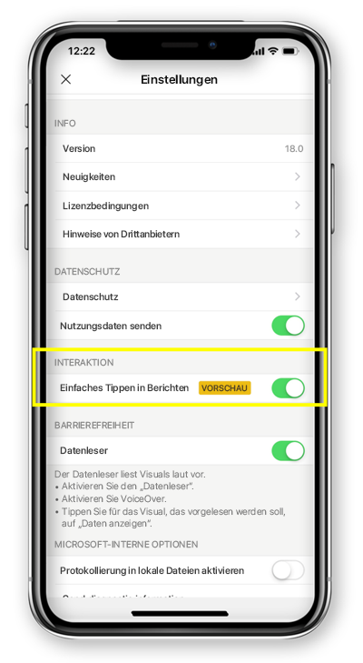

# Konfigurieren von Berichtsinteraktionen für einfaches oder doppeltes Tippen
Gilt für:

|  |  | 
|:--- |:--- |
| iPhones |Android-Telefone |

Ein Power BI-Bericht ist eine interaktive Ansicht Ihrer Daten, und mit den darin enthaltenen Visuals werden unterschiedliche Ergebnisse und Erkenntnisse zu diesen Daten dargestellt.

Sie können die Interaktion mit Ihren Daten konfigurieren. Sie können entscheiden, ob Sie Interaktionen mit einfachem oder doppeltem Tippen haben möchten.

* Bei Interaktionen mit doppeltem Tippen wird mit dem ersten Tippen auf ein Visual eben dieses ausgewählt, und durch das zweite Tippen werden Aktionen ausgeführt wie z. B. das Auswählen von Datenschnittelementen, die übergreifende Hervorhebung oder das Klicken auf einen Link, eine Schaltfläche etc.

* Bei Interaktionen mit einfachem Tippen werden beide Vorgänge ausgeführt: Das Visual wird ausgewählt und die Aktion ausgeführt.

Ab Power BI-App-Version 18.0 für iOS und Version 112540 für Android werden alle neuen Installationen mit einfachem Tippen als Standardverhalten konfiguriert.
Benutzern, die Power BI bereits auf ihrem Smartphone installiert haben und ein Upgrade auf diese neue Version durchführen, wird angeboten, zum Interaktionsverhalten mit einfachem Tippen zu wechseln.

## Ändern des Interaktionsverhaltens

Navigieren Sie zu den App-Einstellungen, und aktivieren/deaktivieren Sie die Interaktionen für einfaches Tippen, um das Interaktionsverhalten zu ändern.

Dieser Artikel gilt für Berichte im Querformat und Smartphoneberichte.

## Nächste Schritte
* [Anzeigen von und Interagieren mit Power BI-Berichten, die für das Smartphone optimiert sind](mobile-apps-view-phone-report.md)
* Haben Sie Fragen? [Stellen Sie Ihre Frage in der Power BI-Community.](https://community.powerbi.com/)

