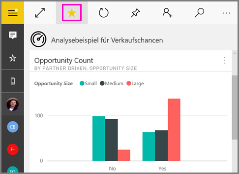

# Erstellen und Anzeigen von Favoriten in den mobilen Power BI-Apps
Gilt für:

|  |  |  |  |  |
|:--- |:--- |:--- |:--- |:--- |
| iPhones |iPads |Android-Telefone |Android-Tablets |Windows 10-Geräte |

Hier erfahren Sie mehr über das Erstellen und Anzeigen Ihrer als Favoriten gespeicherten Power BI-Dashboards, -Berichte und -Apps sowie über Ihre favorisierten lokalen Power BI-Berichtsserver- und Reporting Services-KPIs und -Berichte in den mobilen Apps.

Wenn Sie einen Favoriten in mobilen Power BI-Apps speichern, werden diese auf Ihrer Favoritenseite im [Power BI-Dienst](https://powerbi.com) und auf all Ihren Mobilgeräten angezeigt.

Tippen Sie auf das Symbol „Favoriten“ in der Navigationsleiste, um Ihre Favoritenseite zu sehen:

Sie können auch [Power BI-Dashboard und -Apps als Favoriten im Power BI-Dienst speichern](../end-user-favorite.md). Sie werden dann auf der Favoritenseite in der mobilen App angezeigt.

Sie können KPIs und Berichte als Favoriten in Ihrem Power BI-Berichtsserver- oder Reporting Services-Webportal markieren und dann bequem neben den als Favoriten gespeicherten Power BI-Dashboards in einem Ordner auf Ihrem Mobilgerät anzeigen.

## Speichern einer App als Favoriten
1. Tippen Sie auf das Symbol „Apps“ in der unteren Navigationsleiste, um Ihre App-Seite anzuzeigen.

2. Tippen Sie auf einem iOS-Gerät rechts neben dem Namen der App, die Sie als Favoriten festlegen möchten, auf die Schaltfläche für Informationen. Auf Android-Geräten erscheint „Weitere Optionen (...)“ und nicht die Schaltfläche für Informationen. 

3. Tippen Sie in dem sich öffnenden Bereich „App-Info“ auf den Stern.
   
    
   
    Die App wird nun zusammen mit Ihren favorisierten Dashboards, Berichten und Apps unter Ihrer Favoritenseite aufgelistet.
   
## Speichern eines Dashboards oder Berichts als Favorit in den mobilen iOS- und Windows 10-Apps
Sie können ein Power BI-Dashboard oder einen Bericht in der Liste der Dashboards oder Berichte oder im Dashboard oder Bericht selbst als Favorit festlegen.

* Tippen Sie in der Liste der Dashboards oder Berichte in der mobilen App auf den leeren Stern neben dem Namen . Die Farbe des Sterns ändert sich in Gelb .
  
    
* Wenn Sie sich in Ihrem Dashboard befinden, tippen Sie auf den leeren Stern  im Menüband. Wenn Sie sich in einem Bericht befinden, befindet sich dieser Stern unter **Weitere Optionen** (...).  Der Stern wird schwarz .
  
    

## Speichern eines Dashboards oder Berichts als Favorit in mobilen Android-Apps
Sie können ein Dashboard oder einen Bericht in der Liste der Dashboards oder Berichte oder im Dashboard oder Bericht selbst als Favorit festlegen.

* Tippen Sie in der Liste der Dashboards oder Berichte in der mobilen App auf die vertikale Schaltfläche **Weitere Optionen** (...) neben dem Namen, und tippen Sie dann auf den Favoritenstern auf der erscheinenden Registerkarte „Info“.
  
    

* Wenn Sie sich in einem Dashboard befinden, tippen Sie auf den leeren Stern im Menüband . Die Farbe des Sterns ändert sich in Dunkelgrau .
  
    

* Wenn Sie sich in einem Bericht befinden, wischen Sie nach unten, um das Menüband zu öffnen, tippen Sie auf **Weitere Optionen** (...), und scrollen Sie dann nach unten, um den leeren Stern  zu finden, und tippen Sie dann darauf. Der Stern wird dann Dunkelgrau .
  
    

## Erstellen von Favoriten für Power BI-Berichtsserver- und Reporting Services-Berichte und -KPIs
Sie können Ihre als Favoriten gespeicherten Power BI-Berichtsserver- und Reporting Services-Berichte und -KPIs in den mobilen Power BI-Apps zwar anzeigen, sie dort aber nicht als Favoriten ablegen. Sie [müssen sie im Webportal als Favoriten markieren](../../report-server/tutorial-explore-report-server-web-portal.md#tag-your-favorites). 

## Nächste Schritte
* [Als Favoriten gespeicherte Dashboards im Power BI-Dienst](../end-user-favorite.md) 
* Haben Sie Fragen? [Stellen Sie Ihre Frage in der Power BI-Community.](https://community.powerbi.com/)

