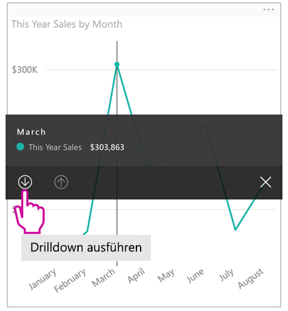
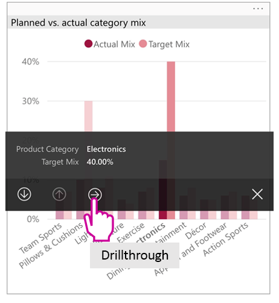
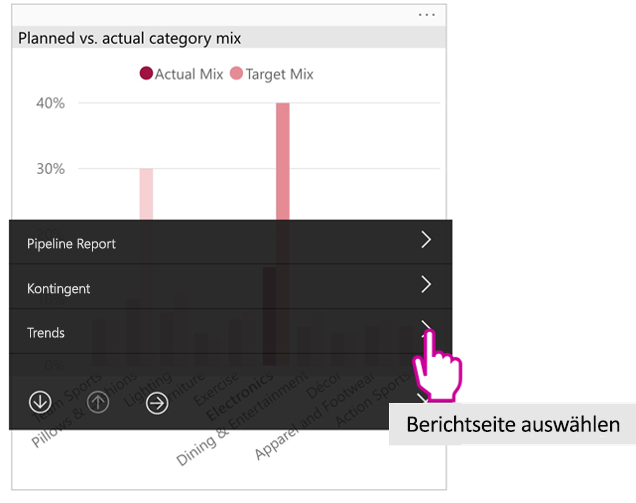

# Anzeigen von Power BI-Berichten, die für das Smartphone optimiert sind

Gilt für:

|  |  |
|:--- |:--- |
| iPhones |Android-Telefone |

Beim Anzeigen eines Power BI-Berichts auf einem Smartphone überprüft Power BI, ob der Bericht für Smartphones optimiert wurde. Ist dies der Fall, öffnet Power BI automatisch den optimierten Bericht im Hochformat.

Wenn kein für das Smartphone optimierter Bericht vorhanden ist, wird der Bericht zwar geöffnet, jedoch in der nicht optimierten Querformatansicht. Auch wenn Sie bei einem für das Smartphone optimierten Bericht das Smartphone auf die Seite drehen, wird der Bericht in der nicht optimierten Ansicht mit dem ursprünglichen Berichtslayout geöffnet. Wenn nur einige Seiten optimiert sind, wird in der Hochformatansicht eine Meldung angezeigt, die Ihnen mitteilt, dass der Bericht im Querformat verfügbar ist.

In für das Smartphone optimierten Berichten werden alle anderen Features von Power BI-Berichten ausgeführt. Weitere Informationen über die Ihnen zur Verfügung stehenden Möglichkeiten finden Sie unter:

* [Berichte auf iPhones](mobile-reports-in-the-mobile-apps.md). 
* [Berichte auf Android-Smartphones](mobile-reports-in-the-mobile-apps.md).

## Filtern der Berichtsseite auf einem Smartphone
Wenn bei einem für das Smartphone optimierten Bericht Filter definiert wurden, können Sie diese Filter beim Anzeigen des Berichts auf einem Smartphone verwenden. Der Bericht wird auf Ihrem Smartphone geöffnet, und es werden die im Web für den Bericht gefilterten Werte angezeigt. Es wird eine Meldung angezeigt, dass die Seite aktive Filter enthält. Sie können die Filtereinstellungen auf Ihrem Smartphone ändern.

1. Tippen Sie auf das Symbol „Filter“  am unteren Rand der Seite. 
2. Verwenden Sie die grundlegenden oder erweiterten Filter, um die Ergebnisse anzuzeigen, an denen Sie interessiert sind.
   
    

## Kreuzhervorhebung visuelle Objekte
Die Kreuzhervorhebung von Visuals im Hochformat funktioniert genauso wie im Power BI-Dienst und bei Smartphones im Querformat: Wenn Sie Daten in einem Visual auswählen, werden die verknüpften Daten in den anderen Visuals auf der jeweiligen Seite hervorgehoben.

Erfahren Sie mehr über das [Filtern und Hervorheben in Power BI](../../power-bi-reports-filters-and-highlighting.md).

## Auswählen visueller Elemente
Wenn Sie in Smartphoneberichten ein visuelles Element auswählen, wird dieses hervorgehoben, und es erhält den Fokus. Gesten für den Zeichenbereich werden unwirksam.

Sobald das visuelle Element ausgewählt ist, können Sie Aktionen in ihm ausführen, z. B. in ihm scrollen. Um die Auswahl eines visuellen Elements aufzuheben, tippen Sie auf eine beliebige Position außerhalb des visuellen Elements.

## Öffnen visueller Elemente im Fokusmodus
Telefonberichte bieten zudem einen Fokusmodus: Dabei können Sie ein einzelnes Visual in einer größeren Ansicht anzeigen und es so leichter analysieren.

* Tippen Sie in einem Smartphonebericht auf die Auslassungspunkte ( **...** ) in der oberen rechten Ecke eines visuellen Elements und dann auf **Auf Fokusmodus erweitern**.
  
    

Ihre Aktionen im Fokusmodus werden im Berichtszeichenbereich übernommen und umgekehrt. Wenn Sie z. B. einen Wert in einem Visual hervorheben und dann zum gesamten Bericht zurückkehren, wird der Bericht nach dem Wert gefiltert, den Sie im Visual hervorgehoben haben.

Aufgrund der Einschränkungen durch die Bildschirmgröße können manche Aktionen nur im Fokusmodus ausgeführt werden:

* **Durchführen eines Drilldowns** auf die Informationen in einem visuellen Element. Weitere Informationen über das Durchführen von [Drilldown und Drillup](mobile-apps-view-phone-report.md#drill-down-in-a-visual) in einem Smartphonebericht finden Sie weiter unten.
* **Sortieren** der Werte im visuellen Element.
* **Wiederherstellen**: Löschen der Untersuchungsschritte, die Sie für ein visuelles Element durchgeführt haben, und Wiederherstellen der Definition, die bei der Erstellung des Berichts festgelegt wurde.
  
    Um alle Untersuchungsschritte aus einem visuellen Element zu löschen, tippen Sie auf die Auslassungspunkte ( **...** ) und dann auf **Zurücksetzen**.
  
    
  
    Die Option zum Zurücksetzen ist sowohl auf der Berichts- als auch auf der Visualebene verfügbar. Auf der Berichtsebene werden die Untersuchungsschritte aus sämtlichen Visuals gelöscht, auf der Visualebene nur aus dem ausgewählten Visual.   

## Durchführen von Drilldown in einem visuellen Element
Wenn in einem visuellen Element Hierarchieebenen definiert sind, können Sie einen Drilldown auf die Detailinformationen im visuellen Element durchführen und dann wieder zur höheren Ebene zurückkehren. Sie können im Power BI-Dienst und in Power BI Desktop [Drilldowns in einem Visual](../end-user-drill.md) ausführen.

Die folgenden Drilldown-Typen sind verfügbar:

### Drilldown für einen Wert
1. Tippen Sie in einem Visual auf einen Datenpunkt, und halten Sie ihn gedrückt.
2. Daraufhin wird eine QuickInfo angezeigt. Wurde eine Hierarchie definiert, werden in der Fußzeile der QuickInfo Pfeile für den Drilldown und Drillup angezeigt.
3. Tippen Sie für einen Drilldown auf den Pfeil nach unten.

    
    
4. Tippen Sie für einen Drillup auf den Pfeil nach oben.

### Drilldown zur nächsten Ebene
1. Tippen Sie in einem Bericht auf einem Smartphone auf die Auslassungspunkte ( **...** ) in der oberen rechten Ecke und dann auf **Auf Fokusmodus erweitern**.
   
    
   
    In diesem Beispiel zeigen die Balken die Werte für Bundesländer an.
2. Tippen Sie auf das Symbol „Durchsuchen“  in der unteren linken Ecke.
   
    
3. Tippen Sie auf **Nächste Ebene anzeigen** oder **Auf nächste Ebene erweitern**.
   
    
   
    Jetzt zeigen die Balken die Werte für Städte an.
   
    
4. Wenn Sie auf den Pfeil in der oberen linken Ecke tippen, kehren Sie zum Smartphonebericht zurück, in dem die Werte noch auf die untere Ebene erweitert sind.
   
    
5. Um auf die ursprüngliche Ebene zurückzukehren, tippen Sie erneut auf die Auslassungspunkte ( **...** ) und dann auf **Zurücksetzen**.
   
    

## Drillthrough von einem Wert
Bei einem Drillthrough werden Werte auf einer Berichtseite mit anderen Berichtseiten verknüpft. Wenn Sie einen Drillthrough von einem Datenpunkt zu einer anderen Berichtseite ausführen, werden die Datenpunktwerte zum Filtern der anderen Seite verwendet oder in Kontext zu den ausgewählten Daten gesetzt.
Berichtsautoren können beim Erstellen eines Berichts einen [Drillthrough definieren](https://docs.microsoft.com/power-bi/desktop-drillthrough).

1. Tippen Sie in einem Visual auf einen Datenpunkt, und halten Sie ihn gedrückt.
2. Daraufhin wird eine QuickInfo angezeigt. Wurde ein Drillthrough definiert, wird in der Fußzeile der QuickInfo ein Pfeil nach rechts für den Drillthrough angezeigt.
3. Tippen Sie für einen Drillthrough auf den Pfeil nach rechts.

    

4. Wählen Sie die Berichtseite aus, für die der Drillthrough ausgeführt werden soll.

    

5. Über die Schaltfläche „Zurück“ im App-Header gelangen Sie zurück auf die ursprüngliche Seite.

## Nächste Schritte
* [Erstellen von Berichten, die für die Power BI-Smartphone-Apps optimiert sind](../../desktop-create-phone-report.md)
* [Erstellen einer Telefonansicht eines Dashboards in Power BI](../../service-create-dashboard-mobile-phone-view.md)
* [Erstellen von dynamischen Visuals, die für eine beliebige Größe optimiert sind](../../visuals/desktop-create-responsive-visuals.md)
* Weitere Fragen? [Stellen Sie Ihre Frage in der Power BI-Community.](https://community.powerbi.com/)

