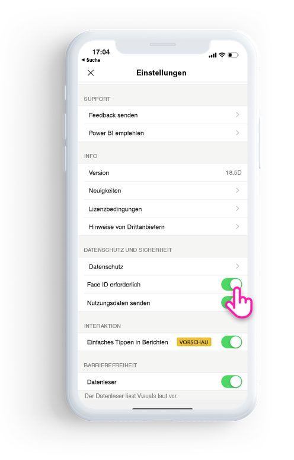

# Schützen der Power BI-App mit Face ID, Touch ID oder einem Passcode 

In vielen Fällen sind die in Power BI verwalteten Daten vertraulich und müssen so geschützt werden, dass nur autorisierte Benutzer darauf zugreifen können. 

In der Power BI-App für iOS können Sie Ihre Daten schützen, indem Sie eine zusätzliche Identifizierung konfigurieren. Sie müssen jedes Mal Face ID, Touch ID oder einen Passcode bereitstellen, wenn Sie die App starten oder aus dem Hintergrund in den Vordergrund bringen.

|  |  |
|:--- |:--- |
| iPhones |iPads |

## Aktivieren von Face ID, Touch ID oder des Passcodes in der App-Einstellung

Navigieren Sie zur App-Einstellung unter **Privacy and Security** (Datenschutz und Sicherheit), um eine zusätzliche Identifizierung in Power BI zu verwenden. Je nach Gerätefunktionen wird Ihnen die Option zum Aktivieren von Face ID, Touch ID oder des Passcodes angezeigt.

Nachdem diese Einstellung aktiviert wurde, werden Sie jedes Mal, wenn Sie Power BI starten oder aus dem Hintergrund bringen, dazu aufgefordert, Ihre ID bereitzustellen, um auf die App zugreifen zu können. 

Die Entscheidung, ob nach Face ID, Touch ID oder dem Passcode gefragt wird, wird von iOS je nach Gerätefunktion getroffen. Wenn Ihr Gerät Face ID unterstützt, müssen Sie Face ID verwenden. Wenn es Touch ID unterstützt, müssen Sie Touch ID verwenden. Wenn keine der beiden Optionen unterstützt wird, müssen Sie einen Passcode angeben.

## Erzwingen von Face ID, Touch ID oder eines Passcodes mit MDM

Einige Organisationen verfügen über Sicherheitsrichtlinien und Konformitätsanforderungen, die eine zusätzliche Identifizierung erzwingen, bevor auf vertrauliche Geschäftsdaten zugegriffen werden kann. 

Die mobile Power BI-App für iOS ermöglicht Administratoren, diese Einstellung zu steuern, indem sie die Konfigurationseinstellungen der App aus Microsoft Intune und anderen Lösungen für die mobile Geräteverwaltung (Mobile Device Management, MDM) mithilfe von Push übertragen. Administratoren können die App-Schutzrichtlinie verwenden, um diese Einstellung für alle Benutzer oder für eine Benutzergruppe zu aktivieren.

|Schlüssel  |Typ  |Beschreibung  |
|---------|---------|---------|
| com.microsoft.powerbi.mobile.ForceDeviceAuthentication | Boolescher Wert | Der Standardwert ist FALSE.  Wenn er auf TRUE festgelegt wird, zwingt die App die Benutzer, sich mit Face ID, Touch ID oder einem Passcode zu identifizieren, damit ihnen Power BI-Daten in der App angezeigt werden können. Benutzer, die auf ihrem Gerät weder über Face ID noch über Touch ID verfügen und keinen Passcode konfiguriert haben, müssen diesen konfigurieren, um auf Power BI zugreifen zu können.  |

## Nächste Schritte

[Use MDM to remotely configure Power BI iOS app (Verwenden von MDM zur Remotekonfiguration der Power BI-App für iOS)](mobile-app-configuration.md)
