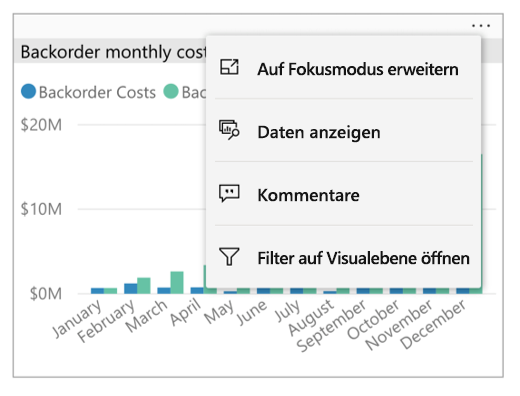
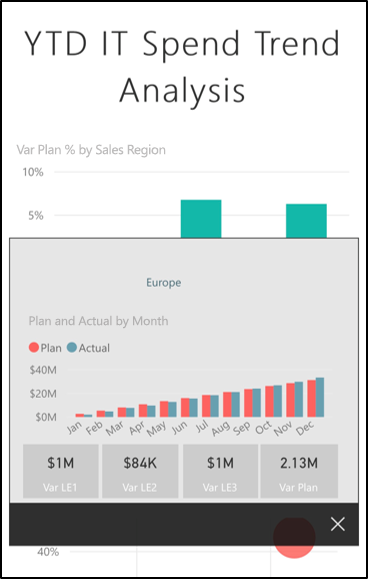
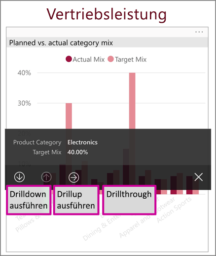
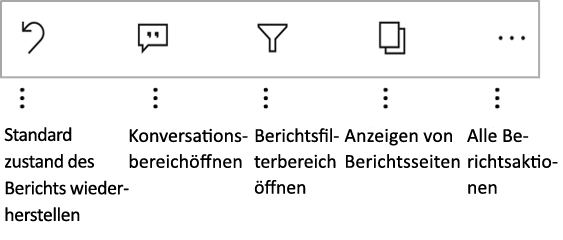
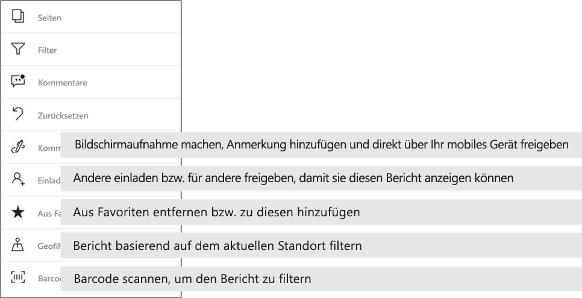

# Durchsuchen von Berichten in den mobilen Power BI-Apps
Gilt für:

|  |  |  |  |  |
|:--- |:--- |:--- |:--- |:--- |
| iPhones |iPads |Android-Telefone |Android-Tablets |Windows 10-Geräte |

Ein Power BI-Bericht ist eine interaktive Ansicht Ihrer Daten, und mit den darin enthaltenen Visuals werden unterschiedliche Ergebnisse und Erkenntnisse zu diesen Daten dargestellt. Das Anzeigen von Berichten in den mobilen Power BI-Apps ist der dritte Schritt in einem dreistufigen Prozess.

1. [Erstellen Sie Berichte in Power BI Desktop](../../desktop-report-view.md). Sie können in Power BI Desktop sogar [einen Bericht für Telefone optimieren](mobile-apps-view-phone-report.md). 
2. Veröffentlichen Sie diese Berichte im Power BI-Dienst [(https://powerbi.com)](https://powerbi.com) oder auf dem [Power BI-Berichtsserver](../../report-server/get-started.md).  
3. Anschließend können Sie in den mobilen Power BI-Apps mit diesen Berichten interagieren.

## Öffnen eines Power BI-Berichts in der mobilen App
Power BI-Berichte werden abhängig von ihrer Herkunft an verschiedenen Stellen in der mobilen App gespeichert. Sie können sich in „Apps“, „Für mich freigegeben“, „Arbeitsbereiche“ (einschließlich „Mein Arbeitsbereich“) oder auf einem Berichtsserver befinden. Manchmal müssen Sie einen Bericht in einem entsprechenden Dashboard suchen, und manchmal sind Berichte aufgelistet.

In Listen und Menüs finden Sie ein Symbol neben einem Berichtsnamen, an dem Sie erkennen können, dass es sich bei diesem Element um einen Bericht handelt. 

 

Es gibt zwei Symbole für Berichte in mobilen Power BI-Apps:

*  Gibt einen Bericht an, der in der App in Querformat dargestellt wird und genauso aussieht, wie im Browser.

*  Gibt einen Bericht an, der mindestens eine für Smartphones optimierte Berichtsseite enthält, die im Hochformat dargestellt wird. 

Hinweis: Wenn Sie Ihr Telefon im Querformat halten, wird immer das Querformat angezeigt, auch wenn die Berichtsseite ein Layout für Smartphones hat. 

Um den Bericht von einem Dashboard abzurufen, tippen Sie auf die Auslassungspunkte (...) in der rechten oberen Ecke einer Kachel, und wählen Sie dann **Bericht öffnen** aus.
  
  
  
  Nicht alle Kacheln verfügen über eine Option zum Öffnen als Bericht. Beispielsweise werden für Kacheln, die durch Stellen einer Frage im Q&A-Feld erstellt wurden, keine Berichte geöffnet, wenn Sie auf die Kachel tippen. 
  
## Interagieren mit Berichten
Nachdem Sie einen Bericht in der App geöffnet haben, können Sie mit diesem arbeiten. Mit Ihrem Bericht und den darin enthaltenen Daten haben Sie viele Möglichkeiten. In der Fußzeile des Berichts finden Sie Aktionen, die Sie mit dem Bericht durchführen können. Durch Antippen und langes Antippen der im Bericht angezeigten Daten können Sie die Daten auch aufteilen.

### Verwenden von Antippen und langem Antippen
Tippen entspricht einem Mausklick. Wenn Sie den Bericht auf Grundlage eines Datenpunkts übergreifend hervorheben möchten, tippen Sie auf den Datenpunkt.
Wenn Sie auf einen Datenschnittwert tippen, wird der Wert ausgewählt und für die restlichen Daten im Bericht wird anhand dieses Werts der Datenschnitt durchgeführt. Wenn Sie auf einen Link, eine Schaltfläche oder ein Lesezeichen tippen, wird dieser auf der Grundlage der vom Autor definierten Aktion aktiviert.

Wahrscheinlich haben Sie bemerkt, dass ein Rahmen angezeigt wird, wenn Sie auf ein Visual tippen. In der rechten oberen Ecke des Rahmens finden Sie Auslassungspunkte (...). Wenn Sie darauf tippen, wird ein Menü mit Aktionen angezeigt, die Sie in diesem Visual ausführen können.

### QuickInfo-und Drillaktionen

Wenn Sie einen Datenpunkt lange antippen (tippen und halten), erscheint eine QuickInfo mit den Werten, die dieser Datenpunkt repräsentiert. 

Wenn der Berichtsautor die QuickInfo der Berichtsseite konfiguriert hat, wird die standardmäßige QuickInfo durch die QuickInfo der Berichtsseite ersetzt.

> [!NOTE]
> Berichts-QuickInfos werden für Geräte mit einer Größe von mehr als 640 Pixel und 320 Viewports unterstützt. Wenn Ihr Gerät kleiner ist, verwendet die APP standardmäßig QuickInfos.

Berichtsautoren können Hierarchien in den Daten und Beziehungen zwischen den Berichtsseiten definieren. Die Hierarchie ermöglicht den Drilldown, Drillup und Drillthrough durch eine andere Berichtsseite aus einem Visual und einem Wert. Wenn Sie also zusätzlich zur QuickInfo lange auf einen Wert tippen, werden in der Fußzeile die entsprechenden Drilloptionen angezeigt. 

Wenn Sie beim *Drillthrough* auf einen bestimmten Teil eines Visual tippen, gelangen Sie zu einer anderen Berichtsseite, die nach dem Wert gefiltert ist, auf den Sie getippt haben.  Der Autor eines Berichts kann mindestens eine Drillthroughoption festlegen, durch die Sie auf eine andere Seite weitergeleitet werden. In diesem Fall können Sie entscheiden, auf welche Seite Sie einen Drillthrough durchführen möchten. Über die Schaltfläche „Zurück“ gelangen Sie auf die vorherige Berichtsseite.

Erfahren Sie, wie Sie [Drillthrough in Power BI Desktop verwenden](../../desktop-drillthrough.md).
   
   > [!IMPORTANT]
   > In der mobilen Power BI-App wird die Drillaktion in Matrix- und Tabellenvisuals nur durch einen Zellenwert und nicht durch Spalten- und Zeilenkopfzeilen aktiviert.
   
   
   
### Verwenden der Aktionen in der Fußzeile des Berichts
Die Berichtsfußzeile enthält Aktionen, die Sie auf der aktuellen Berichtsseite oder im gesamten Bericht ausführen können. Über die Fußzeile haben Sie schnellen Zugriff auf die nützlichsten Aktionen, und alle Aktionen können über die Auslassungspunkte (...) abgerufen werden.

Folgende Aktionen können Sie in der Fußzeile ausführen:
1) Zurücksetzen des Berichtsfilters und der übergreifenden Hervorhebungsauswahl in den ursprünglichen Zustand.
2) Öffnen des Kommentarbereichs zum Anzeigen oder Hinzufügen von Berichten zu diesem Bericht.
3) Öffnen des Filterbereich, um den derzeit auf den Bericht angewendeten Filter anzuzeigen und zu ändern.
4) Auflisten aller Seiten in diesem Bericht. Wenn Sie auf den Seitennamen tippen, wird diese Seite geladen und angezeigt.
Um zwischen den Berichtsseiten zu wechseln, können Sie vom Rand des Bildschirms in die Mitte wischen.
5) Anzeigen aller Berichtsaktionen.

#### Alle Berichtsaktionen
Wenn Sie auf die Option .... in der Fußzeile des Berichts tippen, werden alle Aktionen angezeigt, die Sie für einen Bericht ausführen können. 

Einige der Aktionen können deaktiviert sein, da sie von den spezifischen Berichtsfunktionen abhängig sind.
Beispiel:
1) **Nach aktuellem Speicherort filtern** ist aktiviert, wenn die Daten in Ihrem Bericht vom Autor anhand geografischer Daten kategorisiert wurden. [In diesem Artikel erfahren Sie mehr darüber, wie Sie geografische Daten in Ihrem Bericht identifizieren](https://docs.microsoft.com/power-bi/desktop-mobile-geofiltering).
2) **Der Scan zum Filtern des Berichts nach Barcode** ist nur aktiviert, wenn das Dataset in Ihrem Bericht als Barcode gekennzeichnet wurde. [Markieren eines Tags in Power BI Desktop](https://docs.microsoft.com/power-bi/desktop-mobile-barcodes). 
3) **Einladen** ist nur aktiviert, wenn Sie über die Berechtigung verfügen, diesen Bericht für andere Benutzer freizugeben. Sie verfügen nur über diese Berechtigung, wenn Sie der Besitzer des Berichts sind oder wenn Sie vom Besitzer die Berechtigung zum erneuten Freigeben erhalten haben.
4) **Kommentieren und freigeben** kann deaktiviert sein, wenn in Ihrer Organisation eine [Intune-Schutzrichtlinie](https://docs.microsoft.com/intune/app-protection-policies) vorhanden ist, die die Freigabe über eine mobile Power BI-App untersagt. 

## Nächste Schritte
* [Anzeigen von und Interagieren mit Power BI-Berichten, die für das Smartphone optimiert sind](mobile-apps-view-phone-report.md)
* [Erstellen einer für Smartphones optimierten Version eines Berichts](../../desktop-create-phone-report.md)
* Haben Sie Fragen? [Stellen Sie Ihre Frage in der Power BI-Community.](http://community.powerbi.com/)

