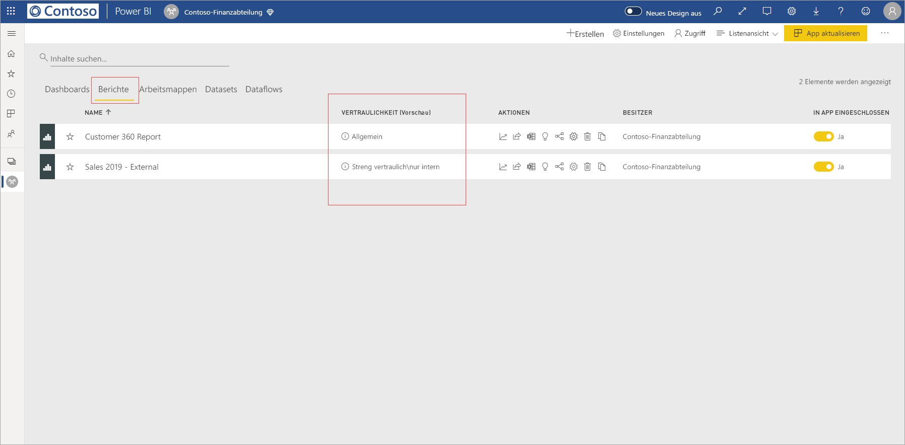
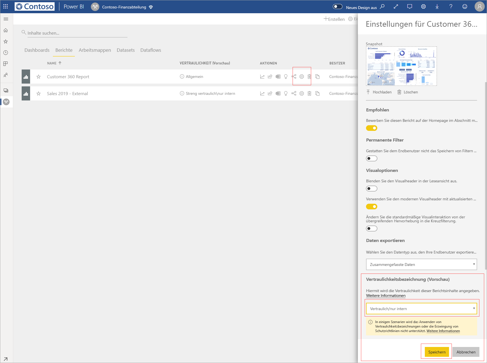
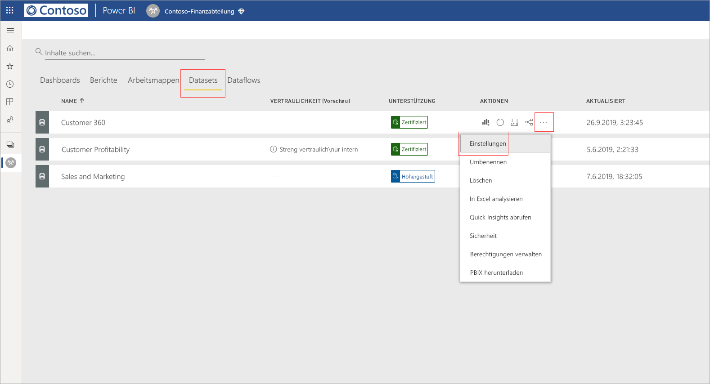
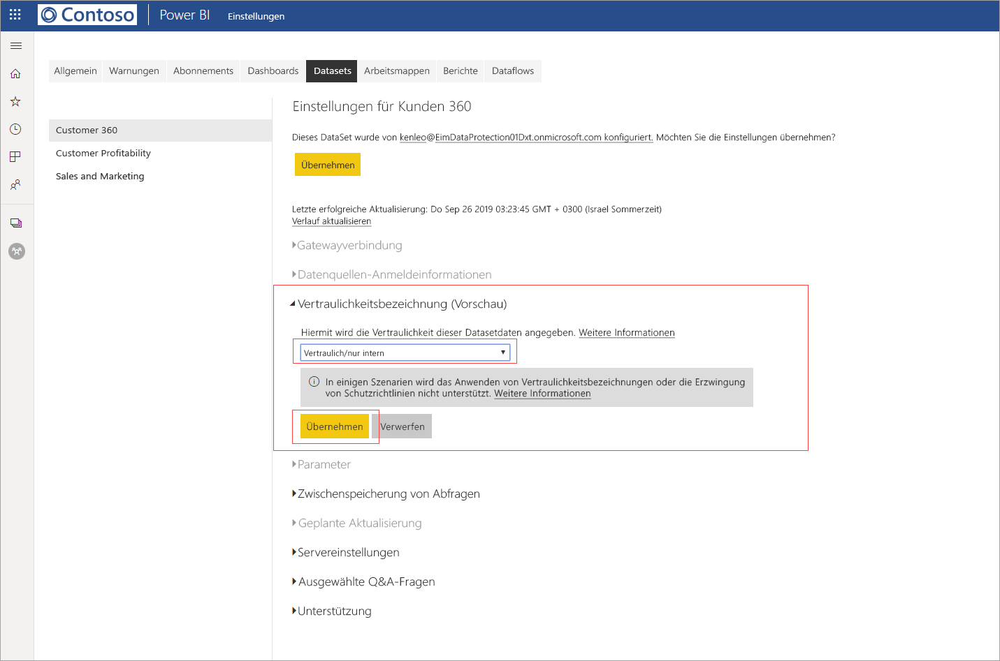
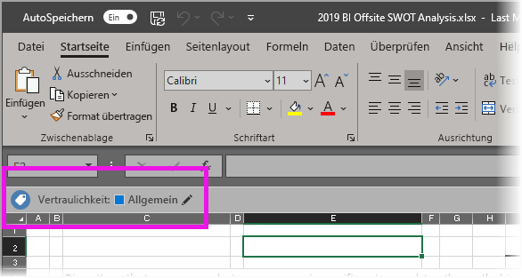

# Anwenden von Vertraulichkeitsbezeichnungen auf Daten in Power BI (Vorschau)

Wenn im Power BI-Dienst Vertraulichkeitsbezeichnungen aktiviert sind, können Sie Ihre Dashboards, Berichte, Datasets und Dataflows vor einem unbefugten Zugriff und Verlust schützen, indem Sie Vertraulichkeitsbezeichnungen anwenden. Die korrekte Kennzeichnung Ihrer Daten mit Vertraulichkeitsbezeichnungen stellt sicher, dass nur autorisierte Personen auf Ihre Daten zugreifen können.

Wenn der Datenschutz aktiviert ist, werden in der Listenansicht von Dashboards, Berichten, Datasets und Dataflows in der Spalte zur Vertraulichkeit Vertraulichkeitsbezeichnungen angezeigt.

> [!NOTE]
> Zum Anwenden von Vertraulichkeitsbezeichnungen Power BI-Dashboards, -Berichte, -Datasets und -Dataflows werden bestimmte Lizenzen und Berechtigungen benötigt. Ausführliche Informationen hierzu finden Sie unter [Anwenden von Vertraulichkeitsbezeichnungen](#applying-sensitivity-labels).

## Anwenden von Vertraulichkeitsbezeichnungen

Um in Power BI Vertraulichkeitsbezeichnungen anwenden zu können, müssen Sie und Ihre Organisation die folgenden Anforderungen erfüllen:

* Ihre Organisation muss über definierte Vertraulichkeitsbezeichnungen verfügen, die entweder im [Microsoft 365 Security Center](https://security.microsoft.com/) oder im [Microsoft 365 Compliance Center](https://compliance.microsoft.com/) definiert sind.
* Sie müssen einer Sicherheitsgruppe angehören, die über die Berechtigung zum Anwenden von Vertraulichkeitsbezeichnungen auf Daten verfügt, wie in dem Artikel [Aktivieren von Vertraulichkeitsbezeichnungen für Daten in Power BI (Vorschau)](../admin/service-security-enable-data-sensitivity-labels.md#enable-data-sensitivity-labels) beschrieben.
* Sie müssen über eine Power BI Pro-Lizenz und Bearbeitungsberechtigungen für die Ressourcen verfügen, die Sie kennzeichnen möchten. 
* Sie müssen über eine Azure Information Protection Premium P1- oder Premium P2-Lizenz verfügen. Microsoft Azure Information Protection kann entweder als eigenständige Version oder über eines der Microsoft-Lizenzpakete erworben werden. Ausführliche Informationen finden Sie unter [Azure Information Protection – Preise](https://azure.microsoft.com/pricing/details/information-protection/).

Um eine Vertraulichkeitsbezeichnung auf einen Bericht anzuwenden oder sie zu ändern, klicken Sie auf das Symbol für die Berichtseinstellungen im Listenelement des Arbeitsbereichs, und wechseln Sie dann zum Abschnitt zur Datenvertraulichkeit im Seitenbereich „Einstellungen“. Wählen Sie die geeignete Vertraulichkeitsbezeichnung aus, und speichern Sie die Einstellungen.

Die aktualisierte Vertraulichkeitsbezeichnung wird in der Spalte zur Vertraulichkeit angezeigt. 

Das Anwenden oder Ändern einer Vertraulichkeitsbezeichnung für ein Dashboard erfolgt nach dem gleichen Verfahren wie bei Berichten. 

Sie können auch Vertraulichkeitsbezeichnungen für Datasets und Dataflows festlegen. Der folgende Screenshot zeigt, wie Sie eine Vertraulichkeitsbezeichnung für ein Dataset festlegen. Die Schritte für einen Dataflow sind ähnlich.

Um eine Vertraulichkeitsbezeichnung für ein Dataset festzulegen, klicken Sie auf die drei Punkte für das Dataset, für das Sie eine Bezeichnung festlegen möchten. Wählen Sie anschließend **Einstellungen** aus.

Öffnen Sie auf Einstellungsseite für das Dataset den Abschnitt für Vertraulichkeitsbezeichnungen, wählen Sie die gewünschte Vertraulichkeitsbezeichnung aus, und klicken Sie auf **Anwenden**.

Das Anwenden oder Ändern einer Vertraulichkeitsbezeichnung für eine Dataflow erfolgt nach dem gleichen Verfahren wie bei Datasets.

## Datenschutz in exportierten Dateien

Wenn Sie [Daten aus einem Bericht exportieren](https://docs.microsoft.com/power-bi/consumer/end-user-export), für die eine Vertraulichkeitsbezeichnung festgelegt wurde, erbt die generierte Datei (Excel, PowerPoint und PDF, CSV wird nicht unterstützt) die Vertraulichkeitsbezeichnung. Die Vertraulichkeitsbezeichnung ist in der Datei sichtbar, und der Zugriff auf die Datei wird auf die Benutzer beschränkt, die über ausreichende Berechtigungen verfügen.

## Überlegungen und Einschränkungen

Berücksichtigen Sie bei der Anwendung von Vertraulichkeitsbezeichnungen Folgendes:

* Für das Anwenden und Anzeigen von Microsoft Information Protection-Vertraulichkeitsbezeichnungen in Power BI wird eine Azure Information Protection Premium P1- oder Premium P2-Lizenz benötigt. Microsoft Azure Information Protection kann entweder als eigenständige Version oder über eines der Microsoft-Lizenzpakete erworben werden. Ausführliche Informationen finden Sie unter [Azure Information Protection – Preise](https://azure.microsoft.com/pricing/details/information-protection/).
* Vertraulichkeitsbezeichnungen können nur auf Dashboards, Berichte, Datasets und Dataflows angewendet werden.
* Das Erzwingen von Bezeichnungen und Schutzeinstellungen für exportierte Dateien wird nur für Excel-, PowerPoint- und PDF-Dateien unterstützt. Bezeichnungen und Schutzeinstellungen werden nicht erzwungen, wenn Daten in CSV-Dateien exportiert, E-Mails abonniert, Visuals eingebettet und gedruckt werden.
* Ein Benutzer, der eine Datei aus Power BI exportiert, kann gemäß den Einstellungen der Vertraulichkeitsbezeichnung auf diese Datei zugreifen und sie bearbeiten. Ein Benutzer, der Daten in eine Datei exportiert, erhält keine Besitzerberechtigungen für die Datei. 
* Vertraulichkeitsbezeichnungen stehen für [paginierte Berichte]( https://docs.microsoft.com/power-bi/paginated-reports-report-builder-power-bi) und Arbeitsmappen aktuell nicht zur Verfügung. 
* Sie können eine Bezeichnung aktuell nicht aus einem Power BI-Asset löschen, nachdem sie angewendet wurde.
* Vertraulichkeitsbezeichnungen für Power BI-Assets sind nur in der Arbeitsbereichsliste und in Herkunftsansichten sichtbar. In den Ansichten „Favoriten“, „Für mich freigegeben“, „Kürzlich verwendet“ oder in der App-Ansicht werden Bezeichnungen aktuell nicht angezeigt. Beachten Sie jedoch, dass eine auf ein Power BI-Asset angewendete Vertraulichkeitsbezeichnung – auch wenn sie nicht sichtbar ist – immer dauerhaft mit den Daten gespeichert wird, die in Excel-, PowerPoint- und PDF-Dateien exportiert werden.
* Die Vertraulichkeitsbezeichnung *Dateiverschlüsselungseinstellung*, die entweder im [Microsoft 365 Security Center](https://security.microsoft.com/) oder im [Microsoft 365 Compliance Center](https://compliance.microsoft.com/) konfiguriert ist, gilt nur für Dateien, die aus Power BI *exportiert werden*. Es erfolgt keine Erzwingung *innerhalb von Power BI*.
* [HYOK-Schutz](https://docs.microsoft.com/azure/information-protection/configure-adrms-restrictions) (Hold Your Own Key) wird für in Power BI angewendete Bezeichnungen nicht unterstützt.
* Für das Anzeigen und Anwenden von Bezeichnungen in Office-Apps gelten [Lizenzanforderungen](https://docs.microsoft.com/microsoft-365/compliance/sensitivity-labels-office-apps#subscription-and-licensing-requirements-for-sensitivity-labels).
* Vertraulichkeitsbezeichnungen werden nur für Mandanten in der globalen (öffentlichen) Cloud unterstützt. Für Mandanten in anderen Clouds werden keine Vertraulichkeitsbezeichnungen unterstützt.

## Nächste Schritte

In diesem Artikel wurde beschrieben, wie Sie Vertraulichkeitsbezeichnungen auf Daten in Power BI anwenden. Die folgenden Artikel stellen ausführlichere Informationen zum Datenschutz in Power BI bereit. 

* [Übersicht über den Datenschutz in Power BI](../admin/service-security-data-protection-overview.md)
* [Aktivieren von Vertraulichkeitsbezeichnungen für Daten in Power BI](../admin/service-security-enable-data-sensitivity-labels.md)
* [Verwenden von Microsoft Cloud App Security-Steuerelementen in Power BI](../admin/service-security-using-microsoft-cloud-app-security-controls.md)