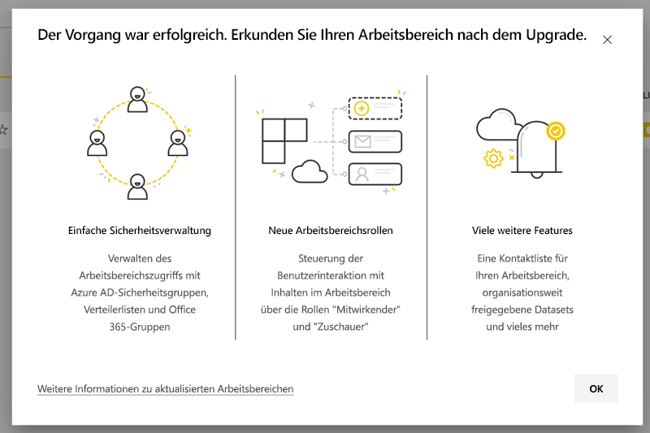
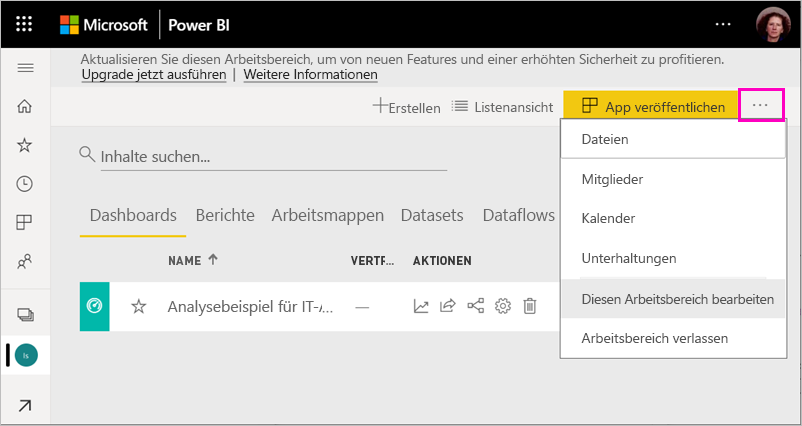
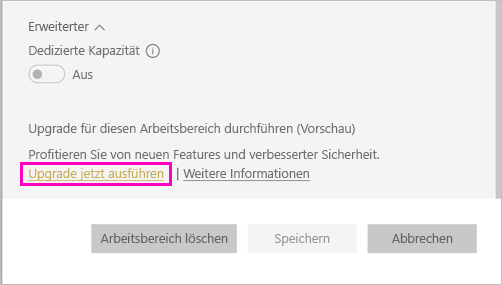
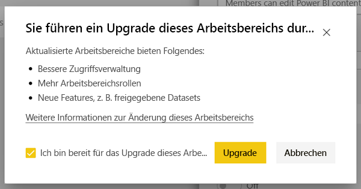
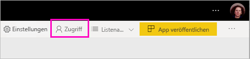
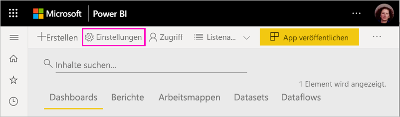
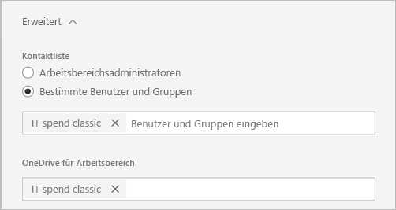
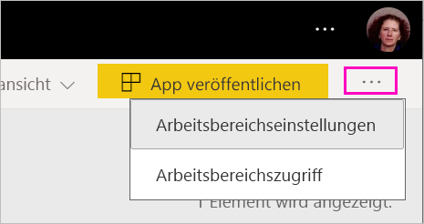
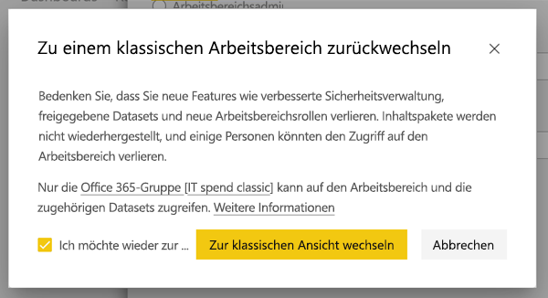
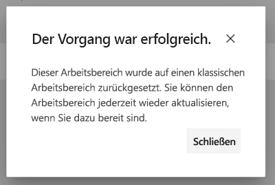

# Aktualisieren klassischer Arbeitsbereiche auf die neuen Arbeitsbereiche in Power BI

In diesem Artikel wird erläutert, wie ein klassischer Arbeitsbereich auf den neuen Arbeitsbereich aktualisiert wird. Sie können einen beliebigen klassischen Arbeitsbereich aktualisieren. Die neuen Arbeitsbereiche verfügen über präzisere Arbeitsbereichsrollen, sodass Sie den Zugriff auf Inhalte besser verwalten können. Sie können aktualisierte Arbeitsbereiche flexibler verwalten, da sie enger mit ihrer ursprünglichen Office 365-Gruppe verbunden sind. Erfahren Sie mehr [über die neuen Arbeitsbereiche](../service-new-workspaces.md). 

>[!NOTE]
>Diese Dokumentation ist eine Vorabversion und erläutert eine Funktion, die noch nicht verfügbar ist. Wir haben sie veröffentlicht, damit Sie sich auf die neue Funktion vorbereiten und Fragen, die sich vor der Veröffentlichung ergeben, klären können.  

Möglicherweise gibt es jedoch Änderungen an Ihrem Arbeitsbereich, die Sie berücksichtigen und entsprechend planen müssen. Beispielsweise werden Inhaltspakete im neuen Arbeitsbereiche nicht unterstützt. Weitere Informationen finden Sie weiter unten in diesem Artikel im Abschnitt [Überlegungen und Einschränkungen zum Upgrade](#upgrade-considerations-and-limitations).

## Aufgaben nach dem Upgrade

*Nach* dem Upgrade müssen Sie einige Aufgaben durchführen. Es empfiehlt sich, diese Aufgaben *vor* dem Upgrade zu planen:
- Überprüfen Sie die Zugriffsliste, und stellen Sie fest, welche [Berechtigungen nach dem Upgrade](#permissions-after-upgrade) erforderlich sind.
- Überprüfen Sie die [Kontaktliste](#modify-the-contact-list), und stellen Sie sicher, dass sie Ihren Wünschen entspricht.
- Sie sollten sich jetzt mit dem [neuen Arbeitsbereich](../service-new-workspaces.md) vertraut machen, wenn das noch nicht geschehen ist.

## Aktualisieren eines klassischen Arbeitsbereichs

Alle Arbeitsbereichsadministratoren können den Arbeitsbereich aktualisieren. Um der Arbeitsbereichsadministrator für einen klassischen Arbeitsbereiche zu sein, müssen Sie der Besitzer der zugrunde liegenden Office 365-Gruppe sein. Führen Sie die folgenden Schritte aus, um einen Arbeitsbereich zu aktualisieren.

1. Wählen Sie in der Inhaltsliste des Arbeitsbereichs **Weitere Optionen** ( **...** ) > **Diesen Arbeitsbereich bearbeiten** aus.

    

1. Klappen Sie den Bereich **Erweitert** aus, und wählen Sie **Upgrade jetzt ausführen** aus.

    

1. Überprüfen Sie die Informationen im Dialogfeld. Es werden Warnungen angezeigt, wenn Sie im Arbeitsbereich Inhaltspakete veröffentlicht oder installiert haben. Wenn Sie bereit sind, aktivieren Sie das Kontrollkästchen **Ich bin bereit für das Upgrade dieses Arbeitsbereichs**, und wählen Sie dann **Aktualisieren** aus.

    

2. Während des Upgrades wird die Meldung **Upgrade wird durchgeführt** angezeigt. Das Upgrade Ihres Arbeitsbereichs dauert in der Regel weniger als eine Minute.

1. Nach Abschluss des Upgrades wird das Dialogfeld **Erfolg** angezeigt. Es wird empfohlen, den Artikel [Organisieren der Arbeit in den neuen Power BI-Arbeitsbereichen](../service-new-workspaces.md) zu lesen. Darin werden die Unterschiede zwischen neuen und klassischen Arbeitsbereichen erläutert.

### Einfluss auf andere Benutzer des Arbeitsbereichs

Es wird empfohlen, das Upgrade außerhalb der Geschäftszeiten durchführen, wenn nur wenige Benutzer Elemente im Arbeitsbereich aktiv anzeigen oder bearbeiten.

Benutzer, die den Arbeitsbereich aktiv verwenden, werden aufgefordert, ihren Browser zu aktualisieren. Benutzer, die einen Bericht bearbeiten, können diesen vor dem Aktualisieren speichern.

## Überlegungen und Einschränkungen zum Upgrade

- Die URLs und IDs Ihres Arbeitsbereichs, dessen Inhalt und die über den Arbeitsbereich veröffentlichte App ändern sich nicht. Inhalte aus in Ihrem Arbeitsbereich installierten Inhaltspaketen werden separat behandelt. Weitere Informationen finden Sie unter [Inhaltspakete während des Upgrades](#content-packs-during-upgrade) in diesem Artikel.
- Inhaltspakete werden im neuen Arbeitsbereiche nicht unterstützt. Lesen Sie [Veröffentlichte Inhaltspakete](#published-content-packs) oder [Installierte Inhaltspakete](#installed-content-packs), um mehr darüber zu erfahren, wie diese während des Upgrades behandelt werden. Wir empfehlen, die in Ihrem Arbeitsbereich installierten oder veröffentlichten Inhaltspakete vor dem Upgrade zu löschen.
- Die Office 365-Gruppe für Ihren klassischen Arbeitsbereich ist vom Arbeitsbereichsupgrade in Power BI nicht betroffen. Jegliche Teams, SharePoint-Websites, Postfächer oder andere, von Office 365 verwaltete Ressourcen werden nicht geändert. Sie bleiben nach dem Upgrade Ihres Power BI-Arbeitsbereichs aktiv. Die Office 365-Gruppe bleibt unverändert vorhanden.
- Der Schutz des Arbeitsbereichs nach dem Upgrade ändert sich jedoch. Weitere Informationen finden Sie im Abschnitt [Arbeitsbereichsberechtigungen nach dem Upgrade](#permissions-after-upgrade).
- Bei Bedarf haben Sie die Möglichkeit, wieder **in einen klassischen Arbeitsbereich zu wechseln**. Allerdings werden einige Elemente Ihres Arbeitsbereichs nicht vollständig im Zustand vor dem Upgrade wiederhergestellt. Wenn Sie mit der Verwendung von Features beginnen, die nur im neuen Arbeitsbereich funktionieren, können Sie nicht mehr in den klassischen Arbeitsbereich wechseln. Die Option zum Zurückwechseln ist für 30 Tage nach dem Upgrade verfügbar.

## Berechtigungen nach dem Upgrade

Wählen Sie **Zugriff** in der Menüleiste am oberen Rand der Inhaltsliste des Arbeitsbereichs aus, um die Berechtigungen nach dem Upgrade zu überprüfen.

Jeder Office 365-Gruppenbesitzer wird einzeln zur Administratorrolle für den aktualisierten Arbeitsbereich hinzugefügt. Die Office 365-Gruppe selbst wird zu einer Arbeitsbereichsrolle hinzugefügt. Die Rolle, der sie hinzugefügt wird, hängt davon ab, ob der klassische Arbeitsbereich *schreibgeschützt* ist oder eine *Lese-/Schreibberechtigung* hat:

- Wenn der Arbeitsbereich auf **Mitglieder können Power BI-Inhalt bearbeiten** festgelegt ist, wird die Office 365-Gruppe nach dem Upgrade zur Zugriffsliste für den Arbeitsbereich mit der Rolle **Mitglied** hinzugefügt.
- Wenn der Arbeitsbereich auf **Mitglieder können Power BI-Inhalt nur lesen** festgelegt ist, wird die Office 365-Gruppe nach dem Upgrade zur Zugriffsliste für den Arbeitsbereich mit der Rolle **Betrachter** hinzugefügt.

Da der Office 365-Gruppe eine Rolle im Arbeitsbereich zugewiesen wird, hat jeder Benutzer, der nach dem Upgrade zur Office 365-Gruppe hinzugefügt wird, im Arbeitsbereich ebenfalls diese Rolle. Wenn Sie jedoch nach dem Upgrade neue Besitzer zur Office 365-Gruppe hinzufügen, haben diese nicht die Rolle des Administrators für den Arbeitsbereich.

### Unterschiede bei Rollen vor und nach dem Upgrade

Die Arbeitsbereichsrollen in den klassischen und neuen Arbeitsbereichen unterscheiden sich. Im neuen Arbeitsbereich können Sie Arbeitsbereichsrollen für Office 365-Gruppen, Sicherheitsgruppen und Verteilerliste zuweisen.

- **Mitglieder** können einzelne Elemente freigeben und mithilfe der Rollen „Mitglied“, „Mitwirkender“ oder „Betrachter“ Zugriff auf den gesamten Arbeitsbereich erteilen.
- **Betrachter** können nur mit der Erstellungsberechtigung Inhalte anzeigen und zugrundeliegenden Daten exportieren oder Arbeitsbereichsdatasets in Excel analysieren.

Alle Benutzer, die über eine Freigabe- oder App-Berechtigung Zugriff auf Elemente im Arbeitsbereich haben, können weiterhin auf diese Elemente zugreifen. Jeder, der Zugriff auf den Arbeitsbereich hat, kann auch auf die aus dem Arbeitsbereich veröffentlichte App zugreifen. Diese Benutzer sind nicht in der Zugriffsliste der App aufgeführt.

Es wird empfohlen, die neue Rolle „Mitwirkender“ zu verwenden. Nach dem Upgrade können Sie der Office 365-Gruppe über den Zugriffsbereich die Rolle „Mitwirkender“ zuweisen.

Nach dem Upgrade können Sie eine Sicherheits- oder Office 365-Gruppe oder Verteilerliste für Arbeitsbereichsadministratoren erstellen, anstatt den Zugriff über Rollenzuweisungen an einzelne Benutzer zu verwalten.

Weitere Informationen finden Sie [Rollen in den neuen Arbeitsbereichen](../service-new-workspaces.md#roles-in-the-new-workspaces).

## Lizenzierung nach dem Upgrade

Benutzer mit den Arbeitsbereichsrollen „Administrator“, „Mitglied“ oder „Mitwirkender“ benötigen für den Zugriff auf den Arbeitsbereich eine Power BI Pro-Lizenz.

Wenn sich der Arbeitsbereich in der gemeinsam genutzten Kapazität befindet, benötigen Benutzer in der Arbeitsbereichsrolle „Betrachter“ für den Zugriff auf den Arbeitsbereich ebenfalls eine Power BI Pro-Lizenz. Wenn sich der Arbeitsbereich jedoch in einer Premium-Kapazität befindet, ist die Pro-Lizenz für den Zugriff auf den Arbeitsbereich für die Rolle „Betrachter“ nicht erforderlich.

## Andere Features des neuen Arbeitsbereichs

Der neue Arbeitsbereich verfügt über Features, die die klassischen Arbeitsbereiche nicht bieten. Ein Unterschied besteht darin, dass Sie für Administratoren oder Besitzer des Arbeitsbereichs eine andere Kontaktliste festlegen können. Eine Gemeinsamkeit ist, dass sie weiterhin mit der SharePoint-Dokumentbibliothek der Office 365-Gruppe verbunden ist. 

### Ändern der Kontaktliste

1. Wählen Sie **Einstellungen** in der Menüleiste am oberen Rand der Inhaltsliste des Arbeitsbereichs aus, um auf die Einstellungen des Arbeitsbereichs zuzugreifen.

    

2. Unter **Erweitert** ist der Arbeitsbereich **Kontaktliste** als Office 365-Gruppe konfiguriert, von der aus der Arbeitsbereich aktualisiert wurde. Sie können weitere Benutzer oder Gruppen zur Kontaktliste hinzufügen oder sie auf Arbeitsbereichsadministratoren umstellen.

    

### Der Arbeitsbereich „OneDrive“ 

Nach dem Upgrade wird der Arbeitsbereich **OneDrive** mit der SharePoint-Dokumentbibliothek der Office 365-Gruppe verbunden. Diese Dokumentbibliothek wird unter **Daten abrufen > Dateien** als **OneDrive**-Option angezeigt. Beachten Sie, dass nicht alle Benutzer des Arbeitsbereichs die Berechtigung für diese Dokumentenbibliothek haben, wenn sie nicht zur Office 365-Gruppe gehören.

## Inhaltspakete während des Upgrades

Inhaltspakete werden im neuen Arbeitsbereiche nicht unterstützt. Verwenden Sie stattdessen Apps und freigegebene Datasets, um Inhalte im Arbeitsbereich zu verteilen. Es wird empfohlen, veröffentlichte oder installierte Inhaltspakete vor dem Upgrade aus dem Arbeitsbereich zu entfernen. Wenn jedoch beim Aktualisieren veröffentlichte oder installierte Inhaltspakete vorhanden sind, versucht der Upgradeprozess, die Inhalte beizubehalten, wie nachfolgend beschrieben.  Das Inhaltspaket oder die Zuordnung von Inhalten zum Inhaltspaket können nach dem Upgrade nicht wiederhergestellt werden.

### Veröffentlichte Inhaltspakete

Aus dem Arbeitsbereich veröffentliche Inhaltspakete werden während des Upgrades entfernt. Sie können sie nach dem Upgrade nicht mehr veröffentlichen oder aktualisieren, auch wenn Sie wieder in den klassischen Arbeitsbereich zurückkehren. Wenn andere Benutzer Ihr Inhaltspaket in ihren eigenen Arbeitsbereichen installiert haben, wird ihnen nach dem Upgrade eine Kopie des Inhalts des Inhaltspakets in ihren Arbeitsbereichen angezeigt. Weitere Informationen finden Sie im Abschnitt **Installierte Inhaltspakete**.

### Installierte Inhaltspakete

Wenn Sie Ihren Arbeitsbereich aktualisieren oder den Arbeitsbereich, von dem aus das Inhaltspaket veröffentlicht wird, aktualisieren, werden wichtige Änderungen an installierten Inhaltspaketen vorgenommen. Nach dem Upgrade enthält der Arbeitsbereich eine Kopie des Inhaltspakets. Es ist mit dem ursprünglichen Dataset im ursprünglichen Arbeitsbereich verbunden.

Es gibt jedoch einige wichtige Änderungen:

- Bei einer Aktualisierung des Inhaltspakets wird der Inhalt nicht mehr aktualisiert.
- Die URLs und Elementbezeichner ändern sich und erfordern, dass alle Lesezeichen oder Links, die Sie für andere freigegeben haben, aktualisiert werden.
- Alle Benutzeranpassungen an dem ursprünglichen Inhaltspaket aus Ihrem Arbeitsbereich gehen verloren. Zu den Anpassungen gehören Abonnements, Warnungen, persönliche Lesezeichen, permanente Filter und Favoriten.
- Neue Benutzer haben möglicherweise keinen Zugriff auf die Datasets im Inhaltspaket. Sie müssen mit dem Besitzer des Datasets zusammenarbeiten, um sicherzustellen, dass die Benutzer des Arbeitsbereichs Zugriff auf die Daten haben.

## Zurückwechseln zu einem klassischen Arbeitsbereich

Im Rahmen des Upgrades haben Sie die Möglichkeit, bis 30 Tage nach dem Upgrade in einen klassischen Arbeitsbereich zurückzukehren. Dadurch wird die Zuordnung von Arbeitsbereichsinhalten zur ursprünglichen Office 365-Gruppe wiederhergestellt. Diese Option ist verfügbar, falls Ihre Organisation mit dem neuen Arbeitsbereich größere Probleme hat. Es bestehen jedoch Einschränkungen. Lesen Sie zunächst den Abschnitt [Überlegungen zum Zurückwechseln in den klassischen Arbeitsbereich](#considerations-for-switching-back-to-classic) in diesem Artikel.

Zum Zurückwechseln müssen Sie ein Besitzer der Office 365-Gruppe sein, der der Arbeitsbereich vor dem Upgrade zugeordnet war. Führen Sie die folgenden Schritte aus.

1. Wählen Sie in der Inhaltsliste des Arbeitsbereichs **Weitere Optionen** ( **...** ) > **Arbeitsbereichseinstellungen** aus.

    

1. Klappen Sie den Bereich **Erweitert** aus, und wählen Sie **Zum klassischen Arbeitsbereich zurückwechseln** aus. Wenn diese Option nicht verfügbar ist, finden Sie weitere Informationen unter [Überlegungen zum Zurückwechseln in den klassischen Arbeitsbereich](#considerations-for-switching-back-to-classic) in diesem Artikel.

    

1. Wenn Sie bereit sind, aktivieren Sie das Feld **Ich bin bereit für den Wechsel zurück zum klassischen Arbeitsbereich**, und wählen Sie **Zum klassischen Arbeitsbereich wechseln** aus. In diesem Dialogfeld werden möglicherweise Warnungen oder Blocker angezeigt. Wenn diese Probleme auftreten sollten, lesen Sie den Abschnitt [Überlegungen zum Zurückwechseln in den klassischen Arbeitsbereich](#considerations-for-switching-back-to-classic) in diesem Artikel.

    

1. Wenn der Wechsel abgeschlossen ist, wird ein Bestätigungsdialogfeld angezeigt.

    

### Überlegungen zum Zurückwechseln in den klassischen Arbeitsbereich

Ein Zurückwechseln ist nicht möglich, wenn eine der folgenden Aussagen über Ihren Arbeitsbereich zutrifft:

- Die Office 365-Gruppe wurde gelöscht.
- Seit dem Upgrade sind mehr als 30 Tagen vergangen.
- Datasets im Arbeitsbereich werden von Berichten oder Dashboards in anderen Arbeitsbereichen verwendet. Wie passiert das? Angenommen, Sie haben vor dem Upgrade ein Inhaltspaket aus dem Arbeitsbereich veröffentlicht, und ein anderer Benutzer hat das Inhaltspaket in einem anderen Arbeitsbereich installiert. Unmittelbar nach dem Upgrade werden die Datasets von den Berichten und Dashboards in diesem Inhaltspaket verwendet.
- Der Arbeitsbereich ist Teil einer Verwaltungspipeline für den Anwendungslebenszyklus.
- Der Arbeitsbereich wird für Vorlagen-Apps verwendet.
- Der Arbeitsbereich verwendet die Funktion für große Modelle.
- Der Arbeitsbereich verwendet das neue Feature für Nutzungsmetriken.

Wenn Sie wieder in einen klassischen Arbeitsbereich wechseln, stellen Sie keine exakte Kopie des ursprünglichen Arbeitsbereichs wieder her. Folgende Änderungen werden vorgenommen:

- Die Berechtigungen für den Arbeitsbereich werden von der Office 365-Gruppe festgelegt, mit der der aktualisierte Arbeitsbereich ursprünglich verbunden war.
  - Alle Administratoren der Office 365-Gruppe werden zu Administratoren des klassischen Arbeitsbereichs.
  - Alle Mitglieder der Office 365-Gruppe werden zu Mitgliedern des klassischen Arbeitsbereichs. Wenn für den klassischen Arbeitsbereich die Einstellung **Mitglieder können Power BI-Inhalt nur lesen** festgelegt ist, wird diese Einstellung wiederhergestellt.
  - Alle Benutzer oder Benutzergruppen, die nach Abschluss des Upgrades dem Arbeitsbereich hinzugefügt wurden (außerhalb der Office 365-Gruppe), haben keinen Zugriff auf den Arbeitsbereich. Fügen Sie sie der Office 365-Gruppe hinzu, damit sie Zugriff erhalten. Beachten Sie, dass Office 365-Gruppen keine Schachtelung von Sicherheits- oder Verteilungsgruppen in der Mitgliedschaft erlauben.
  - Benutzer, die Zugriff auf die App für den Arbeitsbereich erhalten haben, können weiterhin zugreifen.
  - Benutzer, die per Freigabe Zugriff auf die Elemente im Arbeitsbereich erhalten haben, können weiterhin zugreifen.
- Inhaltspakete, die vor dem Upgrade aus dem klassischen Arbeitsbereich veröffentlicht wurden, werden nicht wiederhergestellt.
- Inhaltspakete, die vor dem Upgrade im klassischen Arbeitsbereich installiert wurden, werden nicht wiederhergestellt.
- Abonnements, die von Benutzern im Arbeitsbereich nach dem Upgrade erstellt wurden, werden entfernt. Abonnements, die vor dem Upgrade vorhanden waren, funktionieren weiterhin wie erwartet.
- Datenwarnungen werden nicht beibehalten. Sie werden entfernt.
- Wenn Sie den Arbeitsbereich nach dem Upgrade umbenannt haben, wird der Name des Arbeitsbereichs wiederhergestellt, sodass er mit dem Namen der Office 365-Gruppe übereinstimmt.
- Laufende Vorgänge, wie Aktualisierungen, werden durch das Upgrade des Arbeitsbereichs nicht beeinflusst.

## Verwalten der Migration Ihrer Mandanten in die neuen Arbeitsbereiche 

Einige Organisationen möchten viele oder alle Arbeitsbereiche auf den neuen Arbeitsbereich übertragen. Die Tools für das Upgrade des Arbeitsbereichs sind darauf ausgerichtet, dass Arbeitsbereichsadministratoren ein Upgrade durchführen können. Organisationen, die einen solchen Prozess verwalten wollen, können die folgenden Schritte durchführen.

1. Die Arbeitsbereichsliste im Power BI-Administratorportal und die entsprechende API bieten eine Liste aller Arbeitsbereiche in Power BI. Klassische Arbeitsbereiche werden in der Liste als Typ „Gruppe“ angezeigt.
2. Arbeiten Sie mit einzelnen Office 365-Gruppenbesitzern oder mit Ihrem Office 365-Administrator zusammen, damit diese die Arbeitsbereiche aktualisieren können. Wenn Sie den Arbeitsbereich aktualisieren möchten, müssen Sie Besitzer der Gruppe werden.

Die Funktion für das Upgrade des Arbeitsbereichs bietet keine Tools für Massen- oder programmgesteuerte Upgrades. Darüber hinaus werden neue Office 365-Gruppen, die in Ihrer Organisation erstellt wurden, weiterhin in Power BI angezeigt. 
    

## Nächste Schritte
* [Erstellen der neuen Arbeitsbereiche in Power BI](../service-create-the-new-workspaces.md)
* [Erstellen der klassischen Arbeitsbereiche](../service-create-workspaces.md)
* Haben Sie Fragen? [Stellen Sie Ihre Frage in der Power BI-Community.](https://community.powerbi.com/)
