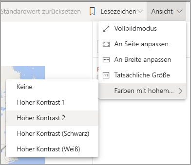
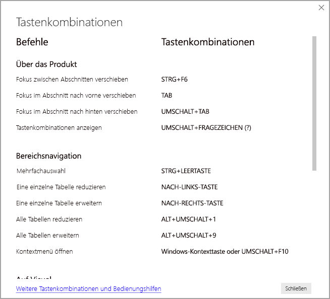
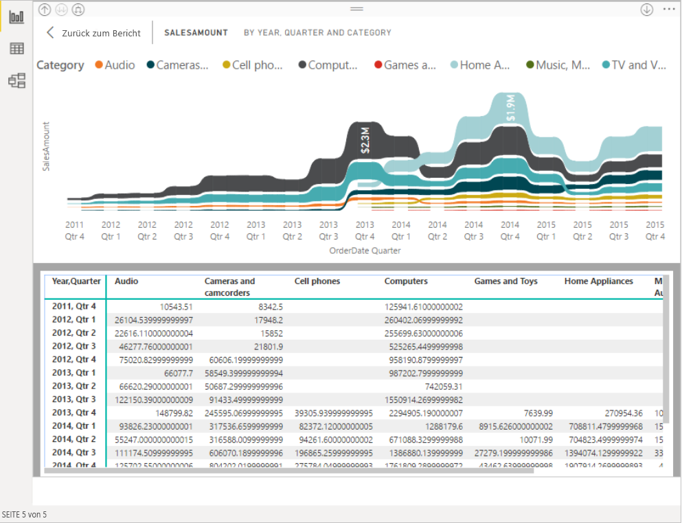

# Nutzen von Berichten in Power BI mit Barrierefreiheitstools
Power BI verfügt über viele integrierte Funktionen zur Unterstützung von Menschen mit Einschränkungen, beispielsweise für die Nutzung von und Interaktion mit Power BI-Berichten. Diese Tools helfen Benutzern dabei, dieselben Informationen aus einem Bericht zu erhalten, wie diejenigen, die keine technische Unterstützung in Anspruch nehmen.

Im Laufe dieses Artikels gibt es einige Begriffe zu beachten:

* **Fokus** beschreibt den Bereich, in dem sich Ihre Maus befindet. Dieser wird normalerweise durch einen blauen Rahmen um ein Objekt angegeben.
* **Canvas** beschreibt den Seitenbereich Ihres Berichts.

In den folgenden Abschnitten werden die Barrierefreiheitstools beschrieben, die bei der Nutzung von Power BI-Berichten zur Verfügung stehen.

## Tastaturnavigation

Wenn Sie Power BI Desktop oder den Power BI-Dienst starten, wird in der Ecke oben rechts eine QuickInfo angezeigt, sobald Sie auf die **TAB-TASTE** drücken. Der Link mit der Bezeichnung **Tipps zur Verwendung von Power BI mit Sprachausgabe** leitet Sie zu diesem Artikel weiter und stellt Informationen zur Verwendung eines Berichts mithilfe von Barrierefreiheitstools zur Verfügung. Wenn Sie auf den Link **Skip to main content** (Zum Hauptinhalt wechseln) klicken, gelangen Sie zum Berichtszeichenbereich.

Wenn Sie auf **?** klicken, wird ein Dialogfeld mit den am häufigsten verwendeten Tastenkombinationen in Power BI geöffnet. Navigieren Sie zum Link am unteren Rand des Dialogfelds, um eine vollständige Liste der in Power BI verfügbaren Tastenkombinationen anzuzeigen. Auf diese Weise gelangen Sie zum Abschnitt [Tastenkombinationen](desktop-accessibility-keyboard-shortcuts.md) in der Power BI-Dokumentation.

Sie können den Fokus zwischen den Seitenregisterkarten von Berichten oder den Objekten auf einer bestimmten Berichtsseite mithilfe von **STRG+F6** wechseln. Wenn der Fokus auf einer geladenen Berichtsseite liegt, verwenden Sie die **TABULATORTASTE**, um den Fokus auf die einzelnen Objekte auf der Seite zu bewegen. Zu diesen zählen alle Textfelder, Bilder, Formen und Diagramme. 

Im Allgemeinen können Sie in Power BI Befehle wie die **EINGABETASTE** zum Auswählen und die **ESC-TASTE** zum Beenden verwenden.

### Tastaturnavigation für Visuals

Viele Power BI-Berichtsersteller erstellen Berichte, die viele Daten enthalten. Beim Durchlaufen eines Visuals kann es ärgerlich sein, mit der Tabulatortaste durch die einzelnen Elemente zu wechseln. Die Tastaturnavigation für Visuals wurde als Hierarchie mit drei Ebenen entworfen. Diese drei Ebenen werden in den folgenden Abschnitten beschrieben.

Drücken Sie beim Navigieren zu einem Visual zum Auswählen des Visuals auf **STRG+NACH-RECHTS-TASTE**, um durch die erste Ebene zu navigieren. Nachdem Sie dieses Visual ausgewählt haben, können Sie auf die **TAB-TASTE** drücken, um die Hauptbereiche der Visualisierung zu durchlaufen. Zu diesen Hauptbereichen, die Sie durchlaufen können, gehören die Datenplotpunkte, die Kategorien der X-Achse (sofern für das Visual zutreffend) und die Legende (wenn das Visual über eine solche verfügt).

In der folgenden GIF-Grafik wird gezeigt, wie ein Benutzer die erste Ebene eines Visuals durchläuft:

Die zweite Hierarchieebene entspricht der Auswahl eines der Hauptbereiche (Datenplotbereich, Kategorien der X-Achse Legende) des Visuals. Wenn Sie einen Bericht nutzen, können Sie in einen dieser Hauptbereiche wechseln und die Datenpunkte oder Kategorien in diesem Abschnitt des Visuals durchlaufen. Nachdem Sie sich für einen Bereich entschieden haben, können Sie die **EINGABETASTE** drücken, um den jeweiligen Bereich zu durchlaufen.

Navigieren Sie zur Legende, und drücken Sie die **EINGABETASTE**, wenn Sie alle Datenpunkte in einer Reihe auswählen möchten. In der Legende können Sie die **TAB-TASTE** drücken, um durch die verschiedenen Kategorien in der Legende zu navigieren. Drücken Sie die **EINGABETASTE**, um eine bestimmte Reihe auszuwählen.

Navigieren Sie zum Datenplotbereich, und drücken Sie die **EINGABETASTE**, wenn Sie bestimmte Datenpunkte auswählen möchten. Im Datenplotbereich können Sie die **TAB-TASTE** drücken, um durch die Datenpunkte zu navigieren. Wenn das Visual mehrere Reihen enthält, können Sie die **NACH-OBEN-TASTE** oder **NACH-UNTEN-TASTE** drücken, um zu den Datenpunkten in einer anderen Reihe zu springen.

Navigieren Sie zu den Achsenbezeichnungen und drücken Sie die **EINGABETASTE**, wenn Sie alle Datenpunkte in einer Kategorieachse auswählen möchten. In den Achsenbezeichnungen können Sie die **TAB-TASTE** drücken, um durch die Bezeichnungsnamen zu navigieren. Drücken Sie die **EINGABETASTE**, um einen Bezeichnungsnamen auszuwählen.

Wenn Sie zu einer Ebene navigiert sind, können Sie die **ESC-TASTE** drücken, um aus diesem Bereich zu gelangen. Die folgende GIF-Grafik zeigt, wie ein Benutzer die Ebenen eines Visuals auswählen und verlassen kann, Datenpunkte und Kategoriebeschriftungen der X-Achse ausgewählt werden, zwischen verschiedenen Reihen gewechselt wird und wie alle Datenpunkte in einer Reihe ausgewählt werden.

Wenn Sie mit einer Tastatur nicht zu einem Objekt oder Visual navigieren können, liegt dies möglicherweise daran, dass der Autor des Berichts festgelegt hat, dass dieses Objekt in der Registerkartenreihenfolge ausgeblendet wird. Berichtsautoren legen häufig fest, dass dekorative Objekte in der Registerkartenreihenfolge ausgeblendet werden. Wenden Sie sich an den Berichtsautor, wenn Sie feststellen, dass Sie einen Bericht nicht auf logische Weise durchsuchen können. Autoren von Berichten können die Registerkartenreihenfolge für Objekte und Visuals festlegen.

### Tastaturnavigation für Slicer

Slicer verfügen ebenfalls über integrierte Barrierefreiheitsfunktionen. Verwenden Sie beim Anpassen des Werts eines Slicers die **STRG+NACH-RECHTS-TASTE**, um die verschiedenen Steuerelemente im Slicer zu durchlaufen, wenn Sie diesen auswählen. Wenn Sie z.B. zuerst **STRG + NACH-RECHTS-TASTE** drücken, liegt der Fokus auf dem Radierer. Das Drücken auf die **Leertaste** entspricht dem Klicken auf die Schaltfläche „Radierer“. Dadurch werden alle Werte im Slicer gelöscht.

Mithilfe der **TABULATORTASTE** können Sie alle Steuerelemente in einem Slicer durchlaufen. Wenn der Radierer aktiv ist, verschieben Sie den Fokus durch Drücken der **TABULATORTASTE** auf die Dropdown-Schaltfläche. Wenn Sie die **TABULATORTASTE** erneut drücken, verschieben Sie den Fokus auf den ersten Slicerwert (sofern mehrere Werte für den Slicer vorhanden sind, z.B. ein Bereich).

### Wechseln zwischen Seiten

Verwenden der **TABULATORTASTE** oder der **PFEILTASTEN** zum Bewegen des Fokus von einer Berichtsseite zur nächsten, wenn sich der Fokus auf Seitenregisterkarten des Berichts befindet. Der Titel der Berichtsseite und ihr aktueller Auswahlstatus werden von der Sprachausgabe vorgelesen. Verwenden Sie die **EINGABETASTE** oder die **LEERTASTE**, um die aktuell im Fokus stehende Berichtsseite zu laden.

### Zugreifen auf den Visualheader
Wenn Sie zwischen Visuals navigieren, können Sie **ALT + UMSCHALT + F10** drücken, um den Fokus zur Kopfzeile des Visuals zu verschieben. Die Kopfzeile des Visuals enthält verschiedene Optionen, wie das Sortieren und Exportieren der Daten hinter das Diagramm und den Fokusmodus. Es hängt von den vom Berichtsautor ausgewählten Optionen ab, welche Symbole im Visualheader angezeigt werden.

## Sprachausgabe

Wenn Sie einen Bericht anzeigen, empfiehlt es sich, den Überprüfungsmodus zu deaktivieren. Power BI sollte eher wie eine Anwendung und weniger wie ein Dokument behandelt werden, sodass dieser Dienst über eine benutzerdefinierte Navigation verfügt, um das Navigieren zu vereinfachen. Wenn Sie in Power BI Desktop eine Sprachausgabe verwenden, sollten Sie auch sicherstellen, dass die Sprachausgabe geöffnet ist, bevor Sie Power BI Desktop öffnen.

Beim Navigieren in den Objekten liest die Sprachausgabe den Objekttyp und ggf. den Titel des Objekts vor. Die Sprachausgabe liest auch eine Beschreibung dieses Objekts (alternativer Hilfetext) vor, wenn diese vom Berichtsautor bereitgestellt wird.

### Daten anzeigen
Sie können **ALT + UMSCHALT + F11** drücken, um eine barrierefreie Version des Fensters **Daten anzeigen** zu öffnen. Dadurch können Sie die im Visual verwendeten Daten in einer HTML-Tabelle untersuchen und dabei die gleichen Tastenkombinationen verwenden, die Sie normalerweise mit der Sprachausgabe verwenden.

Das Feature **Daten anzeigen** ist eine HTML-Tabelle, die nur über diese Tastenkombination für die Sprachausgabe verfügbar ist. Wenn Sie über die Option im visuellen Header **Daten anzeigen** öffnen, wird eine Tabelle angezeigt, die *nicht* mit der Sprachausgabe kompatibel ist.  Wenn Sie mithilfe von Tastenkombinationen **Daten anzeigen** verwenden, aktivieren Sie den Scanmodus, um die in Ihrer Sprachausgabe verfügbaren Hotkeys nutzen zu können.

Drücken Sie die **ESC-TASTE**, um die Option **Daten anzeigen** zu beenden und zu einem Bericht zurückzukehren.

## Modi für hohe Kontraste

Der Power BI-Dienst versucht, die für Windows ausgewählten Einstellungen für den hohen Kontrast zu erkennen. Die Effektivität und Genauigkeit dieser Erkennung hängt vom Browser ab, der den Power BI-Dienst anzeigt. Wenn Sie das Design im Power BI-Dienst manuell festlegen möchten, klicken Sie auf **Ansicht > Farben mit hohem Kontrast**, und wählen Sie dann das Design aus, das Sie auf den Bericht anwenden möchten.

## Nächste Schritte

Die Sammlung von Artikeln zur Barrierefreiheit in Power BI besteht aus den folgenden Artikeln:

* [Übersicht über die Barrierefreiheit in Power BI](desktop-accessibility-overview.md) 
* [Erstellen barrierefreier Power BI-Berichte](desktop-accessibility-creating-reports.md) 
* [Erstellen von Power BI-Berichten mit Barrierefreiheitstools](desktop-accessibility-creating-tools.md)
* [Tastenkombinationen für Barrierefreiheit für Power BI-Berichte](desktop-accessibility-keyboard-shortcuts.md)
* [Checkliste für die Barrierefreiheit von Berichten](desktop-accessibility-creating-reports.md#report-accessibility-checklist)

