# Erstellen von Berichten in Power BI mit Barrierefreiheitstools

Berichtsautoren, die Barrierefreiheitstools zur Erstellung von Berichten nutzen, bietet Power BI viele integrierte Funktionen zur Unterstützung.

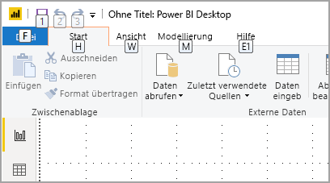

In diesem Artikel werden die vielen Typen von Barrierefreiheitstools beschrieben, die für Berichtsautoren in Power BI Desktop verfügbar sind.

## Navigation auf App-Ebene
Wenn Sie in Power BI Desktop navigieren, können Sie den Fokus in die Hauptbereiche der App verschieben, indem Sie **STRG+F6** drücken. Das Verschieben des Fokus in den Hauptbereich von Power BI Desktop erfolgt in der folgenden Reihenfolge:

1. Objekte in Canvas
2. Registerkarten
3. Bereiche (einzeln getrennt, von links nach rechts für alle geöffneten)
4. Ansichtsnavigator
5. Fußzeile
6. Anmelden
7. Gelbe Warnung/Fehler/Leiste mit Updates

In den meisten Fällen sind das Drücken der **EINGABETASTE** zum Auswählen oder Betreten eines Bereichs und dann das Drücken von **ESC** zum Verlassen gängige Verfahren in Power BI.

## Navigation über das Menüband

Drücken Sie die **ALT-TASTE**, um die kleinen Kästchen mit der Bezeichnung *Zugriffstasteninfos* über jedem Befehl anzuzeigen, der in der aktuellen Ansicht des Menübands verfügbar ist. Anschließend können Sie den Buchstaben drücken, der in den *Zugriffstasteninfos* über dem Befehl angezeigt wird, den Sie verwenden möchten. 

In der folgenden Abbildung wurde beispielsweise die **ALT-TASTE** gedrückt, um Zugriffstasteninfos anzuzeigen, die die Buchstaben für verfügbare barrierefreie Befehle enthalten. Durch Drücken von **M** wird nun die Registerkarte **Modellierung** auf dem Menüband geöffnet.

Je nachdem, welchen Buchstaben Sie drücken, werden möglicherweise weitere Zugriffstasteninfos angezeigt. Wenn beispielsweise die Registerkarte **Start** aktiv ist und Sie **W** drücken, wird die Registerkarte **Ansicht** zusammen mit den Zugriffstasteninfos für die Gruppen auf dieser Registerkarte **Ansicht** angezeigt. Sie können so lange die in den Zugriffstasteninfos angezeigten Buchstaben drücken, bis Sie den Buchstaben des gewünschten Befehls drücken. Um zur vorherigen Gruppe von Zugriffstasteninfos zu wechseln, drücken Sie **ESC**. Um die aktuelle Aktion abzubrechen und die Zugriffstasteninfos auszublenden, drücken Sie die **ALT-TASTE**.

## Navigation im Bereich „Visualisierungen“

Für die Navigation im Bereich **Visualisierungen** müssen Sie zunächst sicherstellen, dass Sie sich Ihr Fokus im Bereich befindet, indem Sie **STRG+F6** drücken, bis Sie diesen Bereich erreichen. Wenn ein Benutzer durch den Bereich „Visualisierungen“ navigiert, befindet sich der Fokus zunächst auf der Kopfzeile. Oben beginnend ist die Aktivierreihenfolge wie in der folgenden Abbildung gezeigt:

1. Kopfzeilentitel
2. Zirkumflexzeichen „Aufklappen/Zuklappen“
3. Erstes Visualsymbol

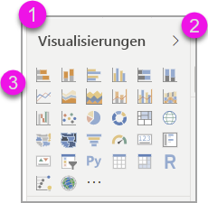

Wenn Sie zu den Visuals gelangen, können Sie mit den Pfeiltasten zu einem bestimmten Visual navigieren und es durch Drücken der **EINGABETASTE** auswählen. Wenn Sie eine Sprachausgabe verwenden, wird sie aktiviert, wenn Sie ein neues Diagramm erstellt haben, und Ihnen mitteilen, um welchen Typ es sich handelt. Oder sie teilt Ihnen mit, dass Sie ein Diagramm eines bestimmten Typs in einen anderen Diagrammtyp geändert haben. 

Nach dem Abschnitt „Visualisierung“ des Bereichs wechselt die Fokusreihenfolge dann zum Bereich „Pivots“, wie in der folgenden Abbildung gezeigt.

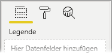

Sobald der Fokus im Bereich „Pivots“ ist, befindet sich die Navigation mit der TAB-TASTE ausschließlich auf dem Symbol des ausgewählten Bereichs. Drücken Sie die Pfeiltasten, um zu anderen Bereichen zu wechseln.

## Well „Feld“

Wenn sich der Fokus im Well „Pivots“ befindet, wird, wie im vorherigen Abschnitt beschrieben, durch erneutes Drücken der TAB-TASTE der Fokus zum Well **Feld** verlagert. 

Im Well **Feld**  ist die Fokusreihenfolge wie folgt:

* Titel der einzelnen Wells (1.)
* gefolgt von einem bestimmten Feld in den einzelnen Wells (2.)
* die Dropdownschaltfläche zum Öffnen des Feldmenüs (3.)
* dann die Schaltfläche zum Entfernen (4.)

Die folgende Abbildung zeigt diese Reihenfolge der Verlagerung des Fokus.

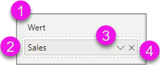

Eine Sprachausgabe liest den Namen des Wells und dessen QuickInfo vor. Für jedes Feld in einem Well liest eine Sprachausgabe den Namen des Felds und seine QuickInfo vor. Wenn ein Well leer ist, sollte der Fokus auf das gesamte leere Well verschoben werden. Die Sprachausgabe sollte den Namen des Wells und dessen QuickInfo vorlesen und angeben, dass es leer ist.

Wenn das Feldmenü geöffnet ist, können Sie durch Drücken der **TAB-TASTE** oder von **UMSCHALT+TAB** oder der **NACH-OBEN-**  / **NACH-UNTEN-** -TASTE darin navigieren. Eine Sprachausgabe liest die Optionsnamen vor.

Wenn Sie ein Feld aus einem Bucket im Well „Feld“ in einen anderen Bucket verschieben möchten, können Sie Ihre Tastatur und anschließend die Option **Verschieben in** im Menü des Wells „Feld“ verwenden (siehe die folgende Abbildung).

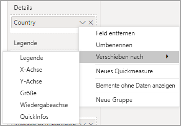

## Formatierungsbereich

Die Fokusreihenfolge im Bereich **Formatierung** wird in der Reihenfolge der Karten von oben nach unten verlagert. Der Fokus bewegt sich um den Kartennamen, gefolgt von dessen Umschaltfläche **EIN/AUS**, sofern vorhanden. Wenn sich der Fokus auf dem Kartennamen befindet, liest eine Sprachausgabe den Namen der Karte vor und gibt an, ob die Karte auf- oder zugeklappt ist. Sie können die **EINGABETASTE** drücken, um die Karte auf- oder zuzuklappen. Über die **EINGABETASTE** kann auch die Umschaltfläche auf **EIN** oder **AUS** festgelegt werden.

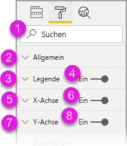

Wenn eine Karte geöffnet ist, wird der Fokus bei Drücken der **TAB-TASTE** durch die Steuerelemente der Karte bewegt, bevor er auf die nächste Karte gelangt. Bei den Steuerelementen auf einer Karte liest eine Sprachausgabe den Titel, den aktuellen Wert und den Steuerelementtyp vor.  

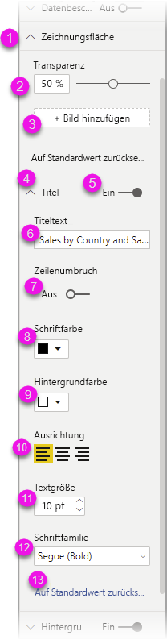

## Navigation in der Liste „Felder“

Sie können die **TAB-TASTE** drücken, um durch die Liste **Felder** zu navigieren. Ähnlich wie im Bereich „Formatierung“ ist die Fokusreihenfolge bei eingeklappten Tabellen wie folgt:

1. Kopfzeile der Liste **Felder**
2. Suchleiste
3. Einzelne Tabellennamen

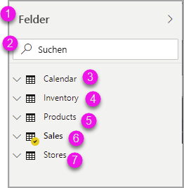

Um alle Tabellen im Well **Felder** aufzuklappen, drücken Sie **ALT+UMSCHALT+9**. Um alle Tabellen zuzuklappen, drücken Sie **ALT+UMSCHALT+1**. Um eine einzelne Tabelle aufzuklappen, drücken Sie die **NACH-RECHTS-TASTE**. Um eine einzelne Tabelle zuzuklappen, drücken Sie die **NACH-LINKS-TASTE**. Wenn ähnlich wie im Bereich „Formatierung“ eine Tabelle aufgeklappt ist, erfolgt die Navigation durch die angezeigten Felder durch Drücken der TAB-TASTE. Eine Sprachausgabe liest vor, ob Sie eine Tabelle auf- oder zugeklappt haben.

Sie können ein Feld mit einem Häkchen versehen, indem Sie zum gewünschten Feld navigieren und die **EINGABETASTE** drücken.   Eine Sprachausgabe liest das Feld mit dem Fokus vor und gibt an, ob es mit einem Häkchen versehen ist oder nicht.

Mausbenutzer ziehen Felder normalerweise per Drag & Drop auf die Canvas oder in die entsprechenden gewünschten Filterbuckets. Wenn Sie die Tastatur verwenden möchten, können Sie einem Filterbucket ein Feld hinzufügen, indem Sie zum Kontextmenü eines Felds wechseln. Drücken Sie dazu **UMSCHALT+F10** und die Pfeiltasten, um zu **Zu Filtern hinzufügen** zu navigieren. Drücken Sie dann für den Filtertyp, dem Sie das Feld hinzufügen möchten, die **EINGABETASTE**.

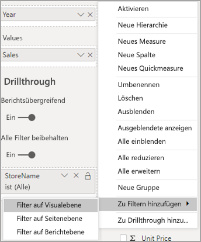

## Navigation im Bereich „Auswahl“
Die Verlagerung des Fokus im Bereich **Auswahl** ist wie folgt:

1. Kopfzeilentitel
2. Schaltfläche „Beenden“
3. Umschalter für Ebenen-/Aktivierreihenfolge
4. Schaltfläche zum Verschieben in Ebene nach oben
5. Schaltfläche zum Verschieben in Ebene nach unten
6. Schaltfläche „Anzeigen“
7. Schaltfläche „Ausblenden“
8. Objekte

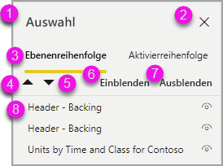

Sie können durch Drücken der TAB-TASTE die Fokusreihenfolge durchlaufen und die **EINGABETASTE** drücken, um das gewünschte Element auszuwählen.  

Wenn Sie zum Umschalter für die Ebenen-/Aktivierreihenfolge gelangen, drücken Sie die NACH-LINKS- oder NACH-RECHTS-TASTE, um zwischen der Ebenen- und der Aktivierreihenfolge umzuschalten.

Wenn Sie zu den Objekten im Bereich **Auswahl** gelangen, drücken Sie **F6**, um den Bereich **Auswahl** zu aktivieren. Nachdem Sie den Bereich **Auswahl** aktiviert haben, können Sie mithilfe der NACH-OBEN- bzw. NACH-UNTEN-TASTE zu den verschiedenen Objekten im Bereich **Auswahl** navigieren.
Nachdem Sie zu einem gewünschten Objekt navigiert sind, können Sie verschiedene Aktionen ausführen:

* Drücken Sie **STRG+UMSCHALT+S**, um ein Objekt aus- bzw. einzublenden.
* Drücken Sie **STRG+UMSCHALT+F**, um ein Objekt in der Ebenenreihenfolge nach oben zu verschieben.
* Drücken Sie **STRG+UMSCHALT+B**, um ein Objekt in der Ebenenreihenfolge nach unten zu verschieben.
* Drücken Sie **STRG+LEERTASTE**, um mehrere Objekte auszuwählen.

## Dialogfelder in Power BI Desktop

Alle Dialogfelder in Power BI Desktop sind bei Tastaturnavigation barrierefrei und können mit Sprachausgaben verwendet werden.

Power BI Desktop enthält die folgenden Dialogfelder:

* Dialogfeld „Quickmeasures“
* Dialogfeld „Bedingte Formatierung und Datenbalken“
* Dialogfeld „Q&A-Explorer“
* Dialogfeld „Erste Schritte“
* Dateimenü und Info-Dialogfeld
* Warnungsleiste
* Dialogfeld zur Dateiwiederherstellung
* Dialogfeld für Stirnrunzeln

## Unterstützung von hohem Kontrast

Wenn Sie unter Windows einen der Modi für hohen Kontrast verwenden, gelten die ausgewählten Einstellungen und die Palette auch für Berichte in Power BI Desktop.

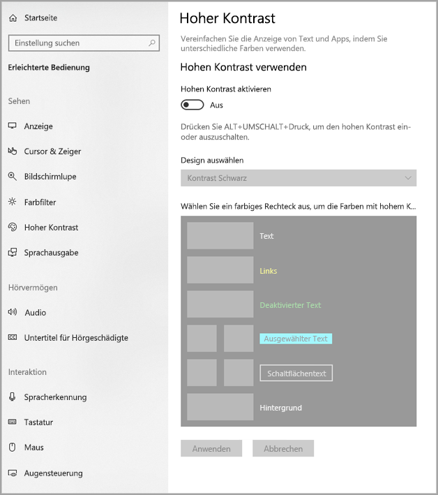

Power BI Desktop erkennt automatisch, welches Design für hohen Kontrast unter Windows verwendet wird, und wendet diese Einstellungen auf Ihre Berichte an. Der Bericht ist auch nach der Veröffentlichung im Power BI-Dienst oder einem anderen Dienst in diesen kontrastreichen Farben gehalten.

## Nächste Schritte

Die Sammlung von Artikeln zur Barrierefreiheit in Power BI besteht aus den folgenden Artikeln:

* [Übersicht über die Barrierefreiheit in Power BI](desktop-accessibility-overview.md) 
* [Erstellen barrierefreier Power BI-Berichte](desktop-accessibility-creating-reports.md) 
* [Nutzen von Berichten in Power BI mit Barrierefreiheitstools](desktop-accessibility-consuming-tools.md)
* [Tastenkombinationen für Barrierefreiheit für Power BI-Berichte](desktop-accessibility-keyboard-shortcuts.md)
* [Checkliste für die Barrierefreiheit von Berichten](desktop-accessibility-creating-reports.md#report-accessibility-checklist)

