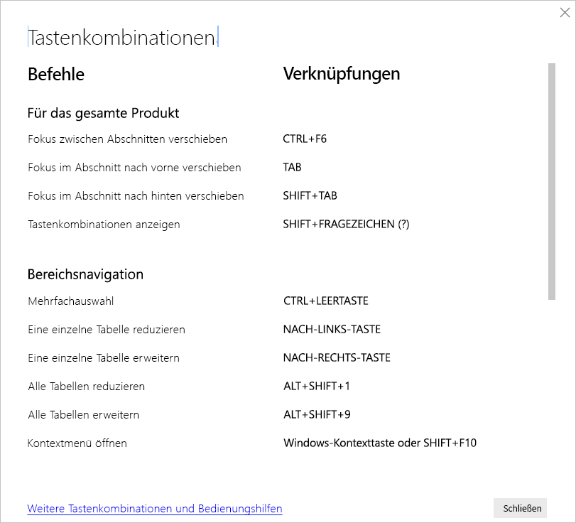

# Tastenkombinationen in Power BI Desktop

Tastenkombinationen sind hilfreich, um sich in Power BI-Berichten mithilfe einer Tastatur zu bewegen. Die Tabellen in diesem Artikel beschreiben die Tastenkombinationen, die in einem Power BI-Bericht zur Verfügung stehen. 

Wenn Sie Power BI Desktop verwenden, können Sie **UMSCHALT + ?** drücken, um Tastenkombinationen anzuzeigen, wie in der folgenden Abbildung dargestellt.

Die folgenden Tastenkombinationen funktionieren nicht nur in **Power BI Desktop**, sondern auch bei den folgenden Funktionen:

* Dialogfeld **Q&A-Explorer**
* Dialogfeld **Erste Schritte**
* **Dateimenü** und Dialogfeld **Info**
* **Warnungsleiste**
* Dialogfeld **Dateiwiederherstellung**
* Dialogfeld **Stirnrunzeln**

Wir arbeiten fortlaufend daran, die Barrierefreiheit weiter zu verbessern, deshalb bieten die oben aufgeführten Benutzeroberflächenelemente darüber hinaus auch eine Sprachausgabe und Einstellungen für einen hohen Kontrast.

## Häufig verwendete Tastenkombinationen
| So führen Sie diese Aktion aus           | Tastenkombination                |
| :------------------- | :------------------- |
| Fokus zwischen Abschnitten verschieben  | **STRG + F6** |
| Fokus im Abschnitt nach vorne verschieben | **TABULATORTASTE**         |
| Fokus im Abschnitt nach hinten verschieben | **UMSCHALT+TABULATORTASTE** |
| Objekt auswählen oder Auswahl löschen | **EINGABETASTE** oder **LEERTASTE** |
| Mehrere Objekte auswählen | **STRG + LEERTASTE** |

## Auf Visual
| So führen Sie diese Aktion aus           | Tastenkombination                |
| :------------------- | :------------------- |
| Fokus auf Visualmenü verschieben | **ALT + UMSCHALT + F10** |
| Daten anzeigen | **ALT + UMSCHALT + F11**  |
| Visual eingeben | **STRG + NACH-RECHTS-TASTE** |
| Ebene eingeben | **EINGABETASTE** |
| Ebene oder Visual beenden | **ESC** |
| Datenpunkt auswählen oder Auswahl löschen | **EINGABETASTE** oder **LEERTASTE** |
| Mehrfachauswahl | **STRG + EINGABETASTE** oder **STRG + LEERTASTE** |
| Rechtsklick | <ul><li>Windows-Tastatur: **Windows-Taste + F10** Die Windows-Taste befindet sich zwischen der linken ALT-TASTE und der Taste mit den spitzen Klammern.</li><li>Andere Tastatur: **UMSCHALT + F10**</li></ul> |
| Auswahl löschen | **STRG + UMSCHALT + C** |

## Tabellen- und Matrixnavigation
| So führen Sie diese Aktion aus          | Tastenkombination                |
| :------------------- | :------------------- |
| Fokus eine Zelle nach oben/unten verschieben (für alle Zellen in allen Bereichen)  | **NACH-OBEN-TASTE** / **NACH-UNTEN-TASTE** |
| Fokus eine Zelle nach links/rechts verschieben (für alle Zellen in allen Bereichen)  | **NACH-LINKS-TASTE** / **NACH-RECHTS-TASTE** |

## Bereichsnavigation
| So führen Sie diese Aktion aus           | Tastenkombination                |
| :------------------- | :------------------- |
| Mehrfachauswahl | **STRG + LEERTASTE** |
| Eine einzelne Tabelle reduzieren | **NACH-LINKS-TASTE** |
| Eine einzelne Tabelle erweitern | **NACH-RECHTS-TASTE** |
| Alle Tabellen reduzieren | **ALT + UMSCHALT + 1** |
| Alle Tabellen erweitern | **ALT + UMSCHALT + 9** |
| Kontextmenü öffnen | <ul><li>Windows-Tastatur: **Windows-Taste + F10**  Die Windows-Taste befindet sich zwischen der linken ALT-TASTE und der Taste mit den spitzen Klammern.</li><li>Andere Tastatur: **UMSCHALT + F10**</li></ul> |

## Slicer
| So führen Sie diese Aktion aus         | Tastenkombination                |
| :------------------- | :------------------- |
| Interagieren mit einem Slicer | **STRG + NACH-RECHTS-TASTE** |

## Auswahlbereich
| So führen Sie diese Aktion aus           | Tastenkombination                |
| :------------------- | :------------------- |
| Auswahlbereich aktivieren | **F6** |
| Ein Objekt auf die nächsthöhere Ebene verschieben | **STRG + UMSCHALT + F** |
| Ein Objekt auf die nächste tiefere Ebene verschieben | **STRG + UMSCHALT + B** |
| Ein Objekt ausblenden/einblenden (umschalten) | **STRG + UMSCHALT + S** |

## DAX-Editor
| So führen Sie diese Aktion aus          | Tastenkombination                |
| :------------------- | :------------------- |
| Zeile nach oben/unten verschieben | **ALT + NACH-OBEN-TASTE** / **NACH-UNTEN-TASTE** |
| Zeile nach oben/unten kopieren | **UMSCHALT+ALT+NACH-OBEN-TASTE** / **NACH-UNTEN-TASTE** |
| Linie darunter einfügen | **STRG + EINGABETASTE** |
| Linie darüber einfügen | **STRG + UMSCHALT + EINGABETASTE** |
| Zu zugehöriger Klammer springen | **STRG + UMSCHALT +**  \ |
| Zeile in Rand einfügen/erweitern | **STRG + ]**  /  **[** |
| Cursor einfügen | **ALT + Klick** |
| Aktuellen Zeile auswählen | **STRG + I** |
| Alle Vorkommen der aktuellen Auswahl auswählen | **STRG +** UMSCHALT + L |
| Alle Vorkommen des aktuellen Worts auswählen | **STRG + F2** |

## Daten eingeben
| So führen Sie diese Aktion aus           | Tastenkombination                |
| :------------------- | :------------------- |
| Bearbeitbares Raster beenden | **STRG + TABULATORTASTE** |

## Überlegungen und Einschränkungen
Es gibt einige bekannte Probleme und Einschränkungen in Bezug auf die Barrierefreiheitsfeatures. Beschreibungen dieser Probleme und Einschränkungen finden Sie in der folgenden Liste:

* Wenn Sie die Sprachausgabe mit **Power BI Desktop** verwenden, erzielen Sie die bestmögliche Leistung, wenn Sie die Sprachausgabe starten, bevor Sie Dateien in **Power BI Desktop** öffnen.
* Wenn Sie die Sprachausgabe von Microsoft verwenden, gibt es einige Einschränkungen beim **Anzeigen von Daten** als HTML-Tabelle.

## Nächste Schritte

Die Sammlung von Artikeln zur Barrierefreiheit in Power BI besteht aus den folgenden Artikeln:

* [Übersicht über die Barrierefreiheit in Power BI](desktop-accessibility-overview.md) 
* [Erstellen barrierefreier Power BI-Berichte](desktop-accessibility-creating-reports.md) 
* [Nutzen von Berichten in Power BI mit Barrierefreiheitstools](desktop-accessibility-consuming-tools.md)
* [Erstellen von Power BI-Berichten mit Barrierefreiheitstools](desktop-accessibility-creating-tools.md)
* [Checkliste für die Barrierefreiheit von Berichten](desktop-accessibility-creating-reports.md#report-accessibility-checklist)

Folgende Artikel könnten Sie ebenfalls interessieren:

* [Verwenden von Berichtdesigns in Power BI Desktop](desktop-report-themes.md)

