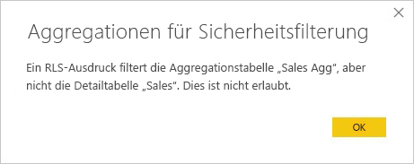

# Verwenden von Aggregationen in Power BI Desktop

Mit *Aggregationen* können Sie die Größe von Tabellen in Power BI reduzieren, damit Sie sich auf die wichtigen Daten konzentrieren und die Abfrageleistung verbessern können. Aggregationen ermöglichen die interaktive Analyse von Big Data auf eine Weise, die andernfalls nicht möglich ist. Somit können die Kosten zur Nutzung großer Datasets für die Entscheidungsfindung drastisch gesenkt werden.

Aggregationen bieten unter anderem folgende Vorteile:

- **Bessere Abfrageleistung für Big Data:** Jede Interaktion mit Power BI-Visuals übermittelt DAX-Abfragen an das Dataset. Zwischengespeicherte aggregierte Daten nutzen einen Bruchteil der Ressourcen, die für Detaildaten benötigt werden. Somit können Sie sich Zugriff auf andernfalls nicht verfügbare Big Data-Datasets verschaffen.
- **Optimierte Datenaktualisierung:** Durch die kleineren Cachegrößen werden die Aktualisierungszeiten verkürzt, sodass Benutzer Daten schneller erhalten.
- **Ausgeglichene Architekturen:** Der In-Memory-Cache von Power BI kann aggregierte Abfragen verarbeiten, im DirectQuery-Modus gesendete Abfragen einschränken und Ihnen dabei helfen, Parallelitätslimits einzuhalten. Bei den verbleibenden Detailabfragen handelt es sich zumeist um gefilterte Abfragen auf Transaktionsebene, die von Data Warehouse- und Big Data-Systemen normalerweise gut verarbeitet werden können.

Dimensionale Datenquellen wie Data Warehouse- und Data Mart-Instanzen können [beziehungsbasierte Aggregationen](#aggregation-based-on-relationships). Bei auf Hadoop basierenden Big Data-Quellen [basieren Aggregationen oft auf GroupBy-Spalten](#aggregation-based-on-groupby-columns). In diesem Artikel werden typische Unterschiede bei der Modellierung in Power BI für jede Art von Datenquelle beschrieben.

## Erstellen einer aggregierten Tabelle

So erstellen Sie eine aggregierte Tabelle:
1. Richten Sie abhängig von Ihrer Datenquelle und Ihrem Modell eine neue Tabelle mit den gewünschten Feldern ein. 
1. Definieren Sie die Aggregationen mithilfe des Dialogfelds **Aggregationen verwalten**.
1. Ändern Sie gegebenenfalls den [Speichermodus](#storage-modes) für die aggregierte Tabelle. 

### Aggregationen verwalten

Sobald Sie die neue Tabelle mit den gewünschten Feldern erstellt haben, klicken Sie im Bereich **Felder** einer beliebigen Power BI Desktop-Ansicht mit der rechten Maustaste auf die Tabelle, und wählen Sie dann **Aggregationen verwalten** aus.

Im Dialogfeld **Aggregationen verwalten** wird für jede Spalte in der Tabelle eine Zeile angezeigt, in der Sie das Aggregationsverhalten festlegen können. Im folgenden Beispiel werden Abfragen der Detailtabelle **Sales** intern an die Aggregationstabelle **Sales Agg** umgeleitet. 

Das Dropdownmenü **Zusammenfassung** des Dialogfelds **Aggregationen verwalten** zeigt die folgenden Werte an:
- Anzahl
- GroupBy
- Max
- Min
- Summe
- Count table rows

Die GroupBy-Einträge in diesem Beispiel für eine beziehungsbasierte Aggregation sind optional. Mit Ausnahme von DISTINCTCOUNT wirken sie sich nicht auf das Aggregationsverhalten aus und dienen hauptsächlich zur besseren Lesbarkeit. Ohne die GroupBy-Einträge würden die Aggregationen immer noch basierend auf den Beziehungen gefunden werden. Dies unterscheidet sich vom [Big Data-Beispiel](#aggregation-based-on-groupby-columns) später in diesem Artikel, bei dem die GroupBy-Einträge erforderlich sind.

Klicken Sie auf **Alle übernehmen**, nachdem Sie die gewünschten Aggregationen definiert haben. 

### Überprüfungen

Das Dialogfeld **Aggregationen verwalten** erzwingt die folgenden relevanten Überprüfungen:

- Die **Detailspalte** muss den gleichen Datentyp wie die **Aggregationsspalte** aufweisen. Ausgenommen sind die **Zusammenfassungsfunktionen** „Count“ und „Count table rows“. Die Funktionen „Count“ und „Count table rows“ sind nur für Integeraggregationsspalten verfügbar und erfordern keinen übereinstimmenden Datentyp.
- Verkettete Aggregationen über drei oder mehr Tabellen sind nicht zulässig. Aggregationen der **Tabelle A** können beispielsweise nicht auf eine **Tabelle B** verweisen, die Aggregationen enthält, die wiederum auf eine **Tabelle C** verweisen.
- Doppelte Aggregationen, bei denen zwei Einträge die gleiche **Zusammenfassungsfunktion** verwenden und auf die gleiche **Detailtabelle** und **Detailspalte** verweisen, sind nicht zulässig.
- Die **Detailtabelle** muss den DirectQuery-Speichermodus verwenden, nicht den Speichermodus „Import“.
- Das Gruppieren nach einer Fremdschlüsselspalte, die von einer inaktiven Beziehung verwendet wird, und die Verwendung der USERELATIONSHIP-Funktion für Aggregationstreffer werden nicht unterstützt.

Die meisten Überprüfungen werden durch das Deaktivieren von Dropdownwerten und das Anzeigen einer Erklärung in einer QuickInfo erzwungen. Dies wird im folgenden Bild veranschaulicht.

### Aggregationstabellen sind ausgeblendet

Benutzer mit schreibgeschütztem Zugriff auf das Dataset können keine Aggregationstabellen abfragen. Dadurch werden Sicherheitsbedenken bei Verwendung mit der *Sicherheit auf Zeilenebene (RLS, row-level security)* vermieden. Benutzer und Abfragen verwenden die Detailtabelle, nicht die Aggregationstabelle. Sie müssen nicht wissen, dass es die Aggregationstabelle gibt.

Daher werden Aggregationen in der **Berichtsansicht** ausgeblendet. Wenn die Tabelle nicht bereits ausgeblendet ist, wird sie über das Dialogfeld **Aggregationen verwalten** ausgeblendet, wenn Sie auf **Alle übernehmen** klicken.

### Speichermodi
Das Aggregationsfeature interagiert mit den Speichermodi auf Tabellenebene. Power BI-Tabellen können die folgenden Speichermodi nutzen: *DirectQuery*, *Import* oder *Dual*. Im DirectQuery-Modus wird das Back-End direkt abgefragt, während die Daten im Import-Modus im Arbeitsspeicher zwischengespeichert und die Abfragen an die zwischenspeicherten Daten gesendet werden. Alle Import- und nicht-mehrdimensionalen DirectQuery-Datenquellen in Power BI können Aggregationen verwenden. 

Wählen Sie die aggregierte Tabelle in der **Modellansicht** in Power BI Desktop aus, um ihren Speichermodus auf „Import“ festzulegen und die Abfragen dadurch zu beschleunigen. Erweitern Sie **Erweitert** im Bereich **Eigenschaften**, und wählen Sie im Dropdownmenü **Speichermodus** die Option **Import** aus. Beachten Sie, dass diese Aktion nicht rückgängig gemacht werden kann. 

Weitere Informationen zu Tabellenspeichermodi finden Sie unter [Verwalten des Speichermodus in Power BI Desktop](desktop-storage-mode.md).

### Sicherheit auf Zeilenebene für Aggregationen

RLS-Ausdrücke (Row Level Security, Sicherheit auf Zeilenebene) sollten die Aggregationstabelle und die Detailtabelle filtern, damit sie ordnungsgemäß für Aggregationen funktionieren. 

Im folgenden Beispiel funktioniert der RLS-Ausdruck der Tabelle **Geography** für Aggregationen, weil in den Beziehungen zu den Tabellen **Sales** und **Sales Agg** nach „Geography“ gefiltert wird. Die RLS wird erfolgreich auf Abfragen für die Aggregationstabelle und andere Abfragen angewendet.

Ein RLS-Ausdruck in der Tabelle **Product** würde nur die Detailtabelle **Sales** filtern, nicht die aggregierte Tabelle **Sales Agg**. Da die Aggregationstabelle eine weitere Darstellung der Daten in der Detailtabelle ist, wäre es nicht sicher, Abfragen aus der Aggregationstabelle zu beantworten, wenn der RLS-Filter nicht angewendet werden kann. Es wird davon abgeraten, nur die Detailtabelle zu filtern, weil Benutzerabfragen mit dieser Rolle nicht von Aggregationstreffern profitieren. 

Ein RLS-Ausdruck, der nur die Aggregationstabelle **Sales Agg** filtert und nicht die Detailtabelle **Sales**, ist nicht zulässig.

Für [Aggregationen, die auf GroupBy-Spalten basieren](#aggregation-based-on-groupby-columns), kann ein RLS-Ausdruck für die Detailtabelle dazu verwendet werden, die Aggregationstabelle zu filtern, da alle GroupBy-Spalten in der Aggregationstabelle auch in der Detailtabelle enthalten sind. Im Gegensatz dazu kann ein RLS-Filter für die Aggregationstabelle nicht auf die Detailseite angewendet werden. Dies ist also unzulässig.

## Aggregationen basierend auf Beziehungen

Dimensionale Modelle verwenden üblicherweise *Aggregationen, die auf Beziehungen basieren*. Power BI-Datasets aus Data Warehouse- und Data Mart-Instanzen weisen ein Stern- oder Schneeflockenschema auf, bei dem Beziehungen zwischen Dimensionstabellen und Faktentabellen bestehen.

Im folgenden Modell einer einzelnen Datenquelle verwenden die Tabellen den DirectQuery-Speichermodus. Die Faktentabelle **Sales** enthält Milliarden von Zeilen. Wenn Sie den Speichermodus von **Sales** für das Zwischenspeichern auf Import festlegen, erfordert dies einen sehr hohen Arbeitsspeicher- und Verwaltungsaufwand.

Erstellen Sie stattdessen die Aggregationstabelle **Sales Agg**. Die Zeilenanzahl in der Tabelle **Sales Agg** sollte mit der Summe von **SalesAmount** übereinstimmen (gruppiert nach **CustomerKey**, **DateKey** und **ProductSubcategoryKey**). Die Tabelle **Sales Agg** besitzt eine höhere Granularität als **Sales**. Diese Tabelle enthält also deutlich weniger Zeilen und ist dadurch deutlich einfacher zu verwalten.

Wenn die folgenden Dimensionstabellen am häufigsten für Abfragen mit hohem Unternehmenswert verwendet werden, kann die Tabelle **Sales Agg** mithilfe von *1:n*- oder *n:1*-Beziehungen gefiltert werden.

- Geografie
- Kunde
- Datum
- Product Subcategory
- Product Category

Die folgende Abbildung zeigt dieses Modell.

In der folgenden Tabelle werden die Aggregationen der **Sales Agg**-Tabelle gezeigt.

> [!NOTE]
> Die Tabelle **Sales Agg** verfügt wie jede andere Tabelle über die Flexibilität, auf verschiedene Weisen geladen werden zu können. Die Aggregation kann in der Quelldatenbank mit ETL- oder ELT-Vorgängen oder mit dem [M-Ausdruck](/powerquery-m/power-query-m-function-reference) für die Tabelle erfolgen. Die aggregierte Tabelle kann den Speichermodus „Import“ mit oder ohne [inkrementeller Aktualisierung in Power BI Premium](service-premium-incremental-refresh.md) verwenden, oder ihr Modus kann auf „DirectQuery“ festgelegt werden, um mit [Columnstore-Indizes](/sql/relational-databases/indexes/columnstore-indexes-overview) schnellere Abfragen zu ermöglichen. Diese Flexibilität ermöglicht ausgeglichene Architekturen, in denen die Abfragelast verteilt wird, um Leistungsengpässe zu vermeiden.

Wenn der Speichermodus der aggregierten Tabelle **Sales Agg** in **Import** geändert wird, wird ein Dialogfeld angezeigt, das darauf hinweist, dass der Speichermodus *Dual* für die zugehörigen Dimensionstabellen festgelegt werden kann. 

Wenn der Speichermodus „Dual“ für die Dimensionstabellen festgelegt wird, können sie je nach Unterabfrage den Speichermodus „Import“ oder „DirectQuery“ verwenden. Im Beispiel:

- Abfragen, die Metriken aus der Tabelle **Sales Agg** aggregieren, deren Modus auf „Import“ festgelegt ist, und die GroupBy-Attribute aus den verwandten Dual-Tabellen können aus dem In-Memory-Cache zurückgegeben werden.
- Abfragen, die Metriken aus der Tabelle **Sales** aggregieren, deren Modus auf „DirectQuery“ festgelegt ist, und GroupBy-Attribute aus den verwandten Dual-Tabellen können im DirectQuery-Modus zurückgegeben werden. Die Abfragelogik und der GroupBy-Vorgang wird an die Quelldatenbank übergeben.

Weitere Informationen zum Speichermodus „Dual“ finden Sie unter [Verwalten des Speichermodus in Power BI Desktop](desktop-storage-mode.md).

### Starke und schwache Beziehungen im Vergleich

Auf Beziehungen basierende Aggregationstreffer erfordern starke Beziehungen.

Starke Beziehungen umfassen die folgenden Kombinationen von Speichermodi, bei denen beide Tabellen aus einer einzelnen Quelle stammen:

| Tabelle auf der *n*-Seite | Tabelle auf der *1*-Seite |
| ------------- |----------------------| 
| Dual          | Dual                 | 
| Importieren        | Import oder Dual       | 
| DirectQuery   | DirectQuery oder Dual  | 

Eine *quellenübergreifende* Beziehung wird nur dann als stark eingestuft, wenn für beide Tabellen der Speichermodus „Import“ festgelegt ist. m:n-Beziehungen werden immer als schwach eingestuft.

Informationen zu *quellenübergreifenden* Aggregationstreffern, die nicht von Beziehungen abhängen, finden Sie unter [Aggregationen basierend auf GroupBy-Spalten](#aggregation-based-on-groupby-columns). 

### Beispiele für Abfragen von auf Beziehungen basierenden Aggregationen

Die folgende Abfrage findet die Aggregation, weil Spalten in der **Date**-Tabelle der Granularität entsprechen, die zum Finden der Aggregation erforderlich ist. Für die Spalte **SalesAmount** wird die Aggregation **Sum** verwendet.

Die folgende Abfrage führt nicht zu einem Aggregationstreffer. Obwohl die Summe von **SalesAmount** angefordert wurde, führt die Abfrage einen GroupBy-Vorgang für eine Spalte in der **Product**-Tabelle durch, die nicht die Granularität aufweist, die zum Finden der Aggregation nötig ist. Wenn Sie die Beziehungen im Modell betrachten, kann eine Unterkategorie der Tabelle „Product“ mehrere **Product**-Zeilen enthalten. Die Abfrage wäre also nicht in der Lage, zu ermitteln, welche Product-Zeile aggregiert werden soll. In diesem Fall kehrt die Abfrage zu DirectQuery zurück und übermittelt eine SQL-Abfrage an die Datenquelle.

Aggregationen können nicht nur für einfache Berechnungen eingesetzt werden (wie z.B. das Berechnen einer Summe). Sie können auch bei komplexen Berechnungen nützlich sein. Eine komplexe Berechnung wird in mehrere Unterabfragen aufgeteilt: SUM, MIN, MAX und COUNT. Jede Unterabfrage wird ausgewertet, um zu bestimmen, ob die Aggregation gefunden werden kann. Dies gilt aufgrund einer Optimierung des Abfrageplans nicht immer. Das folgende Beispiel findet die Aggregation:

Die Funktion COUNTROWS kann von Aggregationen profitieren. Die folgende Abfrage findet die Aggregation, weil eine **Count table rows**-Aggregation in der **Sales**-Tabelle definiert wurde.

Die Funktion AVERAGE kann von Aggregationen profitieren. Die folgende Abfrage findet die Aggregation, weil AVERAGE intern in SUM geteilt durch COUNT gefaltet wird. Da für die Spalte **UnitPrice** Aggregationen für SUM und COUNT definiert sind, wird die Aggregation gefunden.

In einigen Fällen kann die Funktion DISTINCTCOUNT von Aggregationen profitieren. Die folgenden Abfrage findet die Aggregation, weil es einen GroupBy-Eintrag für **CustomerKey** gibt, wodurch **CustomerKey** in der Aggregationstabelle eindeutig bleibt. Dieses Verfahren kann immer noch dem Leistungsschwellenwert entsprechen, bei dem mehr als zwei bis fünf Millionen eindeutige Werte sich auf die Abfrageleistung auswirken können. Es kann sich jedoch in Szenarios als nützlich erweisen, bei denen Milliarden Zeilen in der Detailtabelle vorhanden sind, aber nur zwei bis fünf Millionen verschiedene Werte in der Spalte enthalten sind. In diesem Fall kann DISTINCTCOUNT schneller sein als das Überprüfen der Tabelle mit Milliarden Zeilen, auch wenn diese im Arbeitsspeicher zwischengespeichert werden würde.

## Aggregationen basierend auf GroupBy-Spalten 

Hadoop-basierte Big Data-Modelle unterscheiden sich von dimensionalen Modellen. Zur Vermeidung von Verknüpfungen zwischen großen Tabellen verwenden Big Data-Modelle oft keine Beziehungen, aber sie denormalisieren Dimensionsattribute in Faktentabellen. Sie können auf solche Big Data-Modelle für interaktive Analysen zugreifen, indem Sie *auf GroupBy-Spalten basierende Aggregationen* verwenden.

Die folgende Tabelle enthält die numerische Spalte **Movement**, die aggregiert werden soll. Alle anderen Spalten bezeichnen Attribute, nach denen gruppiert werden kann. Die Tabelle enthält IoT-Daten und eine sehr hohe Anzahl an Zeilen. Der Speichermodus ist „DirectQuery“. Abfragen der Datenquelle, die das gesamte Dataset aggregieren, sind aufgrund des hohen Volumens sehr langsam. 

Fügen Sie eine Aggregationstabelle hinzu, die nach den meisten Attributen gruppiert ist, aber Attribute mit hoher Kardinalität ausschließt (z. B. „longitude“ und „latitude“), um eine interaktive Analyse dieses Datasets zu ermöglichen. Dadurch wird die Anzahl der Zeilen deutlich verringert und ist nun klein genug, um gut in den In-Memory-Cache zu passen. 

Sie können die Aggregationszuordnungen für die Tabelle **Driver Activity Agg** im Dialogfeld **Aggregationen verwalten** definieren. 

Bei Aggregationen, die auf GroupBy-Spalten basieren, sind die **GroupBy**-Einträge nicht optional. Ohne sie werden die Aggregationen nicht gefunden. Dies unterscheidet sich von der Verwendung von Aggregationen, die auf Beziehungen basieren, da die GroupBy-Einträge bei diesen optional sind.

In der folgenden Tabelle werden die Aggregationen der **Driver Activity Agg**-Tabelle gezeigt.

Sie können den Speichermodus „Import“ für die aggregierte Tabelle **Driver Activity Agg** festlegen.

### Beispiel für eine GroupBy-Aggregationsabfrage

Die folgende Abfrage findet die Aggregation, weil die Spalte **Activity Date** in der Aggregationstabelle enthalten ist. Die COUNTROWS-Funktion verwendet die Aggregation **Count table rows**.

Insbesondere für Modelle, die Filterattribute in Faktentabellen enthalten, kann es sich als nützlich erweisen, **Count table rows**-Aggregationen zu verwenden. Power BI kann Abfragen des Datasets mit COUNTROWS durchführen, auch wenn dies nicht explizit vom Benutzer angefordert wurde. Das Dialogfeld „Filter“ zeigt z.B. die Zeilenanzahl für jeden Wert an.

## Kombinierte Aggregationsmethoden

Sie können die Methoden mit Beziehungen und GroupBy-Spalten für Aggregationen kombinieren. Aggregationen, die auf Beziehungen basieren, erfordern möglicherweise, dass die denormalisierten Dimensionstabellen in mehrere Tabellen aufgeteilt werden. Wenn dies für bestimmte Dimensionstabellen zu kostspielig oder umständlich ist, können Sie die erforderlichen Attribute für diese Dimensionen in der Aggregationstabelle replizieren und für andere Beziehungen verwenden.

Im folgenden Modell werden beispielsweise die Attribute **Month**, **Quarter**, **Semester** und **Year** in der Tabelle **Sales Agg** repliziert. Zwischen der **Sales Agg**- und der **Date**-Tabelle besteht keine Beziehung, aber es gibt Beziehungen zu **Customer** und **ProductSubcategory**. **Sales Agg** befindet sich im Speichermodus „Import“.

In der folgenden Tabelle werden die Einträge angezeigt, die Sie im Dialogfeld **Manage aggregations** (Aggregationen verwalten) für die Tabelle **Sales Agg** festgelegt haben. Die GroupBy-Einträge, bei denen **Date** die Detailtabelle ist, müssen Aggregationen für Abfragen finden, die nach den **Date**-Attributen gruppieren. Die **GroupBy**-Einträge für **CustomerKey** und **ProductSubcategoryKey** wirken sich wie im vorherigen Beispiel nicht darauf aus, ob Aggregationen gefunden werden, da Beziehungen vorhanden. DISTINCTCOUNT ist dabei eine Ausnahme.

### Beispiele für Abfragen kombinierter Aggregationen

Die folgende Abfrage findet die Aggregation, weil die Aggregationstabelle **CalendarMonth** enthält und der Zugriff auf **CategoryName** über 1:n-Beziehungen möglich ist. Für die Spalte **SalesAmount** wird die **SUM**-Aggregation verwendet.

Die folgende Abfrage findet die Aggregation nicht, weil die Aggregationstabelle **CalendarDay** nicht enthält.

Die folgenden Zeitintelligenzabfrage findet die Aggregation nicht, weil die DATESYTD-Funktion eine Tabelle aus **CalendarDay**-Werten generiert und die Aggregation **CalendarDay** nicht enthält.

## Aggregationsrangfolge

Durch eine Aggregationsrangfolge können mehrere Aggregationstabellen von einer einzelnen Unterabfrage berücksichtigt werden.

Bei dem folgenden Beispiel handelt es sich um ein [zusammengesetztes Modell](desktop-composite-models.md), das mehrere Quellen enthält:

- Die Tabelle **Driver Activity** befindet sich im DirectQuery-Modus und enthält mehr als eine Billion Zeilen mit IoT-Daten, die aus einem Big Data-System stammen. Sie verarbeitet Drillthroughabfragen zum Anzeigen einzelner IoT-Lesevorgänge in kontrollierten Filterkontexten.
- Die Tabelle **Driver Activity Agg** ist eine Zwischenaggregationstabelle im DirectQuery-Modus. Sie enthält mehr als eine Milliarde Zeilen in Azure SQL Data Warehouse und ihre Quelle wird mithilfe von ColumnStore-Indizes optimiert.
- Die Import-Tabelle **Driver Activity Agg2** weist eine hohe Granularität auf, weil es nur wenige GroupBy-Attribute gibt und die Kardinalität gering ist. Die Anzahl der Zeilen kann nur wenige Tausend betragen, sodass sie problemlos in einen In-Memory-Cache passt. Diese Attribute werden von einem Dashboard einer wichtigen Führungsperson verwendet, weshalb darauf verweisende Abfragen so schnell wie möglich ausgeführt werden sollen.

> [!NOTE]
> DirectQuery-Aggregationstabellen, die eine andere Datenquelle als die Detailtabelle verwenden, werden nur unterstützt, wenn die Aggregationstabelle aus SQL Server, Azure SQL oder Azure SQL Data Warehouse stammt.

Der Speicherbedarf dieses Modells ist relativ gering, obwohl es ein großes Dataset verfügbar macht. Es stellt eine ausgeglichene Architektur dar, weil es die Abfragelast auf alle Komponenten der Architektur verteilt und diese abhängig von ihren Stärken einsetzt.

Im Dialogfeld **Aggregationen verwalten** kann das Feld **Rangfolge** für **Driver Activity Agg2** auf *10* festgelegt werden. Dies ist ein höherer Wert als bei **Driver Activity Agg**. Aufgrund der höheren Rangfolgeneinstellung berücksichtigen Abfragen, die Aggregationen verwenden, zuerst die Tabelle **Driver Activity Agg2**. Unterabfragen, deren Granularität es nicht ermöglicht, dass sie von **Driver Activity Agg2** beantwortet werden könnten, berücksichtigen stattdessen **Driver Activity Agg**. Detailabfragen, die von keiner der Aggregationstabellen beantwortet werden können, werden an **Driver Activity** weitergeleitet.

Die in der Spalte **Detailtabelle** angegebene Tabelle ist **Driver Activity** und nicht **Driver Activity Agg**, weil verkettete Aggregationen nicht zulässig sind.

In der folgenden Tabelle werden die Aggregationen der **Driver Activity Agg2**-Tabelle gezeigt.

## Erkennen, ob Abfragen Aggregationen finden

Der SQL Server Profiler kann ermitteln, ob Abfragen von der In-Memory-Cache-Speicher-Engine zurückgegeben werden oder von DirectQuery an die Datenquelle gepusht werden. Sie können denselben Vorgang verwenden, um zu ermitteln, ob Aggregationen gefunden werden. Weitere Informationen finden Sie unter [Abfragen, die den Cache finden](desktop-storage-mode.md#queries-that-hit-or-miss-the-cache). 

Der SQL Server Profiler stellt außerdem das erweiterte Ereignis `Query Processing\Aggregate Table Rewrite Query` bereit.

Der folgende JSON-Codeausschnitt ist ein Beispiel für die Ausgabe des Ereignisses, wenn eine Aggregation verwendet wird.

- **matchingResult** gibt an, dass für die Unterabfrage eine Aggregation verwendet wurde.
- **dataRequest** gibt die GroupBy-Spalten und aggregierten Spalten an, die von der Unterabfrage verwendet wurden.
- **mapping** gibt die Spalten in der Aggregationstabelle an, die zugeordnet wurden.

## Synchronisieren von Caches

Aggregationen, bei denen die Speichermodi „DirectQuery“, „Import“ und/oder „Dual“ kombiniert werden, können unterschiedliche Daten zurückgeben, es sei denn, der In-Memory-Cache wird dauerhaft mit den Quelldaten synchronisiert. Die Abfrageausführung versucht beispielsweise nicht, Datenprobleme zu maskieren, indem DirectQuery-Ergebnisse entsprechend den zwischengespeicherten Werten gefiltert werden. Bei Bedarf können Sie auf etablierte Verfahren zum Umgang mit derartigen Problemen an der Quelle zurückgreifen. Leistungsoptimierungen sollten nur auf eine Weise verwendet werden, die Ihre Geschäftsanforderungen nicht gefährdet. Es liegt in Ihrer Verantwortung, Ihre eigenen Datenflüsse zu kennen und den Entwurf entsprechend anzupassen. 

## Nächste Schritte

Weitere Informationen über zusammengesetzte Modelle finden Sie unter:

- [Verwenden zusammengesetzter Modelle in Power BI Desktop](desktop-composite-models.md)
- [Anwenden von m:n-Beziehungen in Power BI Desktop](desktop-many-to-many-relationships.md)
- [Verwalten des Speichermodus in Power BI Desktop](desktop-storage-mode.md)

Weitere Informationen über DirectQuery finden Sie unter:

- [Verwenden von DirectQuery in Power BI](desktop-directquery-about.md)
- [Power BI-Datenquellen](desktop-directquery-data-sources.md)
