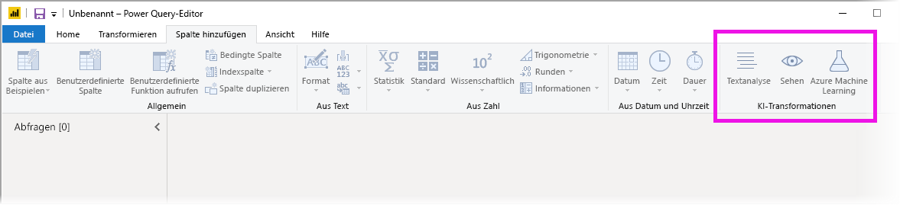
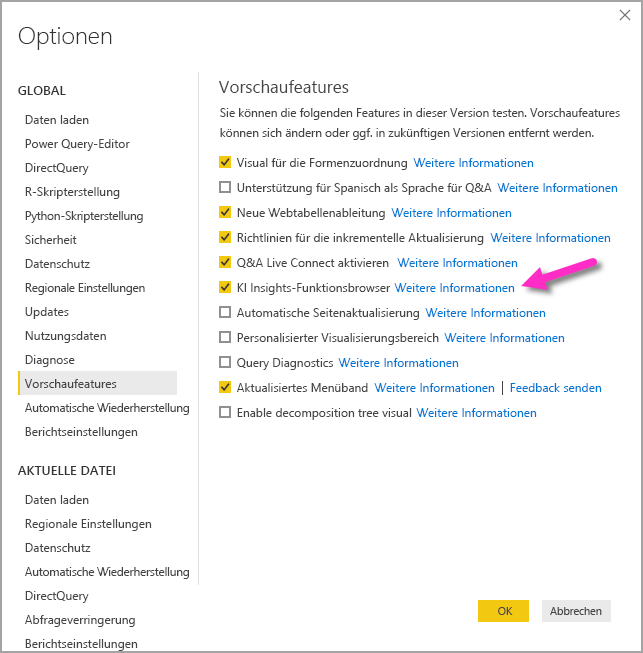
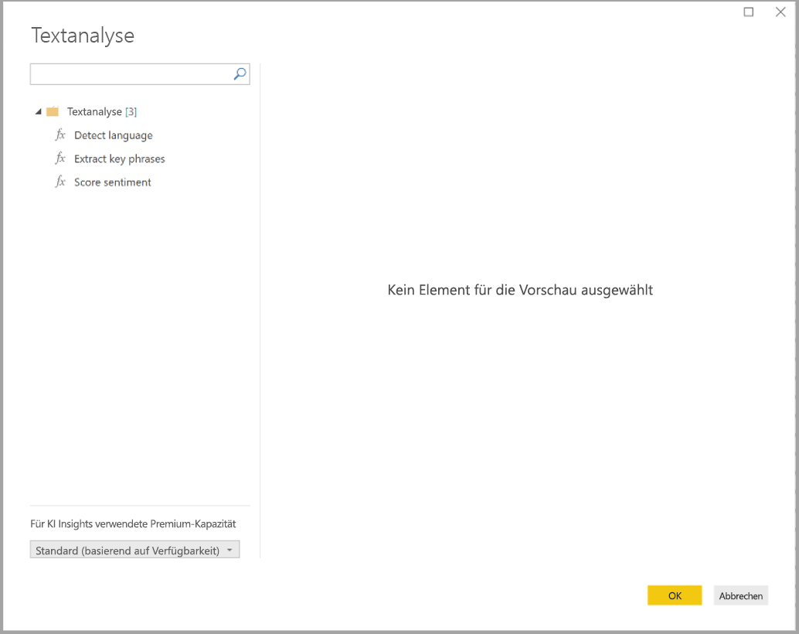
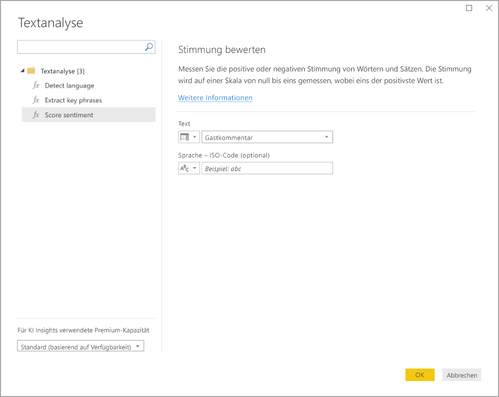
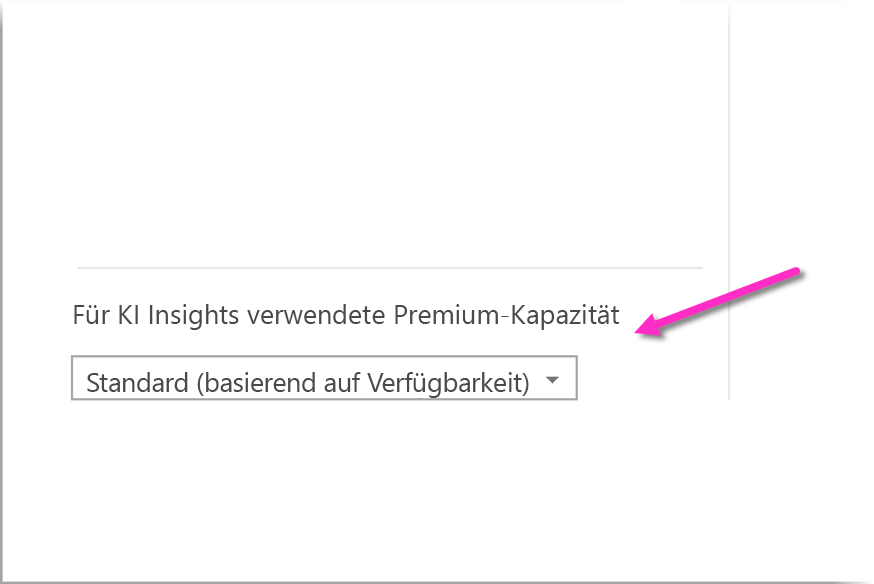
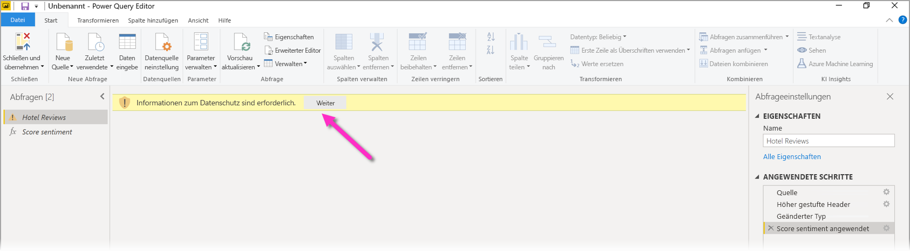
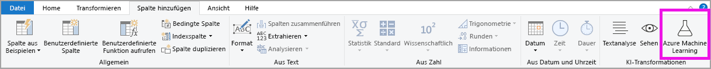

# Verwenden von KI Insights in Power BI Desktop (Vorschau)

Sie können KI Insights in Power BI verwenden, um Zugriff auf eine Sammlung vorab trainierter Machine Learning-Modelle zu erhalten, die Ihre Datenaufbereitungsmaßnahmen verbessern. Der Zugriff auf KI Insights erfolgt über den **Power Query-Editor**, und der Zugriff auf die zugehörigen Features und Funktionen erfolgt über die Registerkarten **Home** und **Spalte hinzufügen** im **Power Query-Editor**. 

In diesem Artikel werden Funktionen für Textanalyse und maschinelles Sehen von Azure Cognitive Services beschrieben. Außerdem befasst sich ein Abschnitt dieses Artikels mit den in Power BI verfügbaren benutzerdefinierten Funktionen von Azure Machine Learning.

## Aktivieren von KI Insights

KI Insights in Power BI ist eine Previewfunktion, die zunächst aktiviert werden muss. Klicken Sie auf **Datei > Optionen und Einstellungen > Optionen**, und klicken Sie dann in der linken Spalte auf **Previewfunktionen**, um sie zu aktivieren. Im rechten Bereich befindet sich die Auswahl des **KI Insights-Funktionsbrowsers**. Aktivieren Sie das Kontrollkästchen neben dem **KI Insights-Funktionsbrowser**, um die Previewfunktion zu aktivieren. Sie müssen Power BI Desktop neu starten, damit die Änderung für die Previewfunktion wirksam wird.

## Verwenden der Textanalyse und des maschinellen Sehens

Mit Textanalyse und maschinellem Sehen in Power BI können Sie verschiedene Algorithmen von [Azure Cognitive Services](https://azure.microsoft.com/services/cognitive-services/) anwenden, um Ihre Daten in Power Query zu erweitern.

Die folgenden Dienste werden aktuell unterstützt:

* [Standpunktanalyse](https://docs.microsoft.com/azure/cognitive-services/text-analytics/how-tos/text-analytics-how-to-sentiment-analysis)
* [Schlüsselbegriffserkennung](https://docs.microsoft.com/azure/cognitive-services/text-analytics/how-tos/text-analytics-how-to-keyword-extraction)
* [Sprachenerkennung](https://docs.microsoft.com/azure/cognitive-services/text-analytics/how-tos/text-analytics-how-to-language-detection)
* [Bildmarkierung](https://docs.microsoft.com/azure/cognitive-services/computer-vision/concept-tagging-images) 

Die Transformationen werden auf dem Power BI-Dienst ausgeführt und erfordern kein Azure Cognitive Services-Abonnement. 

> [!IMPORTANT]
> 
> Für die Verwendung der Textanalyse und des maschinellen Sehens ist Power BI Premium erforderlich.

### Aktivieren der Textanalyse und des maschinellen Sehens für Premium-Kapazitäten

Cognitive Services wird für die Premium-Kapazitätsknoten „EM2“, „A2“, „P1“ und höher unterstützt. Für die Ausführung von Cognitive Services wird eine separate KI-Workload auf der Kapazität verwendet. Während der Public Preview dieser Features (vor Juni 2019) war diese Workload standardmäßig deaktiviert. Bevor Cognitive Services in Power BI verwendet werden kann, muss die KI-Workload in den **Kapazitätseinstellungen** des Verwaltungsportals aktiviert werden. Sie können die **KI-Workload** im Abschnitt **Workloads** aktivieren und die Höchstmenge an Arbeitsspeicher definieren, die diese Workload nutzen soll. Die empfohlene Arbeitsspeichergrenze beträgt 20%. Die Überschreitung dieser Grenze führt zur Verlangsamung der Abfrage.

### Verfügbare Funktionen

Dieser Abschnitt beschreibt die verfügbaren Funktionen in Cognitive Services in Power BI.

#### Sprache erkennen

Die Sprachenerkennungsfunktion wertet Texteingabe aus und gibt für jedes Feld den Sprachennamen und ISO-Bezeichner zurück. Diese Funktion ist nützlich für Datenspalten, die beliebigen Text sammeln, wobei die Sprache unbekannt ist. Die Funktion erwartet Daten im Textformat als Eingabe.

Die Textanalyse erkennt bis zu 120 Sprachen. Weitere Informationen finden Sie unter [Sprach- und Regionsunterstützung für die Textanalyse-API](https://docs.microsoft.com/azure/cognitive-services/text-analytics/text-analytics-supported-languages).

#### Schlüsselbegriffe extrahieren

Die Funktion **Schlüsselbegriffserkennung** wertet unstrukturierten Text aus und gibt für jedes Textfeld eine Liste von Schlüsselbegriffen zurück. Die Funktion erfordert ein Textfeld als Eingabe und akzeptiert eine optionale Eingabe für **Kulturinformationen**.

Die Schlüsselbegriffserkennung funktioniert am besten, wenn Sie ihr größere Textblöcke zur Verarbeitung zuweisen. Dies ist anders als bei der Standpunktanalyse, die kleinere Textblöcke besser verarbeiten kann. Um die besten Ergebnisse beider Vorgänge zu erhalten, sollten Sie die Eingaben entsprechend umstrukturieren.

#### Stimmung bewerten

Die **Score Sentiment**-Funktion wertet die Texteingabe aus und gibt eine Stimmungspunktzahl im Bereich von 0 (negativ) bis 1 (positiv) für jedes Dokument zurück. Diese Funktion ist nützlich zum Erkennen von positiven und negativen Standpunkten in sozialen Medien, Kundenrezensionen und Diskussionsforen.

Die Textanalyse verwendet einen Machine Learning-Klassifizierungsalgorithmus, um eine Stimmungspunktzahl zwischen 0 und 1 zu generieren. Bewertungen, die näher an 1 liegen, weisen auf einen positiven Standpunkt hin, Bewertungen, die näher an 0 liegen, auf einen negativen Standpunkt. Das Modell ist mit einem umfangreichen Textkörper mit Standpunktzuordnungen vortrainiert. Derzeit können Sie nicht Ihre eigenen Trainingsdaten verwenden. Das Modell verwendet zur Textanalyse eine Kombination aus Verfahren – einschließlich Textverarbeitung, Wortartanalyse, Wortplatzierung und Wortassoziationen. Weitere Informationen zum Algorithmus finden Sie unter [Introducing Text Analytics (Einführung in die Textanalyse)](https://blogs.technet.microsoft.com/machinelearning/2015/04/08/introducing-text-analytics-in-the-azure-ml-marketplace/).

Die Standpunktanalyse wird für das gesamte Eingabefeld durchgeführt, im Gegensatz zum Erkennen des Standpunkts für eine bestimmte Entität im Text. In der Praxis besteht die Tendenz, dass sich die Genauigkeit der Bewertung verbessert, wenn Dokumente einen oder zwei Sätze anstatt eines großen Textblocks enthalten. Während einer Objektivitätsbewertungsphase bestimmt das Modell, ob ein Eingabefeld als Ganzes objektiv ist oder einen Standpunkt enthält. Ein überwiegend objektives Eingabefeld wird nicht der Standpunkterkennung übergeben und erhält ohne weitere Verarbeitung eine Bewertung von 0,50. Für die folgenden Eingabefelder in der Pipeline generiert die nächste Erkennung je nach Grad des im Eingabefeld erkannten Standpunkts eine Bewertung über oder unter 0,50.

Derzeit unterstützt die Standpunktanalyse Englisch, Deutsch, Spanisch und Französisch. Andere Sprachen befinden sich in der Vorschauphase. Weitere Informationen finden Sie unter [Sprach- und Regionsunterstützung für die Textanalyse-API](https://docs.microsoft.com/azure/cognitive-services/text-analytics/text-analytics-supported-languages).

#### Bilder markieren

Die Funktion **Bilder markieren** gibt Tags basierend auf mehr als 2.000 erkennbaren Objekten, Lebewesen, Landschaften und Aktionen zurück. Wenn Tags nicht eindeutig oder nicht allgemein bekannt sind, bietet die Ausgabe *Hinweise*, um die Bedeutung der Markierung im Kontext einer bekannten Einstellung zu verdeutlichen. Tags sind nicht taxonomisch angeordnet, und es gibt keine Vererbungshierarchien. Eine Sammlung von Inhaltstags bildet die Grundlage für die *Beschreibung* eines Bilds in durch Menschen lesbarer, in vollständigen Sätzen formulierter Sprache.

Nach dem Hochladen eines Bilds oder der Angabe einer Bild-URL geben Algorithmen für maschinelles Sehen Tags basierend auf den im Bild identifizierten Objekten, Lebewesen und Aktionen aus. Das Taggen ist nicht auf das Hauptbildmotiv wie etwa eine Person im Vordergrund beschränkt, sondern beinhaltet auch die Einstellung (drinnen oder draußen) Möbel, Werkzeuge, Pflanzen, Tiere, Zubehör, Geräte usw.

Für diese Funktion ist eine Bild-URL oder ein Base-64-Feld als Eingabe erforderlich. Zurzeit unterstützt die Bildmarkierung Englisch, Spanisch, Japanisch, Portugiesisch und Chinesisch (vereinfacht). Weitere Informationen finden Sie unter [Sprach- und Regionsunterstützung für die Textanalyse-API](https://docs.microsoft.com/rest/api/cognitiveservices/computervision/tagimage/tagimage#uri-parameters).

### Aufrufen der Funktionen für Textanalyse oder maschinelles Sehen in Power Query

Öffnen Sie den **Power Query-Editor**, um Ihre Daten mit Funktionen für Textanalyse oder maschinelles Sehen zu erweitern. In diesem Beispiel wird die Bewertung der Stimmung eines Texts ausführlich behandelt. Die gleichen Schritte können für die Schlüsselbegriffserkennung, Spracherkennung und Bildmarkierung verwendet werden.

Klicken Sie im Menüband **Home** oder **Spalte hinzufügen** auf **Textanalyse**. Daraufhin werden Sie aufgefordert, sich anzumelden.

Wählen Sie nach der Anmeldung im Popupfenster die gewünschte Funktion und die Datenspalte aus, die Sie transformieren möchten.

Power BI wählt eine Premium-Kapazität für die Ausführung der Funktion aus und übermittelt die Ergebnisse an Power BI Desktop. Die ausgewählte Kapazität wird nur für die Verwendung der Funktionen für Textanalyse und maschinelles Sehen genutzt und in Power BI Desktop aktualisiert. Sobald der Bericht veröffentlicht wurde, erfolgen die Aktualisierungen auf der Premium-Kapazität des Arbeitsbereichs, in dem der Bericht veröffentlicht wurde. Sie können die für Cognitive Services genutzte Kapazität im Dropdownmenü in der unteren linken Ecke des Popupfensters ändern.

**CultureInfo** ist eine optionale Eingabe, um die Sprache des Texts anzugeben. In dieses Feld werden ISO-Codes eingegeben. Sie können eine Spalte oder ein statisches Feld als Eingabe für CultureInfo verwenden. In diesem Beispiel wird die Sprache Englisch (En) für die gesamte Spalte angegeben. Wenn Sie dieses Feld leer lassen, erkennt Power BI die Sprache automatisch vor dem Anwenden der Funktion. Klicken Sie als Nächstes auf **Anwenden**.

Bei der ersten Verwendung von KI Insights auf einer neuen Datenquelle werden Sie dazu aufgefordert, die Datenschutzebene für Ihre Daten festzulegen.

> [!NOTE]
> Aktualisierungen des Datasets in Power BI funktionieren nur für Datenquellen, deren Datenschutzebene auf öffentlich oder Organisation festgelegt ist.

Nach dem Aufrufen der Funktion wird das Ergebnis als neue Spalte der Tabelle hinzugefügt. Die Transformation wird auch als angewendeter Schritt in der Abfrage hinzugefügt.

Bei der Bildmarkierung und Schlüsselbegriffserkennung können die Ergebnisse mehrere Werte zurückgeben. Jedes einzelne Ergebnis wird für ein Duplikat der ursprünglichen Zeile zurückgegeben.

### Veröffentlichen eines Berichts mit Funktionen für Textanalyse oder maschinelles Sehen

Bei der Bearbeitung in Power Query und der Durchführung von Aktualisierungen in Power BI Desktop nutzen die Premium-Kapazität, die im Power Query-Editor ausgewählt wurde. Nach der Veröffentlichung des Berichts in Power BI wird die Premium-Kapazität des Arbeitsbereichs verwendet, in dem der Bericht veröffentlicht wurde.

Berichte mit angewendeten Funktionen für Textanalyse und maschinelles Sehen sollten in einem Arbeitsbereich veröffentlicht werden, der nicht über eine Premium-Kapazität verfügt, da die Aktualisierung des Datasets andernfalls fehlschlägt.

### Verwalten der Auswirkungen auf eine Premium-Kapazität

In den folgenden Abschnitten wird beschrieben, wie Sie die Auswirkungen der Textanalyse und des maschinellen Sehens auf die Kapazität verwalten können.

#### Auswählen einer Kapazität

Berichtsautoren können auswählen, welche Premium-Kapazität für die Ausführung von KI Insights verwendet werden soll. Standardmäßig wählt Power BI die erste erstellte Kapazität aus, auf die der Benutzer zugreifen kann.

#### Überwachung mit der Kapazitätsmetrik-App

Besitzer einer Premium-Kapazität können die Auswirkungen der Funktionen für Textanalyse und maschinelles Sehen auf eine Kapazität mithilfe der [Kapazitätsmetrik-App von Power BI Premium](service-admin-premium-monitor-capacity.md) überwachen. Die App stellt ausführliche Metriken zur Integrität der KI-Workloads in Ihrer Kapazität bereit. Im oberen Diagramm wird die Arbeitsspeichernutzung durch die KI-Workloads veranschaulicht. Administratoren der Premium-Kapazität können das Arbeitsspeicherlimit der KI-Workload pro Kapazität festlegen. Wenn die Arbeitsspeicherauslastung das Arbeitsspeicherlimit erreicht, können Sie in Erwägung ziehen, das Arbeitsspeicherlimit zu erhöhen oder einige Arbeitsbereiche auf eine andere Kapazität zu verschieben.

### Vergleich zwischen Power Query und Power Query Online

Die in Power Query und Power Query Online verwendeten Funktionen für die Textanalyse und maschinelles Sehen sind identisch. Es liegen lediglich die folgenden Unterschiede vor:

* Power Query weist separate Schaltflächen für Textanalysen, maschinelles Sehen und Azure Machine Learning auf. All diese Funktionen befinden sich bei Power Query Online in einem Menü.
* In Power Query kann der Berichtsautor die Premium-Kapazität auswählen, die für die Ausführung der Funktionen verwendet wird. In Power Query Online ist dies nicht erforderlich, da sich Dataflows bereits auf einer spezifischen Kapazität befinden.

### Aspekte und Einschränkungen der Textanalyse

Bei der Verwendung der Textanalyse gibt es einige zu beachtende Aspekte und Einschränkungen.

* Die inkrementelle Aktualisierung wird unterstützt, kann jedoch zu Leistungsproblemen führen, wenn sie für Abfragen mit KI Insights verwendet wird.
* Direct Query wird nicht unterstützt.

## Verwenden von Azure Machine Learning

Viele Organisationen verwenden **Machine Learning**-Modelle, um bessere Erkenntnisse über ihr Geschäft zu erhalten und Vorhersagen zu erstellen. Die Möglichkeit, Erkenntnisse aus diesen Modellen aufzurufen und in Ihren Berichten und Dashboards sowie anderen Analysen zu visualisieren, erleichtert die Weitergabe dieser Erkenntnisse an die Geschäftsbenutzer, die sie am dringendsten benötigen. Power BI vereinfacht die Integration der Erkenntnisse aus Modellen, die in Azure Machine Learning Service gehostet werden, über einfache Point-and-Click-Gesten.

Zur Verwendung dieser Funktion kann ein Data Scientist dem BI-Analysten einfach über das Azure-Portal Zugriff auf das Azure ML-Modell erteilen. Dann ermittelt Power Query am Anfang jeder Sitzung alle Azure ML-Modelle, auf die der Benutzer Zugriff hat, und macht sie als dynamische Power Query-Funktionen verfügbar. Der Benutzer kann dann über das Menüband im Power Query-Editor auf diese Funktionen zugreifen oder die M-Funktion direkt aufrufen. Power BI erstellt auch beim Aufrufen des Azure ML-Modells für eine Gruppe von Zeilen automatisch Batches der Zugriffsanforderungen, um eine bessere Leistung zu erzielen.

Diese Funktionalität wird derzeit nur für Power BI-Dataflows und im Power BI-Dienst für Power Query Online unterstützt.

Weitere Informationen zu Dataflows finden Sie unter [Self-Service-Datenaufbereitung in Power BI (Vorschau)](service-dataflows-overview.md).

Weitere Informationen zu Azure Machine Learning finden Sie in den folgenden Artikeln:

- Übersicht: [Was ist der Machine Learning Service?](https://docs.microsoft.com/azure/machine-learning/service/overview-what-is-azure-ml)
- Schnellstarts und Tutorials für Azure Machine Learning: [Azure Machine Learning-Dokumentation](https://docs.microsoft.com/azure/machine-learning/)

### Gewähren des Zugriffs auf ein Azure Machine Learning-Modell

Um von Power BI aus auf ein Azure ML-Modell zugreifen zu können, benötigen Benutzer den **Lesezugriff** auf das Azure-Abonnement. Außerdem müssen sie über Folgendes verfügen:

- Für Machine Learning Studio-Modelle benötigen Benutzer den **Lesezugriff** auf den Machine Learning Studio-Webdienst.
- Für Machine Learning Service-Modelle benötigen Benutzer den **Lesezugriff** auf den Machine Learning Service-Arbeitsbereich.

Die Schritte in diesem Abschnitt beschreiben, wie Power BI-Benutzern Zugriff auf ein im Azure ML-Dienst gehostetes Modell gewährt wird, damit sie als Power Query-Funktion auf dieses Modell zugreifen können. Weitere Informationen finden Sie unter [Verwalten des Zugriffs auf Azure-Ressourcen mit RBAC und dem Azure-Portal](https://docs.microsoft.com/azure/role-based-access-control/role-assignments-portal).

1. Melden Sie sich beim [Azure-Portal](https://portal.azure.com/) an.
2. Wechseln Sie zur Seite **Abonnements**. Sie finden die Seite **Abonnements** in der Liste **Alle Dienste** im linken Navigationsmenü des Azure-Portals.
3. Auswählen Ihres Abonnements
4. Wählen Sie **Zugriffssteuerung (IAM)** aus, und klicken Sie dann auf **Hinzufügen**.
5. Wählen Sie **Leser** als Rolle aus. Wählen Sie den Power BI-Benutzer aus, dem Sie Zugriff auf das Azure ML-Modell gewähren möchten.
6. Wählen Sie **Speichern** aus.
7. Wiederholen Sie die Schritte 3 bis 6, um dem Benutzer Zugriff als **Leser** auf den jeweiligen Machine Learning Studio-Webdienst *oder* den Machine Learning Service-Arbeitsbereich, der das Modell hostet, zu gewähren.

### Schemaermittlung für Machine Learning Service-Arbeitsbereich-Modelle

Data Scientists verwenden zum Entwickeln und sogar Bereitstellen ihre Machine Learning-Modelle für den Machine Learning Service in erster Linie Python. Im Gegensatz zu Machine Learning Studio, das die Automatisierung des Erstellens einer Schemadatei für das Modell erleichtert, muss der Data Scientist beim Machine Learning Service die Schemadatei explizit mit Python generieren.

Diese Schemadatei muss in den bereitgestellten Webdienst für Modelle des Machine Learning-Diensts aufgenommen werden. Um das Schema für den Webdienst automatisch zu generieren, müssen Sie ein Beispiel der Eingabe/Ausgabe im Eingangsskript für das bereitgestellte Modell angeben. Informationen dazu finden Sie im Unterabschnitt der [(optionalen) Azure Machine Learning Service-Dienstdokumentation zur automatischen Swagger-Schemagenerierung in Bereitstellungsmodellen](https://docs.microsoft.com/azure/machine-learning/service/how-to-deploy-and-where#optional-automatic-schema-generation). Der Link beinhaltet das Beispieleingangsskript mit den Anweisungen für die Schemagenerierung.

Die spezifischen Funktionen _@input\_schema_ und _@output\_schema_ im Eingangsskript referenzieren die Beispielformate für Eingaben und Ausgaben der Variablen _input\_sample_ und _output\_sample_ und nutzen diese Beispiele, um während der Bereitstellung eine OpenAPI-Spezifikation (Swagger) für den Webdienst zu generieren.

Diese Anweisungen zur Schemagenerierung durch Aktualisieren des Eingangsskripts müssen ebenfalls auf Modelle angewendet werden, die automatisierte Experimente in Machine Learning unter Nutzung des Azure Machine Learning-SDKs verwenden.

> [!NOTE]
> Modelle, die mithilfe der grafischen Oberfläche des Azure Machine Learning Service erstellt werden, unterstützen aktuell keine Schemagenerierung. Diese Funktion wird jedoch in kommenden Releases implementiert.
> 
### Aufrufen eines Azure Machine Learning-Modells in Power Query

Sie können ein Azure Machine Learning-Modell, auf das Ihnen Zugriff gewährt wurde, direkt über des Power Query-Editor aufrufen. Klicken Sie im Power Query-Editor im Menüband **Home** oder **Spalte hinzufügen** auf **Azure Machine Learning**, um auf die Azure Machine Learning-Modelle zuzugreifen.

Alle Azure Machine Learning-Modelle, auf die Sie Zugriff haben, finden Sie hier als Power Query-Funktionen aufgelistet. Darüber hinaus werden die Eingabeparameter für das Azure ML-Modell automatisch als Parameter der entsprechenden Power Query-Funktion zugeordnet.

Um ein Azure ML-Modell aufzurufen, können Sie beliebige Spalten der ausgewählten Entität als Eingabe aus der Dropdownliste angeben. Sie können auch einen konstanten Wert angeben, der als Eingabe verwendet werden soll, indem Sie das Spaltensymbol auf der linken Seite des Eingabedialogfelds umschalten.

Klicken Sie auf **OK**, um die Vorschau der Ausgabe des Azure Machine Learning-Modells als neue Spalte in der Entitätstabelle anzuzeigen. Sie sehen den Modellaufruf auch als angewendeten Schritt für die Abfrage.

Wenn das Modell mehrere Ausgabeparameter zurückgibt, werden sie als Datensatz in der Ausgabespalte gruppiert. Sie können die Spalte erweitern, um einzelne Ausgabeparameter in separaten Spalten zu erzeugen.

### Aspekte und Einschränkungen von Azure Machine Learning

Die folgenden Aspekte und Einschränkungen gelten für Azure Machine Learning in Power BI Desktop.

* Modelle, die mithilfe der grafischen Oberfläche von Azure Machine Learning Service erstellt werden, unterstützen aktuell keine Schemagenerierung. Die Unterstützung soll in kommenden Releases integriert werden.
* Die inkrementelle Aktualisierung wird unterstützt, kann jedoch zu Leistungsproblemen führen, wenn sie für Abfragen mit KI Insights verwendet wird.
* Direct Query wird nicht unterstützt.

## Nächste Schritte

In diesem Artikel haben Sie sich einen Überblick über die Integration von Machine Learning in Power BI Desktop verschafft. Die folgenden Artikel könnten für Sie ebenfalls interessant und nützlich sein.

- [Tutorial: Aufrufen eines Machine Learning Studio-Modells in Power BI](service-tutorial-invoke-machine-learning-model.md)
- [Tutorial: Verwenden von Cognitive Services in Power BI](service-tutorial-use-cognitive-services.md)
- [Cognitive Services in Power BI](service-cognitive-services.md)
- [Azure Machine Learning integration in Power BI (Azure Machine Learning-Integration in Power BI)](service-machine-learning-integration.md)
- [Überwachen von Premium-Kapazitäten über die App](service-admin-premium-monitor-capacity.md)
- [KI-Metriken in der Premium-Kapazitätsmetrik-App](https://powerbi.microsoft.com/blog/ai-metrics-now-available-in-power-bi-premium-capacity-metrics-app/)
