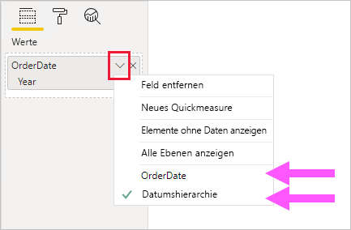
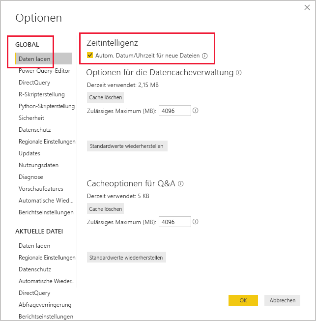

# <a name="auto-datetime-in-power-bi-desktop"></a>Automatische Angabe von Datum/Uhrzeit in Power BI Desktop

Dieser Artikel richtet sich an Datenmodellierer, die Importmodelle oder zusammengesetzte Modelle in Power BI Desktop entwickeln. Im Artikel wird die Option _Autom. Datum/Uhrzeit_ vorgestellt und beschrieben.

„Autom. Datum/Uhrzeit“ ist eine Option zum Laden von Daten Power BI Desktop. Der Zweck dieser Option ist es, praktische Zeitinformationen für Berichte basierend auf Datumsspalten zu unterstützen, die in ein Modell geladen werden. Berichtsautoren, die Ihr Datenmodell verwenden, können mit ihr eine Filterung, Gruppierung und Drilldowns anhand von Kalenderzeiträumen (Jahre, Quartale, Monate und Tage) durchführen. Ein wichtiger Aspekt ist, dass Sie diese Zeitintelligenzfunktionen nicht explizit entwickeln müssen.

Wenn die Option aktiviert ist, erstellt Power BI Desktop für jede Datumsspalte eine ausgeblendete automatische Datums-/Uhrzeittabelle, sofern alle der folgenden Bedingungen erfüllt sind:

- Der Tabellenspeichermodus lautet „Import“.
- Der Spaltendatentyp lautet „date“ oder „date/time“.
- Die Spalte stellt nicht die n-Seite einer 1:n-, n:1- oder n:n-Modellbeziehung dar.

## <a name="how-it-works"></a>So funktioniert‘s

Jede automatische Datums-/Uhrzeittabelle ist tatsächlich eine [berechnete Tabelle](desktop-calculated-tables.md), die unter Verwendung der DAX-Funktion [CALENDAR](/dax/calendar-function-dax) Datenzeilen generiert. Jede Tabelle umfasst außerdem sechs berechnete Spalten: **Day**, **MonthNo**, **Month**, **QuarterNo**, **Quarter** und **Year**.

> [!NOTE]
> Power BI übersetzt und formatiert die Spaltennamen und werte entsprechend der [Modellsprache](supported-languages-countries-regions.md#choose-the-language-for-the-model-in-power-bi-desktop).

Power BI Desktop erstellt außerdem eine Beziehung zwischen der Spalte **Date** der Tabelle mit automatischen Datums-/Zeitangaben und der Datumsspalte im Modell.

Die automatische Datums-/Uhrzeittabelle enthält vollständige Kalenderjahre, die alle in der Datumsspalte des Modells gespeicherten Daten umfassen. Wenn das früheste Datum in einer Datumsspalte beispielsweise der 20. März 2016 und das späteste Datum der 23. Oktober 2019 ist, enthält die Tabelle 1.461 Zeilen. Jede Zeile repräsentiert ein Datum in den vier Kalenderjahren 2016 bis 2019. Wenn Power BI das Modell aktualisiert, wird auch jede automatische Datums-/Uhrzeittabelle aktualisiert. So wird sichergestellt, dass die Tabellen Daten enthalten, die die Werte der Datumsspalte umfassen.

Wenn es möglich war, die Zeilen einer automatischen Datums-/Uhrzeittabelle anzuzeigen, könnten sie so aussehen:


> [!NOTE]
> Automatische Datums-/Uhrzeittabellen sind dauerhaft ausgeblendet, selbst für Modellierer. Sie sind weder im Bereich **Felder** noch im Modellansichtsdiagramm sichtbar, und die zugehörigen Zeilen können nicht in der Datenansicht angezeigt werden. Darüber hinaus können die Tabelle und zugehörige Spalten nicht direkt über DAX-Ausdrücke referenziert werden.

Die Tabelle definiert auch eine Hierarchie, die für Visuals einen Drilldownpfad durch Jahr, Quartal, Monat und Tag bereitstellt.

Wenn es möglich war, eine automatische Datums-/Uhrzeittabelle im Modellansichtsdiagramm anzuzeigen, könnte sie so aussehen (Bezugsspalten sind hervorgehoben):

![Beispiel dafür, wie eine ausgeblendete automatischen Datums-/Uhrzeittabelle aussehen könnte. Anzeige von zwei Tabellen: „Sales“ und „LocalDateTime“. Die Tabellen beziehen sich auf die Spalte „OrderDate“ der Tabelle „Sales“ und die Spalte „Date“ der Tabelle „LocalDateTime“. „LocalDateTime“ definiert sieben Spalten: „Date“, „Day“, „Month“, „MonthNo“, „Quarter“, „QuarterNo“, „Year“ und eine einzelne Hierarchie. Die Hierarchie trägt den Namen „Date Hierarchy“ und umfasst vier Ebenen: Year, Quarter, Month, Day.](media/desktop-auto-date-time/auto-date-time-hidden-table-example-diagram.png)

## <a name="work-with-auto-datetime"></a>Arbeiten mit „Autom. Datum/Uhrzeit“

Wenn eine automatische Datums-/Uhrzeittabelle für eine Datumsspalte vorhanden ist (und diese Spalte sichtbar ist), wird diese Spalte Berichtsautoren nicht als Feld im Bereich **Felder** angezeigt. Stattdessen ist ein erweiterbares Objekt vorhanden, das den Namen der Datumsspalte trägt. Es ist leicht identifizierbar, weil es mit einem Kalendersymbol versehen ist. Wenn Berichtsautoren das Kalenderobjekt erweitern, wird eine Hierarchie namens **Date Hierarchy** geöffnet. Nach dem Erweitern der Hierarchie werden vier Ebenen angezeigt: **Year**, **Quarter**, **Month** und **Day**.


Die generierte automatische Uhrzeit-/Datumshierarchie kann verwendet werden, um ein Visual in genau der gleichen Weise zu konfigurieren wie reguläre Hierarchien. Visuals können konfiguriert werden, indem entweder die gesamte **Date Hierarchy**-Hierarchie oder bestimmte Ebenen der Hierarchie verwendet werden.

Es gibt jedoch eine zusätzliche Funktionalität, die von regulären Hierarchien nicht unterstützt wird. Wenn die automatische Datums-/Uhrzeithierarchie – oder eine Ebene aus der Hierarchie – zu einer Visualquelle hinzugefügt wird, können Berichtsersteller zwischen der Hierarchie und der Datumsspalte umschalten. Dieser Ansatz ist für einige Visuals sinnvoll, wenn nur die Datumsspalte und nicht die Hierarchie und die zugehörigen Ebenen benötigt werden. Sie konfigurieren zunächst das Visualfeld (Rechtsklick auf das Visualfeld oder Klick auf den Pfeil nach unten) und wechseln dann über das Kontextmenü zwischen der Datumsspalte oder der Datumshierarchie.



Schließlich können in DAX geschriebene Modellberechnungen _direkt_ auf eine Datumsspalte oder _indirekt_ auf die ausgeblendeten Spalten der automatischen Datums-/Uhrzeittabelle verweisen.

Eine in Power BI Desktop geschriebene Formel kann wie gewohnt auf eine Datumsspalte verweisen. Die Spalten der automatischen Datums-/Uhrzeittabelle müssen jedoch mit einer speziellen erweiterten Syntax referenziert werden. Sie verweisen zuerst auf die Datumsspalte und fügen dann einen Punkt (.) ein. Anschließend können Sie mithilfe der Autovervollständigung der Bearbeitungsleiste eine Spalte aus der automatischen Datums-/Uhrzeittabelle auswählen.

![Beispiel für die Eingabe eines DAX-Measureausdrucks in der Bearbeitungsleiste. Die Formel lautet bisher „Date Count = COUNT(Sales[OrderDate].“, und eine Autovervollständigungsliste zeigt alle sieben Spalten aus der ausgeblendeten automatischen Datums-/Uhrzeittabelle an. Dies sind: Date, Day, Month, MonthNo, Quarter, QuarterNo, Year.](media/desktop-auto-date-time/auto-date-time-dax-auto-complete.png)

In Power BI Desktop könnte ein gültiger Measureausdruck so aussehen:

```dax
Date Count = COUNT(Sales[OrderDate].[Date])
```

> [!NOTE]
> Obwohl dieser Measureausdruck in Power BI Desktop gültig ist, entspricht er nicht der korrekten DAX-Syntax. Intern transponiert Power BI Desktop Ihren Ausdruck, um auf die richtige (ausgeblendete) Spalte der automatischen Datums-/Uhrzeittabelle zu verweisen.

## <a name="configure-auto-datetime-option"></a>Konfigurieren der Option „Autom. Datum/Uhrzeit“

Die Option „Autom. Datum/Uhrzeit“ kann _global_ oder für die _aktuelle Datei_ konfiguriert werden. Die globale Option wird auf neue Power BI Desktop-Dateien angewendet und kann jederzeit aktiviert oder deaktiviert werden. Für eine neue Installation von Power BI Desktop werden beide Optionen standardmäßig aktiviert.

Die Option für die aktuelle Datei kann ebenfalls jederzeit aktiviert oder deaktiviert werden. Bei Aktivierung der Option werden automatische Datums-/Uhrzeittabellen erstellt. Das Deaktivieren der Option führt dazu, dass automatische Datums-/Uhrzeittabellen aus dem Modell entfernt werden.

> [!CAUTION]
> Gehen Sie mit Bedacht vor, wenn Sie die Option „Aktuelle Datei“ deaktivieren, weil dadurch die automatischen Datums-/Uhrzeittabellen entfernt werden. Stellen Sie sicher, dass alle fehlerhaften Berichtsfilter oder Visuals, die zur Verwendung der Tabellen konfiguriert wurden, korrigiert werden.

Klicken Sie in Power BI Desktop auf _Datei > Optionen und Einstellungen > Optionen_, und wählen Sie dann **Global** oder **Aktuelle Datei** aus. Die Option befindet sich auf jeder Seite im Abschnitt **Zeitintelligenz**.



## <a name="next-steps"></a>Nächste Schritte

Weitere Informationen zur Option „Autom. Datum/Uhrzeit“ und verwandten Themen finden Sie in den folgenden Ressourcen:

- [Festlegen und Verwenden von Datumstabellen in Power BI Desktop](desktop-date-tables.md)
- Haben Sie Fragen? [Stellen Sie Ihre Frage in der Power BI-Community.](https://community.powerbi.com/)
