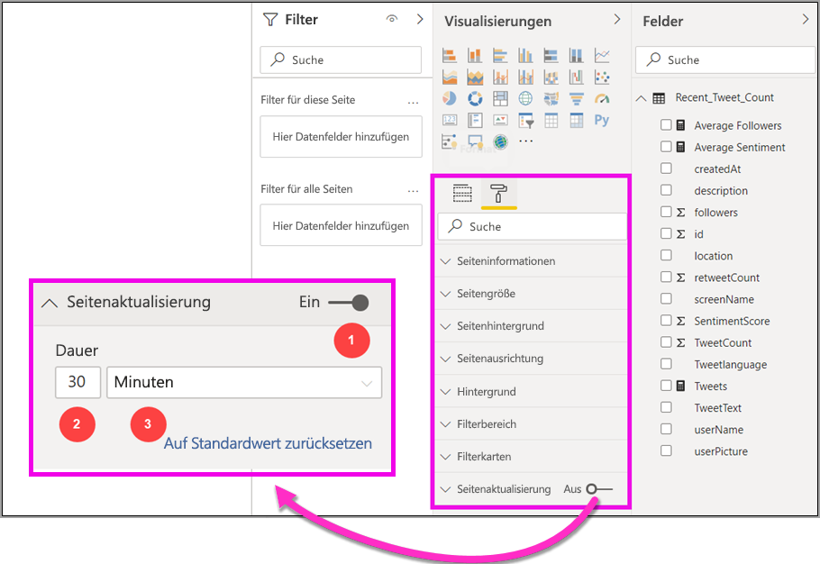
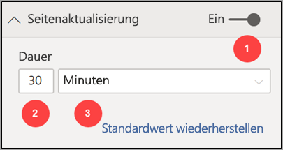
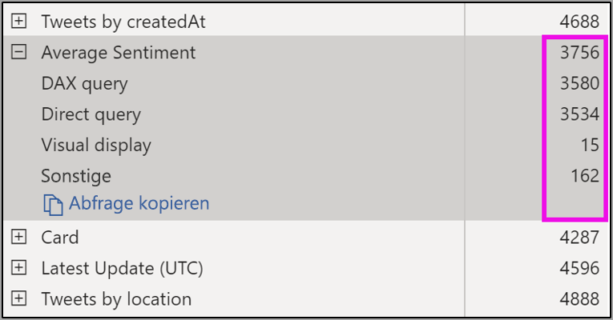
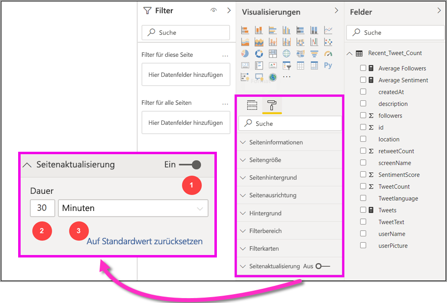

# Automatische Seitenaktualisierung in Power BI Desktop (Vorschau)

Beim Überwachen kritischer Ereignisse ist es wichtig, dass die Daten aktualisiert werden, sobald die Quelldaten aktualisiert werden. In der Fertigungsindustrie ist es beispielsweise wichtig zu wissen, wann eine Maschine nicht funktioniert oder kurz vor einer Störung steht.

Mit der automatischen Seitenaktualisierung (APR) in Power BI kann Ihre aktive Berichtsseite neue Daten in einer vordefinierten Häufigkeit für [DirectQuery-Quellen](https://docs.microsoft.com/power-bi/desktop-directquery-about) abfragen.

## Verwenden der automatischen Seitenaktualisierung

Für diese Vorschauversion müssen Sie das Feature für automatische Seitenaktualisierung in Power BI Desktop aktivieren. Navigieren Sie zu **Datei > Optionen und Einstellungen**, wählen Sie **Optionen** aus, und wählen Sie dann im linken Bereich **Previewfunktion** aus. Aktivieren Sie das Feature, indem Sie das Kontrollkästchen neben *Automatische Seitenaktualisierung* aktivieren. Die automatische Seitenaktualisierung ist nur für DirectQuery-Datenquellen verfügbar.

Um die automatische Seitenaktualisierung zu verwenden, wählen Sie die Berichtsseite aus, für die Sie die Aktualisierung aktivieren möchten. Wählen Sie im Bereich **Visualisierungen** das Symbol für die **Formatierung** (eine Farbrolle) aus, und suchen Sie unten im Bereich nach **Seitenaktualisierung**. 

In der folgenden Abbildung wird die Registerkarte **Seitenaktualisierung** dargestellt. Erläuterungen der nummerierten Elemente werden in den folgenden Abschnitten beschrieben:

1.  Schieberegler für die automatische Seitenaktualisierung: Aktiviert oder Deaktiviert die Seitenaktualisierung
2.  Intervallwert für die Seitenaktualisierung: Numerischer Wert für das Aktualisierungsintervall
3.  Intervalleinheit für die Seitenaktualisierung: Intervalleinheit für die Seitenaktualisierung

Hier können Sie die Seitenaktualisierung aktivieren und die Aktualisierungsdauer auswählen. Der Standardwert sind 30 Minuten, das minimale Aktualisierungsintervall beträgt eine Sekunde. Der Bericht wird in dem von Ihnen festgelegten Intervall aktualisiert. 

## Festlegen des Seitenaktualisierungsintervalls

Wenn die automatische Seitenaktualisierung aktiviert ist, sendet Power BI Desktop ständig Abfragen an Ihre DirectQuery-Quelle. Es gibt eine Verzögerung zwischen dem Senden der Abfrage und der Rückgabe der Daten, sodass Sie für kurze Aktualisierungsintervalle bestätigen sollten, dass Abfragen die abgefragten Daten innerhalb des konfigurierten Intervalls erfolgreich zurückgeben. Wenn die Daten nicht innerhalb des Intervalls zurückgegeben werden, entstehen Situationen, in denen die Visuals weniger häufig als konfiguriert aktualisiert werden.

Als bewährte Methode sollte das Aktualisierungsintervall mindestens der erwarteten Eingangsrate der neuen Daten entsprechen:

* Wenn alle 20 Minuten neue Daten an der Quelle eintreffen, darf das Aktualisierungsintervall nicht weniger als 20 Minuten betragen. 

* Wenn jede Sekunde neue Daten eintreffen, sollte das Intervall auf eine Sekunde festgelegt werden. 

Für niedrige Aktualisierungsintervalle wie eine Sekunde sollten Sie auch den Typ der direkten Abfragedatenquelle, die Last, die Ihre Abfragen dafür erzeugen, die Entfernung Ihrer Berichtsanzeigen vom Rechenzentrum der Kapazität usw. berücksichtigen. 

Sie können dies mit der Leistungsanalyse in Power BI Desktop abschätzen, mit der Sie überprüfen können, ob jede Visual-Abfrage genügend Zeit hat, um mit dem Ergebnis aus der Quelle zurückzukehren, und wo diese Zeit anfällt. Basierend auf den Ergebnissen der Leistungsanalyse können Sie die Datenquelle anpassen und Änderungen vornehmen, oder Sie können mit anderen Visuals und Measures in Ihrem Bericht experimentieren.

In der folgenden Abbildung werden die Ergebnisse einer DirectQuery in der Leistungsanalyse dargestellt:

Betrachten wir einige andere Merkmale dieser Datenquelle. 

1.  Die Daten werden mit einer Rate von zwei Sekunden empfangen. 
2.  Die Leistungsanalyse zeigt die maximale Abfrage- und Anzeigezeit von ungefähr 4,9 Sekunden (4.688 Millisekunden) an. 
3.  Die Datenquelle ist so konfiguriert, dass ungefähr 1.000 gleichzeitige Abfragen pro Sekunde verarbeitet werden. 
4.  Sie erwarten, dass ungefähr 10 Benutzer den Bericht gleichzeitig anzeigen.

Dadurch ergibt sich Folgendes:

* **5 Visuals x 10 Benutzer = ungefähr 50 Abfragen**

Diese Berechnung führt zu einer viel höheren Last als das, was die Datenquelle unterstützen kann. Die Daten werden mit einer Rate von zwei Sekunden empfangen, sodass dies Ihre Aktualisierungsrate sein sollte. Da die Abfrage bis zum Abschluss jedoch ungefähr fünf Sekunden benötigt, sollten wir sie auf mehr als fünf Sekunden festlegen. 

Beachten Sie auch, dass sich dieses Ergebnis unterscheiden kann, wenn Sie den Bericht für den Dienst veröffentlichen, da der Bericht die Analysis Services-Instanz verwendet, die in der Cloud gehostet wird. Möglicherweise möchten Sie die Aktualisierungsraten entsprechend anpassen. 

Um Abfragen und Aktualisierungszeiten zu berücksichtigen, führt Power BI die nächste Aktualisierungsabfrage erst aus, nachdem alle anderen Aktualisierungsabfragen abgeschlossen wurden. Selbst wenn Ihr Aktualisierungsintervall kürzer ist als die Zeit, die Ihre Abfragen zur Verarbeitung benötigen, wird Power BI daher erst wieder aktualisiert, nachdem die verbleibenden Abfragen abgeschlossen wurden. 

Als nächstes schauen wir uns an, wie Sie als Kapazitätsadministrator Leistungsprobleme potenziell erkennen und diagnostizieren können. Weitere Fragen und Antworten zur Leistung und Problembehandlung finden Sie auch im Abschnitt **FAQ zur automatischen Seitenaktualisierung** weiter unten in diesem Artikel.

## Automatische Seitenaktualisierung im Power BI-Dienst

Sie können auch automatische Seitenaktualisierungsintervalle für Berichte festlegen, die in Power BI Desktop erstellt und für den Power BI-Dienst veröffentlicht wurden. 

Die automatische Seitenaktualisierung für Berichte im Power BI-Dienst wird mit Schritten konfiguriert, die der Konfiguration in Power BI Desktop ähneln. Wenn die automatische Seitenaktualisierung im Power BI-Dienst konfiguriert wird, unterstützt sie auch [eingebetteten Power BI-Inhalt](developer/embedding.md). Die folgende Abbildung zeigt die Konfiguration der **Seitenaktualisierung** für den Power BI-Dienst:

1.  Schieberegler für die automatische Seitenaktualisierung: Aktiviert oder Deaktiviert die Seitenaktualisierung
2.  Intervallwert für die Seitenaktualisierung: Numerischer Wert für das Aktualisierungsintervall (muss eine ganze Zahl sein)
3.  Intervalleinheit für die Seitenaktualisierung: Intervalleinheit für die Seitenaktualisierung

### Seitenaktualisierungsintervalle

Die im Power BI-Dienst zulässigen Seitenaktualisierungsintervalle werden durch den Arbeitsbereichstyp des Berichts beeinflusst. Dies gilt für die folgenden Berichte:

* Veröffentlichen eines Berichts in einem Arbeitsbereich, für den automatische Seitenaktualisierung aktiviert ist
* Bearbeiten eines Seitenaktualisierungsintervalls, das bereits in einem Arbeitsbereich festgelegt ist
* Erstellen eines Berichts direkt im Dienst

Power BI Desktop weist keine Einschränkung für das Aktualisierungsintervall auf. Das Aktualisierungsintervall kann so häufig wie sekündlich sein. Wenn Berichte jedoch für den Power BI-Dienst veröffentlicht werden, gelten bestimmte Einschränkungen, die in den folgenden Abschnitten beschrieben werden.

### Einschränkungen für Aktualisierungsintervalle

Im Power BI-Dienst gelten automatische Seitenaktualisierungseinschränkungen basierend auf Faktoren wie dem Arbeitsbereich und sind davon abhängig, ob Premium-Dienste verwendet werden.

Um zu verdeutlichen, wie dies funktioniert, beginnen wir mit einigen Hintergrundinformationen zu Kapazitäten und Arbeitsbereichen:

**Kapazitäten** sind ein zentrales Konzept von Power BI, das eine Reihe von Ressourcen (Speicher, Prozessor und Arbeitsspeicher) darstellt, die zum Hosten und Bereitstellen von Power BI-Inhalten verwendet werden. Kapazitäten werden entweder gemeinsam genutzte oder sind dediziert. Eine **gemeinsam genutzte Kapazität** wird für andere Microsoft-Kunden freigegeben, während eine **dedizierte Kapazität** vollständig einem einzelnen Kunden zugewiesen wird. Dedizierte Kapazitäten werden im Artikel [Verwalten von Premium-Kapazitäten](service-premium-capacity-manage.md) vorgestellt.

Bei gemeinsam genutzten Kapazitäten werden Workloads auf Computeressourcen ausgeführt, die gemeinsam mit anderen Kunden genutzt werden. Da die Kapazität Ressourcen gemeinsam nutzen muss, werden Einschränkungen auferlegt, um *Fairplay* zu gewährleisten, z.B. das Festlegen einer maximalen Modellgröße (1 GB) und einer maximalen täglichen Aktualisierungshäufigkeit (acht Mal pro Tag).

Power BI-**Arbeitsbereiche** befinden sich innerhalb der Kapazitäten, und sie stellen Sicherheits-, Zusammenarbeits- und Bereitstellungscontainer dar. Jeder Power BI-Benutzer verfügt über einen persönlichen Arbeitsbereich, der als **Mein Arbeitsbereich** bezeichnet wird. Zusätzliche Arbeitsbereiche können erstellt werden, um die Zusammenarbeit und die Bereitstellung zu ermöglichen, und diese werden als **Arbeitsbereiche** bezeichnet. Standardmäßig werden Arbeitsbereiche (einschließlich persönlicher Arbeitsbereiche) in der **gemeinsam genutzten Kapazität** erstellt.

Im Folgenden finden Sie einige Details zu den beiden Arbeitsbereichsszenarien:

**Gemeinsam verwendete Arbeitsbereiche**: Für normale Arbeitsbereiche (Arbeitsbereiche, die nicht Teil einer Premium-Kapazität sind) gilt für die automatische Seitenaktualisierung ein Mindestintervall von 30 Minuten (das niedrigste zulässige Intervall).

**Premium-Arbeitsbereiche**: Die automatische Seitenaktualisierungsverfügbarkeit in Premium-Arbeitsbereichen hängt von den Arbeitsauslastungseinstellungen ab, die Ihr Premium-Administrator für die Power BI Premium-Kapazität eingerichtet hat. Es gibt zwei Variablen, die sich auf ihre Fähigkeit zum Einrichten der automatischen Seitenaktualisierung auswirken können:

 1. *Feature ein/aus*: Wenn Ihr Kapazitätsadministrator beschlossen hat, das Feature zu deaktivieren, können Sie in Ihrem veröffentlichten Bericht keine Art von Seitenaktualisierung einrichten.

 2. *Minimales Aktualisierungsintervall*: Wenn Sie die Funktion aktivieren, muss der Kapazitätsadministrator ein minimales Aktualisierungsintervall einrichten. Wenn Ihr Intervall niedriger als das Minimum ist, überschreibt der Power BI-Dienst das Intervall, um das von Ihrem Kapazitätsadministrator festgelegte Mindestintervall zu berücksichtigen.

In der folgenden Tabelle werden weitere Details zur Verfügbarkeit dieses Features und den Grenzwerten für die einzelnen Kapazitätstypen und [Speichermodi](service-dataset-modes-understand.md) beschrieben.

| Speichermodus | Dedizierte Kapazität | Gemeinsam genutzte Kapazität |
| --- | --- | --- |
| Direkte Abfrage | **Unterstützt**: ja.  **Mindestintervall für Aktualisierung**: 1 Sekunde  **Kapazitätsadministratorüberschreibung**: ja. | **Unterstützt**: ja.  **Mindestintervall für Aktualisierung**: 30 Minuten  **Kapazitätsadministratorüberschreibung**: nein. |
| Importieren | **Unterstützt**: nein.  **Mindestintervall für Aktualisierung**: N/V  **Kapazitätsadministratorüberschreibung**: N/A. | **Unterstützt**: nein.  **Mindestintervall für Aktualisierung**: N/V  **Kapazitätsadministratorüberschreibung**: N/A. |
| Gemischter Modus (DQ und andere) | **Unterstützt**: ja.  **Mindestintervall für Aktualisierung**: 1 Sekunde  **Kapazitätsadministratorüberschreibung**: ja. | **Unterstützt**: ja.  **Mindestintervall für Aktualisierung**: 30 Minuten  **Kapazitätsadministratorüberschreibung**: nein. |
| Live Connect AS | **Unterstützt**: nein.  **Mindestintervall für Aktualisierung**: N/V  **Kapazitätsadministratorüberschreibung**: N/A. | **Unterstützt**: nein.  **Mindestintervall für Aktualisierung**: N/V  **Kapazitätsadministratorüberschreibung**: N/A. |
| Live Connect PBI | **Unterstützt**: nein.  **Mindestintervall für Aktualisierung**: N/V  **Kapazitätsadministratorüberschreibung**: N/A. | **Unterstützt**: nein.  **Mindestintervall für Aktualisierung**: N/V  **Kapazitätsadministratorüberschreibung**: N/A. |

> [!NOTE]
> Wenn Sie Ihren für automatische Seitenaktualisierung aktivierten Bericht aus Power BI Desktop für den Dienst veröffentlichen, müssen Sie die Anmeldeinformationen für die DirectQuery-Datenquelle im Menü der Dataseteinstellungen angeben.

## Überlegungen und Einschränkungen

Bei Verwendung der automatischen Seitenaktualisierung in Power BI Desktop oder im Power BI-Dienst sind einige Dinge zu beachten.

* Die Import-, LiveConnect- und Push-Speichermodi werden für automatische Seitenaktualisierung nicht unterstützt.  
* Zusammengesetzte Modelle, die über mindestens eine DirectQuery-Datenquelle verfügen, werden unterstützt.
* Power BI Desktop weist keine Einschränkung für das Aktualisierungsintervall auf, das so häufig wie sekündlich sein kann. Wenn Berichte für den Power BI-Dienst veröffentlicht werden, gelten bestimmte Einschränkungen, die weiter oben in diesem Dokument beschrieben wurden.

### Leistungsdiagnose

Automatische Seitenaktualisierung eignet sich für die Überwachung von Szenarien und das Untersuchen von Daten, die sich schnell ändern. Manchmal kann dies jedoch zu einer unangemessenen Last für die Kapazität oder Datenquelle führen.

Um eine unzulässige Last für Datenquellen zu vermeiden, trifft Power BI die folgenden Sicherheitsvorkehrungen:

1. Alle automatischen Seitenaktualisierungsabfragen werden mit einer **niedrigeren** Priorität ausgeführt, um sicherzustellen, dass interaktive Abfragen (z.B. das Laden von Seiten und das Kreuzfiltern von Visuals) Vorrang besitzen.
2. Wenn Ihre Abfrage nicht vor dem nächsten Aktualisierungszyklus abgeschlossen wurde, gibt Power BI keine neuen Aktualisierungsabfragen aus, bis die vorherige Abfrage abgeschlossen wurde. Wenn Sie beispielsweise ein Aktualisierungsintervall von einer Sekunde verwenden und Ihre Abfragen durchschnittlich vier Sekunden dauern, gibt Power BI effektiv nur alle vier Sekunden eine Abfrage aus.

Es gibt zwei Bereiche, in denen es dennoch zu Leistungsengpässen kommen kann:

1. **Kapazität:** Die Abfrage trifft zunächst auf die Premium-Kapazität, die für die aus den Berichtsvisualisierungen generierte DAX-Abfrage Query Folding in die Quellabfragen ausführt und die Abfrage auswertet.
2. **DirectQuery-Datenquelle:** Die übersetzten Abfragen aus dem vorherigen Schritt werden dann anhand der Quelle ausgeführt. Dabei handelt es sich um Ihre SQL Server-, SAP Hana-Quellen usw.

Mithilfe der [Premium-Metrik-App](service-admin-premium-monitor-capacity.md), die für Administratoren verfügbar ist, können Sie visualisieren, in welchem Umfang Kapazität von Abfragen mit niedriger Priorität verwendet wird.

Abfragen mit niedriger Priorität bestehen aus Abfragen zur automatischen Seitenaktualisierung und Modellaktualisierungsabfragen. Zurzeit gibt es keine Möglichkeit, zwischen der Last durch automatischer Seitenaktualisierung und der Last durch Abfragen zur Modellaktualisierung zu unterscheiden.

Wenn Sie bemerken, dass Ihre Kapazität durch Abfragen mit niedriger Priorität überlastet wird, können Sie einige Aktionen ausführen:

1. Fordern Sie eine größere Premium-SKU an.
2. Setzen Sie sich mit dem Besitzer des Berichts in Verbindung, und bitten Sie ihn, das Aktualisierungsintervall zu verringern.
3. Im Kapazitätsverwaltungsportal können Sie folgende Aktionen ausführen:
  1. Deaktivieren der automatischen Seitenaktualisierung für diese Kapazität
  2. Erhöhen des minimalen Aktualisierungsintervalls, das sich auf alle Berichte für diese Kapazität auswirkt.

### Häufig gestellte Fragen

Dieser Abschnitt enthält häufig gestellte Fragen und Antworten zu den folgenden Themen: 

1. Ich bin der Autor eines Berichts. Ich habe das Aktualisierungsintervall für den Bericht auf dem Desktop auf 1 Sekunde festgelegt, aber nach der Veröffentlichung des Berichts wird er nicht im Dienst aktualisiert.

    * Überprüfen Sie, ob automatische Seitenaktualisierung für die Seite aktiviert ist. Da diese Einstellung pro Seite festgelegt wird, müssen Sie sicherstellen, dass sie für jede Seite im Bericht, die Sie aktualisieren möchten, aktiviert ist.
    * Überprüfen Sie, ob Sie den Upload in einen Arbeitsbereich mit angefügter Premium-Kapazität durchgeführt haben. Wenn dies nicht der Fall ist, wird Ihr Aktualisierungsintervall bei 30 Minuten gesperrt.
    * Wenn sich Ihr Bericht in einem Premium-Arbeitsbereich befindet, fragen Sie Ihren Administrator, ob er diese Funktion für die angefügte Kapazität aktiviert hat. Stellen Sie außerdem sicher, dass das minimale Aktualisierungsintervall für die Kapazität kleiner oder gleich dem Intervall des Berichts ist.

2. Ich bin Kapazitätsadministrator. Ich habe meine Einstellungen für das Intervall für automatische Seitenaktualisierung geändert, aber sie werden nicht angewendet. Mit anderen Worten: Berichte werden immer noch mit einer Rate aktualisiert, die falsch ist, oder sie werden nicht aktualisiert, obwohl ich die Aktualisierung aktiviert habe.

    * Bei Änderungen an den Einstellungen für die automatische Seitenaktualisierung, die in der Kapazitätsverwaltungs-Benutzeroberfläche vorgenommen wurden, kann es bis zu 5 Minuten dauern, bis sie an Berichte weitergegeben werden.
    * Zusätzlich zum Aktivieren der automatischen Seitenaktualisierung für die Kapazität müssen Sie sie auch für Seiten eines Berichts aktivieren, auf denen Sie sie verwenden möchten.

3. Mein Bericht wird im gemischten Modus ausgeführt (DQ und Import). Nicht alle Visuals werden aktualisiert.

    * Wenn Ihre Visuals auf Importtabellen verweisen, wird dieses Verhalten erwartet. Automatische Seitenaktualisierung wird für Import nicht unterstützt.
    * Siehe Frage 1 in diesem Abschnitt.

4. Mein Bericht wurde im Dienst bisher einwandfrei aktualisiert und dann plötzlich nicht mehr.

    * Versuchen Sie, die Seite zu aktualisieren, um festzustellen, ob sich das Problem dann von selbst löst.
    * Wenden Sie sich an Ihren Kapazitätsadministrator, da er das Feature möglicherweise deaktiviert oder das minimale Aktualisierungsintervall erhöht hat (siehe Frage 2).

5. Ich bin der Autor eines Berichts. Meine Visuals werden nicht in der von mir angegebenen Frequenz aktualisiert. Sie werden mit einer langsameren Rate aktualisiert.

    * Wenn die Ausführung Ihrer Abfragen länger dauert, wird das Aktualisierungsintervall verzögert. Die automatische Seitenaktualisierung wartet, bis alle Abfragen abgeschlossen wurden, bevor neue Abfragen ausgeführt werden.
    * Ihr Kapazitätsadministrator hat möglicherweise ein minimales Aktualisierungsintervall festgelegt, das höher ist als das, das Sie für den Bericht festgelegt haben. Wenden Sie sich an Ihren Kapazitätsadministrator, und bitten Sie ihn, die Rate zu senken.

6. Werden automatische Seitenaktualisierungsabfragen aus dem Cache bereitgestellt?

    * Nein, alle automatischen Seitenaktualisierungsabfragen umgehen alle zwischengespeicherten Daten.

## Nächste Schritte

Weitere Informationen finden Sie in den folgenden Artikeln:

* [Verwendung von DirectQuery in Power BI](desktop-directquery-about.md)
* [Verwenden der Leistungsanalyse zum Untersuchen der Leistung von Berichtselementen](desktop-performance-analyzer.md)
* [Bereitstellen und Verwalten von Power BI Premium-Kapazitäten](whitepaper-powerbi-premium-deployment.md)
* [Datenquellen in Power BI Desktop](desktop-data-sources.md)
* [Strukturieren und Kombinieren von Daten mit Power BI Desktop](desktop-shape-and-combine-data.md)
* [Verbinden mit Excel in Power BI Desktop](desktop-connect-excel.md)   
* [Eingeben von Daten direkt in Power BI Desktop](desktop-enter-data-directly-into-desktop.md)   
