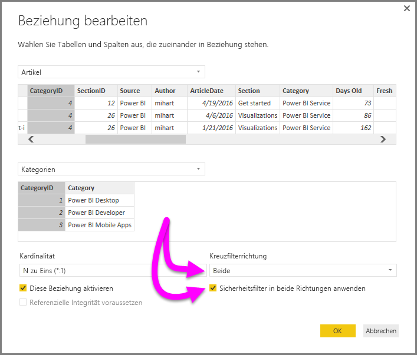

# Aktivieren der bidirektionalen Kreuzfilterung für DirectQuery in Power BI Desktop

Datenmodellierer und Ersteller von Berichten, die Tabellen filtern möchten, damit nur bestimmte Daten angezeigt werden, stehen vor der Herausforderung, festzulegen, wie die Filter auf einen Bericht angewendet werden sollen. Bisher war der Tabellenfilterkontext nur für eine Seite der Beziehung verfügbar, nicht für beide. Deshalb waren häufig komplizierte DAX-Formeln nötig, um das gewünschte Ergebnis zu erhalten.

Die bidirektionale Kreuzfilterung bietet Datenmodellierern und Erstellern von Berichten nun mehr Kontrolle über die Anwendung von Filtern bei verknüpften Tabellen. Sie ermöglicht ihnen, Filter auf *beide* Seiten der Tabellenbeziehung anzuwenden. Sie können die Filter anwenden, indem Sie den Filterkontext auf eine zweite, verknüpfte Tabelle auf der anderen Seite der Tabellenbeziehung ausweiten.

## Aktivieren der bidirektionalen Kreuzfilterung für DirectQuery

Sie können die bidirektionale Kreuzfilterung im Dialogfeld **Beziehung bearbeiten** aktivieren. Um für eine Beziehung die Kreuzfilterung aktivieren zu können, müssen Sie eine der folgenden Optionen konfigurieren:

* Legen Sie für **Kreuzfilterrichtung** die Einstellung **Beide** fest.
* Wählen Sie **Sicherheitsfilter in beide Richtungen anwenden** aus.

  

> [!NOTE]
> Verwenden Sie *UserPrincipalName*, wenn Sie in Power BI Desktop Dax-Formeln für die Kreuzfilterung erstellen. Dieses Feld ist häufig identisch mit dem Anmeldename eines Benutzers, z. B. <em>joe@contoso.com</em>, anstatt *UserName*. Daher müssen Sie möglicherweise eine verknüpfte Tabelle erstellen, die *UserName* oder *EmployeeID* zu *UserPrincipalName* zuordnet.

Weitere Informationen und Beispiele für die Funktionsweise der bidirektionalen Kreuzfilterung finden Sie im [Whitepaper zur bidirektionalen Kreuzfilterung in Power BI Desktop](https://download.microsoft.com/download/2/7/8/2782DF95-3E0D-40CD-BFC8-749A2882E109/Bidirectional%20cross-filtering%20in%20Analysis%20Services%202016%20and%20Power%20BI.docx).

