# Erstellen von Lesezeichen zum Teilen von Erkenntnissen und Erstellen von Präsentationen in Power BI Desktop
Mithilfe von *Lesezeichen* können Sie in Power BI Desktop die aktuell konfigurierte Ansicht einer Berichtsseite, einschließlich Filterung und Zustands der Visuals, erfassen. Sie können später zu diesem Zustand zurückkehren, indem Sie das gespeicherte Lesezeichen auswählen. 

Sie können auch eine Sammlung von Lesezeichen erstellen, sie in der gewünschten Reihenfolge anordnen und dann die einzelnen Lesezeichen in einer Präsentation durchlaufen, um eine Reihe von Erkenntnissen hervorzuheben oder die Geschichte, die Sie mit Ihren Visuals und Berichten erzählen möchten, zu präsentieren. 

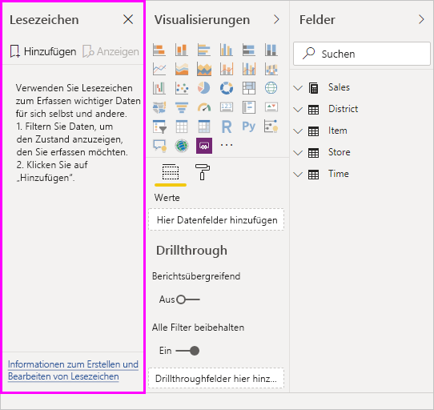

Lesezeichen können für viele unterschiedliche Zwecke hinzugefügt werden. Sie können Lesezeichen beispielsweise zum Nachverfolgen ihrer Fortschritte beim Erstellen von Berichten verwenden (Lesezeichen lassen sich einfach hinzufügen, löschen und umbenennen). Oder Sie können Lesezeichen erstellen, um eine PowerPoint-ähnliche Präsentation zu erzeugen, in der die Lesezeichen nacheinander aufgerufen werden, sodass Ihr Bericht eine Geschichte erzählt. 

> [!TIP]
> Informationen zur Verwendung persönlicher Lesezeichen im Power BI-Dienst finden Sie im Blogbeitrag [Announcing personal bookmarks in the Power BI Service](https://powerbi.microsoft.com/blog/announcing-personal-bookmarks-in-the-power-bi-service/) (Ankündigung persönlicher Lesezeichen im Power BI-Dienst). 

## Verwenden von Lesezeichen
Wählen Sie zum Verwenden von Lesezeichen auf dem Menüband von Power BI Desktop die Registerkarte **Ansicht** und dann **Lesezeichenbereich** aus. 

Wenn Sie ein Lesezeichen erstellen, werden die folgenden Elemente mit dem Lesezeichen gespeichert:

* Die aktuelle Seite
* Filter
* Slicer, einschließlich Slicertyp (z.B. Dropdown oder Liste) und Slicerstatus
* Status der Auswahl des Visuals (z.B. Filter mit übergreifender Hervorhebung)
* Sortierreihenfolge
* Drilldownposition
* Sichtbarkeit eines Objekts (im Bereich **Auswahl**)
* Der Fokus- oder **Spotlightmodus** jedes angezeigten Objekts

Konfigurieren Sie eine Berichtsseite so, wie sie im Lesezeichen angezeigt werden soll. Sobald Ihre Berichtsseite und Visuals wie gewünscht angeordnet sind, wählen Sie im Bereich **Lesezeichen** die Option **Hinzufügen** aus, um ein Lesezeichen hinzufügen. 

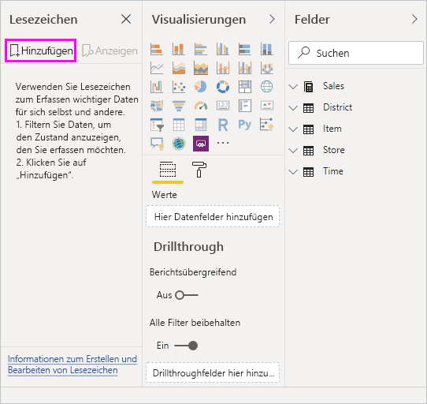

Power BI Desktop erstellt ein Lesezeichen und versieht es mit einem generischen Namen. Lesezeichen können einfach **umbenannt**, **gelöscht** oder **aktualisiert** werden. Wählen Sie dazu die Auslassungspunkte neben dem Namen des Lesezeichens und im daraufhin angezeigten Menü eine Aktion aus.

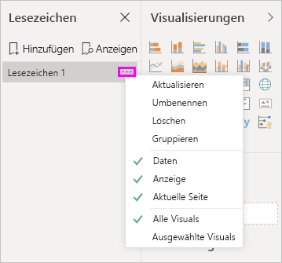

Nachdem Sie ein Lesezeichen erstellt haben, können Sie es anzeigen, indem Sie es im Bereich **Lesezeichen** auswählen. 

Sie können auch auswählen, ob jedes Lesezeichen Eigenschaften von **Daten** anwendet, z. B. Filter und Datenschnitte, **Anzeigeeigenschaften**, z. B. Spotlight und seine Sichtbarkeit, und Änderungen der **aktuellen Seite**, sodass die Seite angezeigt wird, die sichtbar war, als das Lesezeichen hinzugefügt wurde. Diese Funktionen sind nützlich, wenn Sie Lesezeichen verwenden, um zwischen Berichtsansichten oder Visuals zu wechseln. In diesem Fall möchten Sie die Dateneigenschaften wahrscheinlich deaktivieren, damit Filter nicht zurückgesetzt werden, wenn Benutzer durch Auswählen eines Lesezeichen zwischen Ansichten wechseln. 

Um solche Änderungen vorzunehmen, wählen Sie die Auslassungspunkte neben dem Namen des Lesezeichens aus. Dann aktivieren oder deaktivieren Sie das Häkchen neben **Daten**, **Anzeige** und anderen Steuerelementen. 

## Anordnen von Lesezeichen
Beim Erstellen von Lesezeichen werden Sie möglicherweise feststellen, dass die Reihenfolge ihrer Erstellung nicht unbedingt der Reihenfolge entspricht, in der Sie sie Ihrer Zielgruppe präsentieren möchten. Dies ist kein Problem, da Sie die Reihenfolge der Lesezeichen leicht ändern können.

- Ändern Sie im Bereich **Lesezeichen** die Reihenfolge der Lesezeichen per Drag & Drop. 

   Die gelbe Leiste zwischen Lesezeichen gibt an, wo das gezogene Lesezeichen abgelegt wird.

   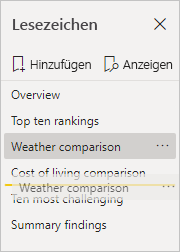

Die Reihenfolge der Lesezeichen kann wichtig werden, wenn Sie das Feature **Ansicht** für Lesezeichen verwenden, wie im nächsten Abschnitt beschrieben.

## Lesezeichen als Bildschirmpräsentation
Wenn Sie über eine Sammlung von Lesezeichen verfügen, die Sie nacheinander präsentieren möchten, können Sie im Bereich **Lesezeichen** die Option **Ansicht** auswählen, um eine Bildschirmpräsentation zu starten.

Im Modus **Ansicht** sind einige Features zu beachten.

   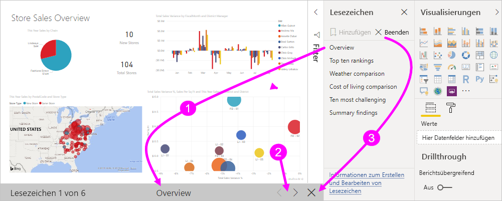

1. Auf der Lesezeichen-Titelleiste am unteren Rand des Zeichenbereichs wird der Name des Lesezeichens angezeigt.

2. Die Lesezeichen-Titelleiste verfügt über Pfeile, mit denen Sie zum nächsten oder vorherigen Lesezeichen wechseln können.

3. Sie können den Modus **Ansicht** beenden, indem Sie im Bereich **Lesezeichen** die Option **Beenden** oder das **X** auf der Titelleiste des Lesezeichens auswählen. 

Im Modus **Ansicht** können Sie den Bereich **Lesezeichen** schließen (durch Klicken auf das **X** in diesem Bereich), um mehr Platz für Ihre Präsentation zu schaffen. Alle Visuals sind interaktiv, wenn sie sich im Modus **Ansicht** befinden und für übergreifendes Hervorheben verfügbar, so wie sie es auch bei direkter Interaktion mit ihnen sind. 

## Sichtbarkeit: Verwenden des Bereichs „Auswahl“
Der in Beziehung zum Bereich **Lesezeichen** stehende Bereich **Auswahl** enthält eine Liste aller Objekte auf der aktuellen Seite und ermöglicht Ihnen, ein Objekt auszuwählen und anzugeben, ob es sichtbar ist. 

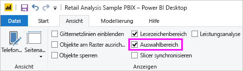

Im Bereich **Auswahl** können Sie ein Objekt auswählen und seine Sichtbarkeit aktivieren/deaktivieren, indem Sie das Augensymbol rechts neben dem Objekt auswählen. 

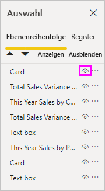

Beim Hinzufügen eines Lesezeichens wird der Sichtbarkeitsstatus jedes Objekts basierend auf der Einstellung im Bereich **Auswahl** gespeichert. 

Wichtig ist zu beachten, dass Berichtsseiten weiterhin durch Datenschnitte gefiltert werden, auch wenn sie nicht sichtbar sind. Sie können daher viele verschiedene Lesezeichen mit unterschiedlichen Datenschnitteinstellungen erstellen und eine einzelne Berichtsseite in verschiedenen Lesezeichen unterschiedlich darstellen (und jeweils andere Erkenntnisse hervorheben).

## Lesezeichen für Formen und Bilder
Sie können auch Formen und Bilder mit Lesezeichen verknüpfen. Wenn Sie dann ein Objekt auswählen, wird das mit dem Objekt verknüpfte Lesezeichen angezeigt. Dies kann besonders nützlich sein, wenn Sie mit Schaltflächen arbeiten. Weitere Informationen finden Sie unter [Verwenden von Schaltflächen in Power BI](desktop-buttons.md). 

So weisen Sie einem Objekt ein Lesezeichen zu 

1. Wählen Sie das Objekt im Berichtszeichenbereich aus. Drehen Sie dann im angezeigten Fenster **Form formatieren** den Schieberegler **Aktion** auf **Ein**.

2. Erweitern Sie den Bereich **Aktion**. Wählen Sie unter **Typ** die Option **Lesezeichen** aus.

3. Wählen Sie unter **Lesezeichen** ein Lesezeichen aus.

   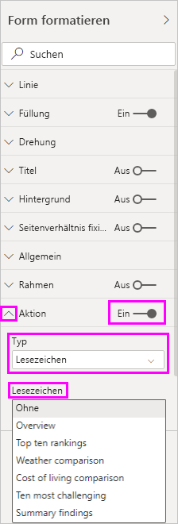

Das Hinzufügen von Lesezeichen, die mit Objekten verknüpft sind, bietet Ihnen viele interessante Möglichkeiten. Sie können auf der Berichtsseite ein Inhaltsverzeichnis der Visuals erstellen oder unterschiedliche Ansichten (z. B. Visualtypen) der gleichen Informationen erstellen.

Wenn Sie sich im Bearbeitungsmodus befinden, drücken Sie die **STRG**-TASTE, und wählen Sie den Link aus, um ihm zu folgen. Wenn Sie sich nicht im Bearbeitungsmodus befinden, wählen Sie das Objekt aus, um dem Link zu folgen. 

## Lesezeichengruppen

Ab dem Power BI Desktop-Release vom August 2018 können Sie Lesezeichengruppen erstellen und verwenden. Eine Lesezeichengruppe ist eine von Ihnen angegebene Sammlung von Lesezeichen, die als Gruppe angezeigt und organisiert werden kann. 

So erstellen Sie eine Lesezeichengruppe 
1. Drücken Sie die **STRG**-TASTE, und wählen Sie die Lesezeichen aus, die Sie in die Gruppe aufnehmen möchten. 

2. Wählen Sie die Auslassungspunkte neben den ausgewählten Lesezeichen aus und dann im eingeblendeten Menü **Gruppieren** aus.

   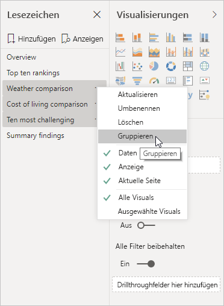

Power BI Desktop nennt die Gruppe automatisch *Gruppe 1*. Sie können die Auslassungspunkte neben diesem Namen auswählen, **Umbenennen** auswählen und ihn nach Belieben ändern.

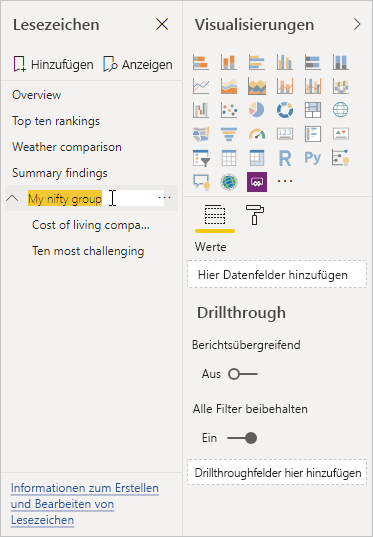

Bei jeder Lesezeichengruppe wird durch Erweitern des Namens der Lesezeichengruppe nur die Gruppe von Lesezeichen auf- oder zugeklappt. Der Gruppenname selbst stellt kein Lesezeichen dar. 

Bei Verwendung des Features **Ansicht** für Lesezeichen gilt Folgendes:

* Wenn Sie unter Lesezeichen **Ansicht** auswählen und sich das ausgewählte Lesezeichen in einer Gruppe befindet, werden in dieser Ansicht nur die Lesezeichen *in dieser Gruppe* angezeigt. 

* Wenn sich das ausgewählte Lesezeichen nicht in einer Gruppe auf der obersten Ebene befindet (wie z. B. der Name einer Lesezeichengruppe), werden alle Lesezeichen, und zwar auch diejenigen in beliebigen Gruppen, für den gesamten Bericht angezeigt. 

So heben Sie die Gruppierung von Lesezeichen auf 
1. Wählen Sie ein beliebiges Lesezeichen in einer Gruppe und dann die Auslassungspunkte aus. 

2. Wählen Sie im eingeblendeten Menü **Gruppierung aufheben** aus.

   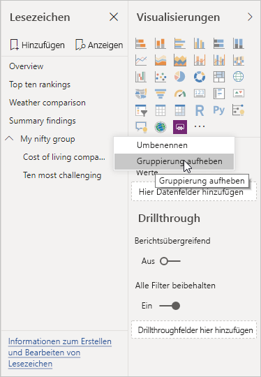

   Wenn Sie in einer Gruppe für ein beliebiges Lesezeichen **Gruppierung aufheben** auswählen, werden alle Lesezeichen aus der Gruppe entfernt. Dabei wird die Gruppe gelöscht, ohne dass die Lesezeichen selbst gelöscht werden. 

So entfernen Sie ein einzelnes Lesezeichen aus einer Gruppe 
1. Wählen Sie für ein Mitglied der Gruppe **Gruppierung aufheben** auswählen, wird die gesamte Gruppierung gelöscht. 

2. Wählen Sie die gewünschten Mitglieder in der neuen Gruppe aus, indem Sie die **STRG**-TASTE drücken, die einzelnen Lesezeichen auswählen und dann erneut **Gruppieren** auswählen. 

## Verwenden von Spotlight
*Spotlight* ist ein weiteres Feature, das zusammen mit Lesezeichen veröffentlicht wird. Mit Spotlight können Sie die Aufmerksamkeit auf ein bestimmtes Diagramm lenken, z. B. bei Präsentation der Lesezeichen im Modus **Ansicht**.

Lassen Sie uns Spotlight mit dem Fokusmodus vergleichen, um die Unterschiede festzustellen:

1. Im Fokusmodus können Sie das Symbol **Fokusmodus** eines Visuals auswählen, um mit dem Visual den gesamten Zeichenbereich auszufüllen.

2. **Spotlight** wählen Sie über die Auslassungspunkte eines Visuals aus, um es in seiner ursprünglichen Größe hervorheben, wodurch alle anderen Visuals auf der Seite nahezu transparent dargestellt werden. 

Wenn Sie das Symbol **Fokusmodus** des Visuals in der vorherigen Abbildung auswählen, wird die Seite wie folgt angezeigt:

Wenn **Spotlight** hingegen im Menü mit den Auslassungspunkten für das Visual ausgewählt wird, sieht die Seite wie folgt aus:

Wenn beim Hinzufügen eines Lesezeichens entweder der Fokus- oder der Spotlight-Modus ausgewählt ist, wird dieser Modus im Lesezeichen beibehalten.

## Lesezeichen im Power BI-Dienst
Wenn Sie im Power BI-Dienst einen Bericht mit mindestens einem Lesezeichen veröffentlichen, können Sie diese Lesezeichen im Power BI-Dienst anzeigen und mit ihnen interagieren. Wenn Lesezeichen in einem Bericht verfügbar sind, zeigen Sie die Bereiche **Auswahl** und **Lesezeichen** an, indem Sie **Ansicht** > **Auswahlbereich** oder **Ansicht** > **Lesezeichenbereich** auswählen. 

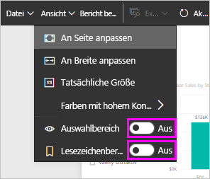

Der Bereich **Lesezeichen** bietet im Power BI-Dienst die gleichen Funktionen wie in Power BI Desktop, einschließlich der Möglichkeit, durch Auswahl von **Ansicht** die Lesezeichen wie in einer Bildschirmpräsentation nacheinander anzuzeigen.

Navigieren Sie durch die Lesezeichen auf der grauen Titelleiste des Lesezeichens statt über die schwarzen Pfeile. (Die schwarzen Pfeile führen Sie durch Berichtsseiten und nicht durch Lesezeichen.)

## Aktivieren der Lesezeichenvorschau (Versionen vor März 2018)
Ab der Version von März 2018 sind Lesezeichen in Power BI Desktop allgemein verfügbar. 

Es wird immer empfohlen, auf das neueste Release zu aktualisieren. Wenn Ihre Power BI Desktop-Version älter als dieses Release ist, können Sie jedoch das Feature „Lesezeichen“ ab dem Power BI Desktop-Release vom Oktober 2017 nutzen. Für Berichte, die Lesezeichen unterstützen, können Sie dieses Feature auch im Power BI-Dienst verwenden. 

So aktivieren Sie das Vorschaufeature „Lesezeichen“ 

1. Wählen Sie **Datei** > **Optionen und Einstellungen** > **Optionen** > **Vorschaufeatures** und dann **Lesezeichen** aus. 

   

2. Starten Sie Power BI Desktop neu, um die Vorschauversion von „Lesezeichen“ zu aktivieren.

## Einschränkungen und Überlegungen
Für dieses Release des Features „Lesezeichen“ gelten einige Einschränkungen und Überlegungen.

* Die meisten benutzerdefinierten Visualisierungen sollten mit Lesezeichen gut funktionieren. Wenn jedoch bei einem Lesezeichen Probleme in Zusammenhang mit einem benutzerdefinierten Visual auftreten sollten, bitten Sie den Ersteller des benutzerdefinierten Visuals, dafür zu sorgen, dass sein Visual Lesezeichen unterstützt. 
* Wenn Sie einer Berichtsseite nach dem Erstellen eines Lesezeichens ein Visual hinzufügen, wird das Visual in seinem Standardstatus angezeigt. Dies bedeutet auch, dass beim Anwenden eines Datenschnitts auf einer Seite, auf der Sie zuvor Lesezeichen erstellt haben, das Verhalten des Datenschnitts seinem Standardstatus entspricht.
* Das Verschieben eines Visuals nach dem Erstellen des Lesezeichens wird automatisch im Lesezeichen wiedergegeben. 

## Nächste Schritte
Weitere Informationen zu Features, die Lesezeichen ähneln oder mit diesen interagieren, finden Sie in den folgenden Artikeln:

* [Verwenden der Drillthroughfunktion in Power BI Desktop](desktop-drillthrough.md)
* [Anzeigen einer Dashboardkachel oder eines Berichtsvisuals im Fokusmodus](consumer/end-user-focus.md)

