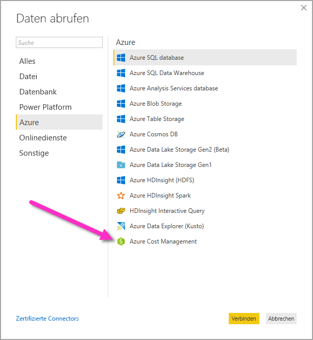
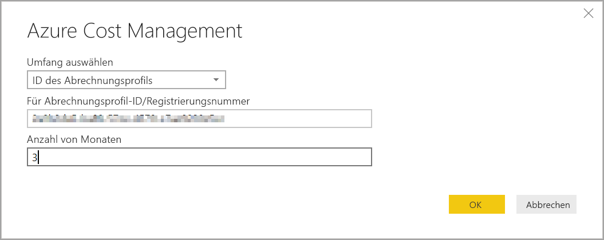
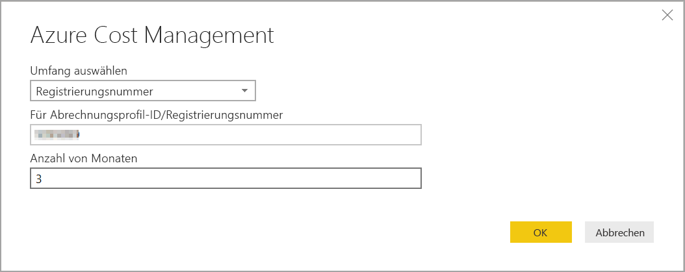
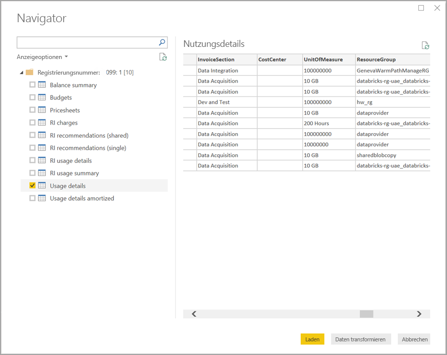

# Herstellen einer Verbindung mit den Daten von Azure Cost Management in Power BI Desktop

Mit dem Azure Cost Management-Connector für Power BI Desktop können Sie leistungsstarke, benutzerdefinierte Visualisierungen und Berichte erstellen, die Ihnen helfen, Ihre Azure-Ausgaben besser zu verstehen. Der Azure Cost Management-Connector unterstützt derzeit Kunden mit einer [Microsoft-Kundenvereinbarung](https://azure.microsoft.com/pricing/purchase-options/microsoft-customer-agreement/) oder einem [Enterprise Agreement](https://azure.microsoft.com/pricing/enterprise-agreement/).  

Der Azure Cost Management-Connector verwendet OAuth 2.0 für die Authentifizierung mit Azure. Zum Herstellen einer Verbindung müssen Sie ein [Unternehmensadministrator](https://docs.microsoft.com/azure/billing/billing-understand-ea-roles)konto für Enterprise Agreements oder einen [Besitzer eines Abrechnungskontos](https://docs.microsoft.com/azure/billing/billing-understand-mca-roles) für Microsoft-Kundenvereinbarungen verwenden. 

> [!NOTE]
> Dieser Connector ersetzt den zuvor verfügbaren [Azure Cost Management-Connector (Beta)](desktop-connect-azure-consumption-insights.md). Alle mit dem vorherigen Connector erstellten Berichte müssen mithilfe dieses Connectors neu erstellt werden.

## Herstellen einer Verbindung mithilfe von Azure Cost Management

Um den **Azure Cost Management-Connector** in Power BI Desktop zu verwenden, gehen Sie wie folgt vor:

1.  Wählen Sie im Menüband **Home** die Option **Daten abrufen** aus.
2.  Wählen Sie **Azure** aus der Liste der Datenkategorien aus.
3.  Wählen Sie **Azure Cost Management** aus.

    

4. Geben Sie im angezeigten Dialogfeld entweder Ihre **Abrechnungsprofil-ID** für **Microsoft-Kundenvereinbarungen** oder Ihre **Registrierungsnummer** für **Enterprise Agreements (EA)** ein. 

## Herstellen einer Verbindung mit einem Microsoft-Kundenvereinbarungskonto 

Zum Herstellen einer Verbindung mit einem **Microsoft-Kundenvereinbarungskonto** können Sie Ihre **Abrechnungsprofil-ID** aus dem Azure-Portal abrufen:

1.  Navigieren Sie im [Azure-Portal](https://portal.azure.com/) zu **Kostenverwaltung und Abrechnung**.
2.  Wählen Sie Ihr Abrechnungsprofil aus. 
3.  Wählen Sie im Menü **Einstellungen** in der Randleiste **Eigenschaften** aus.
4.  Kopieren Sie unter **Abrechnungsprofil** die **ID**. 
5.  Wählen Sie unter **Bereich auswählen** die **Abrechnungsprofil-ID** aus, und fügen Sie die Abrechnungsprofil-ID aus dem vorherigen Schritt ein. 
6.  Geben Sie die Anzahl der Monate ein, und wählen Sie dann **OK** aus.

    

7.  Melden Sie sich mit Ihrem Azure-Benutzerkonto und -Kennwort an, wenn Sie dazu aufgefordert werden. 

## Herstellen einer Verbindung mit einem Enterprise Agreement-Konto

Zum Herstellen einer Verbindung mit einem Enterprise Agreement-Konto (EA) können Sie Ihre Registrierungs-ID aus dem Azure-Portal abrufen:

1.  Navigieren Sie im [Azure-Portal](https://portal.azure.com/) zu **Kostenverwaltung und Abrechnung**.
2.  Wählen Sie Ihr Abrechnungskonto aus.
3.  Kopieren Sie im Menü **Übersicht** die **Abrechnungskonto-ID**.
4.  Wählen Sie unter **Bereich auswählen** die **Registrierungsnummer** aus, und fügen Sie die Abrechnungskonto-ID aus dem vorherigen Schritt ein. 
5.  Geben Sie die Anzahl der Monate ein, und wählen Sie dann **OK** aus.

    

6.  Melden Sie sich mit Ihrem Azure-Benutzerkonto und -Kennwort an, wenn Sie dazu aufgefordert werden. 

## Über den Connector verfügbare Daten

Nachdem Sie sich erfolgreich authentifiziert haben, wird ein **Navigator**fenster mit den folgenden verfügbaren Datentabellen angezeigt:

| **Tabelle** | **Beschreibung** |
| --- | --- |
| **Saldozusammenfassung** | Zusammenfassung des Saldos für Enterprise Agreements (EA). |
| **Billing events** (Abrechnungsereignisse) | Ein Ereignisprotokoll für neue Rechnungen, Käufe auf Rechnung usw. Nur Microsoft-Kundenvereinbarungen. |
| **Budgets** | Budgetdetails zur Anzeige der tatsächlichen Kosten oder Nutzung im Vergleich zu vorhandenen Budgetzielen |
| **Gebühren** | Eine monatsbasierte Zusammenfassung der Azure-Nutzung, Marketplace-Gebühren und separat abgerechneten Gebühren. Nur Microsoft-Kundenvereinbarungen. |
| **Credit lots** (Gutschriftanteile) | Details zu Azure-Gutschriftanteilskäufen für das angegebene Abrechnungsprofil Nur Microsoft-Kundenvereinbarungen. |
| **Pricesheets** (Preisblätter) | Geltende Raten pro Verbrauchseinheit für das angegebene Abrechnungsprofil oder die EA-Registrierung. |
| **RI charges** (Gebühren für reservierte Instanzen) | Die Gebühren für Ihre reservierten Instanzen in den letzten 24 Monaten |
| **RI recommendations (shared)** (Empfehlungen für reservierte Instanzen (gemeinsam genutzt)) | Kaufempfehlungen für reservierte Instanzen, die auf den Nutzungstrends für alle Ihre Abonnements in den letzten sieben, 30 oder 60 Tagen basieren |
| **RI recommendations (single)** (Empfehlungen für reservierte Instanzen (einzeln)) | Kaufempfehlungen für reservierte Instanzen, die auf Ihren Nutzungstrends für ein einzelnes Abonnement in den letzten sieben, 30 oder 60 Tagen basieren |
| **RI-Nutzungsdetails** | Ausführliche Informationen zum Verbrauch für Ihre vorhandenen reservierten Instanzen im letzten Monat |
| **RI-Nutzungszusammenfassung** | Täglicher Nutzungsprozentsatz der Azure-Reservierung. |
| **Usage details** (Nutzungsdetails) | Eine Aufschlüsselung der verbrauchten Mengen und geschätzten Kosten für das angegebene Abrechnungsprofil für die EA-Registrierung. |
| **Amortisierte Nutzungsdetails** | Eine Aufschlüsselung der verbrauchten Mengen und geschätzten amortisierten Kosten für das angegebene Abrechnungsprofil für die EA-Registrierung. |

Sie können eine Tabelle auswählen, um ein Vorschaudialogfeld anzuzeigen. Sie können mindestens eine Tabelle auswählen, indem Sie die Kontrollkästchen neben dem Tabellennamen aktivieren und dann **Laden** auswählen.

Wenn Sie **Laden** auswählen, werden die Daten in Power BI Desktop geladen. 

Nachdem die von Ihnen ausgewählten Daten geladen wurden, werden die Tabellen und Felder im Bereich **Felder** angezeigt.

## Nächste Schritte

Es gibt viele verschiedene Datenquellen, mit denen Sie über Power BI Desktop eine Verbindung herstellen können. Weitere Informationen finden Sie in den folgenden Artikeln:

* [Was ist Power BI Desktop?](desktop-what-is-desktop.md)
* [Datenquellen in Power BI Desktop](desktop-data-sources.md)
* [Strukturieren und Kombinieren von Daten mit Power BI Desktop](desktop-shape-and-combine-data.md)
* [Verbinden mit Excel in Power BI Desktop](desktop-connect-excel.md)   
* [Eingeben von Daten direkt in Power BI Desktop](desktop-enter-data-directly-into-desktop.md)   
