# Herstellen einer Verbindung mit LinkedIn Sales Navigator in Power BI Desktop

In **Power BI Desktop** können Sie eine Verbindung mit **LinkedIn Sales Navigator** herstellen, um beim Suchen und Erstellen von Beziehungen wie bei jeder anderen Datenquelle in Power BI Desktop zu unterstützen und vorgefertigte Berichte über Ihren Fortschritt zu erstellen.

Sie müssen über einen LinkedIn Sales Navigator Enterprise-Plan verfügen und im Sales Navigator-Vertrag entweder als Administrator oder Berichterstellungsbenutzer eingetragen sein, um mithilfe von **LinkedIn Sales Navigator** eine Verbindung mit LinkedIn-Daten herzustellen.

Das folgende Video enthält eine kurze Einführung und ein Tutorial zur Verwendung der Vorlagen-App für **LinkedIn Sales Navigator**, die [weiter unten in diesem Artikel](#using-the-linkedin-sales-navigator-template-app) ausführlich beschrieben wird. 

> [!VIDEO https://www.youtube.com/embed/ZqhmaiORLw0]

## Herstellen einer Verbindung mit LinkedIn Sales Navigator

Wählen Sie in Power BI Desktop im Menüband **Start** die Option **Daten abrufen** aus, um eine Verbindung mit den **LinkedIn Sales Navigator**-Daten herzustellen. Wählen Sie aus den Kategorien auf der linken Seite **Onlinedienste** aus, und scrollen Sie dann zu **LinkedIn Sales Navigator (Beta)** .

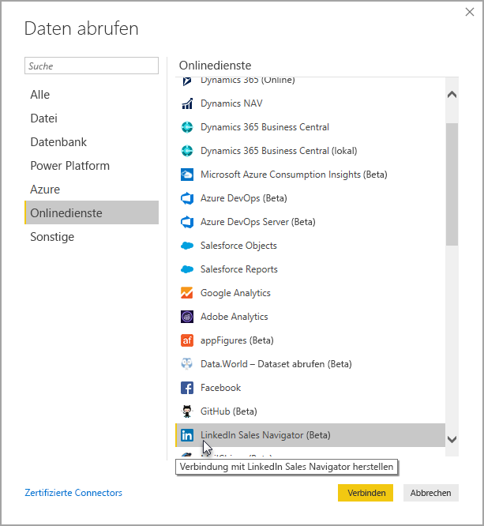

Sie werden darüber informiert, dass Sie eine Verbindung mit einem Drittanbieterconnector herstellen, der sich noch in der Entwicklung befindet. 

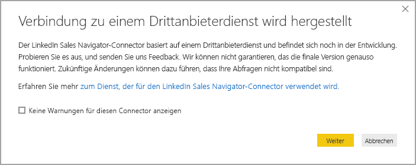

Wenn Sie **Weiter** auswählen, werden Sie dazu aufgefordert anzugeben, welche Daten Sie abrufen möchten.

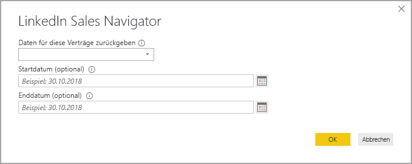

Wählen Sie im angezeigten **LinkedIn Sales Navigator**-Fenster aus, welche Daten Sie zurückgeben möchten. Sie können hierzu in der ersten Dropdownliste entweder *All contacts* (Alle Kontakte) oder *Selected contacts* (Ausgewählte Kontakte) auswählen. Sie können dann das Start- und Enddatum angeben, um die abgerufenen Daten auf ein bestimmtes Zeitfenster zu beschränken.

Sobald Sie diese Informationen angegeben haben, stellt Power BI Desktop eine Verbindung mit den Daten her, die Ihrem LinkedIn Sales Navigator-Vertrag zugeordnet sind. Verwenden Sie dieselbe E-Mail-Adresse, die Sie für die Anmeldung bei LinkedIn Sales Navigator über die Website verwenden. 

Wenn Sie erfolgreich eine Verbindung hergestellt haben, werden Sie über das Fenster **Navigator** zur Auswahl der Daten aus Ihrem LinkedIn Sales Navigator-Vertrag aufgefordert.

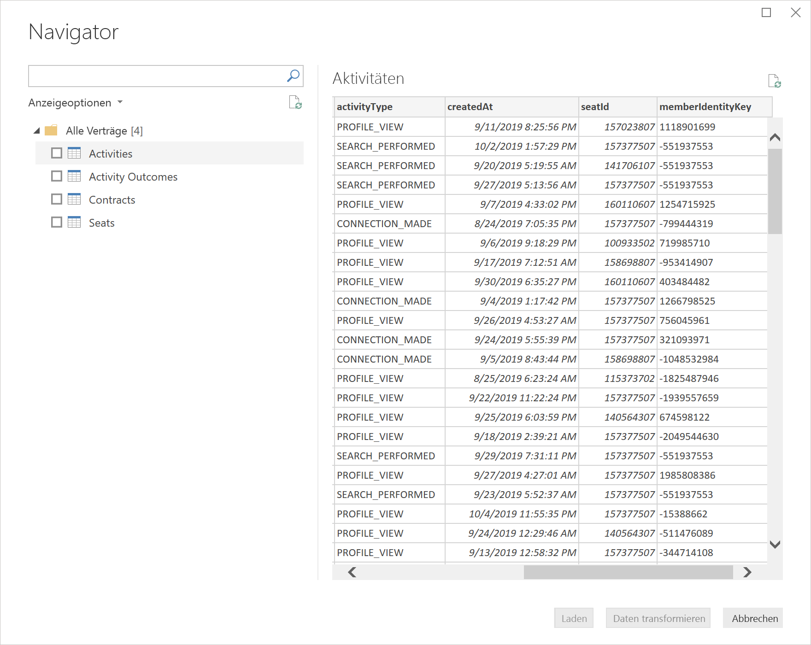

Sie können mit Ihren LinkedIn Sales Navigator-Daten jeden beliebigen Bericht erstellen. Sie können zur Vereinfachung auch die PBIX-Datei für LinkedIn Sales Navigator herunterladen, die bereits Beispieldaten enthält. So können Sie sich mit den Daten und Berichten vertraut machen, ohne von Grund auf neu starten zu müssen.

Die PBIX-Datei können Sie unter folgendem Link herunterladen:
* [PBIX für LinkedIn Sales Navigator](service-template-apps-samples.md)

Zusätzlich zur PBIX-Datei verfügt LinkedIn Sales Navigator auch über eine Vorlagen-App, die Sie ebenfalls herunterladen und verwenden können. Im nächsten Abschnitt wird die Vorlagen-App ausführlich beschrieben.

## Verwenden der Vorlagen-App für LinkedIn Sales Navigator

Sie können die [Vorlagen-App](service-template-apps-overview.md) verwenden, um die Verwendung von **LinkedIn Sales Navigator** so einfach wie möglich zu gestalten. Diese erstellt aus Ihren LinkedIn Sales Navigator-Daten automatisch einen vorgefertigten Bericht.

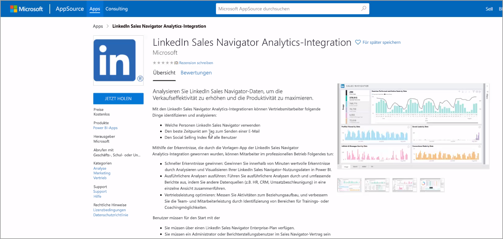

Wenn Sie die App herunterladen, können Sie auswählen, ob Sie eine Verbindung mit Ihren Daten herstellen oder die App mit Beispieldaten ausprobieren möchten. Sie können jederzeit zurückkehren und eine Verbindung mit ihren eigenen LinkedIn Sales Navigator-Daten herstellen, nachdem Sie die Beispieldaten verwendet haben. 

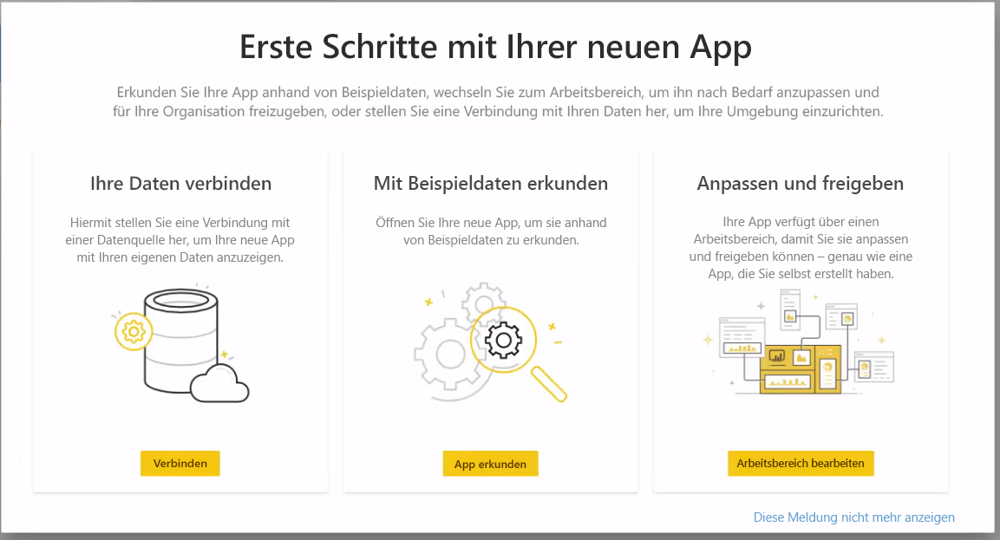

Sie können die Vorlagen-App für **LinkedIn Sales Navigator** über folgenden Link herunterladen:
* [Vorlagen-App für LinkedIn Sales Navigator](https://appsource.microsoft.com/product/power-bi/pbi-contentpacks.linkedin_navigator-preview?flightCodes=17ad4c68-fbc5-4925-a351-139fd384ec33)

Die Vorlagen-App bietet vier Registerkarten zur Unterstützung beim Analysieren und Teilen Ihrer Informationen:

* Verwendung
* Suche
* InMail
* SSI

Auf der Registerkarte **Usage** (Verwendung) werden Ihre gesamten LinkedIn Sales Navigator-Daten angezeigt.

Über die Registerkarte **Search** (Suche) können Sie die Suchergebnisse genauer betrachten:

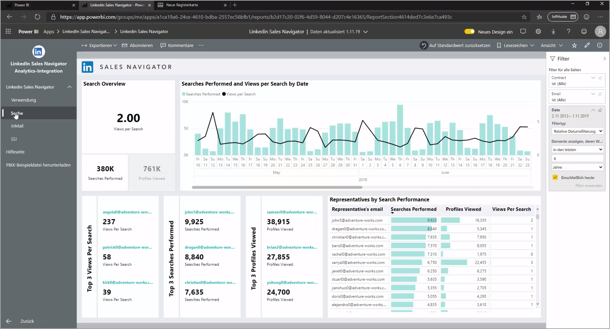

Unter **InMail** erhalten Sie Einblicke in Ihre InMail-Verwendung, darunter die Anzahl gesendeter InMails, Annahmequoten sowie weitere hilfreiche Informationen:

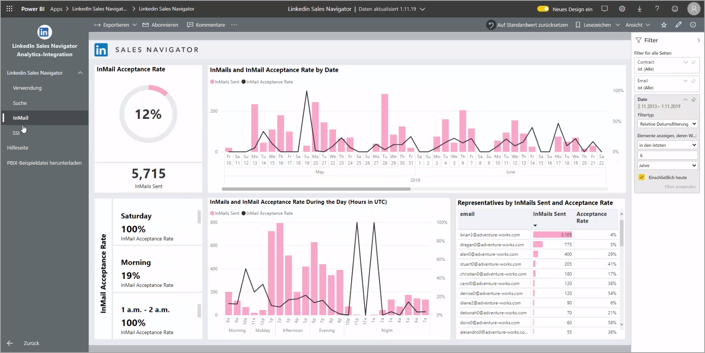

Die Registerkarte **SSI** bietet zusätzliche Informationen zu Ihrem Social Selling Index (SSI):

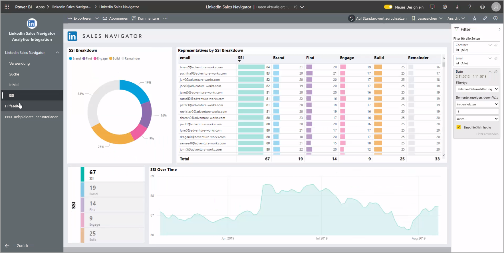

Klicken Sie in der oberen rechten Ecke auf **App bearbeiten** (das Stiftsymbol) und anschließend im angezeigten Bildschirm auf **Ihre Daten verbinden**, um von den Beispieldaten zu Ihren eigenen Daten zu wechseln.

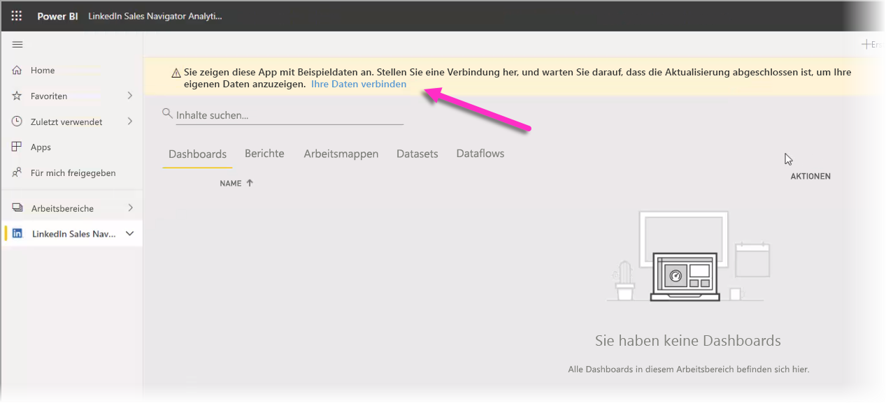

Von dort aus können Sie eine Verbindung mit Ihren eigenen Daten herstellen, indem Sie auswählen, wie viele Tage Daten Sie laden möchten. Sie können bis zu 365 Tage Daten laden. Sie müssen sich anmelden, indem Sie wieder dieselbe E-Mail-Adresse verwenden, die Sie für die Anmeldung bei LinkedIn Sales Navigator über die Website verwenden. 

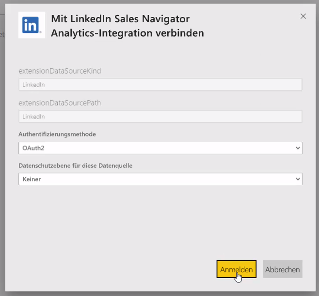

Die Vorlagen-App aktualisiert dann die Daten in der App mit Ihren Daten. Sie können auch eine geplante Aktualisierung einrichten, damit die Daten in Ihrer App so aktuell sind wie Sie es durch die Aktualisierungshäufigkeit angeben. 

Nachdem die Daten aktualisiert wurden, werden Ihnen in der App Ihre Daten angezeigt.

## Nächste Schritte
Sie können mithilfe von Power BI Desktop eine Verbindung mit Daten jeglicher Art herstellen. Weitere Informationen zu Datenquellen finden Sie in folgenden Ressourcen:

* [Was ist Power BI Desktop?](desktop-what-is-desktop.md)
* [Datenquellen in Power BI Desktop](desktop-data-sources.md)
* [Strukturieren und Kombinieren von Daten mit Power BI Desktop](desktop-shape-and-combine-data.md)
* [Verbinden mit Excel in Power BI Desktop](desktop-connect-excel.md)   
* [Eingeben von Daten direkt in Power BI Desktop](desktop-enter-data-directly-into-desktop.md)   

