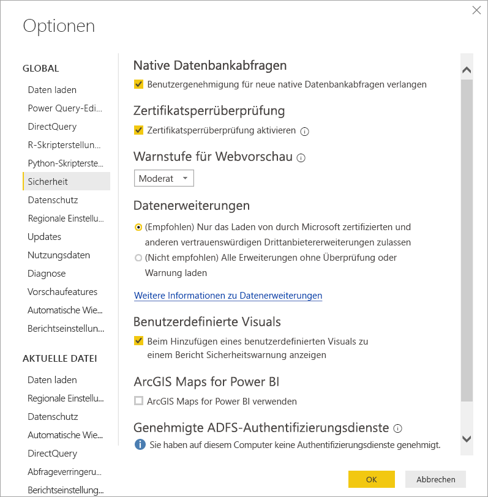

# Connectorerweiterbarkeit in Power BI

In Power BI können Kunden und Entwickler die Datenquellen, mit denen Sie Verbindungen herstellen, auf viele Weisen erweitern. Sie verwenden vorhandene Connectors und generische Datenquellen (z. B. ODBC, OData, Oledb, Web, CSV, XML, JSON). Ferner können Entwickler Datenerweiterungen, die **benutzerdefinierte Connectors** genannt werden, erstellen und in **zertifizierte Connectors** umwandeln.

Derzeit aktivieren Sie **Benutzerdefinierte Connectors** mithilfe eines Menüs, in dem Sie die Ebene des benutzerdefinierten Codes, dem Sie die Ausführung auf Ihrem System gestatten möchten, sicher steuern können. Sie können im Dialogfeld **Daten abrufen** alle benutzerdefinierten Connectors oder nur Connectors auswählen, die von Microsoft zertifiziert sind und verteilt werden.

## Benutzerdefinierte Connectors

**Benutzerdefinierte Connectors** können zahlreiche Funktionen bereitstellen – von kleinen APIs, die für Ihr Unternehmen wichtig sind, bis hin zu großen branchenspezifischen Diensten, für die Microsoft keinen Connector veröffentlicht hat. Viele dieser Connectors werden vom Hersteller verteilt. Wenn Sie also einen bestimmten Datenconnector benötigen, sollten Sie sich an einen Hersteller wenden.

Um einen **benutzerdefinierten Connector** zu verwenden, legen Sie ihn in den Ordner *\[Dokumente]\\Power BI Desktop\\Benutzerdefinierte Connectors* und passen Sie die Sicherheitseinstellungen wie im folgenden Abschnitt beschrieben an.

Sie müssen die Sicherheitseinstellungen nicht anpassen, um **zertifizierte Connectors** zu verwenden.

## Sicherheit für Datenerweiterung

Um die Sicherheitseinstellungen der Datenerweiterung zu ändern, wählen Sie in **Power BI Desktop** **Datei > Optionen und Einstellungen > Optionen > Sicherheit** aus.

Unter **Datenerweiterungen** können Sie zwischen zwei Sicherheitsstufen wählen:

* (Empfohlen) Nur zertifizierte Erweiterungen laden
* (Nicht empfohlen) Alle Erweiterungen ohne Überprüfung oder Warnung laden

Wenn Sie **benutzerdefinierte Connectors** oder von Ihnen bzw. von einem Drittanbieter entwickelte Connectors verwenden möchten, müssen Sie folgende Option auswählen: **„(Not Recommended) Allow any extension to load without warning“** ((Nicht empfohlen) Alle Erweiterungen ohne Überprüfung oder Warnung laden). Diese Sicherheitseinstellung wird nur empfohlen, wenn Sie Ihren benutzerdefinierten Connectors absolut vertrauen. Der Grund hierfür besteht darin, dass der darin enthaltene Code Anmeldeinformationen verarbeiten kann (was etwa das Versenden der Anmeldeinformationen über HTTP einschließt) und Datenschutzebenen ignorieren kann.

Bei der Sicherheitseinstellung **„(Empfohlen)“** erhalten Sie, wenn benutzerdefinierte Connectors auf Ihrem System vorhanden sind, die Fehlermeldung „Der folgende Connector wurde nicht zertifiziert, und wir können nicht überprüfen, ob seine Verwendung sicher ist.“, gefolgt von einer Liste mit Connectors, die nicht sicher geladen werden können.

Um den Fehler zu beheben, ohne die Sicherheit zu ändern, entfernen Sie die nicht signierten Connectors aus Ihrem Ordner „Benutzerdefinierte Connectors“.

Um den Fehler zu beheben und diese Connectors zu verwenden, ändern Sie Ihre Sicherheitseinstellungen, wie zuvor beschrieben, in **„(Nicht empfohlen) Alle Erweiterungen ohne Überprüfung oder Warnung laden“** . Starten Sie dann **Power BI Desktop** neu.

## Zertifizierte Connectors

Eine begrenzte Teilmenge von Datenerweiterungen gilt als **Zertifiziert**. Auf die zertifizierten Connectors können Sie im Dialogfeld **Daten abrufen** zugreifen. Verantwortlich für die Wartung und Unterstützung des Connectors ist jedoch der Drittanbieterentwickler, der ihn erstellt hat. Microsoft verteilt die Connectors zwar, ist aber nicht für deren Leistung oder den Erhalt ihrer Funktionalität verantwortlich.

Wenn Sie einen benutzerdefinierten Connector zertifizieren möchten, muss der Hersteller sich an dataconnectors@microsoft.com wenden.
