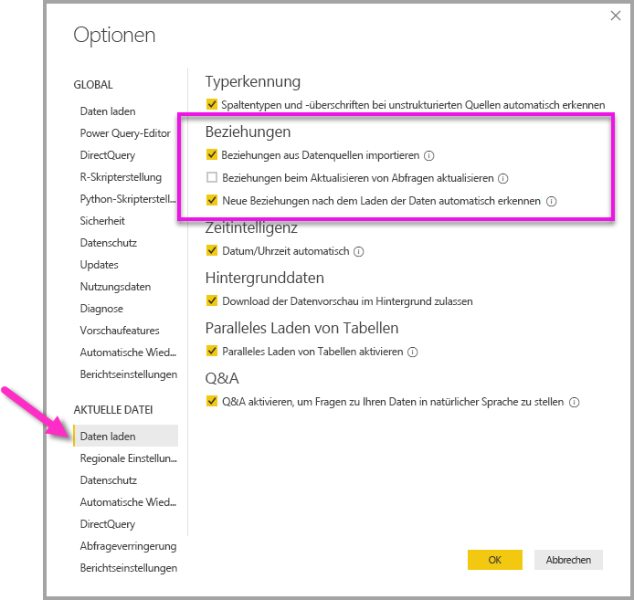

# Erstellen und Verwalten von Beziehungen in Power BI Desktop
Wenn Sie mehrere Tabellen importieren, ist es wahrscheinlich, dass Sie einige Analysen mit Daten aus allen diesen Tabellen durchführen werden. Beziehungen zwischen diesen Tabellen sind erforderlich, damit die Ergebnisse genau berechnet und die richtigen Informationen in Ihren Berichten angezeigt werden. Mit Power BI Desktop können diese Beziehungen ganz leicht erstellt werden. Tatsächlich müssen Sie in den meisten Fällen keine weiteren Schritte unternehmen, da das Feature für die automatische Erkennung dies für Sie übernimmt. In einigen Fällen müssen Sie die Beziehungen jedoch möglicherweise selbst erstellen oder Änderungen an einer Beziehung vornehmen. In beiden Fällen ist es wichtig zu verstehen, wie Beziehungen in Power BI funktionieren und wie sie erstellt und bearbeitet werden.

## AutoErmittlung beim Laden
Wenn Sie zwei oder mehr Tabellen gleichzeitig abfragen, nachdem die Daten geladen sind, versucht Power BI Desktop, die Beziehungen zu finden und für Sie zu erstellen. Die Beziehungsoptionen **Kardinalität**, **Kreuzfilterrichtung** und **Diese Beziehung aktivieren** werden automatisch festgelegt. Power BI Desktop untersucht die Spaltennamen in den abgefragten Tabellen, um festzustellen, ob mögliche Beziehungen vorhanden sind. Wenn Beziehungen vorhanden sind, werden sie automatisch erstellt. Wenn Power BI Desktop nicht mit hoher Zuverlässigkeit ermitteln kann, dass eine Übereinstimmung vorliegt, wird die Beziehung nicht erstellt. Sie können das Dialogfeld **Beziehungen verwalten** weiterhin dazu verwenden, Beziehungen manuell zu erstellen oder zu bearbeiten.

## Erstellen einer Beziehung mit automatischer Erkennung
Klicken Sie auf der Registerkarte **Start** auf **Beziehungen verwalten** \> **Automatische Erkennung**.

## Manuelles Erstellen einer Beziehung
1. Klicken Sie auf der Registerkarte **Start** auf **Beziehungen verwalten** \> **Neu**.

2. Wählen Sie im Dialogfeld **Beziehung erstellen** in der ersten Dropdownliste für Tabellen eine Tabelle aus. Wählen Sie die Spalte aus, die Sie für die Beziehung verwenden möchten.

3. Wählen Sie in der zweiten Dropdownliste für Tabellen die zweite Tabelle für die Beziehung aus. Wählen Sie die andere Spalte aus, die Sie verwenden möchten, und klicken Sie dann auf **OK**.

   

Standardmäßig konfiguriert Power BI Desktop automatisch die Optionen **Kardinalität** (Richtung), **Kreuzfilterrichtung** und **Diese Beziehung aktivieren** für Ihre neue Beziehung. Sie können diese Einstellungen bei Bedarf jedoch ändern. Weitere Informationen finden Sie im Abschnitt [Informationen zu zusätzlichen Optionen](#understanding-additional-options).

Wenn es in keiner der für die Beziehung ausgewählten Tabellen eindeutige Werte gibt, wird die folgende Fehlermeldung angezeigt: *[…] da eine der Spalten eindeutige Werte aufweisen muss.* Mindestens eine Tabelle in einer Beziehung *muss* eine eindeutige Liste von Schlüsselwerten aufweisen. Dies ist eine häufige Anforderung für alle relationalen Datenbanktechnologien. 

Wenn dieser Fehler auftritt, haben Sie mehrere Möglichkeiten, ihn zu beheben:

* Erstellen Sie mithilfe der Option **Doppelte Werte entfernen** eine Spalte mit eindeutigen Werten. Der Nachteil dieses Ansatzes ist, dass Informationen möglicherweise verloren gehen, wenn doppelte Zeilen entfernt werden. Schlüssel (Zeilen) werden häufig aus gutem Grund dupliziert.
* Fügen Sie dem Modell eine zwischengeschaltete Tabelle hinzu, die aus der Liste der eindeutigen Schlüsselwerte erstellt wurde. Das Modell ist dann mit beiden ursprünglichen Spalten in der Beziehung verknüpft.

Weitere Informationen finden Sie in [diesem Blogbeitrag (in englischer Sprache)](https://blogs.technet.microsoft.com/cansql/2016/12/19/relationships-in-power-bi-fixing-one-of-the-columns-must-have-unique-values-error-message/).

## Bearbeiten einer Beziehung
1. Klicken Sie auf der Registerkarte **Start** auf **Beziehungen verwalten**.

2. Wählen Sie im Dialogfeld **Beziehungen verwalten** die Beziehung aus, und klicken Sie dann auf **Bearbeiten**.

## Konfigurieren zusätzlicher Optionen
Beim Erstellen oder Bearbeiten einer Beziehung können Sie zusätzliche Optionen konfigurieren. Standardmäßig werden in Power BI Desktop zusätzliche Optionen automatisch basierend auf einer optimalen Schätzung konfiguriert, die auf Grundlage der Daten in den Spalten für jede Beziehung unterschiedlich sein kann.

### Kardinalität
Für die Option **Kardinalität** ist eine der folgenden Einstellungen möglich:

**n:1 (\*:1):** Eine Viele-zu-Eins-Beziehung ist der am häufigsten verwendete Standardtyp für eine Beziehung. Das bedeutet, dass die Spalte in einer Tabelle mehrere Instanzen eines Werts aufweisen kann, während die andere verknüpfte Tabelle, die häufig als Nachschlagetabelle bezeichnet wird, nur eine Instanz eines Werts besitzt.

**Eins-zu-Eins (1:1):** Dies bedeutet, dass die Spalte in einer Tabelle nur eine Instanz eines bestimmten Werts aufweist, wobei die andere verknüpfte Tabelle ebenfalls nur eine Instanz eines bestimmten Werts besitzt.

**1:n (1:*):** Bei einer Eins-zu-Viele-Beziehung kann die Spalte in einer Tabelle nur eine Instanz eines Werts aufweisen, während die andere verknüpfte Tabelle mehrere Instanzen eines Werts besitzen kann.

**m:n-Beziehung (\*:\*):** Mit zusammengesetzten Modellen können Sie m:n-Beziehungen zwischen Tabellen einrichten, sodass Anforderungen bezüglich eindeutiger Werte in Tabellen entfallen. Zudem sind vorherige Problemumgehungen hinfällig, wie z.B. die Einführung neuer Tabellen zum Einrichten von Beziehungen. Weitere Informationen finden Sie im Artikel [Anwenden von m:n-Beziehungen in Power BI Desktop](https://docs.microsoft.com/power-bi/desktop-many-to-many-relationships). 

Informationen dazu, wann die Kardinalität geändert werden sollte, finden Sie im Abschnitt [Informationen zu zusätzlichen Optionen](#understanding-additional-options).

### Kreuzfilterrichtung
Für die Option **Kreuzfilterrichtung** ist eine der folgenden Einstellungen möglich:

**Beide:** Zu Filterzwecken werden beide Tabellen so behandelt, als wären sie eine einzelne Tabelle. Die Einstellung **Beide** funktioniert problemlos mit einer einzelnen Tabelle, die über eine Reihe von Nachschlagetabellen verfügt, die sie umgeben. Ein Beispiel dafür ist eine Tabelle von Ist-Umsatzwerten mit einer Nachschlagetabelle für die entsprechende Abteilung. Dies wird häufig als Sternschemakonfiguration bezeichnet (eine zentrale Tabelle mit mehreren Nachschlagetabellen). Wenn Sie jedoch zwei oder mehr Tabellen haben, die ebenfalls über Nachschlagetabellen verfügen (wobei einige gemeinsam genutzt werden), empfiehlt es sich nicht, die Einstellung **Beide** zu verwenden. Um mit dem vorherigen Beispiel fortzufahren: In diesem Fall Sie haben Sie auch eine Tabelle "Budgetverkauf", die das Zielbudget für jede Abteilung aufzeichnet. Und die Abteilungstabelle ist sowohl mit der Umsatz- als auch mit der Budget-Tabelle verbunden. Vermeiden Sie die Einstellung **Beide** für diese Art von Konfiguration.

**Einfach:** Die gebräuchlichste Standardrichtung, die bedeutet, dass Filteroptionen in verknüpften Tabellen auf die Tabelle angewendet werden, in der die Werte aggregiert werden. Wenn Sie eine Power Pivot-Tabelle in ein Datenmodell von Excel 2013 oder früher importieren, weisen alle Beziehungen nur eine Richtung auf. 

Informationen dazu, wann die Kreuzfilterrichtung geändert werden sollte, finden Sie im Abschnitt [Informationen zu zusätzlichen Optionen](#understanding-additional-options).

### Diese Beziehung aktivieren
Wenn dieses Kontrollkästchen aktiviert ist, bedeutet dies, dass die Beziehung als aktive Standardbeziehung dient. Wenn zwischen zwei Tabellen mehrere Beziehungen vorhanden sind, bietet die aktive Beziehung Power BI Desktop eine Möglichkeit, automatisch visuelle Elemente zu erstellen, die beide Tabellen einbeziehen.

Weitere Informationen dazu, wann Sie eine bestimmte Beziehung aktivieren sollten, finden Sie im Abschnitt [Informationen zu zusätzlichen Optionen](#understanding-additional-options).

## Informationen zu Beziehungen
Nachdem Sie zwei Tabellen mit einer Beziehung verbunden haben, können Sie mit den Daten in beiden Tabellen arbeiten, als würde es sich um eine einzelne Tabelle handeln. Dadurch brauchen Sie sich nicht mehr um Details der Beziehung kümmern oder diese Tabellen vor dem Importieren auf eine einzelne Tabelle reduzieren. In vielen Szenarios können Beziehungen in Power BI Desktop auch automatisch für Sie erstellt werden. Wenn Power BI Desktop jedoch nicht mit hoher Zuverlässigkeit feststellen kann, dass eine Beziehung zwischen den beiden Tabellen bestehen sollte, wird die Beziehung nicht automatisch erstellt. In diesem Fall, müssen Sie die Beziehung selbst erstellen. 

Wir führen ein kurzes Tutorial durch, um Ihnen besser zu vermitteln, wie Beziehungen in Power BI Desktop funktionieren.

>[!TIP]
>Sie können diese Lerneinheit selbst durchführen: 
>
> 1. Kopieren Sie die folgende **ProjectHours**-Tabelle in ein Tabellenblatt in Excel (der Titel der Tabelle ausgenommen), wählen Sie alle Zellen aus, und klicken Sie dann auf **Einfügen** \> **Tabelle**. 
> 2. Klicken Sie im Dialogfeld **Tabelle erstellen** auf **OK**. 
> 3. Wählen Sie eine beliebige Tabellenzelle aus, klicken Sie auf **Tabellenentwurf** \> **Tabellenname**, und geben Sie dann *ProjectHours* ein. 
> 4. Gehen Sie für die Tabelle **CompanyProject** auf dieselbe Weise vor. 
> 5. Sie können die Daten dann mithilfe der Option **Daten abrufen** in Power BI Desktop importieren. Wählen Sie die beiden Tabellen als Datenquelle aus, und klicken Sie dann auf **Laden**.

Bei der ersten Tabelle, **ProjectHours**, handelt es sich um ein Zeitkonto, in dem die Anzahl der Stunden aufgezeichnet werden, die ein Mitarbeiter für ein bestimmtes Projekt aufgewendet hat. 

**Projektstunden**

| **Ticket** | **Absender** | **Stunden** | **Projekt** | **Sendedatum** |
| ---:|:--- | ---:|:--- | ---:|
| 1001 |Brewer, Alan |22 |Blue |1/1/2013 |
| 1002 |Brewer, Alan |26 |Red |2/1/2013 |
| 1003 |Ito, Shu |34 |Yellow |12/4/2012 |
| 1004 |Brewer, Alan |13 |Orange |1/2/2012 |
| 1005 |Bowen, Eli |29 |Violett |1\.10.2013 |
| 1006 |Bento, Nuno |35 |Green |2/1/2013 |
| 1007 |Hamilton, David |10 |Yellow |1\.10.2013 |
| 1008 |Han, Mu |28 |Orange |1/2/2012 |
| 1009 |Ito, Shu |22 |Purple |2/1/2013 |
| 1010 |Bowen, Eli |28 |Green |10/1/2013 |
| 1011 |Bowen, Eli |9 |Blue |10/15/2013 |

Die zweite Tabelle, **CompanyProject**, enthält eine Liste an Projekten jeweils mit zugewiesener Priorität: A, B oder C. 

**UnternehmenProjekt**

| **Projektname** | **Priorität** |
| --- | --- |
| Blue |A |
| Rot |B |
| Green |C |
| Gelb |C |
| Purple |B |
| Orange |C |

Beachten Sie, dass jede Tabelle eine Projektspalte besitzt. Die Benennung ist etwas unterschiedlich, aber die Werte scheinen gleich zu sein. Das ist wichtig, und wir kommen in Kürze darauf zurück.

Nachdem wir die beiden Tabellen in ein Modell importiert haben, erstellen wir einen Bericht. Zuerst möchten Sie die Anzahl der nach Projektpriorität übermittelten Stunden erhalten. Daher wählen Sie im Bereich **Felder** die Spalten **Priority** und **Hours** aus.

Wenn Sie die Tabelle im Berichtszeichenbereich betrachten, sehen Sie, dass die Anzahl der Stunden 256 für jedes Projekt ergibt, was zudem auch der Gesamtsumme entspricht. Natürlich ist dies nicht korrekt. Warum? Der Grund hierfür ist, dass es nicht möglich ist, aus Werten einer Tabelle (**Hours** in der Tabelle **ProjectHours**), die durch Werte in einer anderen Tabelle (**Priority** in der Tabelle **CompanyProject**) segmentiert werden, ohne eine Beziehung zwischen diesen beiden Tabellen eine Endsumme zu berechnen.

Erstellen wir daher eine Beziehung zwischen diesen beiden Tabellen.

Erinnern Sie sich an die Spalten, die in beiden Tabellen mit einem Projektnamen vorhanden waren, jedoch mit anscheinend gleichen Werten? Sie verwenden diese beiden Spalten nun, um eine Beziehung zwischen den Tabellen zu erstellen.

Warum diese Spalten? Wenn Sie die Spalte **Project** in der Tabelle **ProjectHours** betrachten, sehen Sie Werte wie „Blue“, „Red“, „Yellow“ und „Orange“. Tatsächlich sehen wir mehrere Zeilen, die denselben Wert enthalten. Tatsächlich liegen viele Farbwerte für **Project** vor.

Wenn Sie die Spalte **ProjName** in der Tabelle **CompanyProject** betrachten, ist dort nur einer der einzelnen Farbwerte für den Projektnamen vorhanden. Jeder Farbwert in dieser Tabelle ist eindeutig, und das ist wichtig, da zwischen diesen beiden Tabellen eine Beziehung erstellt werden kann. In diesem Fall eine n:1-Beziehung. In einer n:1-Beziehung muss mindestens eine Spalte in einer der Tabellen eindeutige Werte enthalten. Es gibt einige weitere Optionen für Beziehungen, die Sie sich später noch genauer ansehen können. Erstellen Sie jetzt die Beziehung zwischen den Projektspalten der beiden Tabellen.

### So erstellen Sie eine neue Beziehung
1. Klicken Sie auf der Registerkarte **Start** auf **Beziehungen verwalten**.
2. Klicken Sie in **Beziehungen verwalten** auf **Neu**, um das Dialogfeld **Beziehung erstellen** zu öffnen, in dem die für die Beziehung gewünschten Tabellen, Spalten und zusätzlichen Einstellungen ausgewählt werden können.
3. Wählen Sie in der ersten Dropdownliste **ProjectHours** als erste Tabelle und dann die Spalte **Project** aus. Das ist die *n-Seite* der Beziehung.
4. In der zweiten Dropdownliste ist **CompanyProject** bereits als zweite Tabelle ausgewählt. Wählen Sie die Spalte **ProjName** aus. Dies ist die *1-Seite* der Beziehung. 
5. Behalten Sie bei den anderen Einstellungen die Standardwerte bei, und klicken Sie dann auf **OK**.

   

6. Klicken Sie im Dialogfeld **Beziehungen verwalten** auf **Schließen**.

Im Interesse der vollständigen Offenlegung haben Sie diese Beziehung soeben auf manuelle Weise erstellt. Sie hätten einfach im Dialogfeld **Beziehungen verwalten** auf die Schaltfläche **automatische Erkennung** klicken können. Tatsächlich kann die Beziehung von der automatischen Erkennung beim Laden der Daten für Sie automatisch erstellt werden, wenn beide Spalten den gleichen Namen haben. Aber wo bleibt da die Herausforderung?

Sehen Sie sich nun noch mal die Tabelle im Berichtszeichenbereich an.

Das sieht doch schon viel besser aus, oder?

Wenn Sie die Stunden nach **Priority** addieren, sucht Power BI Desktop nach jeder Instanz der eindeutigen Farbwerte in der Nachschlagetabelle **CompanyProject** und dann nach jeder Instanz dieser Werte in der Tabelle **ProjectHours**, um dann für jeden eindeutigen Wert die Endsumme zu berechnen.

Das war einfach. Mit der automatischen Erkennung ist dieser Vorgang sogar noch einfacher.

## Informationen zu zusätzlichen Optionen
Wenn eine Beziehung entweder mithilfe der automatischen Erkennung oder manuell erstellt wird, konfiguriert Power BI Desktop die zusätzlichen Optionen automatisch auf Basis der Daten in Ihren Tabellen. Diese zusätzlichen Beziehungsoptionen finden Sie im unteren Bereich der Dialogfelder **Beziehung erstellen** und **Beziehung bearbeiten**.

 

In Power BI werden diese Optionen normalerweise automatisch festgelegt, und Sie müssen sie nicht anpassen. Es gibt jedoch einige Situationen, in denen Sie diese Optionen selbst konfigurieren sollten.

## Automatische Beziehungsaktualisierung

Sie können verwalten, wie Power BI Beziehungen in Berichten und Modellen behandelt und automatisch anpasst. Klicken Sie in Power BI Desktop auf **Datei**  >  **Optionen und Einstellungen**  >  **Optionen**, und wählen Sie im linken Bereich die Option **Daten laden** aus, um anzugeben, wie Power BI die Beziehungsoptionen verarbeiten soll. Die Optionen für **Beziehungen** werden angezeigt.

   

Drei Optionen können ausgewählt und aktiviert werden: 

- **Beim ersten Laden Beziehungen aus Datenquellen importieren:** Diese Option ist standardmäßig aktiviert. Wenn diese Option aktiviert ist, überprüft Power BI, welche Beziehungen in der Datenquelle definiert sind, z. B. Fremdschlüssel-/Primärschlüsselbeziehungen in Ihrem Data Warehouse. Wenn solche Beziehungen vorhanden sind, werden sie beim anfänglichen Laden von Daten in das Power BI-Datenmodell gespiegelt. Mit dieser Option können Sie schnell beginnen, mit dem Modell zu arbeiten, anstatt diese Beziehungen selbst suchen oder definieren zu müssen.

- **Beim Aktualisieren von Daten Beziehungen aktualisieren oder löschen:** Diese Option ist standardmäßig deaktiviert. Wenn Sie sie aktivieren, sucht Power BI nach Änderungen bei den Datenquellenbeziehungen, wenn Ihr Dataset aktualisiert wird. Wenn diese Beziehungen geändert oder entfernt werden, spiegelt Power BI diese Änderungen in seinem eigenen Datenmodell wider und aktualisiert oder löscht Beziehungen entsprechend.

   > [!WARNING]
   > Wenn Sie Sicherheit auf Zeilenebene (Row-Level Security, RLS) verwenden, die auf den definierten Beziehungen basiert, sollten Sie diese Option nicht aktivieren. Wenn eine Beziehung entfernt wird, auf der Ihre RLS-Einstellungen basieren, kann das die Sicherheit Ihres Modells beeinträchtigen. 

- **Neue Beziehungen nach dem Laden der Daten automatisch erkennen:** Eine Beschreibung dieser Option finden Sie unter [Automatische Erkennung beim Laden](#autodetect-during-load). 

## Zukünftige Updates für die Daten erfordern eine andere Kardinalität
Normalerweise kann Power BI Desktop automatisch die beste Kardinalität für die Beziehung bestimmen. Wenn Sie die automatische Einstellung außer Kraft setzen müssen, da Sie wissen, dass sich die Daten in der Zukunft verändern, können Sie dies über das Steuerelement **Kardinalität** tun. Betrachten wir ein Beispiel, in dem wir eine andere Kardinalität auswählen müssen.

Die Tabelle **CompanyProjectPriority** besteht aus einer Liste aller Unternehmensprojekte und ihrer jeweiligen Priorität. Die Tabelle **ProjectBudget** umfasst die Projekte, deren Budget genehmigt wurde.

**UnternehmenProjektPriorität**

| **Projektname** | **Priorität** |
| --- | --- |
| Blue |A |
| Rot |B |
| Green |C |
| Gelb |C |
| Purple |B |
| Orange |C |

**Projektbudget**

| **Genehmigte Projekte** | **Budgetzuteilung** | **Zuteilungsdatum** |
|:--- | ---:| ---:|
| Blue |40,000 |12/1/2012 |
| Red |100,000 |12/1/2012 |
| Grün |50.000 |12/1/2012 |

Wenn Sie eine Beziehung zwischen der Spalte **Approved Projects** der Tabelle **ProjectBudget** und der Spalte **ProjectName** der Tabelle **CompanyProjectPriority** erstellen, legt Power BI die **Kardinalität** automatisch auf **Eins-zu-Eins (1:1)** fest und die **Kreuzfilterrichtung** auf **Beide**. 

 

Der Grund dafür, dass Power BI diese Einstellungen vornimmt, ist, dass Power BI Desktop als beste Kombination der beiden Tabellen folgende Kombination erkennt:

| **Projektname** | **Priorität** | **Budgetzuteilung** | **Zuteilungsdatum** |
|:--- | --- | ---:| ---:|
| Blau |A |40,000 |12/1/2012 |
| Red |B |100.000 |12/1/2012 |
| Green |C |50,000 |12/1/2012 |
| Yellow |C |  |  |
| Purple |B |  |  |
| Orange |C |  |  |

Zwischen den beiden Tabellen besteht eine 1:1-Beziehung, da es keine sich wiederholenden Werte in der Spalte **ProjName** der kombinierten Tabelle gibt. Die Spalte **ProjName** ist eindeutig, da jeder Wert nur genau einmal auftritt. Deshalb können die Zeilen der beiden Tabellen direkt kombiniert werden, ohne dass dadurch doppelte Werte auftreten.

Aber angenommen, Sie wissen, dass die Daten bei der nächsten Aktualisierung geändert werden. Eine aktualisierte Version der Tabelle **ProjectBudget** weist jetzt zusätzliche Zeilen für Projekte mit den Werten „Blue“ und „Red“ auf:

**Projektbudget**

| **Genehmigte Projekte** | **Budgetzuteilung** | **Zuteilungsdatum** |
| --- | ---:| ---:|
| Blue |40,000 |12/1/2012 |
| Red |100,000 |12/1/2012 |
| Grün |50.000 |12/1/2012 |
| Blue |80,000 |6/1/2013 |
| Red |90,000 |6/1/2013 |

 Diese zusätzlichen Zeilen bedeuten, dass die beste Kombination der beiden Tabellen jetzt folgendermaßen aussieht: 

| **Projektname** | **Priorität** | **Budgetzuteilung** | **Zuteilungsdatum** |
| --- | --- | ---:| ---:|
| Blau |A |40,000 |12/1/2012 |
| Red |B |100.000 |12/1/2012 |
| Green |C |50,000 |12/1/2012 |
| Yellow |C |  |  |
| Purple |B |  |  |
| Orange |C |  |  |
| Blue |A |80000 |6/1/2013 |
| Red |B |90000 |6/1/2013 |

In dieser neuen kombinierten Tabelle weist die Spalte **ProjName** sich wiederholende Werte auf. Die beiden ursprünglichen Tabellen weisen nach der Aktualisierung der Tabelle keine 1:1-Beziehung auf. Da Sie in diesem Fall wissen, dass die zukünftigen Updates dazu führen, dass es für die Spalte **ProjName** doppelte Werte gibt, sollten Sie die **Kardinalität** auf **n:1 (\*:1)** festlegen. **ProjectBudget** ist dabei die *n-Seite* und **CompanyProjectPriority** die *1-Seite*.

## Anpassen der Kreuzfilterrichtung für komplexe Tabellen und Beziehungen
Für die meisten Beziehungen wird die Kreuzfilterrichtung auf **Beide** festgelegt. Es gibt jedoch einige eher selten auftretende Umstände, unter denen Sie nicht die Standardeinstellung für die Option verwenden sollten, z. B. beim Importieren eines Modells aus einer älteren Version von Power Pivot, wo für alle Beziehungen nur eine einzelne Richtung festgelegt ist. 

Mithilfe der Einstellung **Beide** kann Power BI Desktop alle Aspekte von verknüpften Tabellen so behandeln, als würde es sich um eine einzelne Tabelle handeln. Es gibt jedoch einige Situationen, in denen Power BI Desktop für die Kreuzfilterrichtung einer Beziehung nicht **Beide** festlegen kann und zu Berichtszwecken außerdem eindeutige Standardwerte zur Verfügung gestellt werden muss. Wenn für die Kreuzfilterrichtung der Beziehung nicht **Beide** festlegt wird, liegt dies in der Regel daran, dass dies zur Mehrdeutigkeit führen würde. Wenn die Standardeinstellung für die Kreuzfilterrichtung für Sie nicht geeignet ist, versuchen Sie, sie in Richtung einer bestimmten Tabelle oder auf **Beide** festzulegen.

Die Kreuzfilterrichtung „Einfach“ funktioniert in vielen Situationen. Wenn Sie ein Modell von Power Pivot in Excel 2013 oder älter importiert haben, wird für alle Beziehungen tatsächlich die Richtung „Einfach“ festgelegt. Die Richtung „Einfach“ bedeutet, dass die Filteroptionen in verknüpften Tabellen für die Tabelle gelten, in der die Aggregation erfolgt. Gelegentlich kann es schwierig sein, die Kreuzfilterung zu verstehen, daher betrachten wir dazu ein Beispiel.

Bei der Kreuzfilterrichtung „Einfach“ können Sie einen Bericht erstellen, der die Projektstunden addiert. Dann können Sie nach der **CompanyProject**-Tabelle und ihrer Spalte **Priority** oder der Tabelle **CompanyEmployee** und ihrer Spalte **City** zusammenfassen (oder filtern). Wenn Sie jedoch die Anzahl der Mitarbeiter pro Projekt zählen möchten (eine seltenere Fragestellung), funktioniert das nicht. Sie erhalten eine Spalte mit Werten, die alle identisch sind. Im folgenden Beispiel wird für beide Beziehungen für die Kreuzfilterrichtung die Option „Einfach“ mit Bezug auf die Tabelle **ProjectHours** festgelegt. Im Bereich **Werte** ist das Feld **Project** auf **Anzahl** festgelegt:

 

Wie Sie im folgenden Bild sehen können, verläuft beispielsweise die Filterspezifikation von **CompanyProject** zu **ProjectHours**, von dort jedoch nicht nach oben zu **CompanyEmployee**. 

 

Wenn Sie dies jedoch möchten, können Sie für die Kreuzfilterrichtung **Beide** festlegen. Die Einstellung **Beide** ermöglicht es der Filterspezifikation, auch nach oben zu **CompanyEmployee** zu verlaufen.

 

Wenn für die Kreuzfilterrichtung **Beide** festgelegt ist, werden die Berichte jetzt ordnungsgemäß angezeigt:

 

Die Kreuzfilterrichtung „Beide“ ist gut für Tabellenbeziehungen geeignet, deren Struktur der obigen ähnelt. Dies wird meist als Sternschema bezeichnet, ebenso wie das Folgende:

 

Die Kreuzfilterrichtung ist nicht für allgemeinere Strukturen geeignet, die sich häufig in Datenbanken wie dem folgenden Diagramm finden:

 

Wenn eine solche Tabellenstruktur mit Schleifen vorliegt, kann die Kreuzfilterung zu mehrdeutigen Beziehungssätzen führen. Wenn Sie z. B. ein Feld aus Tabelle „X“ zusammenfassen und anschließend nach einem Feld in Tabelle „Y“ filtern, dann ist nicht eindeutig, wie der Filter verlaufen soll, denn er kann die obere oder untere Tabelle durchqueren. Ein Beispiel für die häufige Verwendung dieser Art von Struktur ist „TableX“ mit Ist-Umsatzdaten und „TableY“ mit Budgetdaten. Die Tabellen in der Mitte sind dann Nachschlagetabellen, die von beiden Tabellen genutzt werden, wie z. B. Abteilung oder Region. 

Wie bei aktiven/inaktiven Beziehungen gestattet es Power BI Desktop nicht, für eine Beziehung **Beide** festzulegen, wenn dies im Bericht zur Uneindeutigkeit führt. Es gibt verschiedene Möglichkeiten, mit einer solchen Situation umzugehen. Im Folgenden lernen Sie die zwei häufigsten kennen:

* Löschen Sie Beziehungen, oder markieren Sie sie als „inaktiv“, um die Mehrdeutigkeit zu reduzieren. Dann können Sie für die Kreuzfilterrichtung einer Beziehung möglicherweise die Option **Beide** festlegen.
* Führen Sie die Tabelle zweimal zu (beim zweiten Mal unter anderem Namen), um Schleifen zu beseitigen. Dadurch erhält die Struktur der Beziehungen ein Sternschema. Bei einem Sternschema kann für alle Beziehungen die Option **Beide** festgelegt werden.

## Falsche aktive Beziehung
Bei der automatischen Erstellung von Beziehungen stellt Power BI Desktop manchmal fest, dass zwischen zwei Tabellen mehrere Beziehungen vorliegen. In diesem Fall wird nur eine der Beziehungen als „aktiv“ festgelegt. Die aktive Beziehung dient als Standardbeziehung, sodass Power BI Desktop automatisch eine Visualisierung für Sie erstellen kann, wenn Sie Felder aus zwei verschiedenen Tabellen auswählen. In einigen Fällen kann die automatisch ausgewählte Beziehung jedoch auch falsch sein. Über das Dialogfeld **Beziehungen verwalten** können Sie eine Beziehung als „aktiv“ oder „inaktiv“ festlegen. Sie können die aktive Beziehung auch im Dialogfeld **Beziehung bearbeiten** festlegen. 

Power BI Desktop gestattet zur gleichen Zeit jeweils nur eine aktive Beziehung zwischen zwei Tabellen, um sicherzustellen, dass eine Standardbeziehung vorhanden ist. Daher müssen Sie zuerst die aktuelle Beziehung als „inaktiv“ festlegen und dann für die gewünschte Beziehung den Status „aktiv“ auswählen.

Betrachten wir dazu ein Beispiel. Die erste Tabelle ist **ProjectTickets** und die zweite **EmployeeRole**.

**ProjektTickets**

| **Ticket** | **GeöffnetVon** | **Absender** | **Stunden** | **Projekt** | **Sendedatum** |
| ---:|:--- |:--- | ---:|:--- | ---:|
| 1001 |Perham, Tom |Brewer, Alan |22 |Blue |1/1/2013 |
| 1002 |Roman, Daniel |Brewer, Alan |26 |Red |2/1/2013 |
| 1003 |Roth, Daniel |Ito, Shu |34 |Yellow |12/4/2012 |
| 1004 |Perham, Tom |Brewer, Alan |13 |Orange |1/2/2012 |
| 1005 |Roman, Daniel |Bowen, Eli |29 |Violett |1\.10.2013 |
| 1006 |Roth, Daniel |Bento, Nuno |35 |Green |2/1/2013 |
| 1007 |Roth, Daniel |Hamilton, David |10 |Yellow |1\.10.2013 |
| 1008 |Perham, Tom |Han, Mu |28 |Orange |1/2/2012 |
| 1009 |Roman, Daniel |Ito, Shu |22 |Purple |2/1/2013 |
| 1010 |Roth, Daniel |Bowen, Eli |28 |Green |10/1/2013 |
| 1011 |Perham, Tom |Bowen, Eli |9 |Blue |10/15/2013 |

**Mitarbeiterfunktion**

| **Mitarbeiter** | **Funktion** |
| --- | --- |
| Bento, Nuno |Projektmanager |
| Bowen, Eli |Projektleiter |
| Brewer, Alan |Projektmanager |
| Hamilton, David |Projektleiter |
| Han, Mu |Projektleiter |
| Ito, Shu |Projektleiter |
| Perham, Tom |Projektträger |
| Roman, Daniel |Projektträger |
| Roth, Daniel |Projektträger |

Es gibt hier eigentlich zwei Beziehungen:
- Eine Beziehung zwischen **Employee** in der Tabelle **EmployeeRole** und **SubmittedBy** in der Tabelle **ProjectTickets**
- Eine Beziehung zwischen **OpenedBy** in der Tabelle **ProjectTickets** und **Employee** in der Tabelle **EmployeeRole**

 

Wenn beide Beziehungen zum Modell hinzugefügt werden (zuerst **OpenedBy**), zeigt das Dialogfeld **Beziehungen verwalten**, dass **OpenedBy** aktiv ist:

 

Wenn jetzt ein Bericht erstellt wird, der die Felder **Role** und **Employee** aus **EmployeeRole** und das Feld **Hours** aus **ProjectTickets** in einer Tabellenvisualisierung im Berichtszeichenbereich verwendet, dann werden ausschließlich Projektträger angezeigt, da sie als Einzige ein Projektticket geöffnet haben.

 

Die aktive Beziehung kann geändert und **SubmittedBy** anstelle von **OpenedBy** abgerufen werden. Deaktivieren Sie unter **Beziehungen verwalten** die Beziehung **ProjectTickets(OpenedBy)** zu **EmployeeRole(Employee)** , und aktivieren Sie anschließend die Beziehung **EmployeeRole(Employee)** zu **ProjectTickets (SubmittedBy)** .

## Anzeigen aller Beziehungen in der Beziehungsansicht
Ihr Modell umfasst manchmal mehrere Tabellen und komplexe Beziehungen zwischen ihnen. In der **Beziehungsansicht** in Power BI Desktop werden alle Beziehungen in Ihrem Modell sowie ihre Richtung und Kardinalität in einem leicht verständlichen und anpassbaren Diagramm angezeigt. 

Weitere Informationen finden Sie unter [Arbeiten mit der Beziehungsansicht in Power BI Desktop](desktop-relationship-view.md).

