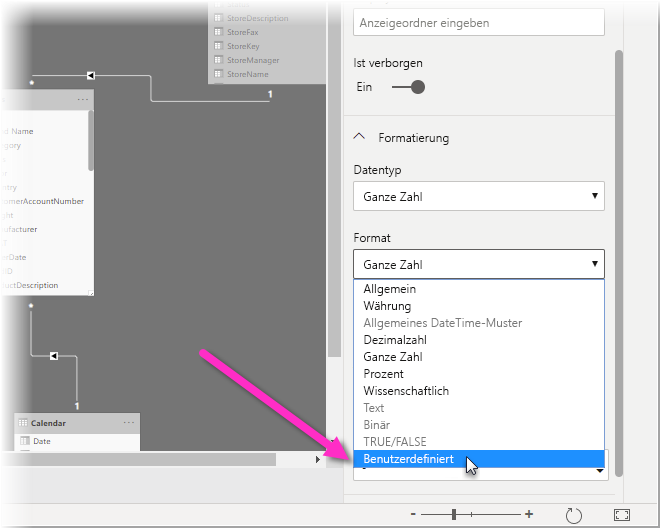
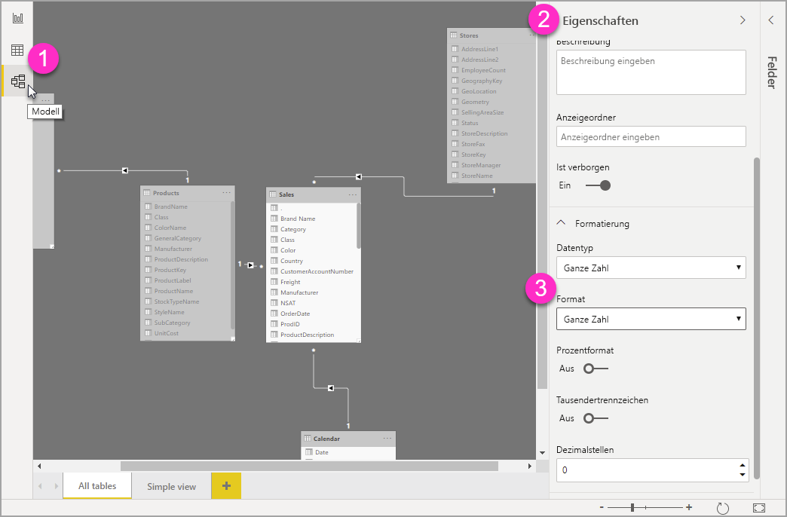

# Verwenden benutzerdefinierter Formatzeichenfolgen in Power BI Desktop

Mit benutzerdefinierten Formatzeichenfolgen in **Power BI Desktop** können Sie anpassen, wie Felder in Visuals angezeigt werden, und sicherstellen, dass die Berichte genau so aussehen, wie sie aussehen sollen.

## Vorgehensweise: Verwenden benutzerdefinierter Formatzeichenfolgen

Um benutzerdefinierte Formatzeichenfolgen zu erstellen, wählen Sie das Feld in der Ansicht **Modellierung** und dann **Format** im Bereich **Eigenschaften** aus.

Nachdem Sie die Option **Anpassen** in der **Format**-Dropdownliste ausgewählt haben, können Sie in einer Liste häufig verwendeter Formatzeichenfolgen eine Auswahl treffen. 

## Vom benutzerdefinierten Format unterstützte Syntax

Benutzerdefinierte Formatzeichenfolgen entsprechen der für Excel und andere Microsoft-Produkte gebräuchlichen VBA-Formatsyntax, unterstützen jedoch nicht jede in anderen Produkten verwendete Syntax. 

Die folgenden Tabellen definieren die Syntax, die in Power BI unterstützt wird.

Die folgende Tabelle zeigt unterstützte **Datumssymbole**:

| **Symbol** | **Bereich** |
| --- | --- |
| _d_ | 1-31 (Tag des Monats, ohne führende Null (0)) |
| _dd_ | 01-31 (Tag des Monats, mit führender Null (0)) |
| _m_ | 1-12 (Monat des Jahres, ohne führende Null (0), beginnend mit Januar = 1) |
| _mm_ | 01-12 (Monat des Jahres, mit führender Null (0), beginnend mit Januar = 01) |
| _mmm_ | Zeigt abgekürzte Monatsnamen an (Hijri-Monatsnamen haben keine Abkürzungen) |
| _mmmm_ | Zeigt die vollständigen Monatsnamen an |
| _yy_ | 00-99 (letzte zwei Ziffern des Jahres) |
| _yyyy_ | 100-9999 (drei- oder vierstellige Jahresangabe) |

Die folgende Tabelle zeigt unterstützte **Zeitsymbole**:

| **Symbol** | **Bereich** |
| --- | --- |
| _h_ | 0-23 (1-12 mit angefügtem &quot;AM&quot; oder &quot;PM&quot;) Stunde des Tages, ohne führende Null (0) |
| _hh_ | 00-23 (01-12 mit angefügtem &quot;AM&quot; oder &quot;PM&quot;) Stunde des Tages, mit führender Null (0) |
| _n_ | 0-59 (Minute der Stunde, ohne führende Null (0)) |
| _nn_ | 00-59 (Minute der Stunde, mit führender Null (0)) |
| _m_ | 0-59 (Minute der Stunde, ohne führende Null (0)) Nur, wenn _h_ oder _hh_ vorangestellt ist |
| _mm_ | 00-59 (Minute der Stunde, mit führender Null (0)) Nur, wenn _h_ oder _hh_ vorangestellt ist |
| _s_ | 0-59 (Sekunde der Minute, ohne führende Null (0)) |
| _ss_ | 00-59 (Sekunde der Minute, mit führender Null (0)) |

Hier sehen Sie ein [Beispiel](https://docs.microsoft.com/office/vba/language/reference/user-interface-help/format-function-visual-basic-for-applications#example) für das Formatieren benutzerdefinierter Wertzeichenfolgen.

Ein benutzerdefinierter Formatausdruck für Zahlen kann einen bis drei durch Semikolons getrennte Abschnitte aufweisen. Wenn Sie aufeinander folgende Semikolons einbeziehen, wird der fehlende Abschnitt nicht angezeigt (er ist &quot;&quot;). Wenn das Semikolon nicht angegeben ist, wird das positive Format verwendet.

Im Folgenden finden Sie Beispiele verschiedener Formate für verschiedene Wertzeichenfolgen:

|   | **Formatzeichenfolgen** |   |   |   |
| --- | --- | --- | --- | --- |
| **Werte** | **0.00;-0,0; &quot;Null (0)&quot;** | **0.00;;** | **0.00;-0.0;** | **0.00;** |
| **-1.234** | -1.2 | &quot;&quot; | -1.2 | &quot;&quot; |
| **0** | &quot;Null (0)&quot; | &quot;&quot; | &quot;&quot; | 0,00 |
| **1.234** | 1.23 | 1.23 | 1.23 | 1.23 |

In der folgenden Tabelle sind die vordefinierten **benannten Datums- und Uhrzeitformate** aufgeführt:

| **Formatname** | **Beschreibung** |
| --- | --- |
| **Allgemeines Datum** | Zeigt ein Datum und/oder eine Uhrzeit an, z. B. 4/3/93 05:34 PM. Wenn kein Bruchteil vorhanden ist, wird nur ein Datum angezeigt, z. B. 4/3/93. Wenn kein ganzzahliger Teil vorhanden ist, wird nur die Zeit angezeigt, z. B. 05:34 PM. Die Datumsanzeige wird von Ihren Systemeinstellungen bestimmt. |
| **Langes Datum** | Datumsanzeige gemäß dem Format Ihres Systems für langes Datum. |
| **Kurzes Datum** | Datumsanzeige gemäß dem Format Ihres Systems für kurzes Datum. |
| **Lange Uhrzeit** | Uhrzeitanzeige gemäß dem Format Ihres Systems für lange Uhrzeit inklusive Stunden, Minuten und Sekunden. |
| **Kurze Uhrzeit** | Uhrzeitanzeige im 24-Stunden-Format, z. B. 17:45. |

Benannte numerische Formate

In der folgenden Tabelle sind die vordefinierten **benannten numerischen Formate** aufgeführt:

| **Formatname** | **Beschreibung** |
| --- | --- |
| **Allgemeine Zahl** | Zahl wird ohne Tausendertrennzeichen angezeigt. |
| **Währung** | Zahl wird ggf. mit Tausendertrennzeichen angezeigt; zwei Ziffern rechts vom Dezimaltrennzeichen werden angezeigt. Die Ausgabe basiert auf den Gebietsschemaeinstellungen des Systems. |
| **Fest** | Mindestens eine Ziffer links und zwei Ziffern rechts vom Dezimaltrennzeichen werden angezeigt. |
| **Standard** | Zahl wird mit Tausendertrennzeichen angezeigt; mindestens eine Ziffer links und zwei Ziffern rechts vom Dezimaltrennzeichen werden angezeigt. |
| **Prozent** | Zahl wird multipliziert mit 100 mit einem rechts angefügten Prozentzeichen ( **%** ) angezeigt; es werden immer zwei Ziffern rechts vom Dezimaltrennzeichen angezeigt. |
| **Wissenschaftlich** | Standardmäßige wissenschaftliche Notation wird verwendet. |

In der folgenden Tabelle sind die Zeichen aufgeführt, mit denen Sie **benutzerdefinierte Datums-/Uhrzeitformate** erstellen können.

| **Zeichen** | **Beschreibung** |
| --- | --- |
| ( **:** ) | Zeittrennzeichen. In manchen Gebietsschemata können andere Zeichen verwendet werden, um das Zeittrennzeichen darzustellen. Das Zeittrennzeichen trennt Stunden, Minuten und Sekunden, wenn Zeitwerte formatiert werden. Welches Zeichen tatsächlich in der formatierten Ausgabe als Zeittrennzeichen verwendet wird, hängt von den Systemeinstellungen ab. |
| ( **/** ) | Datumstrennzeichen. In manchen Gebietsschemata können andere Zeichen verwendet werden, um das Datumstrennzeichen darzustellen. Das Datumstrennzeichen trennt Tag, Monat und Jahr, wenn Datumswerte formatiert werden. Welches Zeichen tatsächlich in der formatierten Ausgabe als Datumstrennzeichen verwendet wird, hängt von den Systemeinstellungen ab. |
| d | Tag wird als Zahl ohne führende Null (0) angezeigt (1-31). |
| dd | Tag wird als Zahl mit führender Null (0) angezeigt (01-31). |
| ddd | Tag wird abgekürzt angezeigt (So-Sa). Lokalisiert. |
| dddd | Tag wird mit vollständigem Namen angezeigt (Sonntag-Samstag). Lokalisiert. |
| m | Monat wird als Zahl ohne führende Null (0) angezeigt (1–12). Wenn „m“ direkt auf „h“ oder „hh“ folgt, wird die Minute und nicht der Monat angezeigt. |
| mm | Monat wird als Zahl mit führender Null (0) angezeigt (01–12). Wenn „m“ direkt auf „h“ oder „hh“ folgt, wird die Minute und nicht der Monat angezeigt. |
| mmm | Monat wird abgekürzt angezeigt (Jan-Dez). Lokalisiert. |
| mmmm | Monat wird mit vollständigem Namen angezeigt (Januar-Dezember). Lokalisiert. |
| yy | Jahr wird als 2-stellige Zahl angezeigt (00-99). |
| yyyy | Jahr wird als 4-stellige Zahl angezeigt (100-9999). |
| h | Stunde wird als Zahl ohne führende Null (0) angezeigt (0-23). |
| hh | Stunde wird als Zahl mit führender Null (0) angezeigt (00-23). |
| n | Minute wird als Zahl ohne führende Null (0) angezeigt (0-59). |
| nn | Minute wird als Zahl mit führender Null (0) angezeigt (00-59). |
| s | Sekunde wird als Zahl ohne führende Null (0) angezeigt (0-59). |
| ss | Sekunde wird als Zahl mit führender Null (0) angezeigt (00-59). |
| AM/PM | 12-Stunden-Format wird verwendet und für jede Stunde vor 12 Uhr mittags AM in Großbuchstaben angezeigt; für jede Stunde zwischen 12 Uhr mittags und 23:59 Uhr wird PM in Großbuchstaben angezeigt. |

In der folgenden Tabelle sind die Zeichen aufgeführt, mit denen Sie **benutzerdefinierte Zahlenformate** erstellen können.

| **Zeichen** | **Beschreibung** |
| --- | --- |
| Ohne | Zeigt die Zahl ohne Formatierung an. |
| (**0**) | Ziffernplatzhalter. Zeigt eine Ziffer oder eine Null (0) an. Wenn der Ausdruck an der Position, an der die 0 in der Formatzeichenfolge steht, eine Ziffer aufweist, wird sie angezeigt. Andernfalls wird an dieser Position eine Null (0) angezeigt. Wenn die Zahl weniger Ziffern hat, als Nullen (auf beiden Seiten des Dezimaltrennzeichens) im Formatausdruck vorhanden sind, werden führende oder nachfolgende Nullen (0) angezeigt. Wenn die Zahl rechts vom Dezimaltrennzeichen mehr Ziffern aufweist, als Nullen (0) rechts vom Dezimaltrennzeichen im Formatausdruck vorhanden sind, wird die Zahl auf so viele Dezimalstellen gerundet, wie Nullen vorhanden sind. Wenn die Zahl links vom Dezimaltrennzeichen mehr Ziffern aufweist, als Nullen (0) links vom Dezimaltrennzeichen im Formatausdruck vorhanden sind, werden die zusätzlichen Ziffern ohne Änderung angezeigt. |
| ( **#** ) | Ziffernplatzhalter. Zeigt eine Ziffer oder nichts an. Wenn der Ausdruck an der Position, an der „#“ in der Formatzeichenfolge steht, eine Ziffer aufweist, wird sie angezeigt. Andernfalls wird an dieser Position nichts angezeigt. Dieses Symbol funktioniert wie der 0-Ziffernplatzhalter, mit dem Unterschied, dass führende und nachfolgende Nullen (0) angezeigt werden, wenn die Zahl höchstens so viele Ziffern hat, wie #-Zeichen auf beiden Seiten des Dezimaltrennzeichens im Formatausdruck vorhanden sind. |
| ( **.** ) | Dezimalplatzhalter. In manchen Gebietsschemata wird ein Komma als Dezimaltrennzeichen verwendet. Der Dezimalplatzhalter bestimmt, wie viele Ziffern links und rechts vom Dezimaltrennzeichen angezeigt werden. Wenn der Formatausdruck links von diesem Symbol nur Zahlenzeichen enthält, beginnen Zahlen, die kleiner als 1 sind, mit einem Dezimaltrennzeichen. Verwenden Sie 0 als ersten Ziffernplatzhalter links vom Dezimaltrennzeichen, um eine führende Null (0) mit Bruchzahlen anzuzeigen. Welches Zeichen tatsächlich in der formatierten Ausgabe als Dezimaltrennzeichen verwendet wird, hängt von dem Zahlenformat ab, das Ihr System erkennt. |
| ( **%)** | Prozentplatzhalter. Der Ausdruck wird mit 100 multipliziert. Das Prozentzeichen ( **%** ) wird an der Position eingefügt, an der es in der Formatzeichenfolge auftritt. |
| ( **,** ) | Tausendertrennzeichen. In manchen Gebietsschemata wird ein Punkt als Tausendertrennzeichen verwendet. Das Tausendertrennzeichen trennt Tausende von Hundertern in einer Zahl, die links vom Dezimaltrennzeichen vier oder mehr Stellen aufweist. Die standardmäßige Verwendung des Tausendertrennzeichens wird angegeben, wenn das Format ein Tausendertrennzeichen enthält, das von Ziffernplatzhaltern (**0** oder **#** ) umgeben ist. Zwei benachbarte Tausendertrennzeichen oder ein Tausendertrennzeichen unmittelbar links vom Dezimaltrennzeichen (unabhängig davon, ob eine Dezimalstelle angegeben ist) &quot;skalieren die Zahl, indem sie durch 1.000 dividiert und nach Bedarf gerundet wird&quot;. Beispielsweise können Sie mit der Formatzeichenfolge &quot;##0,,&quot; 100 Millionen als 100 darzustellen. Zahlen, die kleiner als 1 Million sind, werden als 0 angezeigt. Zwei benachbarte Tausendertrennzeichen in jeder anderen Position als unmittelbar links vom Dezimaltrennzeichen werden einfach als Angabe der Verwendung eines Tausendertrennzeichens behandelt. Welches Zeichen tatsächlich in der formatierten Ausgabe als Tausendertrennzeichen verwendet wird, hängt von dem Zahlenformat ab, das Ihr System erkennt. |
| ( **:** ) | Zeittrennzeichen. In manchen Gebietsschemata können andere Zeichen verwendet werden, um das Zeittrennzeichen darzustellen. Das Zeittrennzeichen trennt Stunden, Minuten und Sekunden, wenn Zeitwerte formatiert werden. Welches Zeichen tatsächlich in der formatierten Ausgabe als Zeittrennzeichen verwendet wird, hängt von den Systemeinstellungen ab. |
| ( **/** ) | Datumstrennzeichen. In manchen Gebietsschemata können andere Zeichen verwendet werden, um das Datumstrennzeichen darzustellen. Das Datumstrennzeichen trennt Tag, Monat und Jahr, wenn Datumswerte formatiert werden. Welches Zeichen tatsächlich in der formatierten Ausgabe als Datumstrennzeichen verwendet wird, hängt von den Systemeinstellungen ab. |
| (**E- E+ e- e+** ) | Wissenschaftliches Format. Wenn der Formatausdruck mindestens einen Ziffernplatzhalter (**0** oder **#** ) rechts von E-, E+, e- oder e+ enthält, wird die Zahl im wissenschaftlichen Format angezeigt, und E oder e wird zwischen der Zahl und deren Exponent eingefügt. Die Anzahl der Ziffernplatzhalter auf der rechten Seite bestimmt die Anzahl der Ziffern im Exponenten. Verwenden Sie E- oder e-, um ein Minuszeichen neben negativen Exponenten zu platzieren. Verwenden Sie E+ oder e+, um ein Minuszeichen neben negativen Exponenten und ein Pluszeichen neben positiven Exponenten zu platzieren. |
| **- + $** ( ) | Zeigt ein literales Zeichen an. Damit ein anderes Zeichen als eines der aufgelisteten angezeigt wird, stellen Sie ihm einen umgekehrten Schrägstrich voran (\)), oder setzen Sie es in doppelte Anführungszeichen (&quot; &quot;). |
| (* *\** ) | Das nächste Zeichen in der Formatzeichenfolge wird angezeigt. Um ein Zeichen anzuzeigen, das eine besondere Bedeutung als literales Zeichen hat, stellen Sie ihm einen umgekehrten Schrägstrich (\) voran. Der umgekehrte Schrägstrich selbst wird nicht angezeigt. Die Verwendung eines umgekehrten Schrägstrichs ist identisch mit dem Einschließen des nächsten Zeichens in doppelte Anführungszeichen. Um einen umgekehrten Schrägstrich anzuzeigen, verwenden Sie zwei umgekehrte Schrägstriche (\\). Beispiele für Zeichen, die nicht als literale Zeichen angezeigt werden können, sind die Datums- und Zeitformatierungszeichen (a, c, d, h, m, n, p, q, s, t, w, / und :), die numerischen Formatierungszeichen (#, 0, %, E, e, Komma und Punkt) und die Zeichenfolgen-Formatierungszeichen (@, &amp;, \&lt;, \&gt; und !). |
| (&quot;ABC&quot;) | Die Zeichenfolge innerhalb der doppelten Anführungszeichen (&quot; &quot;) wird angezeigt. |

## Nächste Schritte
Folgende Artikel könnten Sie ebenfalls interessieren:

* [VBA-Formatzeichenfolgen](https://docs.microsoft.com/office/vba/language/reference/user-interface-help/format-function-visual-basic-for-applications#example)
* [Measures in Power BI Desktop](desktop-measures.md)
* [Datentypen in Power BI Desktop](desktop-data-types.md)
* [Bedingte Formatierung in Tabellen](desktop-conditional-table-formatting.md)

